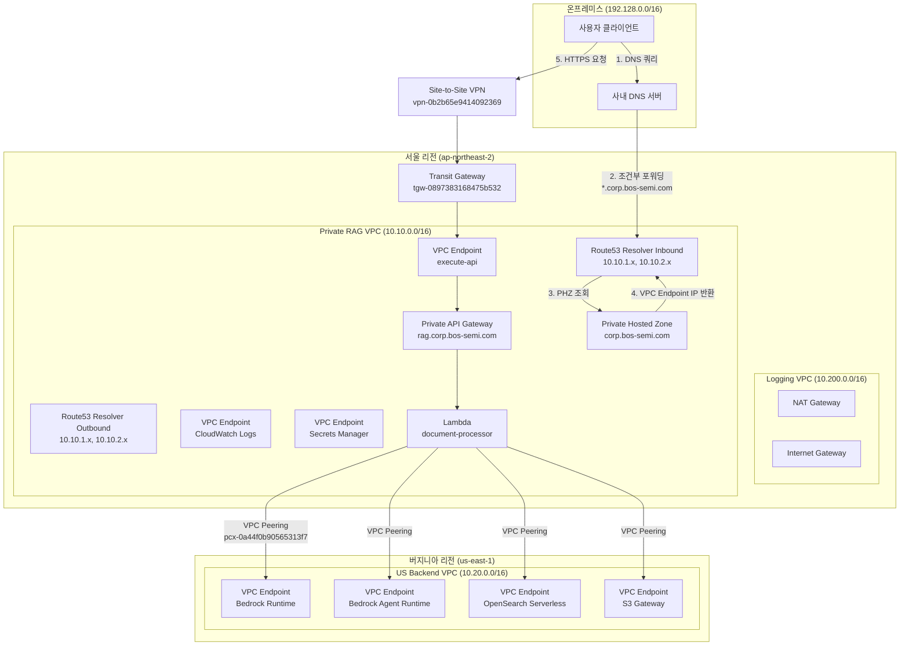
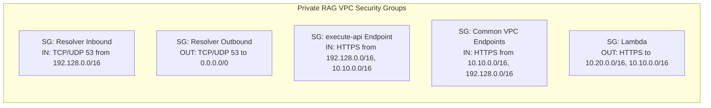
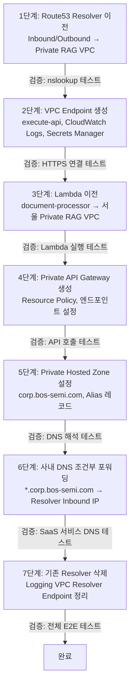

# Private RAG API 설계 문서

## 개요

이 설계 문서는 온프레미스 환경에서만 접근 가능한 완전 Private RAG API를 구축하기 위한 기술 설계를 기술한다. 핵심 원칙은 **Frontend/Backend 분리**이며, 서울 Private RAG VPC(10.10.0.0/16)가 유저 접점(Frontend), 버지니아 Backend VPC(10.20.0.0/16)가 AI 서비스 계층(Backend)으로 동작한다.

주요 변경 사항:
- Route53 Resolver Endpoint를 Logging VPC에서 Private RAG VPC로 이전
- Lambda(document-processor)를 버지니아에서 서울 Private RAG VPC로 이전
- Private API Gateway + execute-api VPC Endpoint 생성
- Route53 Private Hosted Zone(corp.bos-semi.com) 설정
- 사내 DNS 조건부 포워딩(*.corp.bos-semi.com → Route53 Resolver)
- 서울 리전 S3 버킷 + Cross-Region Replication을 통한 데이터 업로드 파이프라인 구축

### 설계 결정 근거

1. **Lambda 서울 이전**: API Gateway는 같은 리전의 Lambda만 직접 프록시 가능. Cross-Region Lambda 프록시는 지원되지 않으므로 Lambda를 서울로 이전하고, VPC Peering을 통해 버지니아 Backend를 호출하는 구조로 결정.
2. **Route53 Resolver 이전**: Private RAG VPC에서 직접 DNS 해석이 가능해야 Private Hosted Zone과 VPC Endpoint가 정상 동작. Logging VPC를 경유하면 불필요한 TGW 홉이 추가됨.
3. **execute-api VPC Endpoint Private DNS 비활성화**: Private Hosted Zone의 커스텀 도메인(rag.corp.bos-semi.com)과 execute-api 기본 DNS가 충돌하므로, VPC Endpoint의 Private DNS를 비활성화하고 Private Hosted Zone에서 Alias 레코드로 라우팅.
4. **조건부 포워딩**: 이전에 사내 DNS에 Route53 Endpoint를 무조건 등록하여 SaaS 서비스 장애가 발생한 경험이 있으므로, *.corp.bos-semi.com만 Route53으로 전달하는 조건부 포워딩을 적용.
5. **서울 S3 + Cross-Region Replication**: 온프렘에서 대용량 문서를 배치 업로드하기 위해 서울 리전에 S3 버킷을 생성하고, S3 Cross-Region Replication으로 버지니아 S3에 자동 복제. 기존 bos-ai-documents-seoul 버킷이 실제로는 버지니아에 있으므로 서울 리전에 재생성 필요. aws s3 sync, Multipart Upload 등 기존 S3 도구를 그대로 활용 가능.

## 아키텍처

### As-Is / To-Be 비교

#### As-Is (현재 상태)
- Route53 Resolver Inbound/Outbound: Logging VPC(10.200.0.0/16)에 위치
- Lambda(document-processor): 버지니아 US Backend VPC(10.20.0.0/16)에 위치
- VPC Endpoint(서울): Logging VPC에 위치 (Kinesis Firehose, S3, Secrets Manager, Bedrock Runtime 등)
- API Gateway: 없음
- Private Hosted Zone: 없음
- S3 데이터 업로드: bos-ai-documents-seoul (실제 버지니아) → Replication → bos-ai-documents-us (버지니아). 서울 리전 S3 버킷 없음

#### To-Be (목표 상태)
- Route53 Resolver Inbound/Outbound: Private RAG VPC(10.10.0.0/16)로 이전
- Lambda(document-processor): 서울 Private RAG VPC(10.10.0.0/16)로 이전
- VPC Endpoint(서울): Private RAG VPC에 신규 생성 (execute-api, CloudWatch Logs, Secrets Manager, S3 Gateway)
- Private API Gateway: Private RAG VPC에서 execute-api VPC Endpoint를 통해 접근
- Private Hosted Zone: corp.bos-semi.com → rag.corp.bos-semi.com Alias → VPC Endpoint
- 사내 DNS 조건부 포워딩: *.corp.bos-semi.com → Route53 Resolver Inbound IP
- S3 데이터 업로드: 서울 리전 S3 버킷 신규 생성 → S3 Cross-Region Replication → 버지니아 S3 → Bedrock KB 임베딩. 온프렘에서 S3 VPC Endpoint(Gateway)를 통해 Private 업로드
- 사내 DNS 조건부 포워딩: 없음

#### To-Be (목표 상태)
- Route53 Resolver Inbound/Outbound: Private RAG VPC(10.10.0.0/16)로 이전
- Lambda(document-processor): 서울 Private RAG VPC(10.10.0.0/16)로 이전
- VPC Endpoint(서울): Private RAG VPC에 신규 생성 (execute-api, CloudWatch Logs, Secrets Manager)
- Private API Gateway: Private RAG VPC에서 execute-api VPC Endpoint를 통해 접근
- Private Hosted Zone: corp.bos-semi.com → rag.corp.bos-semi.com Alias → VPC Endpoint
- 사내 DNS 조건부 포워딩: *.corp.bos-semi.com → Route53 Resolver Inbound IP

### 전체 아키텍처 다이어그램



### 트래픽 흐름 (상세)

**데이터 플레인 (API 호출):**
1. 온프렘 클라이언트 → VPN 터널 → Transit Gateway
2. Transit Gateway → Private RAG VPC (10.10.0.0/16)
3. Private RAG VPC → VPC Endpoint (execute-api) → Private API Gateway
4. Private API Gateway → Lambda (document-processor, 서울)
5. Lambda → VPC Peering (pcx-0a44f0b90565313f7) → US Backend VPC (10.20.0.0/16)
6. US Backend VPC → VPC Endpoint → Bedrock Runtime / OpenSearch Serverless / S3

**DNS 해석 흐름:**
1. 온프렘 클라이언트 → 사내 DNS 서버
2. 사내 DNS 서버 → 조건부 포워딩 (*.corp.bos-semi.com만)
3. Route53 Resolver Inbound (Private RAG VPC) → Private Hosted Zone 조회
4. Private Hosted Zone → rag.corp.bos-semi.com → VPC Endpoint (execute-api) Private IP 반환
5. 클라이언트가 반환된 IP로 HTTPS 요청 전송

## 컴포넌트 및 인터페이스

### 1. Route53 Resolver Endpoint (이전)

**위치:** Private RAG VPC (10.10.0.0/16)

| 컴포넌트 | 서브넷 | 용도 |
|---------|--------|------|
| Resolver Inbound | 10.10.1.0/24, 10.10.2.0/24 | 온프렘 DNS → AWS Private Hosted Zone 해석 |
| Resolver Outbound | 10.10.1.0/24, 10.10.2.0/24 | AWS → 온프렘 DNS 포워딩 (향후 확장용) |

**Security Group:**
- Inbound SG (Resolver Inbound용): TCP/UDP 53 from 192.128.0.0/16 (온프렘)
- Outbound SG (Resolver Outbound용): TCP/UDP 53 to 0.0.0.0/0

**Terraform 리소스:**
```hcl
# 신규 생성
aws_route53_resolver_endpoint.inbound   # Private RAG VPC
aws_route53_resolver_endpoint.outbound  # Private RAG VPC
aws_security_group.resolver_inbound_sg
aws_security_group.resolver_outbound_sg

# 삭제 대상
rslvr-in-79867dcffe644a378   # Logging VPC 기존 Inbound
rslvr-out-528276266e13403aa  # Logging VPC 기존 Outbound
```

### 2. Private API Gateway

**타입:** REST API (Private)
**도메인:** rag.corp.bos-semi.com

| 엔드포인트 | 메서드 | Lambda 핸들러 | 설명 |
|-----------|--------|-------------|------|
| /rag/query | POST | document-processor (query) | RAG 질의 |
| /rag/documents | POST | document-processor (upload) | 문서 업로드 |
| /rag/health | GET | document-processor (health) | 헬스체크 |

**Resource Policy:**
```json
{
  "Version": "2012-10-17",
  "Statement": [{
    "Effect": "Deny",
    "Principal": "*",
    "Action": "execute-api:Invoke",
    "Resource": "arn:aws:execute-api:ap-northeast-2:*:*/*",
    "Condition": {
      "StringNotEquals": {
        "aws:sourceVpce": "${vpce_execute_api_id}"
      }
    }
  }, {
    "Effect": "Allow",
    "Principal": "*",
    "Action": "execute-api:Invoke",
    "Resource": "arn:aws:execute-api:ap-northeast-2:*:*/*"
  }]
}
```

**커스텀 도메인:**
- 도메인: rag.corp.bos-semi.com
- 인증서: ACM Private Certificate (내부 CA) 또는 Regional 인증서
- Base Path Mapping: / → API Stage

### 3. VPC Endpoint (execute-api)

**위치:** Private RAG VPC, 10.10.1.0/24 + 10.10.2.0/24
**Private DNS:** 비활성화 (Private Hosted Zone과 충돌 방지)

**Security Group:**
- Inbound: HTTPS(443) from 192.128.0.0/16 (온프렘) + 10.10.0.0/16 (Private RAG VPC)
- Outbound: All

### 4. Lambda (document-processor) - 서울 이전

**현재 위치:** 버지니아 US Backend VPC
**이전 위치:** 서울 Private RAG VPC (10.10.1.0/24, 10.10.2.0/24)

**변경 사항:**
- VPC 설정: Private RAG VPC 서브넷으로 변경
- 환경 변수: 버지니아 VPC Endpoint DNS를 직접 참조하도록 변경
- IAM Role: 서울 리전 기반으로 재생성, Cross-Region 접근 권한 추가
- Bedrock/AOSS/S3 호출: VPC Peering → 버지니아 VPC Endpoint 경유

**Lambda Security Group:**
- Inbound: 없음 (Lambda는 인바운드 연결 불가)
- Outbound: HTTPS(443) to 10.20.0.0/16 (버지니아 VPC Peering), 10.10.0.0/16 (서울 VPC Endpoint)

**Cross-Region 호출 방식:**
```python
# Lambda에서 버지니아 VPC Endpoint를 직접 호출
# VPC Peering을 통해 10.20.x.x 대역의 VPC Endpoint ENI IP로 접근
bedrock_client = boto3.client(
    'bedrock-runtime',
    region_name='us-east-1',
    endpoint_url='https://bedrock-runtime.us-east-1.amazonaws.com'
)
```

### 5. Route53 Private Hosted Zone

**도메인:** corp.bos-semi.com
**연결 VPC:** Private RAG VPC (10.10.0.0/16)만 연결

| 레코드 | 타입 | 값 |
|--------|------|-----|
| rag.corp.bos-semi.com | A (Alias) | VPC Endpoint (execute-api) DNS |

### 6. 사내 DNS 조건부 포워딩

**대상 도메인:** corp.bos-semi.com
**포워딩 대상:** Route53 Resolver Inbound IP (10.10.1.x, 10.10.2.x)
**영향 범위:** *.corp.bos-semi.com 쿼리만 Route53으로 전달, 나머지는 기존 경로 유지

### 7. Private RAG VPC용 VPC Endpoint

| 서비스 | 타입 | Private DNS | 서브넷 |
|--------|------|-------------|--------|
| execute-api | Interface | 비활성화 | 10.10.1.0/24, 10.10.2.0/24 |
| logs (CloudWatch) | Interface | 활성화 | 10.10.1.0/24, 10.10.2.0/24 |
| secretsmanager | Interface | 활성화 | 10.10.1.0/24, 10.10.2.0/24 |
| s3 | Gateway | N/A | 라우팅 테이블에 추가 |

**공통 Security Group (Interface Endpoint용):**
- Inbound: HTTPS(443) from 10.10.0.0/16 + 192.128.0.0/16
- Outbound: All

### 8. 데이터 업로드 파이프라인 (서울 S3 + Cross-Region Replication)

**목적:** 온프렘에서 RAG 임베딩용 문서를 Air-Gapped 환경에서 업로드

**아키텍처:**
```
온프렘 (aws s3 cp/sync)
    ↓ VPN → TGW
Private RAG VPC (10.10.x.x)
    ↓ S3 Gateway VPC Endpoint
서울 S3 버킷 (bos-ai-documents-seoul-v2, ap-northeast-2)
    ↓ S3 Cross-Region Replication (15분 이내)
버지니아 S3 버킷 (bos-ai-documents-us, us-east-1)
    ↓ Bedrock Knowledge Base Data Source
Bedrock Knowledge Base → 임베딩 → OpenSearch Serverless
```

**서울 S3 버킷 설정:**
- 버킷명: bos-ai-documents-seoul-v2 (기존 bos-ai-documents-seoul은 실제 버지니아에 있으므로 신규 생성)
- 리전: ap-northeast-2 (서울)
- 암호화: SSE-KMS (CMK)
- 버전 관리: 활성화 (Replication 필수 조건)
- Bucket Policy: Private RAG VPC의 S3 VPC Endpoint에서만 접근 허용

**S3 Bucket Policy:**
```json
{
  "Version": "2012-10-17",
  "Statement": [{
    "Effect": "Deny",
    "Principal": "*",
    "Action": "s3:*",
    "Resource": [
      "arn:aws:s3:::bos-ai-documents-seoul-v2",
      "arn:aws:s3:::bos-ai-documents-seoul-v2/*"
    ],
    "Condition": {
      "StringNotEquals": {
        "aws:sourceVpce": "${vpce_s3_gateway_id}"
      }
    }
  }]
}
```

**Cross-Region Replication 설정:**
- Source: bos-ai-documents-seoul-v2 (ap-northeast-2)
- Destination: bos-ai-documents-us (us-east-1)
- Replication Time Control: 15분
- KMS 암호화 객체 복제: 활성화
- Delete Marker 복제: 활성화

**온프렘 업로드 방법:**
```bash
# 단일 파일 업로드
aws s3 cp document.pdf s3://bos-ai-documents-seoul-v2/documents/ \
    --endpoint-url https://s3.ap-northeast-2.amazonaws.com

# 폴더 동기화 (배치 업로드)
aws s3 sync ./documents/ s3://bos-ai-documents-seoul-v2/documents/ \
    --endpoint-url https://s3.ap-northeast-2.amazonaws.com
```

## 데이터 모델

### Terraform 리소스 변경 매트릭스

| 리소스 | 리소스 ID | 변경 유형 | 위치 | 영향 범위 |
|--------|----------|----------|------|----------|
| Route53 Resolver Inbound | rslvr-in-79867dcffe644a378 | 삭제 | Logging VPC | DNS 해석 경로 변경 |
| Route53 Resolver Outbound | rslvr-out-528276266e13403aa | 삭제 | Logging VPC | DNS 포워딩 경로 변경 |
| Route53 Resolver Inbound (신규) | - | 생성 | Private RAG VPC | 온프렘 DNS 해석 |
| Route53 Resolver Outbound (신규) | - | 생성 | Private RAG VPC | AWS→온프렘 DNS |
| Private API Gateway | - | 생성 | 서울 리전 | API 접근점 |
| VPC Endpoint (execute-api) | - | 생성 | Private RAG VPC | API Gateway 접근 |
| VPC Endpoint (CloudWatch Logs) | - | 생성 | Private RAG VPC | 로그 전송 |
| VPC Endpoint (Secrets Manager) | - | 생성 | Private RAG VPC | 시크릿 조회 |
| Private Hosted Zone | - | 생성 | Private RAG VPC | DNS 도메인 |
| Lambda (document-processor) | - | 이전 | 버지니아→서울 | RAG 처리 |
| Lambda Security Group | - | 생성 | Private RAG VPC | Lambda 네트워크 |
| Resolver Inbound SG | - | 생성 | Private RAG VPC | DNS 보안 |
| Resolver Outbound SG | - | 생성 | Private RAG VPC | DNS 보안 |
| VPC Endpoint SG | - | 생성 | Private RAG VPC | Endpoint 보안 |
| S3 버킷 (서울) | - | 생성 | ap-northeast-2 | 문서 업로드 |
| S3 VPC Endpoint (Gateway) | - | 생성 | Private RAG VPC | S3 접근 |
| S3 Cross-Region Replication | - | 생성 | 서울→버지니아 | 문서 복제 |
| S3 Replication IAM Role | - | 생성 | Global | 복제 권한 |

### Terraform 모듈 구조 (To-Be)

```
environments/
├── network-layer/
│   ├── main.tf                    # 기존 VPC, TGW, Peering (변경 없음)
│   ├── route53-resolver.tf        # 신규: Resolver Endpoint 이전
│   ├── vpc-endpoints.tf           # 기존 Logging VPC Endpoint (유지)
│   └── vpc-endpoints-frontend.tf  # 신규: Private RAG VPC Endpoint
├── app-layer/
│   ├── bedrock-rag/
│   │   ├── lambda.tf              # 수정: Lambda를 서울 VPC로 이전
│   │   ├── api-gateway.tf         # 신규: Private API Gateway
│   │   ├── route53.tf             # 신규: Private Hosted Zone
│   │   └── providers.tf           # 수정: 서울 provider 추가
```

### Security Group 매트릭스



### 배포 순서 (단계별)



### 롤백 계획

| 단계 | 롤백 조건 | 롤백 절차 | 목표 시간 |
|------|----------|----------|----------|
| 1단계 (Resolver 이전) | DNS 해석 실패 | 기존 Logging VPC Resolver 유지, 신규 삭제 | 5분 |
| 2단계 (VPC Endpoint) | Endpoint 연결 실패 | 신규 Endpoint 삭제 | 5분 |
| 3단계 (Lambda 이전) | Lambda 실행 실패 | 버지니아 Lambda 재활성화 | 5분 |
| 4단계 (API Gateway) | API 호출 실패 | API Gateway 삭제 | 5분 |
| 5단계 (PHZ) | DNS 레코드 오류 | PHZ 레코드 삭제 | 3분 |
| 6단계 (조건부 포워딩) | SaaS DNS 장애 | 조건부 포워딩 규칙 비활성화 | 1분 |

## 정확성 속성 (Correctness Properties)

*정확성 속성(Property)은 시스템의 모든 유효한 실행에서 참이어야 하는 특성 또는 동작이다. 속성은 사람이 읽을 수 있는 명세와 기계가 검증할 수 있는 정확성 보장 사이의 다리 역할을 한다.*

### Property 1: Resolver Inbound Security Group은 온프렘 DNS만 허용

*For any* ingress rule in the Resolver Inbound Security Group, the rule SHALL only allow TCP/UDP port 53 from the OnPrem_Network CIDR (192.128.0.0/16). No other source CIDR or port should be permitted.

**Validates: Requirements 1.3**

### Property 2: VPC Endpoint Security Group은 허용된 CIDR만 허용

*For any* VPC Interface Endpoint Security Group in Private_RAG_VPC (execute-api, CloudWatch Logs, Secrets Manager), all ingress rules SHALL only allow HTTPS (port 443) from Private_RAG_VPC CIDR (10.10.0.0/16) and OnPrem_Network CIDR (192.128.0.0/16). No other source CIDR or port should be permitted.

**Validates: Requirements 2.5, 7.5**

### Property 3: Private API Gateway는 VPC Endpoint 외부 요청을 거부

*For any* request to the Private_API_Gateway that does not originate from VPC_Endpoint_Execute_API, the API Gateway SHALL return a 403 Forbidden response. Only requests routed through the designated VPC Endpoint are permitted.

**Validates: Requirements 2.10**

### Property 4: Private Hosted Zone DNS 격리

*For any* VPC that is not associated with the Private_Hosted_Zone (corp.bos-semi.com), DNS queries for rag.corp.bos-semi.com SHALL fail to resolve. Only Private_RAG_VPC에서만 해석 가능해야 한다.

**Validates: Requirements 3.3**

### Property 5: 조건부 포워딩 정확성

*For any* DNS query from OnPrem_Network, the query SHALL be forwarded to Route53_Resolver_Inbound if and only if the queried domain matches *.corp.bos-semi.com. All other domain queries SHALL use the existing DNS resolution path without modification.

**Validates: Requirements 4.1, 4.2**

### Property 6: Private RAG VPC 라우팅 정확성

*For any* route entry in Private_RAG_VPC's route table, traffic destined for OnPrem_Network (192.128.0.0/16) SHALL route to Transit_Gateway, traffic destined for US_Backend_VPC (10.20.0.0/16) SHALL route to VPC Peering, and traffic destined for Logging_VPC (10.200.0.0/16) SHALL route to Transit_Gateway. No default route (0.0.0.0/0) SHALL exist.

**Validates: Requirements 5.2**

### Property 7: Private RAG VPC 인터넷 격리

*For any* resource in Private_RAG_VPC, there SHALL be no Internet Gateway attached to the VPC, and no route table entry with destination 0.0.0.0/0 pointing to an Internet Gateway or NAT Gateway. All resources are unreachable from the public internet.

**Validates: Requirements 5.4**

### Property 8: 비인가 CIDR 차단

*For any* source CIDR that is not in the allowed list (192.128.0.0/16, 10.10.0.0/16, 10.20.0.0/16, 10.200.0.0/16), traffic to Private_RAG_VPC resources SHALL be blocked by Security Groups and Network ACLs.

**Validates: Requirements 5.6**

### Property 9: VPC Endpoint Private DNS 설정 일관성

*For any* VPC Interface Endpoint in Private_RAG_VPC except execute-api, Private DNS SHALL be enabled. For the execute-api endpoint specifically, Private DNS SHALL be disabled to avoid conflict with the Private Hosted Zone custom domain.

**Validates: Requirements 5.5, 7.4**

## 오류 처리

### 인프라 배포 오류

| 오류 상황 | 감지 방법 | 처리 방법 |
|----------|----------|----------|
| Resolver Endpoint 생성 실패 | Terraform apply 에러 | 기존 Logging VPC Resolver 유지, 신규 리소스 삭제 |
| VPC Endpoint 생성 실패 | Terraform apply 에러 | 해당 Endpoint만 삭제, 다른 Endpoint에 영향 없음 |
| Lambda 이전 실패 | Lambda 실행 에러, CloudWatch Logs | 버지니아 Lambda 재활성화, 서울 Lambda 비활성화 |
| API Gateway 배포 실패 | Terraform apply 에러 | API Gateway 및 관련 리소스 삭제 |
| Private Hosted Zone 설정 오류 | DNS 해석 실패 (nslookup) | PHZ 레코드 수정 또는 삭제 |
| 조건부 포워딩 설정 오류 | SaaS 서비스 DNS 해석 실패 | 조건부 포워딩 규칙 즉시 비활성화 |

### 런타임 오류

| 오류 상황 | 감지 방법 | 처리 방법 |
|----------|----------|----------|
| Lambda → Bedrock 호출 실패 | Lambda CloudWatch Logs, 에러 메트릭 | 재시도 (3회, 지수 백오프), CloudWatch Alarm |
| Lambda → OpenSearch 호출 실패 | Lambda CloudWatch Logs | 재시도 (3회), 에러 응답 반환 |
| VPC Endpoint 서비스 장애 | CloudWatch Alarm (5분 이내) | 관리자 알림, 수동 확인 |
| DNS 해석 실패 | 클라이언트 타임아웃 | CloudWatch Logs 기록, Resolver 상태 확인 |
| API Gateway 5xx 에러 | API Gateway CloudWatch Metrics | CloudWatch Alarm, Lambda 상태 확인 |

### CloudWatch Alarm 설정

```hcl
# Lambda 에러율 알람
resource "aws_cloudwatch_metric_alarm" "lambda_errors" {
  alarm_name          = "private-rag-lambda-errors"
  comparison_operator = "GreaterThanThreshold"
  evaluation_periods  = 2
  metric_name         = "Errors"
  namespace           = "AWS/Lambda"
  period              = 300
  statistic           = "Sum"
  threshold           = 5
  alarm_actions       = [aws_sns_topic.alerts.arn]
  dimensions = {
    FunctionName = "lambda-document-processor-seoul-prod"
  }
}

# API Gateway 5xx 에러 알람
resource "aws_cloudwatch_metric_alarm" "api_5xx" {
  alarm_name          = "private-rag-api-5xx"
  comparison_operator = "GreaterThanThreshold"
  evaluation_periods  = 2
  metric_name         = "5XXError"
  namespace           = "AWS/ApiGateway"
  period              = 300
  statistic           = "Sum"
  threshold           = 10
  alarm_actions       = [aws_sns_topic.alerts.arn]
}
```

## 테스팅 전략

### 이중 테스팅 접근법

이 프로젝트는 인프라 코드(Terraform)를 대상으로 하므로, 테스팅은 **Terraform Plan 검증**과 **배포 후 통합 테스트**로 구성된다.

### 1. Property-Based Testing (Terraform 구성 검증)

**라이브러리:** [Terratest](https://github.com/gruntwork-io/terratest) (Go) + [rapid](https://github.com/flyingmutant/rapid) (Go PBT 라이브러리)

Terraform plan output을 파싱하여 정확성 속성을 검증한다. 각 property test는 최소 100회 반복 실행한다.

**Property Test 구성:**

```go
// Feature: private-rag-api, Property 1: Resolver Inbound SG는 온프렘 DNS만 허용
func TestProperty1_ResolverInboundSGOnlyAllowsOnPremDNS(t *testing.T) {
    // Terraform plan output에서 SG 규칙을 추출하고
    // 모든 ingress rule이 192.128.0.0/16에서 port 53만 허용하는지 검증
}

// Feature: private-rag-api, Property 2: VPC Endpoint SG는 허용된 CIDR만 허용
func TestProperty2_VPCEndpointSGOnlyAllowsApprovedCIDRs(t *testing.T) {
    // 모든 VPC Endpoint SG의 ingress rule이
    // 10.10.0.0/16과 192.128.0.0/16에서 port 443만 허용하는지 검증
}

// Feature: private-rag-api, Property 6: Private RAG VPC 라우팅 정확성
func TestProperty6_PrivateRAGVPCRoutingCorrectness(t *testing.T) {
    // 라우팅 테이블의 모든 route entry가
    // 올바른 대상(TGW, VPC Peering)으로 설정되어 있는지 검증
}
```

**PBT 적용 대상:**
- Security Group 규칙 검증 (Property 1, 2, 8): 랜덤 CIDR/포트 생성 → 허용/차단 여부 검증
- 라우팅 테이블 검증 (Property 6): 랜덤 목적지 IP 생성 → 올바른 next-hop 검증
- VPC Endpoint Private DNS 설정 검증 (Property 9): 모든 Endpoint 순회 → 설정 일관성 검증

### 2. Unit Testing (Terraform 구성 검증)

**라이브러리:** Terratest (Go)

```go
// 특정 예제: Resolver Inbound가 올바른 서브넷에 생성되는지 확인
func TestResolverInboundSubnetPlacement(t *testing.T) {
    // 요구사항 1.1 검증
}

// 특정 예제: execute-api VPC Endpoint의 Private DNS가 비활성화되어 있는지 확인
func TestExecuteAPIEndpointPrivateDNSDisabled(t *testing.T) {
    // 요구사항 5.5 검증
}

// 특정 예제: API Gateway Resource Policy가 VPC Endpoint만 허용하는지 확인
func TestAPIGatewayResourcePolicyVPCEOnly(t *testing.T) {
    // 요구사항 2.6 검증
}

// 특정 예제: Private Hosted Zone이 올바른 VPC에만 연결되어 있는지 확인
func TestPHZAssociatedWithCorrectVPC(t *testing.T) {
    // 요구사항 3.1 검증
}

// 에지 케이스: Lambda가 서울 VPC에 배포되고 버지니아 VPC에는 없는지 확인
func TestLambdaDeployedInSeoulNotVirginia(t *testing.T) {
    // 요구사항 2.1 검증
}
```

### 3. 통합 테스트 (배포 후)

배포 후 실제 AWS 환경에서 실행하는 E2E 검증:

```bash
# 1단계 검증: DNS 해석
nslookup rag.corp.bos-semi.com <resolver_inbound_ip>

# 2단계 검증: API 호출
curl -k https://rag.corp.bos-semi.com/rag/health

# 3단계 검증: SaaS 서비스 영향 없음
nslookup existing-saas-service.example.com

# 4단계 검증: 외부 접근 차단
# (인터넷에서 rag.corp.bos-semi.com 접근 시도 → 실패 확인)
```

### 테스트 파일 구조

```
tests/
├── properties/
│   ├── security_group_test.go      # Property 1, 2, 8
│   ├── routing_test.go             # Property 6, 7
│   ├── dns_isolation_test.go       # Property 4, 5
│   └── vpc_endpoint_test.go        # Property 3, 9
├── unit/
│   ├── resolver_test.go            # 요구사항 1.x
│   ├── api_gateway_test.go         # 요구사항 2.x
│   ├── private_hosted_zone_test.go # 요구사항 3.x
│   └── vpc_endpoint_test.go        # 요구사항 7.x
└── integration/
    ├── e2e_dns_test.sh             # DNS 해석 E2E
    ├── e2e_api_test.sh             # API 호출 E2E
    └── e2e_saas_impact_test.sh     # SaaS 영향 검증
```

### PBT 설정

- 최소 반복 횟수: 100회
- 각 테스트에 설계 문서 Property 참조 태그 포함
- 태그 형식: `Feature: private-rag-api, Property {number}: {property_text}`
- 각 정확성 속성은 하나의 property-based test로 구현
