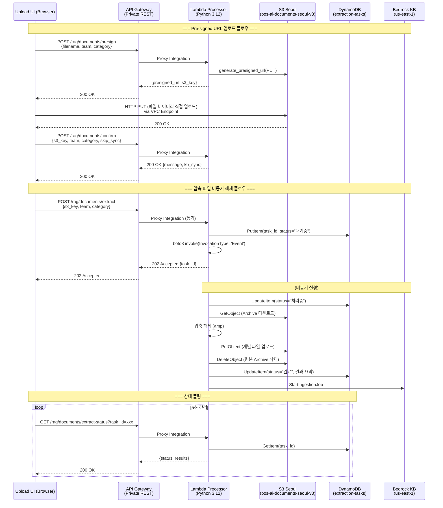
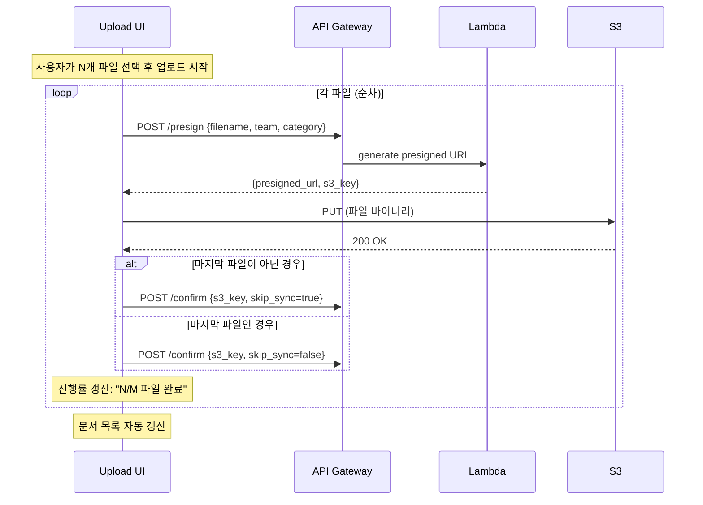

# 설계 문서: 다중 파일/디렉토리 업로드

## 개요

BOS-AI RAG 시스템의 웹 UI에서 다중 파일 선택, 디렉토리 업로드, 압축 파일 비동기 해제를 지원하는 기능을 설계한다. 기존 시스템은 단일 파일을 Base64 인코딩하여 API Gateway를 경유하는 Multipart Upload 방식을 사용하지만, 이 설계에서는 Pre-signed URL 기반 S3 직접 업로드로 전환하여 API Gateway의 10MB 페이로드 제한과 33% Base64 오버헤드를 제거한다.

핵심 설계 결정:
- **Pre-signed URL 직접 업로드**: 클라이언트 → S3 직접 PUT (API Gateway 우회)
- **S3 CORS 설정**: Pre-signed URL PUT 요청 시 브라우저 Cross-Origin 차단 방지를 위해 S3 버킷에 CORS 규칙 필수 적용
- **비동기 압축 해제**: Lambda Event Invocation (재시도 0회)으로 29초 타임아웃 우회, DynamoDB(CMK 암호화)로 상태 추적
- **KB Sync 최적화**: `skip_sync` 파라미터로 개별 파일 동기화 억제, 전체 완료 후 1회 동기화

## 아키텍처

### 시스템 아키텍처 다이어그램



### 다중 파일 업로드 시퀀스




## 컴포넌트 및 인터페이스

### 1. API 엔드포인트

#### 1.1 `POST /rag/documents/presign` — Pre-signed URL 생성

요청:
```json
{
  "filename": "document.pdf",
  "team": "soc",
  "category": "code",
  "content_type": "application/pdf"
}
```

응답 (200):
```json
{
  "presigned_url": "https://bos-ai-documents-seoul-v3.s3.ap-northeast-2.amazonaws.com/documents/soc/code/document.pdf?X-Amz-...",
  "s3_key": "documents/soc/code/document.pdf",
  "expires_in": 3600
}
```

오류 응답 (400):
```json
{
  "error": "filename, team, category are required",
  "missing_fields": ["filename"]
}
```

구현 로직:
- `team/category` 유효성 검증 (`VALID_CATEGORIES` 확인)
- S3 키 생성: `documents/{team}/{category}/{filename}`
- `s3_client.generate_presigned_url('put_object', ...)` 호출
- 유효기간: 3600초
- Pre-signed URL은 S3 Gateway Endpoint를 통해 VPC 내부에서 동작
- **주의**: S3 버킷에 CORS 설정이 필수 (브라우저 → S3 PUT은 Cross-Origin 요청이므로 Preflight OPTIONS 통과 필요)

#### 1.2 `POST /rag/documents/confirm` — 업로드 완료 확인

요청:
```json
{
  "s3_key": "documents/soc/code/document.pdf",
  "filename": "document.pdf",
  "team": "soc",
  "category": "code",
  "skip_sync": true
}
```

응답 (200):
```json
{
  "message": "Upload confirmed",
  "key": "documents/soc/code/document.pdf",
  "kb_sync": "skipped"
}
```

구현 로직:
- S3에 파일 존재 여부 확인 (`head_object`)
- `skip_sync=true`이면 KB Sync 건너뜀
- `skip_sync=false`이면 `trigger_kb_sync()` 호출
- 압축 파일(zip/tar.gz)인 경우: 자동으로 `/rag/documents/extract` 로직 트리거 가능 (선택적)

#### 1.3 `POST /rag/documents/extract` — 비동기 압축 해제 시작

요청:
```json
{
  "s3_key": "documents/soc/code/archive.zip",
  "team": "soc",
  "category": "code"
}
```

응답 (202 Accepted):
```json
{
  "task_id": "ext-20250101-abc123",
  "status": "대기중",
  "message": "Extraction task created"
}
```

구현 로직:
1. `task_id` 생성: `ext-{YYYYMMDD}-{uuid4[:8]}`
2. DynamoDB에 초기 레코드 생성 (status="대기중")
3. Lambda 비동기 호출: `boto3.client('lambda').invoke(InvocationType='Event', ...)`
4. 즉시 202 응답 반환

#### 1.4 `GET /rag/documents/extract-status` — 압축 해제 상태 조회

요청: `GET /rag/documents/extract-status?task_id=ext-20250101-abc123`

응답 (200):
```json
{
  "task_id": "ext-20250101-abc123",
  "status": "완료",
  "created_at": "2025-01-01T12:00:00Z",
  "updated_at": "2025-01-01T12:01:30Z",
  "results": {
    "total_files": 15,
    "success_count": 13,
    "skipped_count": 2,
    "error_count": 0,
    "skipped_files": ["image.png", "video.mp4"],
    "kb_sync": "sync started - job_id: xxx"
  }
}
```

오류 응답 (404):
```json
{
  "error": "Task not found",
  "task_id": "ext-invalid-id"
}
```

### 2. Lambda 핸들러 변경

기존 `handler()` 함수에 새 라우트 추가:

```python
# 새 라우트 (handler 함수 내)
if '/documents/presign' in path and method == 'POST':
    return presign_upload(event)

if '/documents/confirm' in path and method == 'POST':
    return confirm_upload(event)

if '/documents/extract' in path and method == 'POST':
    return start_extraction(event)

if '/documents/extract-status' in path and method == 'GET':
    return get_extraction_status(event)
```

새 함수 목록:
- `presign_upload(event)` — Pre-signed URL 생성
- `confirm_upload(event)` — 업로드 완료 확인 + 선택적 KB Sync
- `start_extraction(event)` — Extraction Task 생성 + 비동기 Lambda 호출
- `process_extraction(event)` — 실제 압축 해제 로직 (비동기 호출 시 실행)
- `get_extraction_status(event)` — DynamoDB에서 상태 조회

비동기 호출 패턴:
```python
# start_extraction 내부
lambda_client = boto3.client('lambda', region_name='ap-northeast-2')
lambda_client.invoke(
    FunctionName=os.environ['AWS_LAMBDA_FUNCTION_NAME'],
    InvocationType='Event',  # 비동기 (재시도 0회 — Terraform event_invoke_config으로 제어)
    Payload=json.dumps({
        'action': 'process_extraction',
        'task_id': task_id,
        's3_key': s3_key,
        'team': team,
        'category': category
    })
)
```

handler에서 비동기 호출 분기:
```python
def handler(event, context):
    # 비동기 Lambda Event Invocation 처리
    if event.get('action') == 'process_extraction':
        return process_extraction(event)
    
    # 기존 API Gateway 라우팅
    path = event.get('path', '')
    method = event.get('httpMethod', '')
    ...
```

`process_extraction` 내부에서는 모든 예외를 try/except로 감싸고, 실패 시 반드시 DynamoDB 상태를 "실패"로 갱신한 후 /tmp를 정리한다. `maximum_retry_attempts=0` 설정으로 AWS 자동 재시도가 비활성화되어 있으므로, 한 번 실패하면 재실행되지 않는다.

### 3. 웹 UI 변경

#### 3.1 파일 선택 UI 개선

- 기존 단일 `<input type="file" multiple>` → 다중 파일 + 디렉토리 선택 분리
- 디렉토리 선택: `<input type="file" webkitdirectory>` 별도 버튼
- 드래그 앤 드롭: `DataTransferItem.webkitGetAsEntry()` 사용하여 디렉토리 재귀 탐색

#### 3.2 파일 유효성 검증 (클라이언트)

```javascript
const ALLOWED_EXTENSIONS = ['pdf', 'txt', 'docx', 'csv', 'html', 'md', 'zip', 'tar.gz'];
const MAX_FILE_SIZE = 100 * 1024 * 1024;       // 100MB (일반 파일)
const MAX_ARCHIVE_SIZE = 500 * 1024 * 1024;     // 500MB (압축 파일)
const ARCHIVE_EXTENSIONS = ['zip', 'tar.gz'];
const SYSTEM_FILES = ['__MACOSX', 'Thumbs.db', '.DS_Store'];
```

#### 3.3 Pre-signed URL 업로드 플로우

```javascript
async function uploadFilePresigned(file, idx, isLast) {
    // 1. Pre-signed URL 요청
    const presignResp = await apiPost('/documents/presign', {
        filename: file.name, team: selectedTeam,
        category: selectedCategory, content_type: file.type
    });
    
    // 2. S3 직접 업로드 (PUT)
    const putResp = await fetch(presignResp.presigned_url, {
        method: 'PUT',
        body: file,  // 바이너리 직접 전송
        headers: { 'Content-Type': file.type }
    });
    
    // 3. 업로드 완료 확인
    const confirmResp = await apiPost('/documents/confirm', {
        s3_key: presignResp.s3_key, filename: file.name,
        team: selectedTeam, category: selectedCategory,
        skip_sync: !isLast  // 마지막 파일만 sync
    });
    
    // 4. 압축 파일이면 비동기 해제 시작
    if (isArchive(file.name)) {
        const extractResp = await apiPost('/documents/extract', {
            s3_key: presignResp.s3_key, team: selectedTeam,
            category: selectedCategory
        });
        startPolling(extractResp.task_id);
    }
}
```

#### 3.4 진행률 표시

- XMLHttpRequest의 `upload.onprogress` 이벤트로 개별 파일 진행률 표시
- 전체 진행: `"N/M 파일 완료"` 카운터
- 압축 해제 상태: 5초 간격 폴링으로 상태 표시

#### 3.5 디렉토리 탐색

```javascript
async function traverseDirectory(entry, path = '') {
    if (entry.isFile) {
        const file = await getFile(entry);
        const name = entry.name;
        // 숨김 파일, 시스템 파일 필터링
        if (name.startsWith('.') || SYSTEM_FILES.includes(name)) return;
        file._relativePath = path + name;
        addFileToQueue(file);
    } else if (entry.isDirectory) {
        const reader = entry.createReader();
        const entries = await readAllEntries(reader);
        for (const child of entries) {
            await traverseDirectory(child, path + entry.name + '/');
        }
    }
}
```

### 4. MCP 브릿지 변경

`server.js`의 `createMcpServer()` 함수에 2개 도구 추가:

#### 4.1 `rag_upload_status`

```javascript
mcp.tool(
    "rag_upload_status",
    "최근 업로드된 RAG 문서 목록과 KB Sync 상태를 조회합니다.",
    {
        team: { type: "string", description: "팀 필터 (선택)" },
        category: { type: "string", description: "카테고리 필터 (선택)" }
    },
    async (params) => {
        const resp = await ragApi("GET", "/documents" + buildQuery(params));
        // 최근 업로드 파일 목록 포맷팅하여 반환
    }
);
```

#### 4.2 `rag_extract_status`

```javascript
mcp.tool(
    "rag_extract_status",
    "압축 파일 해제 작업(Extraction Task)의 상태를 조회합니다.",
    {
        task_id: { type: "string", description: "Extraction Task ID (필수)" }
    },
    async (params) => {
        const resp = await ragApi("GET", "/documents/extract-status?task_id=" + params.task_id);
        // 상태 포맷팅하여 반환
    }
);
```

### 5. Terraform/IaC 변경

#### 5.1 DynamoDB 테이블 생성

```hcl
resource "aws_dynamodb_table" "extraction_tasks" {
  provider = aws.seoul
  name     = "rag-extraction-tasks-${var.environment}"
  billing_mode = "PAY_PER_REQUEST"
  hash_key = "task_id"

  attribute {
    name = "task_id"
    type = "S"
  }

  ttl {
    attribute_name = "ttl"
    enabled        = true
  }

  # 고객 관리형 KMS 키(CMK)로 서버 측 암호화 (보안 Guardrail)
  server_side_encryption {
    enabled     = true
    kms_key_arn = aws_kms_key.rag_kms.arn  # 기존 통합 KMS 키 참조
  }

  tags = merge(local.common_tags, {
    Name    = "rag-extraction-tasks-${var.environment}"
    Purpose = "Extraction Task Status Tracking"
  })
}
```

#### 5.2 S3 버킷 CORS 설정 (Pre-signed URL PUT 지원)

```hcl
# modules/ai-workload/s3-pipeline/s3.tf에 추가
resource "aws_s3_bucket_cors_configuration" "documents_cors" {
  bucket = aws_s3_bucket.documents_seoul.id

  cors_rule {
    allowed_headers = ["*"]
    allowed_methods = ["PUT", "GET", "HEAD"]
    allowed_origins = ["https://r0qa9lzhgi.execute-api.ap-northeast-2.amazonaws.com"]
    expose_headers  = ["ETag", "x-amz-request-id"]
    max_age_seconds = 3600
  }
}
```

> **배경**: 브라우저가 API Gateway 도메인에서 S3 도메인으로 PUT 요청을 보내면 Cross-Origin 요청이 되어, S3에 CORS 규칙이 없으면 Preflight(OPTIONS) 단계에서 100% 차단됩니다.

#### 5.3 Lambda /tmp 디스크 확대

```hcl
resource "aws_lambda_function" "document_processor" {
  # ... 기존 설정 ...
  
  ephemeral_storage {
    size = 3072  # 3GB (기존 512MB → 3072MB)
  }
}
```

#### 5.4 Lambda 비동기 호출 재시도 제한 (멱등성 보장)

```hcl
# Lambda Event Invocation 자동 재시도를 0으로 제한
# AWS 기본값: 실패 시 최대 2회 자동 재시도 → 압축 해제 중복 실행/상태 꼬임 방지
resource "aws_lambda_function_event_invoke_config" "document_processor_async" {
  function_name                = aws_lambda_function.document_processor.function_name
  maximum_retry_attempts       = 0  # 재시도 없음 — 실패 시 즉시 DynamoDB에 "실패" 기록
  maximum_event_age_in_seconds = 300  # 이벤트 최대 대기 시간 (Lambda 타임아웃과 동일)
}
```

> **배경**: Lambda를 `InvocationType='Event'`로 호출하면 실패 시 AWS가 자동으로 최대 2회 재시도합니다. 압축 해제 도중 에러 후 재시도되면 DynamoDB 상태 꼬임, S3 객체 덮어쓰기 등 멱등성 문제가 발생합니다. `maximum_retry_attempts=0`으로 설정하여 실패 시 재시도 없이 즉시 종료되도록 합니다.

#### 5.5 Lambda IAM 정책 추가

```hcl
# DynamoDB 접근 정책
resource "aws_iam_role_policy" "lambda_dynamodb" {
  name = "lambda-dynamodb-access"
  role = aws_iam_role.lambda.id
  policy = jsonencode({
    Version = "2012-10-17"
    Statement = [{
      Effect = "Allow"
      Action = [
        "dynamodb:PutItem",
        "dynamodb:GetItem",
        "dynamodb:UpdateItem",
        "dynamodb:Query"
      ]
      Resource = [aws_dynamodb_table.extraction_tasks.arn]
    }]
  })
}

# Lambda 자기 자신 비동기 호출 정책
resource "aws_iam_role_policy" "lambda_self_invoke" {
  name = "lambda-self-invoke"
  role = aws_iam_role.lambda.id
  policy = jsonencode({
    Version = "2012-10-17"
    Statement = [{
      Effect   = "Allow"
      Action   = "lambda:InvokeFunction"
      Resource = aws_lambda_function.document_processor.arn
    }]
  })
}

# S3 DeleteObject 권한 추가 (원본 Archive 삭제용)
# 기존 lambda_s3 정책에 "s3:DeleteObject" 추가
```

#### 5.6 API Gateway 새 라우트

```hcl
# /rag/documents/presign
resource "aws_api_gateway_resource" "documents_presign" { ... }
resource "aws_api_gateway_method" "documents_presign_post" { ... }
resource "aws_api_gateway_integration" "documents_presign_lambda" { ... }

# /rag/documents/confirm
resource "aws_api_gateway_resource" "documents_confirm" { ... }
resource "aws_api_gateway_method" "documents_confirm_post" { ... }
resource "aws_api_gateway_integration" "documents_confirm_lambda" { ... }

# /rag/documents/extract
resource "aws_api_gateway_resource" "documents_extract" { ... }
resource "aws_api_gateway_method" "documents_extract_post" { ... }
resource "aws_api_gateway_integration" "documents_extract_lambda" { ... }

# /rag/documents/extract-status
resource "aws_api_gateway_resource" "documents_extract_status" { ... }
resource "aws_api_gateway_method" "documents_extract_status_get" { ... }
resource "aws_api_gateway_integration" "documents_extract_status_lambda" { ... }
```

Deployment triggers에 새 리소스 ID 추가 필요.


## 데이터 모델

### DynamoDB: `rag-extraction-tasks` 테이블

| 속성 | 타입 | 설명 |
|------|------|------|
| `task_id` (PK) | String | `ext-{YYYYMMDD}-{uuid4[:8]}` 형식 |
| `status` | String | `대기중` / `처리중` / `완료` / `실패` |
| `s3_key` | String | 원본 Archive 파일의 S3 키 |
| `team` | String | 팀 코드 (예: `soc`) |
| `category` | String | 카테고리 코드 (예: `code`) |
| `created_at` | String | ISO 8601 생성 시각 |
| `updated_at` | String | ISO 8601 최종 갱신 시각 |
| `results` | Map | 처리 결과 요약 (아래 참조) |
| `error_message` | String | 실패 시 오류 메시지 |
| `ttl` | Number | Unix epoch (생성 후 7일 자동 삭제) |

`results` Map 구조:
```json
{
  "total_files": 15,
  "success_count": 13,
  "skipped_count": 2,
  "error_count": 0,
  "success_files": ["file1.pdf", "file2.txt"],
  "skipped_files": ["image.png", "video.mp4"],
  "error_files": [],
  "kb_sync": "sync started - job_id: xxx"
}
```

### 지원 파일 형식

| 확장자 | MIME Type | 최대 크기 | 비고 |
|--------|-----------|-----------|------|
| `.pdf` | application/pdf | 100MB | |
| `.txt` | text/plain | 100MB | |
| `.docx` | application/vnd.openxmlformats-officedocument.wordprocessingml.document | 100MB | |
| `.csv` | text/csv | 100MB | |
| `.html` | text/html | 100MB | |
| `.md` | text/markdown | 100MB | |
| `.zip` | application/zip | 500MB | 비동기 해제 |
| `.tar.gz` | application/gzip | 500MB | 비동기 해제 |

### 압축 해제 시 파일명 변환 규칙

- 하위 디렉토리 구조 평탄화: `subdir/file.txt` → `subdir_file.txt`
- 숨김 파일 제외: `.`으로 시작하는 파일
- 시스템 파일 제외: `__MACOSX/`, `Thumbs.db`, `.DS_Store`
- 지원하지 않는 확장자: 건너뛰고 `skipped_files`에 기록


## 정확성 속성 (Correctness Properties)

*정확성 속성(Property)은 시스템의 모든 유효한 실행에서 참이어야 하는 특성 또는 동작이다. 사람이 읽을 수 있는 명세와 기계가 검증할 수 있는 정확성 보장 사이의 다리 역할을 한다.*

### Property 1: 파일 큐 병합 시 중복 방지

*For any* 두 개의 파일 목록 A와 B에 대해, A에 B를 병합한 결과 큐에는 동일한 파일명이 두 번 이상 존재하지 않아야 하며, A와 B에 포함된 모든 고유 파일명이 결과 큐에 존재해야 한다.

**Validates: Requirements 1.2, 1.3**

### Property 2: 파일 제거 후 큐 무결성

*For any* 파일 큐와 큐 내 유효한 인덱스에 대해, 해당 인덱스의 파일을 제거하면 큐 길이가 1 감소하고, 제거된 파일명이 큐에 더 이상 존재하지 않아야 한다.

**Validates: Requirements 1.5**

### Property 3: 디렉토리 재귀 탐색 및 필터링

*For any* 파일 트리 구조에 대해, 재귀 탐색 함수는 모든 리프 파일을 반환하되, `.`으로 시작하는 숨김 파일과 시스템 파일(`__MACOSX`, `Thumbs.db`, `.DS_Store`)은 결과에 포함되지 않아야 한다.

**Validates: Requirements 2.2, 2.3, 2.4**

### Property 4: 파일 유효성 검증 (형식 + 크기)

*For any* 파일에 대해, 유효성 검증 함수는 다음을 만족해야 한다: (1) 확장자가 `[pdf, txt, docx, csv, html, md, zip, tar.gz]`에 포함되지 않으면 거부, (2) 일반 파일이 100MB를 초과하면 거부, (3) 압축 파일(zip/tar.gz)이 500MB를 초과하면 거부, (4) 위 조건을 모두 통과하면 허용.

**Validates: Requirements 6.1, 6.2, 6.3, 6.4**

### Property 5: 경로 평탄화 변환

*For any* 하위 디렉토리 경로를 포함하는 파일명에 대해, 평탄화 함수는 `/` 구분자를 `_`로 변환하여 단일 파일명을 생성해야 하며, 원본 파일명의 모든 구성 요소가 결과에 보존되어야 한다.

**Validates: Requirements 3.3**

### Property 6: 비지원 파일 건너뛰기

*For any* 지원 파일과 비지원 파일이 혼합된 압축 파일에 대해, 압축 해제 시 비지원 파일은 S3에 업로드되지 않고 `skipped_files` 목록에 포함되어야 하며, 지원 파일은 정상적으로 S3에 업로드되어야 한다.

**Validates: Requirements 3.5**

### Property 7: 압축 해제 결과 카운트 불변식

*For any* 압축 해제 작업의 결과에 대해, `success_count + skipped_count + error_count == total_files`가 항상 성립해야 한다.

**Validates: Requirements 3.6**

### Property 8: skip_sync 파라미터에 의한 KB Sync 제어

*For any* confirm 요청에 대해, `skip_sync=true`이면 KB Sync가 트리거되지 않아야 하고, `skip_sync=false`이면 KB Sync가 정확히 1회 트리거되어야 한다. 또한 압축 해제 완료 시에도 KB Sync가 1회 트리거되어야 한다.

**Validates: Requirements 5.1, 5.2, 5.4**

### Property 9: Extraction Task 상태 머신

*For any* 압축 해제 작업에 대해, 상태는 반드시 `대기중 → 처리중 → 완료` 또는 `대기중 → 처리중 → 실패` 순서로만 전이되어야 하며, 초기 API 응답은 HTTP 202와 함께 유효한 `task_id`를 반환해야 한다.

**Validates: Requirements 3.1, 7.2, 7.3, 7.4, 7.5**

### Property 10: Pre-signed URL S3 키 경로 생성

*For any* 유효한 filename, team, category 조합에 대해, presign 엔드포인트가 반환하는 `s3_key`는 `documents/{team}/{category}/{filename}` 형식이어야 하며, 반환된 `presigned_url`에 해당 S3 키가 포함되어야 한다.

**Validates: Requirements 10.2**

### Property 11: Pre-signed URL 입력 검증

*For any* presign 요청에서 filename, team, category 중 하나 이상이 누락되면, 응답은 HTTP 400이어야 하며 누락된 필드명이 오류 메시지에 포함되어야 한다.

**Validates: Requirements 10.7**

### Property 12: Extraction 상태 조회 라운드트립

*For any* DynamoDB에 기록된 Extraction Task에 대해, `GET /extract-status?task_id={task_id}`로 조회한 결과는 DynamoDB에 저장된 status, results와 동일해야 한다.

**Validates: Requirements 7.7**

### Property 13: 업로드 오류 복원력

*For any* 파일 목록에서 일부 파일의 업로드가 실패하더라도, 나머지 파일의 업로드는 계속 진행되어야 하며, 최종 결과의 성공 수 + 실패 수는 전체 파일 수와 같아야 한다.

**Validates: Requirements 4.5**


## 오류 처리

### API 엔드포인트 오류

| 엔드포인트 | 오류 조건 | HTTP 코드 | 응답 |
|-----------|----------|-----------|------|
| `POST /presign` | 필수 필드 누락 (filename, team, category) | 400 | `{"error": "...", "missing_fields": [...]}` |
| `POST /presign` | 유효하지 않은 team/category | 400 | `{"error": "Invalid team/category: ..."}` |
| `POST /confirm` | S3에 파일 미존재 | 404 | `{"error": "File not found in S3"}` |
| `POST /extract` | S3에 Archive 미존재 | 404 | `{"error": "Archive not found in S3"}` |
| `POST /extract` | 지원하지 않는 Archive 형식 | 400 | `{"error": "Unsupported archive format"}` |
| `GET /extract-status` | task_id 미전달 | 400 | `{"error": "task_id is required"}` |
| `GET /extract-status` | 존재하지 않는 task_id | 404 | `{"error": "Task not found"}` |

### 비동기 압축 해제 오류

| 오류 조건 | 처리 방식 |
|----------|----------|
| /tmp 디스크 용량 초과 (3072MB) | DynamoDB status="실패", error_message 기록, /tmp 정리 |
| S3 다운로드 실패 | DynamoDB status="실패", error_message 기록 |
| 손상된 Archive 파일 | DynamoDB status="실패", error_message="Corrupted archive" |
| 개별 파일 S3 업로드 실패 | error_count 증가, error_files에 추가, 나머지 파일 계속 처리 |
| Lambda 타임아웃 (300초) | DynamoDB status는 "처리중"으로 남음 → 클라이언트 폴링 시 타임아웃 감지 필요 (재시도 0회이므로 재실행 없음) |

### 클라이언트 오류 처리

| 오류 조건 | 처리 방식 |
|----------|----------|
| Pre-signed URL 만료 (403) | 새 Pre-signed URL 자동 재요청 후 재시도 |
| S3 PUT 업로드 실패 | 해당 파일 상태를 "오류"로 표시, 나머지 파일 계속 업로드 |
| confirm API 실패 | 해당 파일 상태를 "오류"로 표시, 나머지 파일 계속 업로드 |
| 네트워크 오류 | 최대 3회 재시도 후 실패 처리 |
| 폴링 중 네트워크 오류 | 폴링 계속 시도 (최대 60회 = 5분) |

## 테스트 전략

### 단위 테스트 (Unit Tests)

Python (Lambda):
- `presign_upload()`: 유효한 요청 시 Pre-signed URL 반환 확인
- `presign_upload()`: 필수 필드 누락 시 400 응답 확인
- `confirm_upload()`: skip_sync=true 시 KB Sync 미호출 확인
- `confirm_upload()`: skip_sync=false 시 KB Sync 호출 확인
- `start_extraction()`: DynamoDB에 초기 레코드 생성 확인
- `start_extraction()`: 202 응답 + task_id 반환 확인
- `process_extraction()`: zip 파일 해제 후 S3 업로드 확인
- `process_extraction()`: tar.gz 파일 해제 후 S3 업로드 확인
- `process_extraction()`: 비지원 파일 건너뛰기 확인
- `process_extraction()`: /tmp 용량 초과 시 실패 처리 확인
- `get_extraction_status()`: 존재하는 task_id 조회 확인
- `get_extraction_status()`: 존재하지 않는 task_id 시 404 확인
- `flatten_path()`: 경로 평탄화 변환 확인

JavaScript (Web UI):
- `validateFile()`: 지원 형식 허용 확인
- `validateFile()`: 비지원 형식 거부 확인
- `validateFile()`: 크기 제한 초과 거부 확인
- `addFiles()`: 중복 파일명 병합 확인
- `removeFile()`: 파일 제거 확인
- `traverseDirectory()`: 숨김/시스템 파일 필터링 확인

JavaScript (MCP Bridge):
- `rag_upload_status` 도구 등록 확인
- `rag_extract_status` 도구 등록 확인
- `rag_extract_status` 호출 시 extract-status API 호출 확인

### 속성 기반 테스트 (Property-Based Tests)

라이브러리: Python — `hypothesis`, JavaScript — `fast-check`

각 테스트는 최소 100회 반복 실행하며, 설계 문서의 Property 번호를 태그로 참조한다.

| Property | 테스트 대상 | 태그 |
|----------|-----------|------|
| Property 1 | `addFiles()` 큐 병합 + 중복 방지 | Feature: multi-file-upload, Property 1: 파일 큐 병합 시 중복 방지 |
| Property 2 | `removeFile()` 큐 제거 | Feature: multi-file-upload, Property 2: 파일 제거 후 큐 무결성 |
| Property 3 | `traverseDirectory()` 재귀 탐색 + 필터링 | Feature: multi-file-upload, Property 3: 디렉토리 재귀 탐색 및 필터링 |
| Property 4 | `validateFile()` 형식 + 크기 검증 | Feature: multi-file-upload, Property 4: 파일 유효성 검증 |
| Property 5 | `flatten_path()` 경로 평탄화 | Feature: multi-file-upload, Property 5: 경로 평탄화 변환 |
| Property 6 | `process_extraction()` 비지원 파일 건너뛰기 | Feature: multi-file-upload, Property 6: 비지원 파일 건너뛰기 |
| Property 7 | `process_extraction()` 결과 카운트 불변식 | Feature: multi-file-upload, Property 7: 압축 해제 결과 카운트 불변식 |
| Property 8 | `confirm_upload()` skip_sync 제어 | Feature: multi-file-upload, Property 8: skip_sync에 의한 KB Sync 제어 |
| Property 9 | `start_extraction()` + `process_extraction()` 상태 전이 | Feature: multi-file-upload, Property 9: Extraction Task 상태 머신 |
| Property 10 | `presign_upload()` S3 키 경로 생성 | Feature: multi-file-upload, Property 10: Pre-signed URL S3 키 경로 생성 |
| Property 11 | `presign_upload()` 입력 검증 | Feature: multi-file-upload, Property 11: Pre-signed URL 입력 검증 |
| Property 12 | `get_extraction_status()` 라운드트립 | Feature: multi-file-upload, Property 12: Extraction 상태 조회 라운드트립 |
| Property 13 | 업로드 오케스트레이션 오류 복원력 | Feature: multi-file-upload, Property 13: 업로드 오류 복원력 |

각 정확성 속성은 단일 property-based 테스트로 구현하며, 단위 테스트는 구체적인 예시, 엣지 케이스, 통합 포인트에 집중한다.
