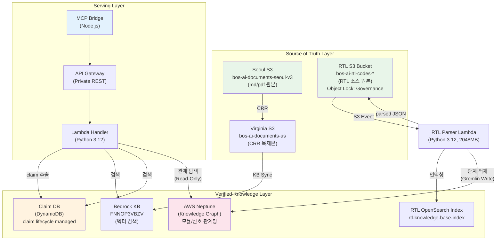
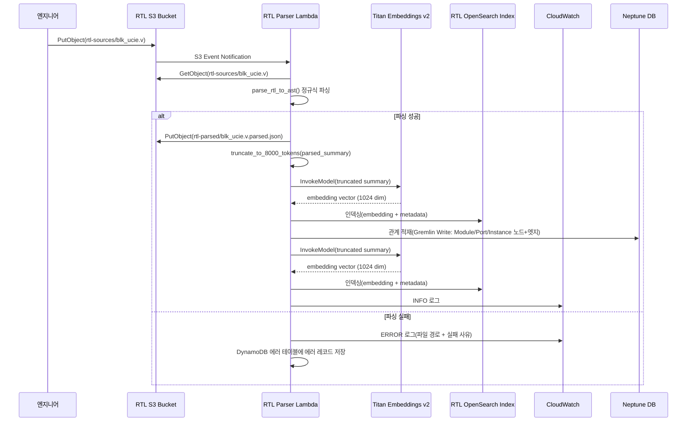
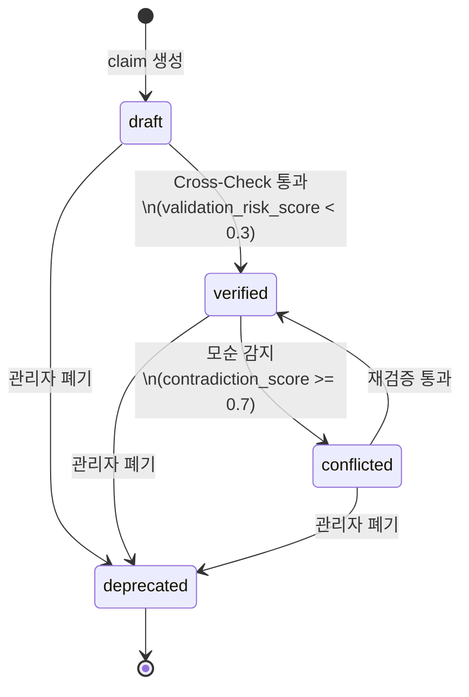
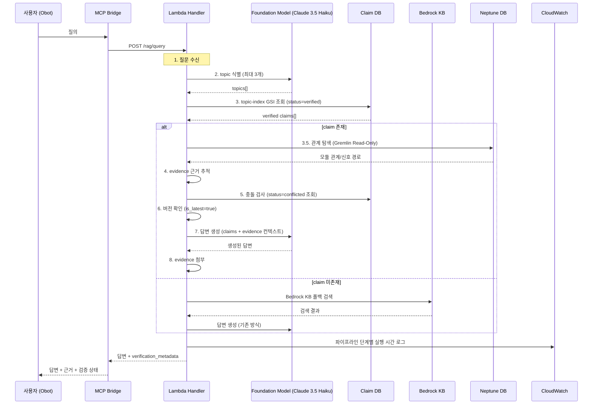
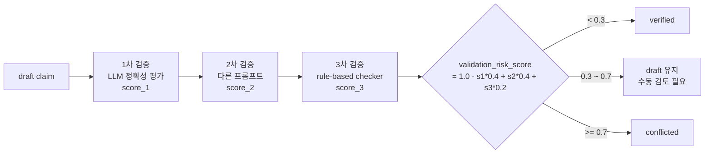

# 설계 문서: Enhanced RAG Optimization (v1.0)

## 개요

Spec 5(rag-search-optimization)에서 구현한 Hybrid Search, 메타데이터 자동 생성/필터링, MCP Bridge 필터 전달을 기반으로, BOS-AI Private RAG 시스템을 근본적으로 확장하는 설계이다. 두 개의 아키텍처 제안서(A: RTL 파이프라인 분리 + 인프라 격리, B: Claim DB + Verification Pipeline)의 장점을 통합하여, 단순 문서 검색에서 **검증된 지식 단위(Claim) 기반 답변 시스템**으로 진화한다.

### 핵심 변경 영역

| # | 영역 | 설명 | Phase |
|---|------|------|-------|
| 1 | RTL 전용 S3 버킷 분리 | Object Lock + Event Notification + CRR | Phase 1 |
| 2 | RTL 구조 파싱 Lambda | 정규식 기반 파서, 2048MB, ECR 마이그레이션 준비 | Phase 1 |
| 3 | RTL OpenSearch 인덱스 | 별도 Python 스크립트로 data plane 인덱스 생성 | Phase 1 |
| 4 | Claim DB (DynamoDB) | claim_id/version PK/SK, 5 GSI, PITR, KMS | Phase 2 |
| 5 | Claim DB 오염 방지 | evidence 필수, 상태 전이, optimistic locking | Phase 2 |
| 6 | 문서 Ingestion 분리 | topic/variant/version 구조화 | Phase 2 |
| 7 | Claim 생성 파이프라인 | LLM 기반 claim 분해, statement/evidence 분리 | Phase 2 |
| 8 | MCP Tool 분리 | search_archive, get_evidence, list_verified_claims | Phase 3 |
| 9 | Verification Pipeline | 8단계 검증 파이프라인, Bedrock KB 폴백 | Phase 3 |
| 10 | MCP Tool 확장 | generate_hdd_section, publish_markdown | Phase 4 |
| 11 | Cross-Check 파이프라인 | 3단계 교차 검증 + validation_risk_score | Phase 5 |
| 12 | 3계층 RAG 분리 | Source of Truth / Knowledge Archive / Serving | Phase 1~3 |
| 13 | 보안 및 네트워크 격리 | IAM Explicit Deny, VPC Endpoint 전용 | Phase 1 |
| 14 | Human Review Gate | critical topic 승인 게이트 | Phase 4 |
| 15 | Operational KPI Metrics | CloudWatch 커스텀 메트릭 7종 | Phase 5 |
| 16 | RTL Knowledge Graph | Neptune Graph DB + 관계 추출 + 3저장소 통합 질의 | Phase 6 |

### 설계 결정 사항

| 결정 | 근거 |
|------|------|
| OpenSearch 인덱스 생성을 Terraform에서 분리 | Terraform은 control plane(컬렉션, 액세스 정책)만 관리. data plane(인덱스 생성)은 `scripts/create-opensearch-index.py`에서 SigV4 인증으로 수행. `local-exec`의 상태 관리 문제 회피 |
| RTL Parser Lambda 메모리 2048MB | CPU 집약적 정규식 파싱 대응. Lambda vCPU는 메모리에 비례(2048MB ≈ 1.2 vCPU). 향후 PyVerilog AST 파싱 시 추가 CPU 필요 |
| DynamoDB Optimistic Locking | `ConditionExpression='version = :expected_version'`으로 동시성 제어. `ConditionalCheckFailedException` 시 Exponential Backoff with Full Jitter(base=100ms, max=2s) 알고리즘으로 최대 3회 재시도. 분산 락 대비 구현 단순, Lambda 환경에 적합 |
| IAM Explicit Deny로 Source of Truth 보호 | Allow 정책만으로는 다른 정책의 Allow가 우선할 수 있음. Explicit Deny는 모든 Allow를 무시하므로 prompt injection 공격으로 인한 원본 변조를 인프라 수준에서 차단. Versioning + Object Lock 환경에서 `s3:DeleteObjectVersion`, `s3:BypassGovernanceRetention`, `s3:PutObjectRetention`도 추가 거부 |
| Titan Embeddings v2 8,000 토큰 truncation (BPE 기반) | RTL 코드는 특수문자가 빈번하여 단어 기반 근사는 부정확. tiktoken cl100k_base BPE 토크나이저로 정확한 토큰 수 계산 후 truncation. 입력 제한 8,192에서 안전 마진 192 토큰 확보 |
| Object Lock은 RTL_S3_Bucket에만 적용 | 기존 Seoul_S3는 Object Lock 활성화 시 버킷 재생성 필요. 신규 RTL_S3_Bucket에만 Governance 모드 적용 |
| Claim_DB 5 GSI 설계 | topic-index, status-index, topic-variant-index, source-document-index, family-index — 각각 주제별/상태별/variant/evidence 역추적/계보 추적 용도 |
| validation_risk_score와 contradiction_score 분리 | validation_risk_score는 개별 claim의 Cross-Check 결과(0~1), contradiction_score는 claim 간 모순 정도(0~1). 용도와 계산 시점이 다름 |
| Claim status lifecycle 6가지 전이만 허용 | draft→verified, draft→deprecated, verified→conflicted, verified→deprecated, conflicted→verified, conflicted→deprecated. 역방향 불허로 데이터 무결성 보장 |
| Neptune db.t4g.medium 선택 | 비용 최적화(월 ~$200). Private Subnet + VPC Endpoint 전용. LLM은 Read-Only(neptune-db:ReadDataViaQuery)만 허용하여 원본 코드 대신 그래프에만 접근 |
| 3저장소 통합 질의 | Graph DB(관계 탐색) + Claim DB(사실 조회) + OpenSearch(임베딩 검색) 3개 결과를 조합하여 LLM이 통합 답변 생성 |
| Neptune SG 엄격 통제 | Inbound TCP 8182를 RTL_Parser_Lambda SG(Write)와 Lambda_Handler SG(Read-Only)에서만 허용. 다른 소스 차단 |
| 3저장소 질의 Fallback | Neptune 쿼리 실패/Timeout 시 OpenSearch + Claim DB 결과만으로 답변 생성. 시스템 중단 방지 |
| 3저장소 병렬 비동기 호출 | Python asyncio로 3개 DB를 병렬 호출하여 Lambda Timeout(300초) 리스크 완화. 개별 DB Timeout은 30초로 제한 |

### 변경 범위

| 컴포넌트 | 파일/경로 | 변경 유형 |
|----------|----------|----------|
| RTL S3 Bucket | `environments/app-layer/bedrock-rag/rtl-s3.tf` | 신규 |
| RTL Parser Lambda | `environments/app-layer/bedrock-rag/rtl-parser-lambda.tf` | 신규 |
| RTL Parser 소스 | `environments/app-layer/bedrock-rag/rtl_parser_src/handler.py` | 신규 |
| OpenSearch 인덱스 스크립트 | `scripts/create-opensearch-index.py` | 신규 |
| Claim DB Terraform | `environments/app-layer/bedrock-rag/claim-db.tf` | 신규 |
| Lambda Handler | `environments/app-layer/bedrock-rag/lambda_src/index.py` | 수정 |
| Lambda IAM | `environments/app-layer/bedrock-rag/lambda.tf` | 수정 |
| MCP Bridge | `mcp-bridge/server.js` | 수정 |
| Terraform Variables | `environments/app-layer/bedrock-rag/variables.tf` | 수정 |
| Property Tests | `tests/properties/enhanced_rag_optimization_test.go` | 신규 |
| Neptune Terraform | `environments/app-layer/knowledge-graph/main.tf` | 신규 |
| Neptune IAM | `environments/app-layer/knowledge-graph/iam_readonly.tf` | 신규 |
| Neptune Module | `modules/ai-workload/graph-knowledge/neptune.tf` | 신규 |

## 아키텍처

### 3계층 RAG 분리 아키텍처



### RTL 파싱 파이프라인



### Claim 생명주기 (Status Lifecycle)



### Verification Pipeline 흐름



### Cross-Check 파이프라인



## 컴포넌트 및 인터페이스

### 1. RTL 전용 S3 버킷 (`rtl-s3.tf`)

**Terraform 리소스:**

```hcl
resource "aws_s3_bucket" "rtl_codes" {
  provider            = aws.seoul
  bucket              = "bos-ai-rtl-codes-${data.aws_caller_identity.current.account_id}"
  object_lock_enabled = true
  tags = merge(local.common_tags, { Name = "bos-ai-rtl-codes", Purpose = "RTL Source Code Storage" })
}

resource "aws_s3_bucket_object_lock_configuration" "rtl_codes" {
  bucket = aws_s3_bucket.rtl_codes.id
  rule {
    default_retention { mode = "GOVERNANCE"; days = 365 }
  }
}
```

- 버전 관리(versioning) 활성화
- KMS CMK 암호화 (기존 BOS-AI KMS 키 사용)
- Block Public Access 전체 활성화
- VPC Endpoint 전용 버킷 정책
- S3 Event Notification: `rtl-sources/` 접두사 → RTL_Parser_Lambda 트리거
- CRR: Seoul → Virginia RTL 전용 버킷
- 필수 태그: Project=BOS-AI, Environment=prod, ManagedBy=terraform, Layer=app

### 2. RTL Parser Lambda (`rtl-parser-lambda.tf` + `rtl_parser_src/handler.py`)

**Lambda 구성:**
- Runtime: Python 3.12
- Memory: 2048MB (≈ 1.2 vCPU)
- Timeout: 300초
- VPC: BOS-AI Frontend VPC (10.10.0.0/16)
- 코드 구조: ECR 컨테이너 이미지 마이그레이션 준비 (Dockerfile 포함 가능한 디렉토리 구조)

**디렉토리 구조:**
```
rtl_parser_src/
├── handler.py          # Lambda 핸들러 + parse_rtl_to_ast
├── Dockerfile          # AWS Lambda Python 3.12 Base Image (ECR 마이그레이션 대비)
└── requirements.txt    # tiktoken, requests-aws4auth 등 의존성
```

**Dockerfile 뼈대:**
```dockerfile
FROM public.ecr.aws/lambda/python:3.12
COPY requirements.txt .
RUN pip install -r requirements.txt
COPY handler.py .
CMD ["handler.handler"]
```

**핵심 함수 인터페이스:**

```python
def handler(event, context):
    """S3 Event Notification 핸들러"""
    # event['Records'][0]['s3']['bucket']['name']
    # event['Records'][0]['s3']['object']['key']

def parse_rtl_to_ast(rtl_content: str) -> dict:
    """RTL 파일을 정규식 기반으로 파싱하여 메타데이터 추출.
    향후 PyVerilog/AST 통합 시 함수 시그니처 변경 없이 내부 구현만 교체.
    
    Returns:
        {
            "module_name": str,
            "parent_module": str,  # 없으면 ""
            "port_list": list[str],
            "parameter_list": list[str],
            "instance_list": list[str],
            "file_path": str
        }
    """

def truncate_to_tokens(text: str, max_tokens: int = 8000) -> str:
    """Titan Embeddings v2 입력 제한(8,192 토큰) 대응.
    RTL 코드는 특수문자([31:0], _, 기호)가 빈번하여 단어 기반 근사는 2~3배 과소추정됨.
    tiktoken cl100k_base BPE 토크나이저를 보수적 근사로 사용하여 정확한 토큰 수 계산.
    Titan 자체 토크나이저와 차이가 있으므로 안전 마진 포함(8,000 토큰 상한).
    임베딩 API 호출 전 방어적 길이 검사."""

def generate_parsed_summary(metadata: dict) -> str:
    """파싱된 메타데이터를 텍스트 요약으로 변환.
    모듈 선언부 + 포트 선언부만 포함 (원본 RTL 소스 전체 미포함)."""
```

**IAM 권한 (최소 권한):**
- `s3:GetObject` — RTL_S3_Bucket `rtl-sources/*`
- `s3:PutObject` — RTL_S3_Bucket `rtl-parsed/*`
- `aoss:APIAccessAll` — RTL_OpenSearch_Index 인덱싱
- `logs:CreateLogStream`, `logs:PutLogEvents` — CloudWatch Logs
- `kms:Decrypt`, `kms:GenerateDataKey` — KMS
- `bedrock:InvokeModel` — Titan Embeddings v2
- `dynamodb:PutItem` — 에러 테이블 기록
- `neptune-db:WriteDataViaQuery` — Neptune Graph 데이터 적재 (Phase 6)

### 3. OpenSearch 인덱스 생성 스크립트 (`scripts/create-opensearch-index.py`)

Terraform은 OpenSearch_Collection과 데이터 액세스 정책(control plane)만 프로비저닝한다. 인덱스 생성(data plane)은 별도 Python 스크립트로 수행한다.

```python
# scripts/create-opensearch-index.py
# SigV4 인증으로 OpenSearch Serverless에 접근하여 RTL 인덱스 생성
# 의존성: requests, requests-aws4auth, boto3

INDEX_BODY = {
    # AOSS Vector Search 컬렉션은 k-NN이 암묵적으로 활성화됨.
    # settings.index.knn을 명시하면 IllegalArgumentException 발생 가능.
    # mappings의 knn_vector 타입 정의만으로 충분.
    "mappings": {
        "properties": {
            "embedding":      { "type": "knn_vector", "dimension": 1024,
                                "method": { "engine": "faiss", "space_type": "l2" } },
            "module_name":    { "type": "keyword" },
            "parent_module":  { "type": "keyword" },
            "port_list":      { "type": "text" },
            "parameter_list": { "type": "text" },
            "instance_list":  { "type": "text" },
            "file_path":      { "type": "keyword" },
            "parsed_summary": { "type": "text" }
        }
    }
}
```

**데이터 액세스 정책 (Terraform):**
- RTL_Parser_Lambda IAM 역할: 인덱싱 권한
- Bedrock_KB 서비스 프린시펄: 검색 권한
- 기존 문서 인덱스(`bedrock-knowledge-base-default-index`)와 독립 유지

### 4. Claim DB 관련 Lambda Handler 확장 (`index.py`)

기존 `index.py`에 다음 함수/엔드포인트를 추가한다:

#### 4.1 Claim CRUD 함수

```python
def create_claim(event):
    """POST /rag/claims - 새 claim 생성
    - evidence 배열 최소 1개 검증 (없으면 HTTP 400)
    - status='draft', version=1 초기화
    - confidence 0.0~1.0 범위 검증
    - topic 계층적 형식 검증 (슬래시 구분)
    - 동일 topic verified claim과 contradiction_score 계산
    - optimistic locking: ConditionExpression='attribute_not_exists(claim_id)'
    """

def update_claim_status(event):
    """POST /rag/claims/update-status - claim 상태 전이
    - 허용 전이: draft->verified, draft->deprecated, verified->conflicted,
      verified->deprecated, conflicted->verified, conflicted->deprecated
    - 불허 전이 시 HTTP 409
    - optimistic locking: ConditionExpression='version = :expected_version'
    - ConditionalCheckFailedException 시 최대 3회 재시도
    - deprecated 전이 시 하위 claim status를 conflicted로 변경
    """

def get_evidence(event):
    """POST /rag/get-evidence - claim의 evidence 배열 반환"""

def list_verified_claims(event):
    """POST /rag/list-verified-claims - topic의 verified claim 목록 반환
    - topic-index GSI 사용, status=verified 필터
    """
```

#### 4.2 Claim Ingestion 함수

```python
def ingest_claims(event, context):
    """Lambda Event 비동기 호출 - 문서를 claim 단위로 분해
    - 1회 최대 100건 문서 처리
    - Foundation_Model로 claim 추출 (statement + evidence 분리)
    - statement: LLM이 재구성한 정규화된 1문장 (10~500자)
    - evidence.source_chunk: 원본 문서의 정확한 인용 (10~1000자)
    - 각 claim을 Claim_DB에 status=draft, version=1로 저장
    - has_more + continuation_token 페이지네이션
    """
```

#### 4.3 Verification Pipeline 함수

```python
def verification_pipeline(query, variant=None):
    """8단계 Verification Pipeline 실행
    Returns:
        {
            "answer": str,
            "citations": list,
            "verification_metadata": {
                "claims_used": list,       # claim_id 배열
                "topics_identified": list,  # topic 배열
                "has_conflicts": bool,
                "pipeline_execution_time_ms": int,
                "fallback": bool
            }
        }
    """
```

#### 4.4 Cross-Check 함수

```python
def cross_check_claims(event, context):
    """Lambda Event 비동기 호출 - draft claim 교차 검증
    - 1차: LLM 정확성 평가 -> score_1
    - 2차: 다른 프롬프트 재검증 -> score_2
    - 3차: rule-based checker -> score_3
    - validation_risk_score = 1.0 - (score_1 * 0.4 + score_2 * 0.4 + score_3 * 0.2)
    - < 0.3 -> verified, 0.3~0.7 -> draft 유지, >= 0.7 -> conflicted
    """
```

#### 4.5 Human Review Gate 함수

```python
def approve_claim(event):
    """POST /rag/claims/approve - claim 승인
    - approval_status를 'approved'로 설정
    - approved_by, approved_at 기록
    """

def reject_claim(event):
    """POST /rag/claims/reject - claim 거부
    - approval_status를 'rejected'로 설정
    """
```

#### 4.6 문서 생성 함수

```python
def generate_hdd_section(event):
    """POST /rag/generate-hdd - HDD 섹션 자동 생성
    - topic의 verified + approved claim 조회
    - Foundation_Model로 마크다운 생성
    - evidence 각주 포함 (include_evidence=true)
    - 면책 조항 자동 포함
    """

def publish_markdown(event):
    """POST /rag/publish-markdown - 마크다운 출판
    - Seoul_S3 published/ 접두사에 저장
    - 메타데이터 자동 생성 (source='system_generated')
    - critical topic claim은 approval_status='approved'만 사용
    """
```

#### 4.7 KPI Metrics 함수

```python
def publish_kpi_metrics(metrics):
    """CloudWatch 커스텀 메트릭 발행 (BOS-AI/ClaimDB 네임스페이스)
    메트릭: ClaimIngestionSuccessRate, ClaimVerificationPassRate,
    ContradictionDetectionRate, BedrockKBFallbackRate,
    AvgEvidenceCountPerAnswer, StaleClaimRatio, TopicCoverageRatio
    """
```

#### 4.8 handler() 라우팅 확장

기존 API Gateway 라우트에 추가:

| HTTP Method | Path | 함수 | 요구사항 |
|-------------|------|------|---------|
| POST | /rag/search-archive | search_archive() | 8.1, 8.4 |
| POST | /rag/get-evidence | get_evidence() | 8.2, 8.4 |
| POST | /rag/list-verified-claims | list_verified_claims() | 8.3, 8.4 |
| POST | /rag/claims | create_claim() | 5.1~5.7 |
| POST | /rag/claims/update-status | update_claim_status() | 5.2, 5.3, 5.8~5.10 |
| POST | /rag/claims/approve | approve_claim() | 14.3 |
| POST | /rag/claims/reject | reject_claim() | 14.4 |
| POST | /rag/generate-hdd | generate_hdd_section() | 10.1~10.3 |
| POST | /rag/publish-markdown | publish_markdown() | 10.4~10.6 |

Lambda Event 비동기 호출 (API Gateway 미경유):

| action | 함수 | 요구사항 |
|--------|------|---------|
| ingest_claims | ingest_claims() | 7.1~7.7 |
| cross_check_claims | cross_check_claims() | 11.1~11.10 |

### 5. MCP Bridge 도구 확장 (`server.js`)

기존 `rag_query` 도구에 더해 5개 도구를 추가한다:

```javascript
// search_archive - 기존 Bedrock KB 검색 + topic/source 필터
mcp.tool("search_archive", "Archive 문서 검색", {
  query: z.string().describe("검색 질의"),
  topic: z.string().optional().describe("topic 필터"),
  source: z.string().optional().describe("source 필터"),
  max_results: z.number().optional().default(5).describe("최대 결과 수")
}, async (args) => { /* POST /rag/search-archive */ });

// get_evidence - claim의 evidence 배열 조회
mcp.tool("get_evidence", "Claim 근거 조회", {
  claim_id: z.string().describe("claim ID")
}, async (args) => { /* POST /rag/get-evidence */ });

// list_verified_claims - topic의 verified claim 목록
mcp.tool("list_verified_claims", "검증된 Claim 목록 조회", {
  topic: z.string().describe("topic 식별자")
}, async (args) => { /* POST /rag/list-verified-claims */ });

// generate_hdd_section - HDD 섹션 자동 생성
mcp.tool("generate_hdd_section", "HDD 섹션 생성", {
  topic: z.string().describe("topic"),
  section_title: z.string().describe("섹션 제목"),
  include_evidence: z.boolean().optional().default(true)
}, async (args) => { /* POST /rag/generate-hdd */ });

// publish_markdown - 마크다운 출판
mcp.tool("publish_markdown", "마크다운 출판", {
  content: z.string().describe("마크다운 콘텐츠"),
  filename: z.string().describe("파일명"),
  topic: z.string().optional().describe("topic")
}, async (args) => { /* POST /rag/publish-markdown */ });
```

모든 도구 응답에 `execution_time_ms` 필드를 포함한다.

## 데이터 모델

### 1. Claim_DB DynamoDB 테이블 스키마

**테이블 구성:**
- 테이블명: `bos-ai-claim-db-prod`
- 파티션 키: `claim_id` (String, UUID)
- 정렬 키: `version` (Number, 1부터 시작)
- 과금 모드: PAY_PER_REQUEST (온디맨드)
- 암호화: KMS CMK
- PITR: 활성화

**Claim 레코드 구조:**

| 필드 | 타입 | 필수 | 설명 | 예시 |
|------|------|------|------|------|
| `claim_id` | String (UUID) | PK | 고유 식별자 | `"a1b2c3d4-..."` |
| `version` | Number | SK | 버전 번호 (1부터) | `1` |
| `topic` | String | 필수 | 계층적 주제 식별자 | `"ucie/phy/ltssm"` |
| `statement` | String | 필수 | 정규화된 1문장 사실 진술 (10~500자) | `"HADDR는 AHB 버스의 32비트 주소 버스이다"` |
| `evidence` | List of Map | 필수 (최소 1개) | Evidence 객체 배열 | 아래 참조 |
| `confidence` | Number | 필수 | 확신도 (0.0~1.0) | `0.92` |
| `status` | String | 필수 | Claim_Status 열거값 | `"draft"` |
| `variant` | String | 필수 | 변형 식별자 | `"default"` |
| `claim_family_id` | String (UUID) | 필수 | 버전 그룹 식별 | `"f5e6d7c8-..."` |
| `is_latest` | Boolean | 필수 | 최신 버전 여부 | `true` |
| `applies_to` | List of String | 선택 | 적용 대상 variant 배열 | `["baseline", "N1B0"]` |
| `baseline_reference` | String | 선택 | baseline variant claim_id | `null` |
| `supersedes_claim_id` | String | 선택 | 이전 버전 claim_id | `null` |
| `derived_from` | List of String | 필수 | 원본 claim_id 배열 | `[]` |
| `created_at` | String | 필수 | ISO 8601 생성 시각 | `"2026-03-15T09:30:00Z"` |
| `last_verified_at` | String | 필수 | ISO 8601 최종 검증 시각 | `"2026-03-15T09:30:00Z"` |
| `created_by` | String | 필수 | 생성 주체 식별자 | `"system:ingest_claims"` |
| `approval_status` | String | 필수 | 승인 상태 | `"pending_review"` |
| `approved_by` | String | 선택 | 승인자 식별자 | `null` |
| `approved_at` | String | 선택 | ISO 8601 승인 시각 | `null` |

**Evidence 객체 구조:**

| 필드 | 타입 | 필수 | 설명 | 예시 |
|------|------|------|------|------|
| `source_document_id` | String | 필수 | S3 키 또는 문서 식별자 | `"documents/soc/spec/ahb_spec.pdf"` |
| `source_chunk` | String | 필수 | 원본 정확 인용 (10~1000자) | `"HADDR[31:0] is the 32-bit..."` |
| `page_number` | Number | 선택 | 페이지 번호 | `42` |
| `extraction_date` | String | 필수 | ISO 8601 추출 일시 | `"2026-03-15T09:30:00Z"` |
| `source_type` | String | 필수 | `"md"`, `"pdf"`, `"rtl"`, `"csv"` 중 하나 | `"pdf"` |
| `source_path` | String | 필수 | 파일 내부 위치 | `"Section 3.2"` |
| `line_start` | Number | 선택 | 시작 라인 (md/rtl용) | `145` |
| `line_end` | Number | 선택 | 종료 라인 | `152` |
| `chunk_hash` | String | 필수 | source_chunk SHA-256 해시 | `"a3f2b1c4..."` |

**GSI (Global Secondary Index) 5개:**

| GSI 이름 | 파티션 키 | 정렬 키 | 용도 |
|----------|----------|---------|------|
| `topic-index` | `topic` | `last_verified_at` | 주제별 claim 조회 (Verification Pipeline 3단계) |
| `status-index` | `status` | `last_verified_at` | 상태별 claim 조회 (Cross-Check 대상 선별) |
| `topic-variant-index` | `topic_variant` (복합 키) | `last_verified_at` | variant 필터링 (요구사항 9.9) |
| `source-document-index` | `source_document_id` | `extraction_date` | evidence 역추적 (원본 문서에서 claim 찾기) |
| `family-index` | `claim_family_id` | `version` | claim 계보 추적 (버전 체인) |

**Terraform 정의 (`claim-db.tf`):**

```hcl
resource "aws_dynamodb_table" "claim_db" {
  provider     = aws.seoul
  name         = "bos-ai-claim-db-prod"
  billing_mode = "PAY_PER_REQUEST"
  hash_key     = "claim_id"
  range_key    = "version"

  attribute {
    name = "claim_id"
    type = "S"
  }
  attribute {
    name = "version"
    type = "N"
  }
  attribute {
    name = "topic"
    type = "S"
  }
  attribute {
    name = "status"
    type = "S"
  }
  attribute {
    name = "topic_variant"
    type = "S"
  }
  attribute {
    name = "source_document_id"
    type = "S"
  }
  attribute {
    name = "claim_family_id"
    type = "S"
  }
  attribute {
    name = "last_verified_at"
    type = "S"
  }
  attribute {
    name = "extraction_date"
    type = "S"
  }

  global_secondary_index {
    name            = "topic-index"
    hash_key        = "topic"
    range_key       = "last_verified_at"
    projection_type = "ALL"
  }

  global_secondary_index {
    name            = "status-index"
    hash_key        = "status"
    range_key       = "last_verified_at"
    projection_type = "ALL"
  }

  global_secondary_index {
    name            = "topic-variant-index"
    hash_key        = "topic_variant"
    range_key       = "last_verified_at"
    projection_type = "ALL"
  }

  global_secondary_index {
    name            = "source-document-index"
    hash_key        = "source_document_id"
    range_key       = "extraction_date"
    projection_type = "KEYS_ONLY"
  }

  global_secondary_index {
    name            = "family-index"
    hash_key        = "claim_family_id"
    range_key       = "version"
    projection_type = "ALL"
  }

  point_in_time_recovery {
    enabled = true
  }

  server_side_encryption {
    enabled     = true
    kms_key_arn = aws_kms_key.s3_seoul.arn
  }

  tags = merge(local.common_tags, {
    Name    = "bos-ai-claim-db-prod"
    Purpose = "Claim Knowledge Archive"
  })
}
```

### 2. Claim Status 전이 규칙

허용되는 상태 전이:

```python
ALLOWED_TRANSITIONS = {
    "draft":      ["verified", "deprecated"],
    "verified":   ["conflicted", "deprecated"],
    "conflicted": ["verified", "deprecated"],
    "deprecated": []  # 종료 상태, 전이 불가
}
```

### 3. RTL 파싱 결과 JSON 구조 (`rtl-parsed/*.parsed.json`)

```json
{
  "module_name": "BLK_UCIE",
  "parent_module": "",
  "port_list": ["clk", "rst_n", "haddr", "hwdata", "hrdata"],
  "parameter_list": ["DATA_WIDTH=32", "ADDR_WIDTH=16"],
  "instance_list": ["u_phy: UCIE_PHY", "u_ctrl: UCIE_CTRL"],
  "file_path": "rtl-sources/blk_ucie.v",
  "parsed_summary": "module BLK_UCIE (clk, rst_n, haddr[15:0], hwdata[31:0], hrdata[31:0]); parameter DATA_WIDTH=32; ..."
}
```

### 4. 문서 메타데이터 확장 구조

기존 Spec 5의 `.metadata.json`에 topic/variant/doc_version/source 필드를 추가한다:

```json
{
  "metadataAttributes": {
    "team": "soc",
    "category": "spec",
    "document_type": "markdown",
    "upload_date": "2026-03-15T09:30:00Z",
    "version": "2.0",
    "source_system": "archive_md",
    "topic": "ucie/phy",
    "variant": "default",
    "doc_version": "2.0",
    "source": "archive_md"
  }
}
```

### 5. Verification Pipeline 응답 구조

```json
{
  "answer": "HADDR 신호는 AHB 버스의 32비트 주소 버스로...",
  "citations": [
    {
      "text": "HADDR[31:0] is the 32-bit system address bus...",
      "references": [
        { "uri": "s3://bos-ai-documents-us/documents/soc/spec/ahb_spec.pdf", "score": 0.87 }
      ]
    }
  ],
  "verification_metadata": {
    "claims_used": ["a1b2c3d4-...", "e5f6g7h8-..."],
    "topics_identified": ["ahb/signal/haddr", "ahb/bus"],
    "has_conflicts": false,
    "pipeline_execution_time_ms": 3200,
    "fallback": false
  }
}
```

### 6. Cross-Check 결과 응답 구조

```json
{
  "claims_verified": 45,
  "claims_conflicted": 3,
  "claims_pending": 12,
  "total_processed": 60
}
```

### 7. Claim Ingestion 응답 구조

```json
{
  "documents_processed": 87,
  "claims_created": 342,
  "documents_failed": 3,
  "has_more": true,
  "continuation_token": "documents/soc/spec/last_doc.md"
}
```

### 8. KPI Metrics 정의

| 메트릭 이름 | 네임스페이스 | 단위 | 계산 공식 | 발행 시점 |
|-------------|-------------|------|----------|----------|
| ClaimIngestionSuccessRate | BOS-AI/ClaimDB | Percent | `(claims_created / (claims_created + documents_failed)) * 100` | ingest_claims 완료 시 |
| ClaimVerificationPassRate | BOS-AI/ClaimDB | Percent | `(claims_verified / total_processed) * 100` | cross_check_claims 완료 시 |
| ContradictionDetectionRate | BOS-AI/ClaimDB | Percent | `(claims_conflicted / total_processed) * 100` | cross_check_claims 완료 시 |
| BedrockKBFallbackRate | BOS-AI/ClaimDB | Count | 폴백 발생 시 1 증가 | Verification Pipeline 폴백 시 |
| AvgEvidenceCountPerAnswer | BOS-AI/ClaimDB | Count | 사용된 claim의 evidence 수 평균 | Verification Pipeline 답변 생성 시 |
| StaleClaimRatio | BOS-AI/ClaimDB | Percent | `(30일 미검증 verified claim / 전체 verified claim) * 100` | 질의 처리 시 또는 스케줄 |
| TopicCoverageRatio | BOS-AI/ClaimDB | Percent | `(verified claim 존재 topic 수 / 전체 topic 수) * 100` | 질의 처리 시 또는 스케줄 |

## 정확성 속성 (Correctness Properties)

*속성(Property)은 시스템의 모든 유효한 실행에서 참이어야 하는 특성 또는 동작이다. 속성은 사람이 읽을 수 있는 명세와 기계가 검증할 수 있는 정확성 보장 사이의 다리 역할을 한다.*

### Property 1: RTL 파싱 라운드트립

*For any* 유효한 Verilog/SystemVerilog 모듈 선언에 대해, `parse_rtl_to_ast`로 파싱한 후 결과를 텍스트로 직렬화하고 다시 `parse_rtl_to_ast`로 파싱하면, 동일한 메타데이터 구조(`module_name`, `parent_module`, `port_list`, `parameter_list`, `instance_list`, `file_path`)를 생성해야 한다.

**Validates: Requirements 2.2, 2.4, 2.9**

### Property 2: 토큰 Truncation 상한

*For any* 입력 텍스트에 대해, `truncate_to_tokens(text, 8000)` 함수의 출력은 8,000 토큰을 초과하지 않아야 하며, 입력이 8,000 토큰 이하인 경우 출력은 입력과 동일해야 한다.

**Validates: Requirements 2.11**

### Property 3: RTL 파싱 실패 시 에러 레코드 생성

*For any* 정규식 파서로 파싱할 수 없는 RTL 파일 콘텐츠에 대해, RTL_Parser_Lambda는 원본 파일 경로와 실패 사유를 포함한 에러 레코드를 생성해야 하며, 파싱된 요약(parsed_summary)에 원본 RTL 소스 코드 전체가 포함되지 않아야 한다.

**Validates: Requirements 2.6, 2.7**

### Property 4: RTL OpenSearch 인덱스 매핑 완전성

*For any* RTL_OpenSearch_Index 매핑 정의에 대해, `embedding`(knn_vector, dimension=1024, engine=faiss, space_type=l2), `module_name`(keyword), `parent_module`(keyword), `port_list`(text), `parameter_list`(text), `instance_list`(text), `file_path`(keyword), `parsed_summary`(text) 필드가 모두 존재하고 올바른 타입이어야 한다.

**Validates: Requirements 3.3, 3.4**

### Property 5: Claim_DB Terraform 구성 완전성

*For any* Claim_DB DynamoDB 테이블 Terraform 정의에 대해, 파티션 키가 `claim_id`(String)이고 정렬 키가 `version`(Number)이며, 5개 GSI(`topic-index`, `status-index`, `topic-variant-index`, `source-document-index`, `family-index`)가 올바른 키 스키마로 정의되고, PAY_PER_REQUEST 과금 모드, PITR 활성화, KMS CMK 암호화가 설정되어야 한다.

**Validates: Requirements 4.1, 4.2, 4.5, 4.6, 4.7**

### Property 6: Claim 필드 유효성 검증

*For any* Claim 생성 요청에 대해, 다음 검증 규칙이 적용되어야 한다: (1) `evidence` 배열이 최소 1개의 Evidence 객체를 포함해야 하고 (빈 배열이면 HTTP 400), (2) `confidence`가 0.0 이상 1.0 이하여야 하고 (범위 밖이면 HTTP 400), (3) `topic`이 비어있지 않고 슬래시 구분 계층적 형식이어야 하고, (4) `statement`가 10자 이상 500자 이하여야 하고, (5) 각 Evidence의 `source_chunk`가 10자 이상 1000자 이하여야 한다.

**Validates: Requirements 5.1, 5.6, 5.7, 7.2**

### Property 7: Claim 상태 전이 규칙

*For any* Claim과 상태 전이 요청에 대해, `draft->verified`, `draft->deprecated`, `verified->conflicted`, `verified->deprecated`, `conflicted->verified`, `conflicted->deprecated` 전이만 성공해야 하며, 그 외 전이(예: `deprecated->*`, `verified->draft`)는 HTTP 409 응답을 반환해야 한다. 새로 생성된 claim의 초기 status는 항상 `draft`여야 한다.

**Validates: Requirements 5.2, 5.3**

### Property 8: Claim 버전 불변성

*For any* Claim 업데이트에 대해, 새로운 version 번호는 이전 version + 1이어야 하며, 이전 version의 레코드는 Claim_DB에 그대로 유지되어야 한다 (삭제되지 않음).

**Validates: Requirements 5.4**

### Property 9: Optimistic Locking 동시성 제어

*For any* Claim_DB 쓰기 작업(PutItem, UpdateItem)에 대해, `ConditionExpression='version = :expected_version'`이 포함되어야 하며, `ConditionalCheckFailedException` 발생 시 최신 version을 다시 읽어 최대 3회 재시도해야 한다.

**Validates: Requirements 5.9, 5.10**

### Property 10: Contradiction Score 기반 상태 변경

*For any* 동일 topic 내 새로운 claim과 기존 `verified` claim에 대해, `contradiction_score`가 0.7 이상이면 기존 claim의 status가 `conflicted`로 변경되고 새 claim의 `derived_from`에 충돌 claim_id가 기록되어야 한다. `deprecated` 전이 시 해당 claim을 `derived_from`으로 참조하는 모든 하위 claim의 status가 `conflicted`로 변경되어야 한다.

**Validates: Requirements 5.5, 5.8**

### Property 11: Validation Risk Score 계산 및 상태 전이

*For any* 세 개의 검증 점수 `score_1`, `score_2`, `score_3` (각각 0.0~1.0 범위)에 대해, `validation_risk_score = 1.0 - (score_1 * 0.4 + score_2 * 0.4 + score_3 * 0.2)`이며, 결과가 0.3 미만이면 claim status가 `verified`로, 0.3 이상 0.7 미만이면 `draft` 유지, 0.7 이상이면 `conflicted`로 변경되어야 한다.

**Validates: Requirements 11.5, 11.6, 11.7, 11.8**

### Property 12: Rule-Based Checker 검증

*For any* claim에 대해, 3차 rule-based checker는 다음을 검증해야 한다: (1) evidence의 `source_document_id`가 실제 S3에 존재하는지, (2) `statement` 길이가 10자 이상 500자 이하인지, (3) `topic` 형식이 유효한지. 세 조건 모두 통과하면 score_3 = 1.0, 하나라도 실패하면 score_3 < 1.0이어야 한다.

**Validates: Requirements 11.4**

### Property 13: 문서 메타데이터 확장 구조

*For any* topic 파라미터와 함께 업로드된 문서에 대해, 메타데이터에 `topic`, `variant`(기본값 `"default"`), `doc_version`(기본값 `"1.0"`), `source`(허용 값: `"archive_md"`, `"rtl_parsed"`, `"codebeamer"`, `"manual_upload"`, `"system_generated"` 중 하나) 필드가 포함되어야 한다.

**Validates: Requirements 6.2, 6.5**

### Property 14: 파일 경로에서 Topic 자동 추출

*For any* `documents/{team}/{category}/{filename}` 형식의 S3 키에 대해, topic 자동 추출 함수는 파일 경로와 파일명에서 유효한 계층적 topic 문자열을 생성해야 한다.

**Validates: Requirements 6.6**

### Property 15: Claim Ingestion 페이지네이션 및 카운팅

*For any* ingest_claims 실행에 대해, (1) 처리된 문서 수가 100건을 초과하지 않아야 하고, (2) 응답에 `documents_processed`, `claims_created`, `documents_failed` 필드가 포함되어야 하며, (3) 미처리 문서가 남아있으면 `has_more=true`와 `continuation_token`이 포함되어야 하고, (4) 새로 생성된 모든 claim의 status는 `draft`이고 version은 `1`이어야 한다.

**Validates: Requirements 7.3, 7.4, 7.7**

### Property 16: Verification Pipeline 응답 구조

*For any* Verification Pipeline 실행에 대해, 응답에 `verification_metadata` 객체가 포함되어야 하며, 해당 객체에는 `claims_used`(배열), `topics_identified`(배열, 최대 3개), `has_conflicts`(불리언), `pipeline_execution_time_ms`(양의 정수), `fallback`(불리언) 필드가 모두 존재해야 한다. Claim_DB에 관련 claim이 없으면 `fallback`이 `true`여야 하고, claim 검색에서는 `status=verified`인 claim만 사용되어야 한다.

**Validates: Requirements 9.2, 9.3, 9.6, 9.7**

### Property 17: 충돌 경고 포함

*For any* Verification Pipeline 실행에서 식별된 topic에 `status=conflicted`인 claim이 존재하면, 응답의 `has_conflicts`가 `true`여야 하고 답변에 충돌 경고 메시지가 포함되어야 한다.

**Validates: Requirements 9.4**

### Property 18: Human Review Gate 승인 생명주기

*For any* claim에 대해, (1) status가 `verified`로 변경되면 `approval_status`가 `"pending_review"`로 설정되어야 하고, (2) `approve_claim` 실행 시 `approval_status`가 `"approved"`로, `approved_by`와 `approved_at`이 설정되어야 하고, (3) `reject_claim` 실행 시 `approval_status`가 `"rejected"`로 설정되어야 하고, (4) `publishable`은 `status="verified"` AND `approval_status="approved"`인 경우에만 `true`여야 하고, (5) critical topic 문서 생성 시 `approval_status`가 `"approved"`가 아닌 claim이 사용되면 HTTP 403을 반환해야 한다.

**Validates: Requirements 14.2, 14.3, 14.4, 14.5, 14.6, 14.7**

### Property 19: Cross-Check 결과 카운팅 일관성

*For any* cross_check_claims 실행 결과에 대해, `claims_verified + claims_conflicted + claims_pending`이 `total_processed`와 일치해야 한다.

**Validates: Requirements 11.9**

### Property 20: KPI 메트릭 계산 공식

*For any* 메트릭 발행 시점에서, (1) `ClaimIngestionSuccessRate = (claims_created / (claims_created + documents_failed)) * 100`, (2) `ClaimVerificationPassRate = (claims_verified / total_processed) * 100`, (3) `ContradictionDetectionRate = (claims_conflicted / total_processed) * 100`, (4) `AvgEvidenceCountPerAnswer`는 사용된 claim의 evidence 수 평균, (5) `StaleClaimRatio`는 30일 미검증 verified claim 비율, (6) `TopicCoverageRatio`는 verified claim 존재 topic 비율이어야 한다. 모든 메트릭은 `BOS-AI/ClaimDB` 네임스페이스에 발행되어야 한다.

**Validates: Requirements 15.2, 15.3, 15.4, 15.5, 15.6, 15.7**

### Property 21: MCP Tool 응답 실행 시간 포함

*For any* MCP Tool 응답에 대해, `execution_time_ms` 필드가 존재하고 양의 정수여야 한다.

**Validates: Requirements 8.6**

### Property 22: IAM Explicit Deny로 Source of Truth 보호

*For any* Lambda_Handler IAM 역할 정책에 대해, Source of Truth 버킷(Seoul_S3의 `documents/*` 접두사 및 RTL_S3_Bucket의 `rtl-sources/*` 접두사)에 대한 `s3:PutObject`, `s3:DeleteObject`, `s3:DeleteObjectVersion`, `s3:BypassGovernanceRetention`, `s3:PutObjectRetention` 작업을 명시적으로 거부(Effect=Deny)하는 정책 문이 포함되어야 한다.

**Validates: Requirements 13.9**

### Property 23: RTL S3 버킷 보안 구성

*For any* RTL_S3_Bucket Terraform 정의에 대해, (1) Object Lock이 Governance 모드로 활성화되어야 하고, (2) KMS CMK 암호화가 적용되어야 하고, (3) Block Public Access 4개 설정이 모두 true여야 하고, (4) 필수 태그(Project=BOS-AI, Environment=prod, ManagedBy=terraform, Layer=app)가 적용되어야 한다.

**Validates: Requirements 1.1, 1.2, 1.5, 1.6, 12.2**

### Property 24: RTL Parser Lambda Terraform 구성

*For any* RTL_Parser_Lambda Terraform 정의에 대해, (1) Python 3.12 런타임이어야 하고, (2) 메모리가 2048MB여야 하고, (3) 타임아웃이 300초여야 하고, (4) Frontend VPC(10.10.0.0/16) 내에서 실행되어야 하고, (5) IAM 역할이 RTL_S3_Bucket GetObject/PutObject, OpenSearch 인덱싱, CloudWatch Logs, KMS, Bedrock InvokeModel 권한만 포함해야 한다.

**Validates: Requirements 2.8, 13.1, 13.2**

### Property 25: Neptune 통합 질의 Fallback 및 병렬 호출

*For any* 3저장소 통합 질의 실행에 대해, (1) Neptune, Claim DB, OpenSearch 3개 DB를 병렬 비동기(asyncio)로 호출해야 하고, (2) 개별 DB 쿼리 Timeout은 30초를 초과하지 않아야 하며, (3) Neptune 쿼리가 실패하거나 Timeout되면 OpenSearch + Claim DB 결과만으로 답변을 생성해야 하고(시스템 중단 없음), (4) Neptune Fallback 발생 시 `verification_metadata.neptune_fallback`이 `true`로 설정되어야 하고, (5) Neptune SG는 Inbound TCP 8182를 RTL_Parser_Lambda SG와 Lambda_Handler SG에서만 허용해야 한다.

**Validates: Requirements 16.3, 16.5, 16.12, 16.15**

## 에러 처리

### Lambda Handler 에러 처리

| 에러 상황 | HTTP 코드 | 응답 | 로그 레벨 |
|-----------|----------|------|----------|
| `evidence` 빈 배열로 claim 생성 시도 | 400 | `{"error": "evidence array must contain at least 1 item"}` | WARNING |
| `confidence` 범위 초과 (0.0~1.0 밖) | 400 | `{"error": "confidence must be between 0.0 and 1.0"}` | WARNING |
| `topic` 빈 값 또는 잘못된 형식 | 400 | `{"error": "topic must be non-empty hierarchical format"}` | WARNING |
| `statement` 길이 초과/미달 (10~500자) | 400 | `{"error": "statement must be 10-500 characters"}` | WARNING |
| 불허 상태 전이 요청 | 409 | `{"error": "transition from X to Y not allowed", "current_status": "X"}` | WARNING |
| `ConditionalCheckFailedException` (3회 재시도 후) | 409 | `{"error": "version conflict after 3 retries"}` | ERROR |
| MCP Tool 잘못된 파라미터 | 400 | `{"error": "missing required parameter: X"}` | WARNING |
| critical topic 미승인 claim 사용 시도 | 403 | `{"error": "claim requires approval for critical topic"}` | WARNING |
| RTL 파싱 실패 | - | DynamoDB 에러 테이블에 레코드 저장 | ERROR |
| Titan Embeddings API 호출 실패 | - | CloudWatch ERROR 로그, 인덱싱 건너뜀 | ERROR |
| VPC Endpoint 접근 실패 | 500 | `{"error": "service connection failed"}` (대체 경로 미시도) | ERROR |
| Claim ingestion 개별 문서 LLM 호출 실패 | - | 해당 문서 건너뛰고 계속 처리, `documents_failed` 증가 | ERROR |
| Cross-Check LLM 호출 실패 | - | 해당 claim 건너뛰고 계속 처리 | ERROR |
| Neptune 쿼리 Timeout/실패 | - | OpenSearch + Claim DB 결과만으로 답변 생성 (Fallback), neptune_fallback=true | WARNING |
| Neptune 관계 적재 실패 (RTL Parser) | - | parsed JSON/OpenSearch 인덱싱은 정상 처리, Neptune 적재만 실패 기록 | ERROR |

### RTL Parser Lambda 에러 처리

| 에러 상황 | 처리 | 로그 레벨 |
|-----------|------|----------|
| S3 GetObject 실패 | 즉시 종료, 에러 응답 | ERROR |
| 정규식 파싱 실패 | DynamoDB 에러 테이블에 에러 레코드 저장 | ERROR |
| Titan Embeddings API 호출 실패 | parsed JSON은 저장, 인덱싱만 실패 처리 | ERROR |
| OpenSearch 인덱싱 실패 | parsed JSON은 저장, 인덱싱만 실패 처리 | ERROR |
| parsed_summary 8,000 토큰 초과 | truncation 적용 후 진행 | WARNING |

### Optimistic Locking 재시도 전략

```
시도 1: write with ConditionExpression='version = :v'
  실패 (ConditionalCheckFailedException) ->
  sleep(min(2s, 100ms * 2^0 * random(0,1)))
시도 2: read latest version -> re-apply update -> write
  실패 ->
  sleep(min(2s, 100ms * 2^1 * random(0,1)))
시도 3: read latest version -> re-apply update -> write
  실패 -> HTTP 409 반환
```

## 테스트 전략

### 단위 테스트 (Unit Tests)

단위 테스트는 특정 예시, 엣지 케이스, 에러 조건을 검증한다. 속성 기반 테스트가 커버하지 못하는 구체적 시나리오에 집중한다.

| 테스트 | 검증 내용 | 요구사항 |
|--------|----------|---------|
| RTL 파싱: 빈 파일 입력 | 빈 RTL 파일에 대해 에러 레코드 생성 | 2.6 |
| RTL 파싱: 주석만 있는 파일 | 모듈 선언 없는 파일 처리 | 2.6 |
| OpenSearch 인덱스 스크립트: SigV4 인증 | 스크립트가 SigV4 인증을 사용하는지 확인 | 3.2 |
| Claim 생성: evidence 빈 배열 | HTTP 400 에러 응답 형식 확인 | 5.1 |
| 상태 전이: deprecated -> verified 시도 | HTTP 409 에러 메시지 형식 | 5.3 |
| Optimistic lock: 3회 재시도 후 실패 | 재시도 횟수 및 최종 에러 | 5.10 |
| deprecated 전이: 하위 claim cascading | derived_from 참조 claim들의 상태 변경 | 5.8 |
| Ingestion: 개별 문서 LLM 실패 시 계속 처리 | documents_failed 증가, 나머지 정상 처리 | 7.5 |
| Verification Pipeline: claim 없을 때 폴백 | fallback=true 확인 | 9.7 |
| VPC Endpoint 실패: 대체 경로 미시도 | 즉시 에러 응답, 재시도 없음 | 13.8 |
| publish_markdown: 미승인 claim | HTTP 403 critical topic 승인 게이트 | 14.7 |
| RTL 파싱: 원본 소스 전체 로그 미포함 | 파일명과 요약만 로그 | 13.7 |
| doc_version 업데이트: superseded_by 설정 | 이전 버전 메타데이터 업데이트 확인 | 6.3 |

### 속성 기반 테스트 (Property-Based Tests)

속성 기반 테스트는 gopter 라이브러리(Go 1.21)를 사용하여 무작위 입력에 대한 보편적 속성을 검증한다. 각 테스트는 최소 100회 반복 실행한다. 각 속성 기반 테스트는 단일 property를 검증하며, 설계 문서의 property 번호를 태그로 참조한다.

테스트 파일: `tests/properties/enhanced_rag_optimization_test.go`

| Property # | 테스트 이름 | 태그 |
|------------|-----------|------|
| 1 | RTL 파싱 라운드트립 | `Feature: enhanced-rag-optimization, Property 1: RTL parsing round-trip` |
| 2 | 토큰 Truncation 상한 | `Feature: enhanced-rag-optimization, Property 2: Token truncation upper bound` |
| 3 | RTL 파싱 실패 에러 레코드 | `Feature: enhanced-rag-optimization, Property 3: RTL parse failure error record` |
| 4 | OpenSearch 인덱스 매핑 | `Feature: enhanced-rag-optimization, Property 4: OpenSearch index mapping` |
| 5 | Claim_DB Terraform 구성 | `Feature: enhanced-rag-optimization, Property 5: Claim_DB Terraform config` |
| 6 | Claim 필드 유효성 검증 | `Feature: enhanced-rag-optimization, Property 6: Claim field validation` |
| 7 | Claim 상태 전이 규칙 | `Feature: enhanced-rag-optimization, Property 7: Claim status transitions` |
| 8 | Claim 버전 불변성 | `Feature: enhanced-rag-optimization, Property 8: Claim version immutability` |
| 9 | Optimistic Locking | `Feature: enhanced-rag-optimization, Property 9: Optimistic locking` |
| 10 | Contradiction Score 상태 변경 | `Feature: enhanced-rag-optimization, Property 10: Contradiction score` |
| 11 | Validation Risk Score 계산 | `Feature: enhanced-rag-optimization, Property 11: Validation risk score` |
| 12 | Rule-Based Checker | `Feature: enhanced-rag-optimization, Property 12: Rule-based checker` |
| 13 | 문서 메타데이터 확장 | `Feature: enhanced-rag-optimization, Property 13: Document metadata extension` |
| 14 | Topic 자동 추출 | `Feature: enhanced-rag-optimization, Property 14: Topic auto-extraction` |
| 15 | Ingestion 페이지네이션 | `Feature: enhanced-rag-optimization, Property 15: Ingestion pagination` |
| 16 | Verification Pipeline 응답 | `Feature: enhanced-rag-optimization, Property 16: Verification pipeline response` |
| 17 | 충돌 경고 포함 | `Feature: enhanced-rag-optimization, Property 17: Conflict warning` |
| 18 | Human Review Gate | `Feature: enhanced-rag-optimization, Property 18: Human review gate` |
| 19 | Cross-Check 카운팅 | `Feature: enhanced-rag-optimization, Property 19: Cross-check counting` |
| 20 | KPI 메트릭 계산 | `Feature: enhanced-rag-optimization, Property 20: KPI metric formulas` |
| 21 | MCP Tool 실행 시간 | `Feature: enhanced-rag-optimization, Property 21: MCP tool execution time` |
| 22 | IAM Explicit Deny | `Feature: enhanced-rag-optimization, Property 22: IAM explicit deny` |
| 23 | RTL S3 보안 구성 | `Feature: enhanced-rag-optimization, Property 23: RTL S3 security config` |
| 24 | RTL Parser Lambda 구성 | `Feature: enhanced-rag-optimization, Property 24: RTL Parser Lambda config` |

### 테스트 실행

```bash
# Property-based tests
cd tests && go test -v ./properties/ -run TestEnhancedRagOptimization -count=1

# Terraform validation
cd environments/app-layer/bedrock-rag && terraform validate

# TFLint
tflint
```

### 테스트 커버리지 매핑

| 요구사항 | Property 테스트 | Unit 테스트 |
|---------|----------------|------------|
| 1 (RTL S3) | P23 | S3 Event Notification |
| 2 (RTL Parser) | P1, P2, P3, P24 | 빈 파일, 주석 파일 |
| 3 (OpenSearch Index) | P4 | SigV4 인증 |
| 4 (Claim DB) | P5 | - |
| 5 (오염 방지) | P6, P7, P8, P9, P10 | deprecated cascading, lock 재시도 |
| 6 (Ingestion 분리) | P13, P14 | doc_version 업데이트 |
| 7 (Claim 생성) | P15 | LLM 실패 시 계속 처리 |
| 8 (MCP Tool) | P21 | - |
| 9 (Verification) | P16, P17 | Bedrock KB 폴백 |
| 10 (MCP 확장) | - | - |
| 11 (Cross-Check) | P11, P12, P19 | - |
| 12 (3계층 분리) | P22 | - |
| 13 (보안) | P22, P23, P24 | VPC Endpoint 실패 |
| 14 (Human Review) | P18 | 미승인 claim HTTP 403 |
| 15 (KPI) | P20 | - |
