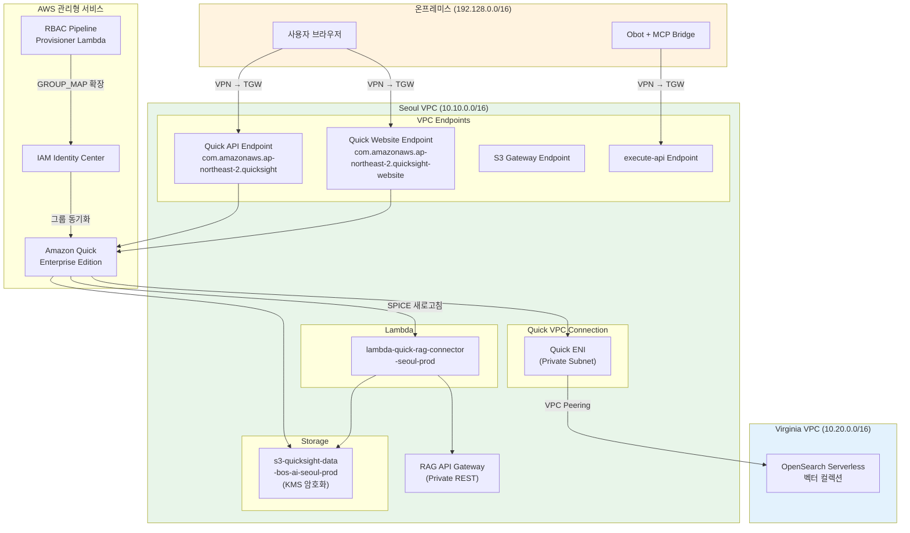
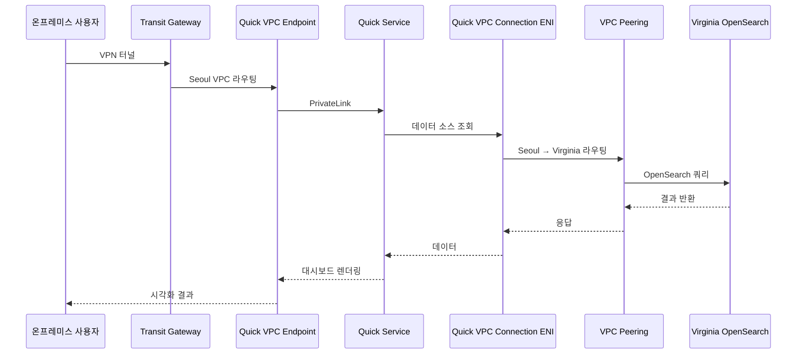
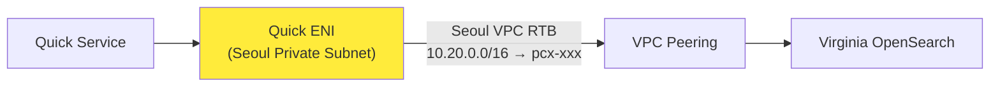
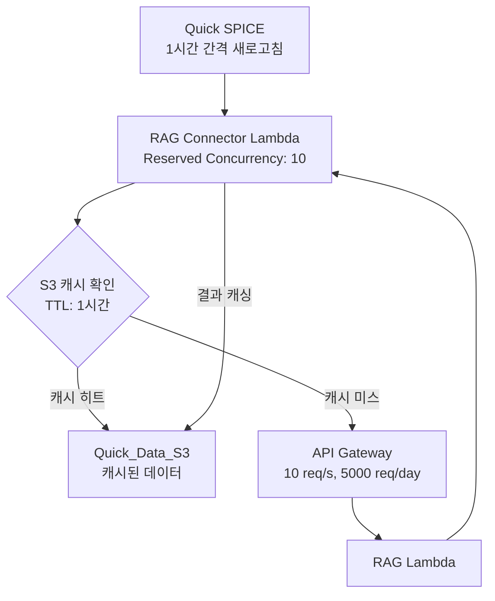
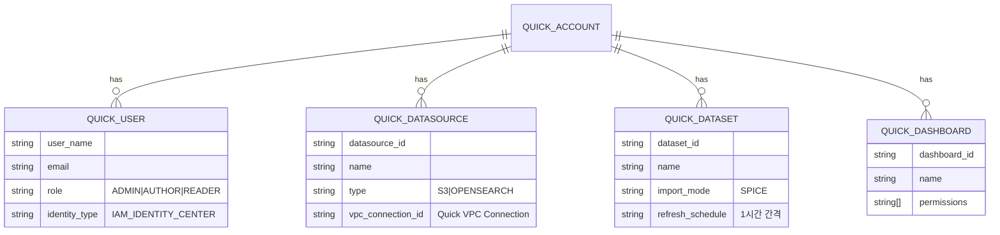

# 설계 문서: Amazon Quick Private 통합

## 개요 (Overview)

본 설계 문서는 BOS-AI Private RAG 인프라에 Amazon Quick(구 QuickSight)을 완전 Private하게 통합하기 위한 기술 아키텍처를 정의한다. 기존 에어갭 아키텍처(IGW 없음, NAT 없음)의 보안 수준을 유지하면서, Quick Enterprise Edition을 Seoul VPC(10.10.0.0/16)에 VPC Endpoint 기반으로 배치하고, VPC Peering을 경유하여 Virginia OpenSearch 데이터를 시각화한다.

핵심 설계 원칙:
- **완전 Private 트래픽**: Quick API/Website VPC Endpoint를 통해 모든 트래픽이 AWS 내부 네트워크에서만 흐름
- **데이터 주권**: Quick 전용 S3 버킷(Seoul)에 KMS 암호화 + VPC Endpoint 조건부 접근으로 데이터 격리
- **경유 라우팅**: Quick → Seoul VPC ENI → VPC Peering → Virginia OpenSearch (Virginia 직접 접근 차단)
- **RBAC 파이프라인 연계**: IAM Identity Center 그룹 기반 사용자 자동 프로비저닝 (GROUP_MAP 확장)
- **비용 최적화**: Reserved Concurrency, API Gateway 스로틀, S3 캐싱, SPICE 스케줄로 Lambda 사용량 폭발 방지
- **기존 IaC 패턴 준수**: Terraform 레이어 구조, 모듈 패턴, 태깅 전략 그대로 따름

## 아키텍처 (Architecture)

### 전체 아키텍처 다이어그램



### 네트워크 트래픽 흐름



### 배포 레이어 구조

기존 Terraform 레이어 구조를 확장한다:

```
environments/
├── global/
│   └── iam/                          # Quick IAM 역할 + Identity Center 그룹 추가
├── network-layer/                     # Quick VPC Endpoint + Security Group + Route53 DNS 추가
│   ├── quicksight-vpc-endpoints.tf   # Quick API/Website VPC Endpoint
│   ├── quicksight-security-groups.tf # Quick 전용 Security Group
│   └── quicksight-dns.tf            # Route53 Private DNS 레코드
└── app-layer/
    └── quicksight/                    # 신규 레이어
        ├── main.tf                   # Quick 계정, VPC Connection
        ├── lambda.tf                 # RAG Connector Lambda
        ├── s3.tf                     # Quick 전용 S3 버킷
        ├── monitoring.tf             # CloudWatch 알람/대시보드
        ├── variables.tf
        ├── outputs.tf
        ├── backend.tf
        ├── providers.tf
        └── terraform.tfvars.example

modules/
├── security/
│   └── quicksight/                   # Quick 보안 모듈
│       ├── main.tf                  # KMS, IAM 역할
│       ├── variables.tf
│       └── outputs.tf
└── ai-workload/
    └── quicksight-connector/         # RAG Connector Lambda 모듈
        ├── main.tf
        ├── variables.tf
        └── outputs.tf

lambda/
└── quick-rag-connector/              # Python 3.12 Lambda 소스
    ├── handler.py
    ├── requirements.txt
    └── test_handler.py

policies/
└── quicksight-security.rego          # Quick 전용 OPA 정책
```


## 컴포넌트 및 인터페이스 (Components and Interfaces)

### 1. Quick VPC Endpoints (네트워크 레이어)

기존 `vpc-endpoints-frontend.tf` 패턴을 따라 Quick 전용 VPC Endpoint를 추가한다.

| 컴포넌트 | 서비스명 | 타입 | Private DNS |
|----------|---------|------|-------------|
| Quick API Endpoint | `com.amazonaws.ap-northeast-2.quicksight` | Interface | ON |
| Quick Website Endpoint | `com.amazonaws.ap-northeast-2.quicksight-website` | Interface | ON |

**Security Group**: 전용 SG 생성 (`sg-quicksight-endpoints-bos-ai-seoul-prod`)
- 인바운드: Seoul VPC CIDR(10.10.0.0/16) + 온프레미스 CIDR(192.128.0.0/16) → HTTPS(443)
- 아웃바운드: 기존 VPC Endpoint SG 패턴과 동일

**서브넷 배치**: `module.vpc_frontend.private_subnet_ids` (기존 VPC Endpoint 전용 서브넷)

**Terraform 리소스 예시**:
```hcl
resource "aws_security_group" "quicksight_endpoints" {
  provider    = aws.seoul
  name        = "sg-quicksight-endpoints-bos-ai-seoul-prod"
  description = "Quick VPC Endpoints - HTTPS from VPC and on-premises"
  vpc_id      = module.vpc_frontend.vpc_id

  ingress {
    description = "HTTPS from Seoul VPC"
    from_port   = 443
    to_port     = 443
    protocol    = "tcp"
    cidr_blocks = [var.seoul_vpc_cidr]  # 10.10.0.0/16
  }

  ingress {
    description = "HTTPS from on-premises"
    from_port   = 443
    to_port     = 443
    protocol    = "tcp"
    cidr_blocks = ["192.128.0.0/16"]
  }

  egress {
    description = "Allow all outbound"
    from_port   = 0
    to_port     = 0
    protocol    = "-1"
    cidr_blocks = ["0.0.0.0/0"]
  }

  tags = merge(local.seoul_tags, {
    Name    = "sg-quicksight-endpoints-bos-ai-seoul-prod"
    Purpose = "Quick VPC Endpoints"
    Service = "quicksight"
  })
}

resource "aws_vpc_endpoint" "quicksight_api" {
  provider            = aws.seoul
  vpc_id              = module.vpc_frontend.vpc_id
  service_name        = "com.amazonaws.ap-northeast-2.quicksight"
  vpc_endpoint_type   = "Interface"
  private_dns_enabled = true
  subnet_ids          = module.vpc_frontend.private_subnet_ids
  security_group_ids  = [aws_security_group.quicksight_endpoints.id]

  tags = merge(local.seoul_tags, {
    Name    = "vpce-quicksight-api-bos-ai-seoul-prod"
    Purpose = "Quick API Private access"
    Service = "quicksight"
  })
}

resource "aws_vpc_endpoint" "quicksight_website" {
  provider            = aws.seoul
  vpc_id              = module.vpc_frontend.vpc_id
  service_name        = "com.amazonaws.ap-northeast-2.quicksight-website"
  vpc_endpoint_type   = "Interface"
  private_dns_enabled = true
  subnet_ids          = module.vpc_frontend.private_subnet_ids
  security_group_ids  = [aws_security_group.quicksight_endpoints.id]

  tags = merge(local.seoul_tags, {
    Name    = "vpce-quicksight-website-bos-ai-seoul-prod"
    Purpose = "Quick Website Private access"
    Service = "quicksight"
  })
}
```

### 2. Quick 계정 및 RBAC 연계 (앱 레이어)

**Quick Enterprise Edition 계정 구성**:
```hcl
resource "aws_quicksight_account_subscription" "main" {
  account_name              = "bos-ai-quicksight"
  edition                   = "ENTERPRISE"
  authentication_method     = "IAM_IDENTITY_CENTER"
  iam_identity_center_instance_arn = data.aws_ssoadmin_instances.main.arns[0]
}
```

**RBAC Pipeline GROUP_MAP 확장**:
```python
GROUP_MAP = {
    # 기존 서비스
    "chatgpt-team": "group-id-chatgpt",
    "aws-q": "group-id-aws-q",
    # Quick 서비스 추가
    "quicksight-admin": "group-id-qs-admin",
    "quicksight-author": "group-id-qs-author",
    "quicksight-viewer": "group-id-qs-viewer",
}
```

**IAM Identity Center 그룹 3개 생성**:
- `QS_Admin_Users` → Quick ADMIN 역할
- `QS_Author_Users` → Quick AUTHOR 역할
- `QS_Viewer_Users` → Quick READER 역할

**설계 결정 근거**: Quick은 IAM Identity Center와 네이티브 통합을 지원하므로, 기존 RBAC Pipeline의 GROUP_MAP 확장만으로 사용자 프로비저닝을 자동화할 수 있다. 별도의 SCIM 커넥터나 커스텀 동기화 로직이 불필요하다.

### 3. Quick 전용 S3 버킷 (앱 레이어)

| 속성 | 값 |
|------|-----|
| 버킷명 | `s3-quicksight-data-bos-ai-seoul-prod` |
| 리전 | ap-northeast-2 (Seoul) |
| 암호화 | SSE-KMS (고객 관리형 CMK) |
| 버전 관리 | 활성화 |
| 퍼블릭 액세스 | 전체 차단 |
| 접근 조건 | `aws:sourceVpce` 조건부 버킷 정책 |
| 수명 주기 | 90일 → Intelligent-Tiering, 365일 → Glacier |
| 로깅 | 기존 로깅 버킷에 서버 액세스 로그 저장 |

**버킷 정책 핵심**:
```json
{
  "Condition": {
    "StringEquals": {
      "aws:sourceVpce": ["vpce-quicksight-api-xxx", "vpce-s3-gateway-xxx"]
    }
  }
}
```

### 4. Quick VPC Connection (앱 레이어)

Quick이 Seoul VPC 내 데이터 소스에 접근하기 위한 ENI 기반 연결이다.



**핵심 설계 결정**: Quick VPC Connection은 Seoul VPC에만 연결하고, Virginia VPC(10.20.0.0/16)에 직접 연결하지 않는다. Virginia 트래픽은 Seoul VPC의 라우팅 테이블에 이미 설정된 VPC Peering 경로(`10.20.0.0/16 → pcx-xxx`)를 통해 전달된다.

**Security Group** (`sg-quicksight-vpc-conn-bos-ai-seoul-prod`):
- 아웃바운드: Seoul VPC CIDR(10.10.0.0/16) 내 HTTPS(443)만 허용
- 아웃바운드에 Virginia CIDR(10.20.0.0/16) 직접 지정 금지
- 인바운드: Quick 서비스 ENI 응답 트래픽 허용

**라우팅 확인**: Quick VPC Connection ENI가 배치된 서브넷의 라우팅 테이블에 `10.20.0.0/16 → pcx-xxx` 경로가 존재하는지 확인 필요. 기존 `module.vpc_peering`이 `module.vpc_frontend.private_route_table_ids`에 이미 이 경로를 설정하고 있으므로, Quick ENI를 동일 Private 서브넷에 배치하면 자동으로 적용된다.

### 5. RAG Connector Lambda (앱 레이어)

| 속성 | 값 |
|------|-----|
| 함수명 | `lambda-quick-rag-connector-seoul-prod` |
| 런타임 | Python 3.12 |
| 메모리 | 256MB |
| 타임아웃 | 60초 |
| VPC | Seoul VPC Private Subnet |
| Reserved Concurrency | 10 |
| 환경 변수 | `RAG_API_ENDPOINT`, `CACHE_BUCKET`, `CACHE_TTL_SECONDS` |

**비용 최적화 전략**:



1. **SPICE 스케줄**: 1시간 간격 새로고침 → 실시간 Lambda 호출 방지
2. **S3 캐싱**: 동일 질의 패턴 TTL 1시간 → RAG API 재호출 방지
3. **Reserved Concurrency**: 최대 10개 → 계정 전체 Lambda 한도 보호
4. **API Gateway Usage Plan**: 10 req/s, 5,000 req/day → Quick 전용 API Key 스로틀

### 6. MCP Bridge Quick 도구 (애플리케이션)

기존 `server.mjs`의 MCP 도구 패턴을 따라 2개 도구를 추가한다:

```javascript
// Tool 4: Quick 대시보드 목록 조회
mcpServer.tool(
  "quick_dashboard_list",
  "Quick 대시보드 목록을 조회합니다.",
  {},
  async () => {
    // Quick ListDashboards API → VPC Endpoint 경유
    // IAM 자격 증명 사용 (환경 변수 또는 인스턴스 프로파일)
  }
);

// Tool 5: Quick 대시보드 데이터 조회
mcpServer.tool(
  "quick_dashboard_data",
  "지정된 대시보드의 데이터셋 요약 정보를 조회합니다.",
  { dashboardId: { type: "string", description: "대시보드 ID" } },
  async (params) => {
    // Quick DescribeDashboard API → VPC Endpoint 경유
  }
);
```

**Quick API 호출 경로**: MCP Bridge → VPN → TGW → Seoul VPC → Quick API VPC Endpoint → Quick Service

### 7. OPA 정책 (보안)

`policies/quicksight-security.rego`에 Quick 전용 보안 정책을 추가한다:

| 정책 | 검증 내용 |
|------|----------|
| `deny_quicksight_sg_virginia_direct` | Quick VPC Connection SG에 Virginia CIDR(10.20.0.0/16) 직접 아웃바운드 규칙 금지 |
| `deny_quicksight_sg_open_egress` | Quick 관련 SG에 0.0.0.0/0 아웃바운드 규칙 금지 |
| `deny_quicksight_s3_public` | Quick S3 버킷 퍼블릭 액세스 차단 검증 |

### 8. Route53 Private DNS (네트워크 레이어)

기존 Private Hosted Zone(`rag.corp.bos-semi.com`)에 Quick 레코드를 추가한다:

```hcl
resource "aws_route53_record" "quicksight" {
  zone_id = data.aws_route53_zone.private.zone_id
  name    = "quick.rag.corp.bos-semi.com"
  type    = "CNAME"
  ttl     = 300
  records = [aws_vpc_endpoint.quicksight_api.dns_entry[0]["dns_name"]]
}
```

온프레미스 DNS 서버에서 기존 Route53 Resolver Endpoint를 통해 `quick.rag.corp.bos-semi.com` → Quick API VPC Endpoint Private IP로 해석된다.

### 9. IAM 역할 (글로벌 레이어)

| 역할명 | 권한 | 조건 |
|--------|------|------|
| `role-quicksight-admin-bos-ai-seoul-prod` | Quick 계정/사용자/데이터소스 관리 | IP + VPC Endpoint 조건 |
| `role-quicksight-author-bos-ai-seoul-prod` | 대시보드 생성/편집, 데이터셋 조회 | IP + VPC Endpoint 조건 |
| `role-quicksight-viewer-bos-ai-seoul-prod` | 대시보드 조회만 | IP + VPC Endpoint 조건 |

모든 역할에 공통 조건:
- `aws:SourceIp`: `192.128.0.0/16`, `10.10.0.0/16`
- `aws:sourceVpce`: Quick API VPC Endpoint ID

### 10. 모니터링 (앱 레이어)

| 알람 | 조건 | 액션 |
|------|------|------|
| Quick VPC Endpoint 상태 | Endpoint 비정상 | SNS 알림 |
| Quick VPC Connection ENI 상태 | `!= available` | SNS 알림 |
| RAG Connector Lambda 스로틀 | 5분간 Throttles > 5 | SNS 알림 |
| RAG Connector Lambda 동시 실행 | ConcurrentExecutions 모니터링 | 대시보드 |
| Quick_Data_S3 크기/객체 수 | 대시보드 위젯 | - |
| CloudTrail Quick API 호출 | `quicksight:*` 이벤트 기록 | - |

CloudWatch 로그 그룹 보존 기간: 90일


## 데이터 모델 (Data Models)

### Quick 데이터 소스 구성



### RAG Connector Lambda 캐시 데이터 구조

S3 캐시 키 패턴: `cache/{query_hash}/{timestamp}.json`

```json
{
  "query_pattern": "rag_usage_stats",
  "cached_at": "2026-03-20T10:00:00Z",
  "ttl_seconds": 3600,
  "data": [
    {
      "query_id": "q-001",
      "query_text": "SoC 설계 스펙",
      "response_time_ms": 1200,
      "citation_count": 3,
      "search_type": "semantic",
      "timestamp": "2026-03-20T09:55:00Z"
    }
  ]
}
```

### IAM Identity Center 그룹 매핑

```json
{
  "quicksight-admin": {
    "group_name": "QS_Admin_Users",
    "quick_role": "ADMIN",
    "description": "Quick 관리자 - 계정/사용자/데이터소스 관리"
  },
  "quicksight-author": {
    "group_name": "QS_Author_Users",
    "quick_role": "AUTHOR",
    "description": "Quick 작성자 - 대시보드 생성/편집"
  },
  "quicksight-viewer": {
    "group_name": "QS_Viewer_Users",
    "quick_role": "READER",
    "description": "Quick 뷰어 - 대시보드 조회만"
  }
}
```

### Terraform 리소스 태그 표준

모든 Quick 관련 리소스에 적용:

```hcl
locals {
  quicksight_tags = {
    Project     = "BOS-AI"
    Environment = "prod"
    ManagedBy   = "terraform"
    Layer       = "app"
    Service     = "quicksight"
  }
}
```


## 정확성 속성 (Correctness Properties)

*정확성 속성(property)은 시스템의 모든 유효한 실행에서 참이어야 하는 특성 또는 동작이다. 이는 사람이 읽을 수 있는 명세와 기계가 검증할 수 있는 정확성 보장 사이의 다리 역할을 한다.*

### Property 1: Quick VPC Endpoint 구성 정확성

*For any* Quick 관련 VPC Endpoint 리소스에 대해, 해당 리소스는 Interface 타입이어야 하고, Private DNS가 활성화되어 있어야 하며, Seoul VPC의 Private 서브넷에 배치되어야 한다.

**Validates: Requirements 1.1, 1.2, 1.4**

### Property 2: Quick Security Group 인바운드 규칙 제한

*For any* Quick 관련 Security Group의 인바운드 규칙에 대해, 허용된 소스 CIDR은 Seoul VPC CIDR(10.10.0.0/16)과 온프레미스 CIDR(192.128.0.0/16)만이어야 하며, 허용된 포트는 HTTPS(443)만이어야 한다.

**Validates: Requirements 1.3, 4.3**

### Property 3: Quick VPC Connection Security Group Virginia 직접 접근 차단

*For any* Quick VPC Connection Security Group의 아웃바운드 규칙에 대해, Virginia VPC CIDR(10.20.0.0/16)이 직접 대상으로 지정되어서는 안 되며, 0.0.0.0/0 대상도 포함되어서는 안 된다.

**Validates: Requirements 4.2, 4.5, 7.2**

### Property 4: Quick 리소스 필수 태그 존재

*For any* Quick 관련 Terraform 리소스에 대해, Project, Environment, ManagedBy, Layer 태그가 모두 존재해야 한다.

**Validates: Requirements 1.6, 3.7, 9.6**

### Property 5: Quick 서비스 역할 최소 권한

*For any* Quick 서비스 IAM 역할의 정책에 대해, Quick_Data_S3에는 읽기/쓰기 권한이, 기존 RAG S3에는 읽기 전용 권한이, OpenSearch_Collection에는 읽기 전용 권한(`aoss:APIAccessAll`)만 부여되어야 하며, 와일드카드(`*`) 리소스에 대한 전체 권한은 포함되어서는 안 된다.

**Validates: Requirements 2.3, 2.4**

### Property 6: GROUP_MAP Quick 역할 매핑 정확성

*For any* Quick 서비스명(`quicksight-admin`, `quicksight-author`, `quicksight-viewer`)에 대해, GROUP_MAP 조회 결과는 대응하는 IAM Identity Center 그룹 ID를 반환해야 하며, 해당 그룹의 멤버는 각각 ADMIN, AUTHOR, READER Quick 역할로 매핑되어야 한다.

**Validates: Requirements 2.6, 2.7**

### Property 7: Quick S3 버킷 보안 구성

*For any* Quick 관련 S3 버킷에 대해, 버전 관리가 활성화되어 있어야 하고, KMS CMK 기반 SSE-KMS 암호화가 적용되어 있어야 하며, 퍼블릭 액세스 차단이 모든 항목에 대해 활성화되어 있어야 하고, 버킷 정책에 `aws:sourceVpce` 조건이 포함되어야 한다.

**Validates: Requirements 3.1, 3.2, 3.3, 3.4**

### Property 8: OPA 정책 보안 위반 감지

*For any* Quick 관련 Terraform plan에 대해, OPA 정책은 다음 위반을 올바르게 감지해야 한다: (a) Quick VPC Connection SG에 Virginia CIDR 직접 아웃바운드 규칙이 포함된 경우 deny, (b) Quick 관련 SG에 0.0.0.0/0 아웃바운드 규칙이 포함된 경우 deny, (c) Quick S3 버킷에 퍼블릭 액세스 차단이 비활성화된 경우 deny.

**Validates: Requirements 4.9, 7.5, 7.6**

### Property 9: RAG Connector Lambda 응답 형식 변환

*For any* 유효한 RAG API 응답에 대해, RAG Connector Lambda의 변환 결과는 Quick이 소비할 수 있는 JSON 배열 형식이어야 하며, 각 항목에는 질의 로그, 인용 통계, 검색 유형별 성능 데이터 필드가 포함되어야 한다.

**Validates: Requirements 5.2, 5.4**

### Property 10: RAG Connector Lambda 에러 처리

*For any* RAG API 호출 실패 응답(네트워크 에러, 타임아웃, 4xx/5xx 응답)에 대해, Lambda 함수는 빈 데이터셋과 에러 메시지를 반환해야 하며, 에러 상세를 CloudWatch에 기록해야 한다. MCP Bridge의 Quick API 호출 실패 시에도 동일하게 에러 메시지를 사용자에게 반환하고 로그에 기록해야 한다.

**Validates: Requirements 5.5, 6.5**

### Property 11: RAG Connector Lambda 캐시 라운드트립

*For any* RAG API 응답 데이터에 대해, S3에 캐싱한 후 TTL 내에 동일한 질의 패턴으로 조회하면 원본과 동일한 데이터가 반환되어야 한다. TTL이 만료된 후에는 RAG API를 재호출해야 한다.

**Validates: Requirements 5.9**

### Property 12: Lambda 소스 코드 자격 증명 미포함

*For any* Quick 관련 Lambda 함수의 소스 코드에 대해, API 키, 시크릿 키, 액세스 키 등 하드코딩된 자격 증명 문자열이 포함되어서는 안 된다.

**Validates: Requirements 5.6**

### Property 13: Quick IAM 역할별 권한 분리

*For any* Quick IAM 역할(admin, author, viewer)과 Quick API 액션에 대해, admin 역할은 모든 Quick 관리 액션을 수행할 수 있어야 하고, author 역할은 대시보드 생성/편집과 데이터셋 조회만 가능해야 하며, viewer 역할은 대시보드 조회만 가능해야 한다. 각 역할은 상위 역할의 권한을 초과해서는 안 된다.

**Validates: Requirements 9.1, 9.2, 9.3**

### Property 14: Quick IAM 역할 접근 조건

*For any* Quick IAM 역할의 정책에 대해, `aws:SourceIp` 조건에 온프레미스 CIDR(192.128.0.0/16)과 VPC CIDR(10.10.0.0/16)만 포함되어야 하며, `aws:sourceVpce` 조건에 Quick API VPC Endpoint ID가 포함되어야 한다.

**Validates: Requirements 9.4, 9.5**

### Property 15: Quick 네트워크 격리

*For any* Quick 관련 서브넷의 라우팅 테이블에 대해, Internet Gateway 또는 NAT Gateway로의 경로가 포함되어서는 안 되며, Network ACL은 허용된 VPC CIDR(10.10.0.0/16, 10.20.0.0/16, 192.128.0.0/16)과 AWS 서비스 CIDR 외의 트래픽을 차단해야 한다.

**Validates: Requirements 7.1, 7.3**

### Property 16: Quick CloudWatch 로그 보존 기간

*For any* Quick 관련 CloudWatch 로그 그룹에 대해, 보존 기간은 90일로 설정되어야 한다.

**Validates: Requirements 10.5**


## 에러 처리 (Error Handling)

### Terraform 리소스 생성 에러

| 에러 시나리오 | 처리 방식 |
|--------------|----------|
| Quick VPC Endpoint 서비스 미지원 리전 | `precondition` 블록에서 리전별 서비스 가용 여부 확인, 실패 시 안내 메시지 출력 |
| Quick 계정 이미 존재 | `data` 소스로 기존 계정 참조, `lifecycle { prevent_destroy = true }` 적용 |
| VPC Connection 서브넷 IP 부족 | `postcondition` 블록에서 서브넷 가용 IP 확인, 실패 시 CIDR 확장 안내 |
| Route53 레코드 생성 실패 | `precondition`에서 Hosted Zone ID와 VPC 연결 상태 확인, 실패 시 안내 메시지 |

### Lambda 함수 에러

| 에러 시나리오 | 처리 방식 |
|--------------|----------|
| RAG API 호출 타임아웃 | 60초 타임아웃, 최대 3회 지수 백오프 재시도 후 빈 데이터셋 + 에러 메시지 반환 |
| RAG API 4xx/5xx 응답 | 에러 상세를 CloudWatch에 기록, 빈 데이터셋 + 에러 메시지 반환 |
| S3 캐시 읽기/쓰기 실패 | 캐시 무시하고 RAG API 직접 호출, 캐시 에러를 CloudWatch에 기록 |
| Reserved Concurrency 초과 | Lambda 스로틀 발생, CloudWatch 알람 트리거 → SNS 알림 |
| API Gateway 스로틀 | 429 응답 반환, Quick에서 다음 SPICE 새로고침 시 재시도 |

### MCP Bridge 에러

| 에러 시나리오 | 처리 방식 |
|--------------|----------|
| Quick API 호출 실패 | 에러 메시지를 사용자에게 반환 (`isError: true`), 콘솔 로그에 기록 |
| IAM 자격 증명 만료 | 인스턴스 프로파일 자동 갱신, 환경 변수 방식은 수동 갱신 필요 |
| VPC Endpoint 연결 불가 | 타임아웃 후 에러 메시지 반환, 네트워크 상태 확인 안내 |

### 모니터링 기반 에러 감지

| 감지 대상 | CloudWatch 알람 조건 | 액션 |
|----------|---------------------|------|
| Lambda 스로틀 | Throttles > 5 (5분간) | SNS 알림 |
| VPC Endpoint 비정상 | EndpointState != available | SNS 알림 |
| VPC Connection ENI 비정상 | NetworkInterfaceStatus != available | SNS 알림 |
| S3 버킷 비정상 접근 | CloudTrail 이상 이벤트 | CloudWatch Logs 기록 |

## 테스트 전략 (Testing Strategy)

### 이중 테스트 접근법

본 프로젝트는 단위 테스트와 속성 기반 테스트를 상호 보완적으로 사용한다:

- **단위 테스트 (Unit Tests)**: 특정 예시, 엣지 케이스, 에러 조건 검증
- **속성 기반 테스트 (Property-Based Tests)**: 모든 입력에 대한 보편적 속성 검증
- 두 접근법을 함께 사용하여 포괄적인 커버리지를 달성한다

### 속성 기반 테스트 구성

- **라이브러리**: Go `gopter` (기존 프로젝트 테스트 스택과 동일)
- **위치**: `tests/properties/quicksight_test.go`
- **최소 반복 횟수**: 각 property 테스트당 100회 이상
- **태그 형식**: `Feature: quicksight-private-integration, Property {number}: {property_text}`

### 단위 테스트 범위

| 테스트 대상 | 위치 | 검증 내용 |
|------------|------|----------|
| Terraform plan 검증 | `tests/unit/quicksight_terraform_test.go` | VPC Endpoint, SG, S3, IAM 리소스 속성 |
| Lambda 함수 로직 | `lambda/quick-rag-connector/test_handler.py` | 응답 변환, 캐싱, 에러 처리 |
| OPA 정책 | `policies/quicksight-security.rego` | 보안 위반 감지 정확성 |
| MCP Bridge 도구 | `mcp-bridge/test/quicksight_tools_test.js` | 도구 등록, API 호출, 에러 처리 |

### 속성 기반 테스트 매핑

| Property | 테스트 파일 | 테스트 설명 |
|----------|-----------|------------|
| Property 1 | `tests/properties/quicksight_test.go` | Quick VPC Endpoint 구성 속성 검증 |
| Property 2 | `tests/properties/quicksight_test.go` | SG 인바운드 규칙 CIDR/포트 제한 검증 |
| Property 3 | `tests/properties/quicksight_test.go` | VPC Connection SG Virginia 직접 접근 차단 검증 |
| Property 4 | `tests/properties/quicksight_test.go` | 필수 태그 존재 검증 |
| Property 5 | `tests/properties/quicksight_test.go` | IAM 정책 최소 권한 검증 |
| Property 6 | `tests/properties/quicksight_test.go` | GROUP_MAP 역할 매핑 검증 |
| Property 7 | `tests/properties/quicksight_test.go` | S3 보안 구성 검증 |
| Property 8 | `tests/properties/quicksight_opa_test.go` | OPA 정책 위반 감지 검증 |
| Property 9 | `tests/properties/quicksight_lambda_test.go` | Lambda 응답 형식 변환 검증 |
| Property 10 | `tests/properties/quicksight_lambda_test.go` | Lambda/MCP 에러 처리 검증 |
| Property 11 | `tests/properties/quicksight_lambda_test.go` | 캐시 라운드트립 검증 |
| Property 12 | `tests/properties/quicksight_lambda_test.go` | 소스 코드 자격 증명 미포함 검증 |
| Property 13 | `tests/properties/quicksight_test.go` | IAM 역할별 권한 분리 검증 |
| Property 14 | `tests/properties/quicksight_test.go` | IAM 역할 접근 조건 검증 |
| Property 15 | `tests/properties/quicksight_test.go` | 네트워크 격리 검증 |
| Property 16 | `tests/properties/quicksight_test.go` | CloudWatch 로그 보존 기간 검증 |

### 통합 테스트

| 테스트 | 위치 | 검증 내용 |
|--------|------|----------|
| VPC Endpoint 연결성 | `tests/integration/quicksight_test.go` | Quick API/Website VPC Endpoint를 통한 실제 연결 확인 |
| VPC Connection 경로 | `tests/integration/quicksight_test.go` | Quick ENI → VPC Peering → Virginia OpenSearch 경로 확인 |
| DNS 해석 | `tests/integration/quicksight_test.go` | `quick.rag.corp.bos-semi.com` → VPC Endpoint Private IP 해석 확인 |
| Lambda 실행 | `tests/integration/quicksight_test.go` | RAG Connector Lambda 실제 호출 및 응답 확인 |
| RBAC 동기화 | `tests/integration/quicksight_test.go` | IAM Identity Center 그룹 변경 → Quick 역할 매핑 확인 |

### OPA 정책 테스트

```bash
# Quick 전용 OPA 정책 테스트
opa eval -i terraform-plan.json -d policies/quicksight-security.rego "data.main.deny"
```

각 OPA 정책에 대해 다음을 검증한다:
- 위반 케이스: deny 규칙이 올바르게 트리거되는지
- 정상 케이스: 올바른 구성에서 deny가 발생하지 않는지
- 엣지 케이스: 경계 조건에서의 동작

