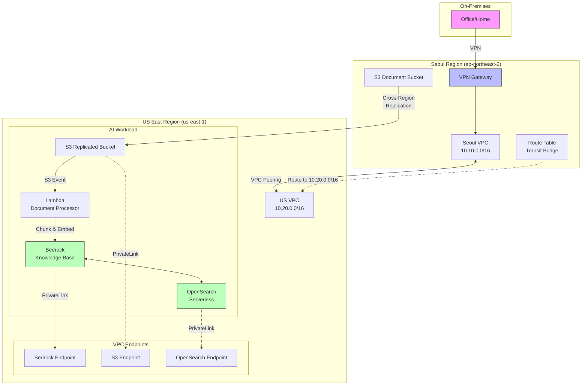
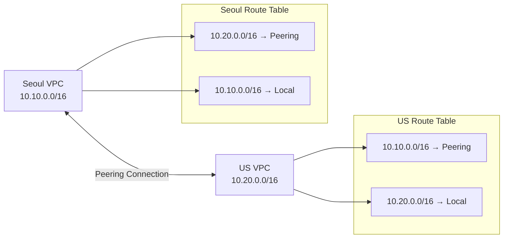

# Design Document: AWS Bedrock RAG Deployment

## Overview

이 설계는 AWS Bedrock 기반 RAG(Retrieval-Augmented Generation) 시스템을 Terraform IaC로 배포하기 위한 아키텍처를 정의합니다. 시스템은 서울과 미국 리전에 걸쳐 구성되며, 기존 VPN 환경과 통합되어 온프레미스에서 안전하게 접근할 수 있습니다.

### Key Design Principles

1. **Layered Architecture**: 네트워크 레이어와 애플리케이션 레이어를 분리하여 독립적인 배포와 관리 가능
2. **Security by Default**: No-IGW 정책, PrivateLink, 최소 권한 IAM, KMS 암호화를 기본으로 적용
3. **Infrastructure as Code**: 모든 리소스를 Terraform으로 관리하여 재현 가능하고 버전 관리 가능한 인프라 구축
4. **Hybrid Connectivity**: 기존 VPN 환경과 통합하여 온프레미스에서 클라우드 리소스에 안전하게 접근
5. **Cost Optimization**: 적절한 리소스 크기 조정과 라이프사이클 정책으로 비용 최적화

### Technology Stack

- **IaC**: Terraform 1.5+
- **Cloud Provider**: AWS (Seoul: ap-northeast-2, US East: us-east-1)
- **AI Services**: AWS Bedrock (Claude, Titan Embeddings)
- **Vector Database**: OpenSearch Serverless
- **Storage**: S3 with versioning and encryption
- **Compute**: Lambda (Python 3.11+)
- **Networking**: VPC, VPC Peering, VPC Endpoints
- **Security**: IAM, KMS, Security Groups, NACLs
- **Monitoring**: CloudWatch, CloudTrail, X-Ray

## Architecture

### High-Level Architecture



### Network Architecture

#### VPC Design

**Seoul VPC (10.10.0.0/16)**
- Purpose: Transit Bridge for on-premises to US region access
- Subnets:
  - Private Subnet A: 10.10.1.0/24 (ap-northeast-2a)
  - Private Subnet B: 10.10.2.0/24 (ap-northeast-2c)
- No Internet Gateway (No-IGW policy)
- VPN Gateway attached for on-premises connectivity

**US VPC (10.20.0.0/16)**
- Purpose: AI workload hosting
- Subnets:
  - Private Subnet A: 10.20.1.0/24 (us-east-1a)
  - Private Subnet B: 10.20.2.0/24 (us-east-1b)
  - Private Subnet C: 10.20.3.0/24 (us-east-1c)
- No Internet Gateway (No-IGW policy)
- VPC Endpoints for AWS services

#### VPC Peering



- Peering connection established between Seoul and US VPCs
- Automatic acceptance for same-account peering
- Bidirectional routing configured
- Seoul VPC acts as Transit Bridge for on-premises traffic to US region

#### Security Groups

**Bedrock Lambda Security Group**
- Inbound: None (Lambda initiates outbound only)
- Outbound: 
  - HTTPS (443) to Bedrock VPC Endpoint
  - HTTPS (443) to S3 VPC Endpoint
  - HTTPS (443) to OpenSearch VPC Endpoint

**OpenSearch Security Group**
- Inbound:
  - HTTPS (443) from Bedrock Lambda SG
  - HTTPS (443) from Bedrock Service
- Outbound: All (for AWS service communication)

**VPC Endpoint Security Group**
- Inbound:
  - HTTPS (443) from VPC CIDR (10.20.0.0/16)
  - HTTPS (443) from Seoul VPC CIDR (10.10.0.0/16)
- Outbound: All

### Data Flow Architecture

```mermaid
sequenceDiagram
    participant User as User (On-Prem)
    participant SS3 as Seoul S3
    participant US3 as US S3
    participant Lambda as Lambda Processor
    participant Bedrock as Bedrock KB
    participant OpenSearch as OpenSearch

    User->>SS3: Upload Document
    SS3->>US3: Cross-Region Replication
    US3->>Lambda: S3 Event Notification
    Lambda->>Lambda: Semantic Chunking
    Lambda->>Bedrock: Start Ingestion Job
    Bedrock->>Bedrock: Generate Embeddings
    Bedrock->>OpenSearch: Store Vectors
    OpenSearch-->>Bedrock: Confirm Storage
    Bedrock-->>Lambda: Job Complete
    
    Note over User,OpenSearch: Query Flow
    User->>Bedrock: RAG Query
    Bedrock->>OpenSearch: Vector Search
    OpenSearch-->>Bedrock: Relevant Chunks
    Bedrock->>Bedrock: Generate Response
    Bedrock-->>User: AI Response
```



## Components and Interfaces

### Module Structure

```
bos-ai-infra/
├── modules/
│   ├── network/
│   │   ├── vpc/
│   │   │   ├── main.tf
│   │   │   ├── variables.tf
│   │   │   └── outputs.tf
│   │   ├── peering/
│   │   │   ├── main.tf
│   │   │   ├── variables.tf
│   │   │   └── outputs.tf
│   │   └── security-groups/
│   │       ├── main.tf
│   │       ├── variables.tf
│   │       └── outputs.tf
│   ├── ai-workload/
│   │   ├── bedrock-rag/
│   │   │   ├── main.tf
│   │   │   ├── variables.tf
│   │   │   ├── outputs.tf
│   │   │   ├── knowledge-base.tf
│   │   │   ├── opensearch.tf
│   │   │   └── lambda.tf
│   │   └── s3-pipeline/
│   │       ├── main.tf
│   │       ├── variables.tf
│   │       └── outputs.tf
│   └── security/
│       ├── iam/
│       │   ├── main.tf
│       │   ├── variables.tf
│       │   └── outputs.tf
│       ├── kms/
│       │   ├── main.tf
│       │   ├── variables.tf
│       │   └── outputs.tf
│       └── vpc-endpoints/
│           ├── main.tf
│           ├── variables.tf
│           └── outputs.tf
├── environments/
│   ├── global/
│   │   ├── backend/
│   │   │   └── main.tf
│   │   └── iam/
│   │       └── main.tf
│   ├── network-layer/
│   │   ├── main.tf
│   │   ├── variables.tf
│   │   ├── outputs.tf
│   │   ├── providers.tf
│   │   └── backend.tf
│   └── app-layer/
│       ├── bedrock-rag/
│       │   ├── main.tf
│       │   ├── variables.tf
│       │   ├── outputs.tf
│       │   ├── providers.tf
│       │   ├── backend.tf
│       │   └── data.tf (remote state)
│       └── monitoring/
│           └── main.tf
└── scripts/
    ├── import-existing-resources.sh
    └── cost-estimation.sh
```

### Network Module

#### VPC Module

**Purpose**: Create VPC with subnets, route tables, and basic networking

**Inputs**:
```hcl
variable "vpc_cidr" {
  description = "CIDR block for VPC"
  type        = string
  validation {
    condition     = can(cidrhost(var.vpc_cidr, 0))
    error_message = "Must be valid IPv4 CIDR"
  }
}

variable "vpc_name" {
  description = "Name tag for VPC"
  type        = string
}

variable "availability_zones" {
  description = "List of AZs for subnet distribution"
  type        = list(string)
}

variable "private_subnet_cidrs" {
  description = "CIDR blocks for private subnets"
  type        = list(string)
}

variable "enable_dns_hostnames" {
  description = "Enable DNS hostnames in VPC"
  type        = bool
  default     = true
}

variable "enable_dns_support" {
  description = "Enable DNS support in VPC"
  type        = bool
  default     = true
}

variable "tags" {
  description = "Common tags for all resources"
  type        = map(string)
  default     = {}
}
```

**Outputs**:
```hcl
output "vpc_id" {
  description = "ID of the VPC"
  value       = aws_vpc.main.id
}

output "vpc_cidr" {
  description = "CIDR block of the VPC"
  value       = aws_vpc.main.cidr_block
}

output "private_subnet_ids" {
  description = "List of private subnet IDs"
  value       = aws_subnet.private[*].id
}

output "private_route_table_ids" {
  description = "List of private route table IDs"
  value       = aws_route_table.private[*].id
}
```

#### VPC Peering Module

**Purpose**: Establish and configure VPC peering connections

**Inputs**:
```hcl
variable "vpc_id" {
  description = "Requester VPC ID"
  type        = string
}

variable "peer_vpc_id" {
  description = "Accepter VPC ID"
  type        = string
}

variable "peer_region" {
  description = "Accepter VPC region"
  type        = string
}

variable "auto_accept" {
  description = "Automatically accept peering (same account)"
  type        = bool
  default     = true
}

variable "requester_route_table_ids" {
  description = "Route table IDs in requester VPC"
  type        = list(string)
}

variable "accepter_route_table_ids" {
  description = "Route table IDs in accepter VPC"
  type        = list(string)
}

variable "peer_cidr" {
  description = "CIDR block of peer VPC"
  type        = string
}
```

**Outputs**:
```hcl
output "peering_connection_id" {
  description = "ID of VPC peering connection"
  value       = aws_vpc_peering_connection.main.id
}

output "peering_status" {
  description = "Status of peering connection"
  value       = aws_vpc_peering_connection.main.accept_status
}
```

### AI Workload Module

#### Bedrock RAG Module

**Purpose**: Configure Bedrock Knowledge Base with OpenSearch Serverless

**Inputs**:
```hcl
variable "knowledge_base_name" {
  description = "Name for Bedrock Knowledge Base"
  type        = string
}

variable "embedding_model_arn" {
  description = "ARN of embedding model (e.g., Titan Embeddings)"
  type        = string
  default     = "arn:aws:bedrock:us-east-1::foundation-model/amazon.titan-embed-text-v1"
}

variable "foundation_model_arn" {
  description = "ARN of foundation model for generation"
  type        = string
  default     = "arn:aws:bedrock:us-east-1::foundation-model/anthropic.claude-v2"
}

variable "opensearch_collection_name" {
  description = "Name for OpenSearch Serverless collection"
  type        = string
}

variable "opensearch_index_name" {
  description = "Name for vector index"
  type        = string
  default     = "bedrock-knowledge-base-index"
}

variable "vector_dimension" {
  description = "Dimension of embedding vectors"
  type        = number
  default     = 1536  # Titan Embeddings dimension
}

variable "opensearch_capacity_units" {
  description = "OCU capacity for OpenSearch Serverless"
  type = object({
    search_ocu  = number
    indexing_ocu = number
  })
  default = {
    search_ocu   = 2
    indexing_ocu = 2
  }
}

variable "s3_data_source_bucket_arn" {
  description = "ARN of S3 bucket containing documents"
  type        = string
}

variable "kms_key_arn" {
  description = "ARN of KMS key for encryption"
  type        = string
}

variable "vpc_subnet_ids" {
  description = "Subnet IDs for VPC configuration"
  type        = list(string)
}

variable "security_group_ids" {
  description = "Security group IDs"
  type        = list(string)
}
```

**Outputs**:
```hcl
output "knowledge_base_id" {
  description = "ID of Bedrock Knowledge Base"
  value       = aws_bedrockagent_knowledge_base.main.id
}

output "knowledge_base_arn" {
  description = "ARN of Bedrock Knowledge Base"
  value       = aws_bedrockagent_knowledge_base.main.arn
}

output "opensearch_collection_endpoint" {
  description = "Endpoint of OpenSearch Serverless collection"
  value       = aws_opensearchserverless_collection.main.collection_endpoint
}

output "opensearch_collection_arn" {
  description = "ARN of OpenSearch Serverless collection"
  value       = aws_opensearchserverless_collection.main.arn
}
```

#### S3 Pipeline Module

**Purpose**: Configure S3 buckets, replication, and Lambda processing

**Inputs**:
```hcl
variable "source_bucket_name" {
  description = "Name for source S3 bucket (Seoul)"
  type        = string
}

variable "destination_bucket_name" {
  description = "Name for destination S3 bucket (US)"
  type        = string
}

variable "kms_key_arn" {
  description = "ARN of KMS key for S3 encryption"
  type        = string
}

variable "enable_versioning" {
  description = "Enable S3 versioning"
  type        = bool
  default     = true
}

variable "enable_replication" {
  description = "Enable cross-region replication"
  type        = bool
  default     = true
}

variable "lambda_function_name" {
  description = "Name for document processor Lambda"
  type        = string
}

variable "lambda_runtime" {
  description = "Lambda runtime"
  type        = string
  default     = "python3.11"
}

variable "lambda_memory_size" {
  description = "Lambda memory in MB"
  type        = number
  default     = 1024
  validation {
    condition     = var.lambda_memory_size >= 1024
    error_message = "Lambda memory must be at least 1024 MB for document processing"
  }
}

variable "lambda_timeout" {
  description = "Lambda timeout in seconds"
  type        = number
  default     = 300
  validation {
    condition     = var.lambda_timeout >= 300
    error_message = "Lambda timeout must be at least 300 seconds (5 minutes)"
  }
}

variable "lambda_vpc_config" {
  description = "VPC configuration for Lambda"
  type = object({
    subnet_ids         = list(string)
    security_group_ids = list(string)
  })
}
```

**Outputs**:
```hcl
output "source_bucket_id" {
  description = "ID of source S3 bucket"
  value       = aws_s3_bucket.source.id
}

output "destination_bucket_id" {
  description = "ID of destination S3 bucket"
  value       = aws_s3_bucket.destination.id
}

output "lambda_function_arn" {
  description = "ARN of Lambda function"
  value       = aws_lambda_function.processor.arn
}

output "lambda_function_name" {
  description = "Name of Lambda function"
  value       = aws_lambda_function.processor.function_name
}
```

### Security Module

#### IAM Module

**Purpose**: Create IAM roles and policies with least privilege

**Key Roles**:

1. **Bedrock Knowledge Base Role**
```hcl
# Permissions:
# - Read from S3 data source bucket
# - Write to OpenSearch Serverless collection
# - Use KMS key for decryption/encryption
# - Invoke embedding model
```

2. **Lambda Execution Role**
```hcl
# Permissions:
# - Read from S3 bucket
# - Write CloudWatch Logs
# - Start Bedrock ingestion jobs
# - Use KMS key
# - VPC network interface management (for VPC Lambda)
```

3. **OpenSearch Access Role**
```hcl
# Permissions:
# - OpenSearch Serverless data access
# - Collection management
```

#### KMS Module

**Purpose**: Create and manage KMS customer-managed keys

**Key Policy Requirements**:
```hcl
# Key policy must grant access to:
# 1. Account root (for key management)
# 2. Bedrock service principal (bedrock.amazonaws.com)
# 3. S3 service principal (s3.amazonaws.com)
# 4. OpenSearch service principal (aoss.amazonaws.com)
# 5. Lambda execution role
# 6. Cross-region replication role
```

#### VPC Endpoints Module

**Purpose**: Create VPC endpoints for PrivateLink connectivity

**Endpoints Required**:
- com.amazonaws.us-east-1.bedrock-runtime
- com.amazonaws.us-east-1.bedrock-agent-runtime
- com.amazonaws.us-east-1.s3 (Gateway endpoint)
- com.amazonaws.us-east-1.aoss (OpenSearch Serverless)

## Data Models

### Terraform State Structure

**Backend Configuration**:
```hcl
terraform {
  backend "s3" {
    bucket         = "bos-ai-terraform-state"
    key            = "network-layer/terraform.tfstate"  # or app-layer/bedrock-rag/terraform.tfstate
    region         = "ap-northeast-2"
    encrypt        = true
    kms_key_id     = "arn:aws:kms:ap-northeast-2:ACCOUNT:key/KEY_ID"
    dynamodb_table = "terraform-state-lock"
  }
}
```

### Remote State Data Source

**App Layer accessing Network Layer**:
```hcl
data "terraform_remote_state" "network" {
  backend = "s3"
  config = {
    bucket = "bos-ai-terraform-state"
    key    = "network-layer/terraform.tfstate"
    region = "ap-northeast-2"
  }
}

# Usage in app-layer
locals {
  vpc_id             = data.terraform_remote_state.network.outputs.us_vpc_id
  private_subnet_ids = data.terraform_remote_state.network.outputs.us_private_subnet_ids
  security_group_ids = data.terraform_remote_state.network.outputs.bedrock_security_group_ids
}
```

### Document Metadata Schema

**S3 Object Metadata**:
```json
{
  "x-amz-meta-document-type": "rtl|spec|diagram|text",
  "x-amz-meta-source-system": "string",
  "x-amz-meta-version": "string",
  "x-amz-meta-classification": "string",
  "x-amz-meta-chunking-strategy": "semantic|hierarchical|fixed"
}
```

### OpenSearch Index Mapping

```json
{
  "settings": {
    "index": {
      "knn": true,
      "knn.algo_param.ef_search": 512
    }
  },
  "mappings": {
    "properties": {
      "bedrock-knowledge-base-default-vector": {
        "type": "knn_vector",
        "dimension": 1536,
        "method": {
          "name": "hnsw",
          "engine": "faiss",
          "parameters": {
            "ef_construction": 512,
            "m": 16
          }
        }
      },
      "AMAZON_BEDROCK_TEXT_CHUNK": {
        "type": "text"
      },
      "AMAZON_BEDROCK_METADATA": {
        "type": "text",
        "index": false
      }
    }
  }
}
```

### Lambda Event Schema

**S3 Event Notification**:
```json
{
  "Records": [
    {
      "eventVersion": "2.1",
      "eventSource": "aws:s3",
      "eventName": "ObjectCreated:Put",
      "s3": {
        "bucket": {
          "name": "bos-ai-documents-us",
          "arn": "arn:aws:s3:::bos-ai-documents-us"
        },
        "object": {
          "key": "documents/rtl/design.v",
          "size": 1024,
          "eTag": "abc123"
        }
      }
    }
  ]
}
```

### Chunking Strategy Configuration

```python
# Lambda environment variables
CHUNKING_STRATEGIES = {
    "rtl": {
        "type": "semantic",
        "preserve_structure": True,
        "chunk_size": 2000,
        "overlap": 200,
        "delimiters": ["module", "endmodule", "function", "endfunction"]
    },
    "spec": {
        "type": "hierarchical",
        "chunk_size": 1500,
        "overlap": 150,
        "section_markers": ["#", "##", "###"]
    },
    "diagram": {
        "type": "fixed",
        "chunk_size": 1000,
        "overlap": 0,
        "extract_text": True
    },
    "text": {
        "type": "semantic",
        "chunk_size": 1000,
        "overlap": 100,
        "sentence_boundary": True
    }
}
```

### Resource Tagging Schema

```hcl
locals {
  common_tags = {
    Project     = "BOS-AI-RAG"
    Environment = var.environment  # dev, staging, prod
    ManagedBy   = "Terraform"
    CostCenter  = "AI-Infrastructure"
    Layer       = var.layer  # network, app
    Region      = var.region
    Owner       = "AI-Team"
  }
}
```


## Correctness Properties

A property is a characteristic or behavior that should hold true across all valid executions of a system—essentially, a formal statement about what the system should do. Properties serve as the bridge between human-readable specifications and machine-verifiable correctness guarantees.

For this Terraform infrastructure deployment, properties validate that the generated infrastructure code correctly implements the requirements. These properties can be tested using Terraform validation tools, policy-as-code frameworks (like OPA/Sentinel), and infrastructure testing frameworks (like Terratest).

### Property 1: VPC CIDR Non-Overlap

*For any* two VPCs created by the module (Seoul and US), their CIDR blocks should not overlap, ensuring proper network isolation and routing.

**Validates: Requirements 1.1**

### Property 2: VPC Peering Establishment

*For any* deployment where both Seoul and US VPCs exist, a VPC peering connection should be established between them with bidirectional routing configured in both VPC route tables.

**Validates: Requirements 1.2, 1.4, 1.5**

### Property 3: VPC Peering Auto-Acceptance

*For any* VPC peering connection created within the same AWS account, the auto_accept attribute should be set to true to enable automatic acceptance.

**Validates: Requirements 1.3**

### Property 4: Multi-AZ Subnet Distribution

*For any* VPC created by the module, private subnets should be distributed across at least two different availability zones for high availability.

**Validates: Requirements 1.6**

### Property 5: No Internet Gateway Policy

*For any* VPC created by the module, no Internet Gateway resource should be attached, enforcing the No-IGW security policy.

**Validates: Requirements 1.9**

### Property 6: Bedrock Knowledge Base Configuration

*For any* Bedrock Knowledge Base created by the module, it should have a configured foundation model ARN, embedding model ARN, and data source connection to an S3 bucket.

**Validates: Requirements 2.2, 2.3, 2.4**

### Property 7: Knowledge Base Vector Store Integration

*For any* Bedrock Knowledge Base created by the module, its storage configuration should reference an OpenSearch Serverless collection as the vector store.

**Validates: Requirements 2.5**

### Property 8: Bedrock CloudWatch Logging

*For any* Bedrock Knowledge Base created by the module, CloudWatch log groups should be configured to capture API calls and operations.

**Validates: Requirements 2.6**

### Property 9: OpenSearch Serverless Vector Configuration

*For any* OpenSearch Serverless collection created by the module, it should be configured with vector search capabilities and have a vector index with dimension size matching the embedding model's output dimension.

**Validates: Requirements 3.1, 3.3**

### Property 10: OpenSearch Capacity Constraints

*For any* OpenSearch Serverless collection created by the module, the configured capacity units (OCU) should be within valid ranges (minimum 2 OCU for search and indexing).

**Validates: Requirements 3.2, 11.1**

### Property 11: OpenSearch Data Access Policies

*For any* OpenSearch Serverless collection created by the module, data access policies should be configured to grant access to the Bedrock Knowledge Base role.

**Validates: Requirements 3.4**

### Property 12: OpenSearch Encryption and Network Isolation

*For any* OpenSearch Serverless collection created by the module, encryption at rest using KMS should be enabled, and network access policies should restrict connections to VPC endpoints only.

**Validates: Requirements 3.5, 3.6**

### Property 13: S3 Bucket Security Configuration

*For any* S3 bucket created by the module, versioning should be enabled, and encryption at rest using KMS customer-managed keys should be configured.

**Validates: Requirements 4.1, 4.2, 13.1**

### Property 14: S3 Event-Driven Lambda Invocation

*For any* S3 bucket configured as a document source, S3 event notifications should be configured to invoke the document processor Lambda function on object creation events.

**Validates: Requirements 4.3, 4.10**

### Property 15: Lambda Resource Constraints

*For any* Lambda function created for document processing, the memory allocation should be at least 1024 MB and the timeout should be at least 300 seconds (5 minutes).

**Validates: Requirements 4.5, 4.6**

### Property 16: Lambda IAM Permissions

*For any* Lambda function created for document processing, its execution role should have IAM policies granting permissions to read from S3, write to CloudWatch Logs, start Bedrock ingestion jobs, and use KMS keys.

**Validates: Requirements 4.11**

### Property 17: IAM Policy Administrator Access Prohibition

*For any* IAM role or policy created by the module, it should not reference or attach the AdministratorAccess managed policy ARN.

**Validates: Requirements 5.3**

### Property 18: KMS Customer-Managed Keys

*For any* encryption configuration in the module, KMS customer-managed keys should be used instead of AWS-managed keys, providing full control over key policies and rotation.

**Validates: Requirements 5.4**

### Property 19: KMS Key Policy Service Principals

*For any* KMS key created by the module, the key policy should grant usage permissions to the Bedrock service principal (bedrock.amazonaws.com), S3 service principal (s3.amazonaws.com), and OpenSearch service principal (aoss.amazonaws.com).

**Validates: Requirements 5.5, 5.6**

### Property 20: VPC Endpoints for PrivateLink

*For any* deployment in the US region, VPC endpoints should be created for Bedrock, S3, and OpenSearch Serverless services to enable PrivateLink connectivity.

**Validates: Requirements 5.7**

### Property 21: VPC Endpoint Policy Configuration

*For any* VPC endpoint created by the module, an endpoint policy should be configured to restrict access to specific resources or actions.

**Validates: Requirements 5.8**

### Property 22: CloudTrail Audit Logging

*For any* deployment, CloudTrail should be configured to log all API calls for audit and compliance purposes.

**Validates: Requirements 5.9**

### Property 23: Security Group Default Deny

*For any* security group created by the module, inbound rules should follow a default-deny pattern, only allowing traffic from explicitly trusted sources.

**Validates: Requirements 5.10**

### Property 24: Network ACL Implementation

*For any* VPC created by the module, network ACLs should be configured as an additional layer of network security beyond security groups.

**Validates: Requirements 5.11**

### Property 25: Terraform State Backend Configuration

*For any* Terraform configuration in the module, an S3 backend should be configured with encryption enabled, versioning enabled on the state bucket, and a DynamoDB table for state locking.

**Validates: Requirements 6.1, 6.2, 6.3, 6.4**

### Property 26: State Bucket Access Restriction

*For any* S3 bucket used for Terraform state storage, bucket policies should be configured to restrict access to authorized IAM principals only.

**Validates: Requirements 6.5**

### Property 27: State Bucket Access Logging

*For any* S3 bucket used for Terraform state storage, access logging should be enabled to track all access attempts.

**Validates: Requirements 6.6**

### Property 28: S3 Cross-Region Replication

*For any* S3 bucket in the Seoul region configured as a document source, cross-region replication should be configured to replicate objects to a corresponding bucket in the US region.

**Validates: Requirements 8.1, 13.3, 13.4**

### Property 29: Cross-Region Event Pipeline

*For any* S3 bucket in the Seoul region, event notifications should be configured to trigger the synchronization pipeline when documents are uploaded.

**Validates: Requirements 8.2**

### Property 30: Bedrock Ingestion Lambda Function

*For any* deployment, a Lambda function should be created with the purpose of initiating Bedrock Knowledge Base ingestion jobs when triggered by S3 events.

**Validates: Requirements 8.3**

### Property 31: Lambda Dead Letter Queue

*For any* Lambda function handling S3 events, a Dead Letter Queue (DLQ) should be configured to capture failed invocation events for retry and debugging.

**Validates: Requirements 8.7**

### Property 32: Multi-Region Provider Configuration

*For any* Terraform configuration requiring multi-region deployment, provider aliases should be defined for both Seoul (ap-northeast-2) and US East (us-east-1) regions.

**Validates: Requirements 9.1**

### Property 33: Regional Resource Distribution

*For any* deployment, network infrastructure resources should be created in both Seoul and US regions, while Bedrock and AI workload resources should be created only in the US East region.

**Validates: Requirements 9.2, 9.3**

### Property 34: Resource Naming Consistency

*For any* resources created across multiple regions, naming conventions should follow a consistent pattern including project identifier, environment, region, and resource type.

**Validates: Requirements 9.4**

### Property 35: Route53 DNS Configuration

*For any* multi-region deployment, Route53 hosted zones and records should be configured to enable DNS resolution across regions.

**Validates: Requirements 9.5**

### Property 36: Remote State Data Source

*For any* app-layer Terraform configuration, a terraform_remote_state data source should be configured to reference network-layer outputs (VPC IDs, subnet IDs, security group IDs).

**Validates: Requirements 9.7, 12.5**

### Property 37: CloudWatch Log Groups

*For any* service component (Lambda, Bedrock, VPC Flow Logs), corresponding CloudWatch log groups should be created to capture logs.

**Validates: Requirements 10.1**

### Property 38: CloudWatch Alarms with SNS

*For any* critical metric (Bedrock API errors, Lambda failures, OpenSearch capacity), CloudWatch alarms should be configured with SNS topic actions for notifications.

**Validates: Requirements 10.3**

### Property 39: VPC Flow Logs

*For any* VPC created by the module, VPC Flow Logs should be enabled to capture network traffic for analysis and troubleshooting.

**Validates: Requirements 10.4**

### Property 40: Lambda X-Ray Tracing

*For any* Lambda function created by the module, X-Ray tracing should be enabled to provide distributed tracing capabilities.

**Validates: Requirements 10.5**

### Property 41: CloudWatch Dashboards

*For any* deployment, CloudWatch dashboards should be created to visualize key metrics for Bedrock, OpenSearch, Lambda, and network components.

**Validates: Requirements 10.6**

### Property 42: S3 Intelligent-Tiering

*For any* S3 bucket used for document storage, the default storage class should be set to Intelligent-Tiering to automatically optimize storage costs.

**Validates: Requirements 11.2**

### Property 43: S3 Lifecycle Policies

*For any* S3 bucket used for document storage, lifecycle policies should be configured to transition old objects to cheaper storage classes (e.g., Glacier) after a specified period.

**Validates: Requirements 11.4**

### Property 44: Cost Allocation Tags

*For any* resource created by the module, cost allocation tags should be applied including Project, Environment, ManagedBy, CostCenter, Layer, and Owner tags.

**Validates: Requirements 11.5**

### Property 45: AWS Budgets Configuration

*For any* deployment, AWS Budgets should be configured with alerts to monitor and control infrastructure costs.

**Validates: Requirements 11.6**

### Property 46: Variable Descriptions

*For any* input variable defined in a Terraform module, a description attribute should be provided to document the variable's purpose and usage.

**Validates: Requirements 12.3**

### Property 47: Module Outputs

*For any* Terraform module, output blocks should be defined to expose resource IDs and attributes needed by dependent modules or configurations.

**Validates: Requirements 12.4**

## Error Handling

### Terraform Validation Errors

**VPC CIDR Overlap Detection**:
```hcl
# Validation in variables.tf
variable "seoul_vpc_cidr" {
  type = string
  validation {
    condition     = can(cidrhost(var.seoul_vpc_cidr, 0))
    error_message = "Seoul VPC CIDR must be a valid IPv4 CIDR block"
  }
}

variable "us_vpc_cidr" {
  type = string
  validation {
    condition     = can(cidrhost(var.us_vpc_cidr, 0))
    error_message = "US VPC CIDR must be a valid IPv4 CIDR block"
  }
}

# Custom validation for non-overlap
locals {
  cidrs_overlap = cidrsubnet(var.seoul_vpc_cidr, 0, 0) == cidrsubnet(var.us_vpc_cidr, 0, 0)
}

resource "null_resource" "cidr_validation" {
  count = local.cidrs_overlap ? 1 : 0
  
  provisioner "local-exec" {
    command = "echo 'Error: VPC CIDRs overlap' && exit 1"
  }
}
```

**Lambda Resource Constraints**:
```hcl
variable "lambda_memory_size" {
  type    = number
  default = 1024
  
  validation {
    condition     = var.lambda_memory_size >= 1024
    error_message = "Lambda memory must be at least 1024 MB for document processing"
  }
}

variable "lambda_timeout" {
  type    = number
  default = 300
  
  validation {
    condition     = var.lambda_timeout >= 300
    error_message = "Lambda timeout must be at least 300 seconds (5 minutes)"
  }
}
```

### AWS Service Errors

**Bedrock Model Access**:
```hcl
# Check if Bedrock model is available in the region
data "aws_bedrock_foundation_model" "claude" {
  model_id = "anthropic.claude-v2"
}

# Error handling in Lambda
try:
    response = bedrock_client.invoke_model(
        modelId=model_id,
        body=json.dumps(payload)
    )
except bedrock_client.exceptions.ModelNotReadyException as e:
    logger.error(f"Model not ready: {e}")
    raise
except bedrock_client.exceptions.ThrottlingException as e:
    logger.warning(f"Throttled, retrying: {e}")
    time.sleep(backoff_time)
    retry()
```

**OpenSearch Capacity Limits**:
```hcl
variable "opensearch_capacity_units" {
  type = object({
    search_ocu   = number
    indexing_ocu = number
  })
  
  validation {
    condition     = var.opensearch_capacity_units.search_ocu >= 2 && var.opensearch_capacity_units.indexing_ocu >= 2
    error_message = "OpenSearch Serverless requires minimum 2 OCU for search and indexing"
  }
  
  validation {
    condition     = var.opensearch_capacity_units.search_ocu <= 40 && var.opensearch_capacity_units.indexing_ocu <= 40
    error_message = "OpenSearch Serverless maximum is 40 OCU per dimension"
  }
}
```

**S3 Replication Errors**:
```python
# Lambda error handling for replication failures
def handle_replication_failure(event, context):
    try:
        # Check replication status
        response = s3_client.head_object(
            Bucket=destination_bucket,
            Key=object_key
        )
        
        replication_status = response.get('ReplicationStatus')
        
        if replication_status == 'FAILED':
            logger.error(f"Replication failed for {object_key}")
            # Send to DLQ for manual intervention
            sqs_client.send_message(
                QueueUrl=dlq_url,
                MessageBody=json.dumps({
                    'bucket': source_bucket,
                    'key': object_key,
                    'error': 'Replication failed'
                })
            )
    except ClientError as e:
        logger.error(f"Error checking replication: {e}")
        raise
```

### VPC Peering Errors

**Peering Connection Failures**:
```hcl
resource "aws_vpc_peering_connection" "seoul_to_us" {
  vpc_id        = module.vpc_seoul.vpc_id
  peer_vpc_id   = module.vpc_us.vpc_id
  peer_region   = "us-east-1"
  auto_accept   = false  # Manual acceptance for cross-region
  
  tags = merge(
    local.common_tags,
    {
      Name = "seoul-to-us-peering"
    }
  )
}

# Accepter side configuration
resource "aws_vpc_peering_connection_accepter" "us" {
  provider                  = aws.us_east
  vpc_peering_connection_id = aws_vpc_peering_connection.seoul_to_us.id
  auto_accept               = true
  
  tags = merge(
    local.common_tags,
    {
      Name = "seoul-to-us-peering-accepter"
    }
  )
}

# Wait for peering to be active before adding routes
resource "time_sleep" "wait_for_peering" {
  depends_on = [aws_vpc_peering_connection_accepter.us]
  
  create_duration = "30s"
}

resource "aws_route" "seoul_to_us" {
  depends_on                = [time_sleep.wait_for_peering]
  route_table_id            = module.vpc_seoul.private_route_table_ids[0]
  destination_cidr_block    = module.vpc_us.vpc_cidr
  vpc_peering_connection_id = aws_vpc_peering_connection.seoul_to_us.id
}
```

### Import Block Errors

**Existing Resource Import**:
```hcl
# Import block for existing VPN Gateway
import {
  to = aws_vpn_gateway.existing
  id = "vgw-1234567890abcdef0"
}

resource "aws_vpn_gateway" "existing" {
  vpc_id = module.vpc_seoul.vpc_id
  
  tags = merge(
    local.common_tags,
    {
      Name = "existing-vpn-gateway"
      Imported = "true"
    }
  )
}

# Validation after import
data "aws_vpn_gateway" "validate" {
  id = aws_vpn_gateway.existing.id
}

output "vpn_gateway_state" {
  value = data.aws_vpn_gateway.validate.state
  description = "Should be 'available' after successful import"
}
```

### KMS Key Policy Errors

**Service Principal Access**:
```hcl
data "aws_iam_policy_document" "kms_key_policy" {
  statement {
    sid    = "Enable IAM User Permissions"
    effect = "Allow"
    
    principals {
      type        = "AWS"
      identifiers = ["arn:aws:iam::${data.aws_caller_identity.current.account_id}:root"]
    }
    
    actions   = ["kms:*"]
    resources = ["*"]
  }
  
  statement {
    sid    = "Allow Bedrock to use the key"
    effect = "Allow"
    
    principals {
      type        = "Service"
      identifiers = ["bedrock.amazonaws.com"]
    }
    
    actions = [
      "kms:Decrypt",
      "kms:GenerateDataKey"
    ]
    
    resources = ["*"]
    
    condition {
      test     = "StringEquals"
      variable = "kms:ViaService"
      values   = ["bedrock.us-east-1.amazonaws.com"]
    }
  }
  
  statement {
    sid    = "Allow S3 to use the key"
    effect = "Allow"
    
    principals {
      type        = "Service"
      identifiers = ["s3.amazonaws.com"]
    }
    
    actions = [
      "kms:Decrypt",
      "kms:GenerateDataKey"
    ]
    
    resources = ["*"]
  }
  
  statement {
    sid    = "Allow OpenSearch to use the key"
    effect = "Allow"
    
    principals {
      type        = "Service"
      identifiers = ["aoss.amazonaws.com"]
    }
    
    actions = [
      "kms:Decrypt",
      "kms:CreateGrant"
    ]
    
    resources = ["*"]
  }
}

resource "aws_kms_key" "main" {
  description             = "KMS key for BOS AI RAG infrastructure"
  deletion_window_in_days = 30
  enable_key_rotation     = true
  policy                  = data.aws_iam_policy_document.kms_key_policy.json
  
  tags = local.common_tags
}
```

## Testing Strategy

### Dual Testing Approach

This infrastructure deployment requires both unit testing and property-based testing to ensure comprehensive coverage:

**Unit Tests**: Validate specific examples, edge cases, and error conditions
- Test specific CIDR block configurations
- Test IAM policy JSON structure
- Test resource naming patterns
- Test error handling for invalid inputs

**Property Tests**: Verify universal properties across all inputs
- Test that any valid CIDR configuration produces non-overlapping VPCs
- Test that any resource configuration includes required tags
- Test that any Lambda configuration meets minimum resource requirements
- Test that any KMS key policy includes required service principals

Together, these approaches provide comprehensive coverage: unit tests catch concrete bugs in specific scenarios, while property tests verify general correctness across all possible inputs.

### Testing Tools and Frameworks

**Terraform Validation**:
```bash
# Validate Terraform syntax and configuration
terraform init
terraform validate

# Check formatting
terraform fmt -check -recursive

# Static analysis with tflint
tflint --init
tflint --recursive
```

**Policy-as-Code Testing (OPA/Conftest)**:
```bash
# Test infrastructure policies
conftest test environments/network-layer/*.tf -p policies/

# Example policy: Ensure all S3 buckets have versioning
package main

deny[msg] {
  resource := input.resource.aws_s3_bucket[name]
  not resource.versioning[_].enabled
  msg := sprintf("S3 bucket '%s' must have versioning enabled", [name])
}
```

**Infrastructure Testing (Terratest)**:
```go
// Test VPC creation and peering
func TestVPCPeering(t *testing.T) {
    terraformOptions := &terraform.Options{
        TerraformDir: "../environments/network-layer",
        Vars: map[string]interface{}{
            "seoul_vpc_cidr": "10.10.0.0/16",
            "us_vpc_cidr":    "10.20.0.0/16",
        },
    }
    
    defer terraform.Destroy(t, terraformOptions)
    terraform.InitAndApply(t, terraformOptions)
    
    // Verify VPC peering connection exists
    peeringID := terraform.Output(t, terraformOptions, "peering_connection_id")
    assert.NotEmpty(t, peeringID)
    
    // Verify peering status is active
    peeringStatus := terraform.Output(t, terraformOptions, "peering_status")
    assert.Equal(t, "active", peeringStatus)
}
```

**Property-Based Testing Configuration**:

Each property test should:
- Run minimum 100 iterations with randomized inputs
- Reference the design document property number
- Tag format: `Feature: aws-bedrock-rag-deployment, Property {number}: {property_text}`

Example property test:
```go
// Property 1: VPC CIDR Non-Overlap
// Feature: aws-bedrock-rag-deployment, Property 1: VPC CIDR Non-Overlap
func TestProperty_VPCCIDRNonOverlap(t *testing.T) {
    properties := gopter.NewProperties(nil)
    
    properties.Property("VPC CIDRs should not overlap", prop.ForAll(
        func(seoulCIDR, usCIDR string) bool {
            // Generate random valid CIDR blocks
            terraformOptions := &terraform.Options{
                TerraformDir: "../environments/network-layer",
                Vars: map[string]interface{}{
                    "seoul_vpc_cidr": seoulCIDR,
                    "us_vpc_cidr":    usCIDR,
                },
            }
            
            // Validate that Terraform accepts the configuration
            err := terraform.InitE(t, terraformOptions)
            if err != nil {
                return false
            }
            
            // Check that CIDRs don't overlap
            return !cidrsOverlap(seoulCIDR, usCIDR)
        },
        genValidCIDR(),
        genValidCIDR(),
    ))
    
    properties.TestingRun(t, gopter.ConsoleReporter(false))
}
```

### Test Organization

```
tests/
├── unit/
│   ├── vpc_test.go
│   ├── bedrock_test.go
│   ├── opensearch_test.go
│   ├── s3_test.go
│   └── iam_test.go
├── properties/
│   ├── network_properties_test.go
│   ├── security_properties_test.go
│   ├── ai_workload_properties_test.go
│   └── cost_properties_test.go
├── integration/
│   ├── end_to_end_test.go
│   └── cross_region_test.go
├── policies/
│   ├── security.rego
│   ├── compliance.rego
│   └── cost.rego
└── fixtures/
    ├── valid_configs/
    └── invalid_configs/
```

### Continuous Testing

**Pre-commit Hooks**:
```bash
#!/bin/bash
# .git/hooks/pre-commit

# Run Terraform format check
terraform fmt -check -recursive || exit 1

# Run Terraform validation
terraform validate || exit 1

# Run tflint
tflint --recursive || exit 1

# Run policy tests
conftest test environments/**/*.tf -p policies/ || exit 1
```

**CI/CD Pipeline**:
```yaml
# .github/workflows/terraform-test.yml
name: Terraform Tests

on: [push, pull_request]

jobs:
  test:
    runs-on: ubuntu-latest
    steps:
      - uses: actions/checkout@v3
      
      - name: Setup Terraform
        uses: hashicorp/setup-terraform@v2
        
      - name: Terraform Format Check
        run: terraform fmt -check -recursive
        
      - name: Terraform Validation
        run: |
          cd environments/network-layer
          terraform init -backend=false
          terraform validate
          
      - name: Run tflint
        run: |
          curl -s https://raw.githubusercontent.com/terraform-linters/tflint/master/install_linux.sh | bash
          tflint --init
          tflint --recursive
          
      - name: Run Policy Tests
        run: |
          docker run --rm -v $(pwd):/project openpolicyagent/conftest test /project/environments/**/*.tf -p /project/policies/
          
      - name: Run Terratest
        run: |
          cd tests
          go test -v -timeout 30m ./...
```

### Manual Testing Procedures

**Import Existing Resources**:
```bash
# 1. Identify existing VPN Gateway
aws ec2 describe-vpn-gateways --region ap-northeast-2

# 2. Add import block to Terraform
# (see import block in Error Handling section)

# 3. Run Terraform plan to verify import
terraform plan

# 4. Apply to import resource
terraform apply

# 5. Verify state
terraform state show aws_vpn_gateway.existing
```

**Cost Estimation**:
```bash
# Use Infracost to estimate costs
infracost breakdown --path environments/network-layer
infracost breakdown --path environments/app-layer/bedrock-rag

# Compare costs between configurations
infracost diff --path environments/app-layer/bedrock-rag \
  --compare-to infracost-base.json
```

**Deployment Validation**:
```bash
# 1. Deploy network layer
cd environments/network-layer
terraform init
terraform plan
terraform apply

# 2. Verify network connectivity
aws ec2 describe-vpc-peering-connections --region ap-northeast-2
aws ec2 describe-route-tables --region ap-northeast-2

# 3. Deploy app layer
cd ../app-layer/bedrock-rag
terraform init
terraform plan
terraform apply

# 4. Verify Bedrock Knowledge Base
aws bedrock-agent list-knowledge-bases --region us-east-1

# 5. Test document upload and processing
aws s3 cp test-document.txt s3://bos-ai-documents-seoul/
aws logs tail /aws/lambda/document-processor --follow

# 6. Query Knowledge Base
aws bedrock-agent-runtime retrieve-and-generate \
  --knowledge-base-id <kb-id> \
  --input '{"text": "test query"}' \
  --region us-east-1
```
