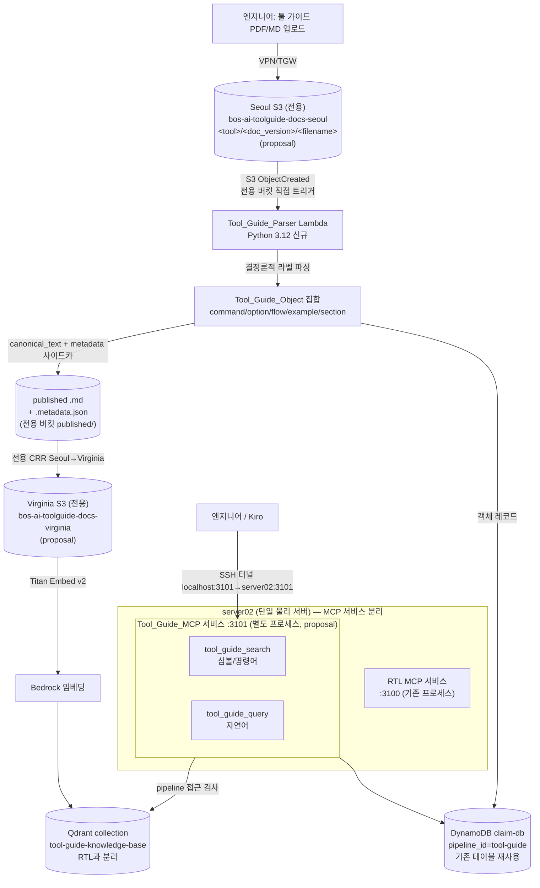
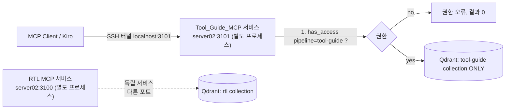
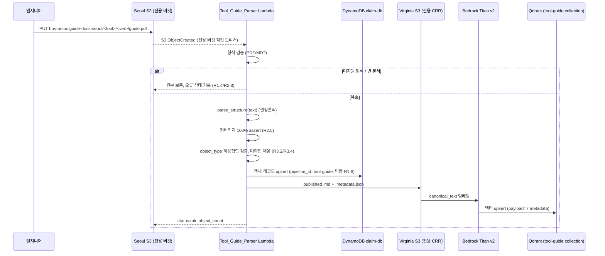
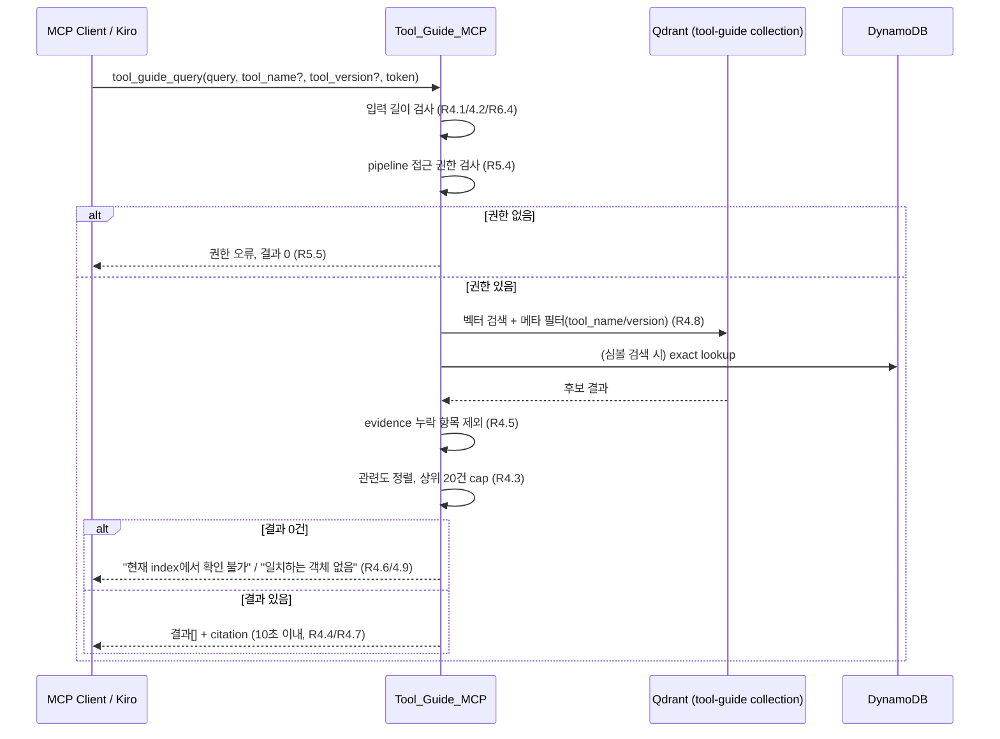

# Design Document

**Feature:** EDA Tool Guide 자산화 (Tool Guide RAG)

> **Created:** 2026-06-16
> **Updated:** 2026-06-18
> **Purpose:** EDA 툴 가이드 문서를 RTL RAG 인프라(Qdrant + Bedrock Titan + Lambda + DynamoDB + S3 CRR + MCP) 위에 분리된 파이프라인으로 끼워 넣어, 엔지니어가 근거 기반으로 명령어·옵션·플로우를 조회하게 하는 MVP 설계. (저장소는 전용 S3 버킷, MCP는 server02의 별도 포트/프로세스로 분리)
> **Spec / Project:** `.kiro/specs/eda-tool-guide-rag/`
> **Status:** Draft
> **Owner:** BOS-AI Private RAG

## Revision History

| 날짜 | 버전 | 변경 내용 | 작성자 |
|------|------|----------|--------|
| 2026-06-18 | 0.4 | Vision 다이어그램 파싱(R7) 추가: pymupdf 페이지 렌더링 + Bedrock Converse API(Claude) Vision 설명 생성, 텍스트 희소 페이지 임계값(100자), ENABLE_VISION_PARSING 환경 변수 제어, C2 Vision 처리 흐름 추가, Property 13 추가 | Kiro |
| 2026-06-18 | 0.3 | requirements.md 동기화: (1) 자연어 질의 길이 한도를 **8,192자로 통일**(C5/Property 11/관련 본문), (2) **임베딩 토큰 하드 리밋(R4.10)** 반영 — 문자 길이 검사는 사전 검증 가드, 구속 한도는 Titan Embed v2 입력 토큰 윈도(8,192 토큰), Error Handling에 `error:token_limit` 행 추가, (3) **id/doc_id 정규화(R3.6)** 반영(C2/Data Models — 대소문자·공백 정규화), (4) object_type 닫힌 집합 정합 확인, (5) 요구사항→설계 매핑에 R3.6/R4.10 및 R5.2/5.3 검증 경로 명시 | Kiro |
| 2026-06-17 | 0.2 | 검토 반영: (1) S3 분리를 prefix→**전용 버킷 + 전용 CRR**로 강화, (2) MCP 분리를 도구 namespace→**별도 포트/프로세스 서비스**로 강화. 다운스트림(아키텍처/이벤트 라우팅/C1/C5/C6/시퀀스/가정/R5 매핑) 반영 | Kiro |
| 2026-06-16 | 0.1 | 초판 | Kiro |

---

## Overview

EDA Tool Guide RAG는 EDA 벤더 툴 가이드 문서(Synopsys/Cadence/Siemens user guide·command reference·methodology guide)를 전용 corpus로 수집·파싱·임베딩하여, 엔지니어가 TCL·Makefile·툴 플로우 스크립트를 작성할 때 명령어·옵션·플로우 단계를 **출처와 함께** 조회하도록 하는 기능이다.

이 설계의 제1원칙은 `document_rag_parsing_embedding_strategy.md`에서 확립한 **"새 임베딩 스택을 만들지 않고 기존 RTL RAG 파이프라인 메커니즘에 문서 파서를 끼운다"** 이다. 즉 S3 업로드 + Cross-Region Replication **메커니즘**, Bedrock Titan Embed v2, Lambda(Python 3.12), DynamoDB claim-db 레코드 패턴, Qdrant 벡터 인덱스, MCP bridge 연결 모델을 모두 재사용한다. 신규로 만드는 것은 (1) Tool_Guide_Parser 추출 프로파일(Lambda), (2) **Tool Guide 전용 S3 소스 버킷 + 전용 CRR**(저장소 분리), (3) 분리된 corpus/Qdrant 컬렉션 namespace, (4) **server02의 별도 포트/프로세스로 분리된 Tool_Guide_MCP 서비스**뿐이다.

> **R1.5와의 정합성(중요):** 전용 S3 소스 버킷과 전용 CRR을 두는 것은 **저장소(storage) 분리**이지 **새 임베딩 스택**이 아니다. 임베딩 모델(Titan Embed v2)·벡터 인덱스 엔진(Qdrant)·DynamoDB 테이블·MCP 노출 메커니즘은 그대로 재사용한다. 따라서 "신규 임베딩 모델·벡터 인덱스·DynamoDB 테이블을 생성하지 않는다"는 R1.5와 모순되지 않는다. 마찬가지로 MCP를 별도 포트/프로세스로 띄우는 것은 **MCP bridge 연결 모델(SSH 터널 + localhost, Streamable HTTP)** 의 재사용 위에서 서비스 인스턴스를 하나 더 두는 것이며 새 임베딩/인덱스 스택이 아니다.

본 설계는 의도적으로 좁은 MVP다. requirements.md의 Non-Goals(cross-domain 질의, Codex testbench, LiteLLM gateway 전체 설계, fine-grained ACL, DV harness)는 다루지 않는다. 파이프라인 분리와 MCP 분리는 설계하되, 접근 제어는 **파이프라인 경계 + 분리된 MCP 노출**이라는 high-level 수준까지만 다룬다.

### 인프라 정합성 가정 (명시)

steering 문서 간 불일치가 존재한다. `product.md`/`structure.md`는 벡터 저장소를 OpenSearch Serverless로 기술하지만, **`tech.md`(권위 문서)는 Qdrant**로 명시한다(`QDRANT_ENDPOINT`, `QDRANT_COLLECTION=rtl-knowledge-base`, `QDRANT_API_KEY_SECRET_ARN`). 본 설계는 **tech.md를 권위 기준으로 채택하여 Qdrant를 전제**한다. `document_rag_parsing_embedding_strategy.md`의 OpenSearch 언급은 구버전 표현으로 간주하고 Qdrant 컬렉션/namespace 분리로 대체한다.

다음을 가정한다(검증 전 가정임을 명시):

- **가정 1:** 현재 운영 Qdrant는 단일 인스턴스에 다중 collection을 둘 수 있다. Tool Guide는 별도 collection(`tool-guide-knowledge-base`)으로 분리한다.
- **가정 2:** DynamoDB claim-db 테이블(`bos-ai-claim-db-prod`)은 `pipeline_id`/`corpus_id` 속성으로 RTL 객체와 Tool Guide 객체를 같은 테이블 안에서 분리 조회 가능하다(파티션 분리). 별도 테이블을 새로 만들지 않는다(요구사항 1.5 준수).
- **가정 3 (변경 — 전용 S3 버킷):** Tool Guide는 RTL과 **prefix를 공유하지 않고 전용 S3 소스 버킷**을 갖는다. 버킷/IAM 단위로 접근을 통제하기 위함이다. 제안 이름(검증 전 proposal): Seoul 소스 `bos-ai-toolguide-docs-seoul`, Virginia CRR 타깃 `bos-ai-toolguide-docs-virginia` (네이밍 규칙상 `-prod` 접미사 부여 가능: `bos-ai-toolguide-docs-seoul-prod`). 이 전용 버킷은 **자체 Cross-Region Replication(Seoul→Virginia)** 규칙을 가지며, S3 ObjectCreated 이벤트가 이 버킷에서 직접 Tool_Guide_Parser Lambda를 트리거한다(공유 버킷의 prefix 라우팅이 아님). 버킷 내부 객체 키 레이아웃은 `<tool_name>/<doc_version>/<filename>` 을 유지한다.
- **가정 4 (변경 — 별도 MCP 포트/프로세스):** MCP는 **하나의 물리 서버(server02)** 위에서 RTL MCP와 Tool Guide MCP를 **서로 다른 포트의 독립 프로세스/서비스**로 운영한다. 제안 포트(검증 전 proposal): RTL MCP `:3100`, Tool_Guide_MCP `:3101`. Kiro 연결 모델(SSH 터널 + localhost; Kiro는 HTTPS 또는 localhost만 허용 — tech.md)을 따르되, **SSH 터널이 신규 포트(`localhost:3101` → `server02:3101`)도 매핑**해야 한다. 이로써 RTL MCP와 Tool Guide MCP는 독립적 접근 제어·장애 격리·배포 주기를 갖는다.
- **가정 5:** Bedrock Titan Embed Text v2(`amazon.titan-embed-text-v2:0`)를 그대로 사용한다. 차원/모델을 새로 도입하지 않는다.

> **향후/운영 노트 (MVP 범위 외):** 파이프라인별 전용 S3 소스 버킷이 늘어나면 **RAG 업로드용 S3 버킷을 향후 정리·통합(consolidation)** 하는 것이 바람직하다("나중엔 RAG 업로드용 S3가 정리되면 좋겠다"). 이는 운영 정리 과제로 MVP 범위에 포함하지 않으며, 본 MVP는 명시적 분리(전용 버킷)를 우선한다.

이 가정 중 하나라도 실제 환경에서 거짓이면 Requirement 1.5/5.1의 "공유하지 않음" 조건을 재검토해야 한다.

---

## Architecture

### 기존 RTL RAG 파이프라인 메커니즘에 끼우는 방식

Tool Guide 파이프라인은 기존 파이프라인과 **동형(同形)**이며, 분기점은 (a) **전용 S3 소스 버킷**(+자체 CRR), (b) 파서(전용 버킷 이벤트가 직접 트리거), (c) Qdrant collection, (d) DynamoDB 파티션, (e) **별도 포트/프로세스의 Tool_Guide_MCP 서비스** 다섯 곳뿐이다. 임베딩 모델·인덱스 엔진·DDB 테이블·MCP 연결 모델은 재사용한다.



### 레이어 책임

| 레이어 | 책임 | 재사용/신규 | 요구사항 |
|---|---|---|---|
| S3 Ingestion | **전용 소스 버킷** 수집, **전용 CRR**, 형식 검증 | 재사용(메커니즘)+**전용 버킷** | R1 |
| Tool_Guide_Parser (Lambda) | 결정론적 객체 추출, 100% 커버, 공통 스키마 적재 | 신규 | R2, R3, R6 |
| Embedding/Index | Titan v2 임베딩 → Qdrant 분리 collection | 재사용(+collection) | R1, R5 |
| Object Store | DynamoDB claim-db 패턴, pipeline 파티션 분리 | 재사용(+파티션) | R3, R5 |
| Tool_Guide_MCP | 심볼/자연어 검색, 근거 인용, 결과 cap, 권한 검사 | **신규 서비스(별도 포트/프로세스 :3101)** | R4, R5, R6 |

### 이벤트 라우팅 원칙

**전용 S3 소스 버킷**(`bos-ai-toolguide-docs-seoul`, proposal)을 두고, 이 버킷의 S3 ObjectCreated 이벤트가 **Tool_Guide_Parser Lambda를 직접 트리거**한다. 즉 공유 버킷에서 prefix(`raw/tool-guide/**` vs `raw/rtl/**`)로 가르던 방식이 아니라, **버킷 자체가 분리**되어 RTL 파이프라인과 이벤트·저장소·접근 권한(IAM)이 버킷/IAM 단위로 격리된다. published 산출물과 전용 CRR(Seoul→Virginia) 역시 이 전용 버킷에 귀속된다. 버킷 내부 객체 키는 `<tool_name>/<doc_version>/<filename>` 레이아웃을 유지해 툴/버전 메타데이터를 경로에서 도출한다. 이로써 버킷 수준에서 corpus가 분리된다(R1.2, R5.1).

> **향후/운영 노트:** 파이프라인이 늘어 전용 버킷이 다수가 되면 **RAG 업로드용 S3 버킷의 정리·통합**을 향후 과제로 둔다(MVP 범위 외). 현재 MVP는 명시적 버킷 분리를 우선한다.

---

## Components and Interfaces

### C1. Tool_Guide_Ingestion (전용 S3 버킷 + 이벤트 트리거)

- **입력:** **전용 소스 버킷** `bos-ai-toolguide-docs-seoul`(proposal)에 `<tool_name>/<doc_version>/<filename>.{pdf,md}` 키로 업로드된 객체. (공유 버킷의 `raw/tool-guide/` prefix가 아니라 버킷 자체가 분리된다.)
- **형식 검증:** 확장자/매직바이트로 PDF·Markdown만 통과. 그 외는 처리 중단 + 원본 보존 + 오류 상태 기록(R1.4).
- **재업로드 멱등성:** 동일 키(=동일 버킷+경로+파일명)는 동일 `doc_id`로 매핑되어 기존 객체 레코드를 교체(덮어쓰기), 중복 생성 금지(R1.6). `doc_id = sha1(normalize(tool_name) + normalize(doc_version) + normalize(filename))`로 결정하며, `normalize`는 대소문자 통일 + 앞뒤 공백 제거의 결정론적 정규화다(R3.6).
- **복제:** 전용 버킷은 **자체 CRR(Seoul→Virginia, 타깃 `bos-ai-toolguide-docs-virginia` proposal)** 을 갖는다. RTL 버킷의 CRR과 독립적이다.
- **출력:** 파싱 대상 메시지(`doc_id`, S3 key, tool_name, doc_version)를 Tool_Guide_Parser Lambda로 전달.

```
인터페이스 (S3 event → Lambda):
  trigger: S3 ObjectCreated on bucket=bos-ai-toolguide-docs-seoul (전용 버킷, prefix 라우팅 아님)
  payload: { bucket, key, tool_name(from key path), doc_version(from key path), filename }
```

### C2. Tool_Guide_Parser (신규 Lambda, Python 3.12)

RTL 파서와 동형의 결정론적 파서. 핵심은 **라벨/구조 규칙만으로 객체 경계·type·관계를 확정**하고, LLM은 canonical_text 문장·요약 생성에만 보조 사용(R2.2).

처리 단계:

```
1. 텍스트화: PDF는 pdftotext -layout, Markdown은 그대로. 문자 오프셋 ↔ 페이지/섹션 매핑 테이블 구축.
2. 블록 스캔 (결정론적):
   - command 블록: 명령어 헤더 라벨(예: "Command:", "SYNTAX", "Usage:") 기반 경계 검출
   - option 정의: 옵션 라벨(예: "-option", "Options:", "Arguments:") 블록
   - flow 섹션: methodology/flow 단계 헤더
   - example: 코드펜스/"Example" 라벨 블록
3. 관계 결정: option 블록이 command 블록의 텍스트 범위 안/직속 하위면 belongs_to=command_id.
              어느 command에도 안 속하면 독립 객체로 보존 (R2.4).
4. 잔여 구간 처리: 규칙으로 안 잡힌 모든 구간을 section 객체로 포장 (R2.5).
5. 커버리지 검사: 모든 객체의 [start,end) 합집합이 원문(공백 제외) 100% 인지 assert.
6. canonical_text 생성: 각 객체 1개당 1문장(임베딩 단위). 결정론적 템플릿 우선,
   서술 요약이 필요한 section/example만 LLM 보조 (입력 동일→출력 동일 보장 위해 temperature=0, 캐시).
7. 메타데이터 채움: 7개 필드. 원문 미확인 값은 "미확인" (R3.4). object_type 허용집합 검증 (R3.2).
8. 적재: DynamoDB(객체 레코드) + S3 published(canonical .md + .metadata.json).
```

**Vision 다이어그램 처리 (R7, 선택적)**
- 조건: `ENABLE_VISION_PARSING=true` 환경 변수 설정 시에만 동작
- 대상: PDF 페이지 중 추출 텍스트 길이 < 100자(비공백)인 페이지
- 처리 흐름:
  1. `pymupdf`(fitz)로 해당 페이지를 PNG 이미지로 렌더링 (72 DPI 기본)
  2. Bedrock Converse API(`anthropic.claude-3-5-sonnet-20241022-v2:0`)에 이미지 + 프롬프트 전달
  3. 프롬프트: "이 EDA 툴 가이드 다이어그램에서 블록 구성 요소, 신호 흐름, 인터페이스, 레이블을 설명하세요."
  4. 생성된 텍스트를 해당 페이지의 `section` 객체의 `canonical_text`로 저장
  5. Vision 실패(API 오류, timeout) 시: 원문 텍스트(빈 문자열일 수 있음)로 폴백, 파싱 계속
- 기존 `summarize` 콜백에 Vision 로직을 주입하는 방식으로 구현 (build_objects.py의 injectable summarizer 패턴 활용)
- 임베딩은 Titan Embed v2 재사용 (R1.5 준수, 신규 모델 없음)

**결정론 보장 메커니즘 (R2.7):**
- 객체 경계·type·belongs_to는 순수 함수 `parse_structure(text) -> [objects]` 가 결정. 외부 상태·시각·난수 미사용.
- 객체 정렬은 `start_offset` 오름차순 안정 정렬.
- canonical_text의 LLM 보조 부분은 `(object_id, source_span)` 키로 캐시하여 재처리 시 동일 출력 재사용. 캐시 미스 시에도 temperature=0 고정. **결정론 단위/속성 테스트는 LLM 비의존 부분(`parse_structure`)을 대상으로 한다.**

**식별자 정규화 (R3.6):** `id` 및 `doc_id`를 구성하는 식별자 입력값(`tool_name`, `doc_version`, `filename`)은 식별자 생성 직전에 **결정론적으로 정규화**(대소문자 통일 = case-folding + 앞뒤 공백 제거 = trimming)한 뒤 사용한다. 따라서 동일한 논리적 문서를 입력 대소문자·공백 변형(예: `VCS` vs ` vcs `)으로 반복 수집해도 동일한 `id`/`doc_id`가 산출된다(`doc_id = sha1(normalize(tool_name) + normalize(doc_version) + normalize(filename))`). 이 정규화는 Property 1(파서 결정론)과 Property 6(재수집 멱등성)을 식별자 생성 입력 변형까지 확장해 보강한다.

**빈/미지원 입력 (R2.8):** 텍스트가 비었거나 형식 미지원이면 추출 중단, 오류 반환, 부분 결과 저장 금지(트랜잭션: 전체 객체 적재가 성공해야 commit).

```
인터페이스:
  parse_structure(text: str) -> list[ParsedObject]   # 순수·결정론적
  build_objects(parsed, meta) -> list[ToolGuideObject]
  handler(event) -> { doc_id, object_count, status }  # status: ok | error:<reason>
```

### C3. Embedding & Index (재사용 + 분리)

- 각 객체의 `canonical_text`를 Titan Embed v2로 임베딩(객체 1개 = 벡터 1개).
- Qdrant collection `tool-guide-knowledge-base`(RTL의 `rtl-knowledge-base`와 분리)에 upsert. payload에 7개 메타데이터 필드 + `pipeline_id=tool-guide` 포함하여 필터 검색 지원.
- 신규 임베딩 모델/차원 도입 없음(R1.5).
- **토큰 하드 리밋(R4.10):** 임베딩 대상 텍스트(질의·canonical_text)의 구속력 있는 강제 한도는 임베딩 모델(Bedrock Titan Embed Text v2)의 입력 토큰 윈도(8,192 토큰)다. MCP 계층의 문자 길이 검사는 저비용 사전 검증 가드일 뿐이며, 문자 검사를 통과했더라도 토큰화 결과가 토큰 윈도를 초과하면 임베딩을 시도하지 않고 식별 가능한 토큰 한도 초과 오류(`error:token_limit`)로 거부한다(부분 결과 미반환).

### C4. Object Store (DynamoDB claim-db 패턴)

- 기존 테이블 재사용. 파티션 키에 `pipeline_id=tool-guide` 부여하여 RTL과 물리적으로 같은 테이블, 논리적으로 분리.
- `tool_name`/`command` exact lookup용 GSI(또는 payload 필터)로 심볼 검색 보강.

### C5. Tool_Guide_MCP (신규 서비스, 별도 포트/프로세스로 분리)

Tool_Guide_MCP는 RTL MCP와 **동일 물리 서버(server02)** 에서 동작하되, **별도 포트의 독립 프로세스/서비스**로 분리 운영된다(RTL MCP `:3100`, Tool_Guide_MCP `:3101`, 포트는 proposal). 이는 단순한 도구 이름 namespace 분리를 넘어 **서비스 수준 분리**로, RTL MCP와 독립적인 접근 제어·장애 격리·배포 주기를 갖는다(R5.2 강화). 도구 이름도 RTL MCP와 겹치지 않는다. Kiro 연결은 tech.md 연결 모델(SSH 터널 + localhost, Kiro는 HTTPS 또는 localhost만 허용)을 따르며, **SSH 터널이 신규 포트(`localhost:3101` → `server02:3101`)도 매핑**해야 한다. 도구 2종:

```
tool_guide_search(query: str<=256,           # R4.1
                  tool_name?: str, tool_version?: str,
                  pipeline_token) -> Result[]
tool_guide_query(query: str<=8192,            # R4.2
                 tool_name?: str, tool_version?: str,
                 pipeline_token) -> Result[]
```

공통 응답 규칙:
- 관련도 내림차순, 최대 20건(R4.3, R6.2).
- 각 결과에 evidence 인용(문서명, doc_version, 페이지|섹션) 포함(R4.4).
- evidence 필수 항목 누락 결과는 **반환 전 필터링**하여 제외(R4.5).
- corpus에 근거 없으면 `"현재 index에서 확인 불가"` 반환, 명령어 생성 금지(R4.6).
- `tool_name`/`tool_version` 지정 시 해당 객체로 범위 한정(R4.8). 일치 객체 없으면 빈 결과 + `"일치하는 객체 없음"`(R4.9).
- 질의 수신 ~ 응답까지 10초 이내(R4.7). 초과 시 timeout 오류 응답.
- 입력 길이 위반(빈 질의 또는 한도 초과: 심볼 256자, 자연어 8,192자)은 거부 + 길이 위반 오류(R6.4).
- **임베딩 토큰 하드 리밋(R4.10):** 문자 길이 검사(자연어 8,192자, 심볼 256자)는 **저비용 사전 검증 가드**일 뿐이며, 구속력 있는 강제 한도는 임베딩 모델(Bedrock Titan Embed Text v2)의 입력 토큰 윈도(8,192 토큰)다. 문자 길이 검사를 통과했더라도 토큰화 결과가 토큰 윈도를 초과하면 해당 질의를 **식별 가능한 토큰 한도 초과 오류(`error:token_limit`)로 거부**하고 부분 결과를 반환하지 않는다.
- 호출 시 pipeline 접근 권한 검사. 권한 없으면 결과 없이 권한 오류(R5.4/5.5). 권한 보유 시 Tool Guide corpus 결과만, RTL 혼입 금지(R5.6) — Qdrant collection/필터가 collection 단위로 분리되어 구조적으로 보장.

### C6. 접근 경계 (high-level)



파이프라인 식별자 `tool-guide`를 단일·고유하게 부여(R5.3). Tool_Guide_MCP는 **RTL MCP와 다른 포트의 독립 서비스**이므로 RTL 도구가 동일 엔드포인트에 노출되지 않는다(서비스 경계). 그 위에 MCP 진입에서 토큰의 파이프라인 접근 여부를 검사하는 **경계 수준** 권한 검사를 둔다. 세분화된 corpus/document ACL, LiteLLM 키 정책은 범위 외(Non-Goals)이며 `NPU_SOC_RTL_RAG_MCP_Improvement_Report.md`의 2단계 권한 모델을 향후 방향으로만 참조.

---

## Data Models

### 공통 객체 레코드 (claim-db 호환, R3.5)

모든 Tool_Guide_Object는 RTL 객체와 동일한 5개 최상위 필드를 가진다.

```json
{
  "id": "toolguide#vcs#2023.12#command#elaborate",
  "object_type": "command",
  "canonical_text": "Command 'elaborate' compiles and elaborates the design. ...",
  "metadata": {
    "tool_name": "VCS",
    "tool_version": "2023.12",
    "command": "elaborate",
    "option": "미확인",
    "section": "4.2 Elaboration",
    "doc_version": "2023.12-rev1",
    "object_type": "command"
  },
  "evidence": {
    "source_file": "vcs_user_guide_2023.12.pdf",
    "doc_version": "2023.12-rev1",
    "page": 42,
    "section": "4.2 Elaboration"
  }
}
```

### 필드 정의

| 최상위 필드 | 타입 | 설명 | 요구사항 |
|---|---|---|---|
| `id` | string | `toolguide#<tool>#<ver>#<type>#<name>` 결정론적 식별자. 구성 입력값(`tool_name`, `doc_version`, `filename`)은 결정론적 정규화(대소문자 통일 + 앞뒤 공백 제거) 후 사용하여 입력 변형과 무관하게 동일 `id`/`doc_id` 보장 | R3.5, R3.6 |
| `object_type` | string | 허용 집합 중 하나 | R3.2 |
| `canonical_text` | string | 임베딩 대상 단일 문장 | R2.6 |
| `metadata` | object | 7개 필드(아래) | R3.1 |
| `evidence` | object | 출처(문서명+doc_version+page\|section≥1) | R3.3 |

### metadata 7개 필드 (R3.1) — 모두 문자열, 항상 존재

`tool_name`, `tool_version`, `command`, `option`, `section`, `doc_version`, `object_type`. 원문에서 확인 불가한 값은 고정 문자열 `"미확인"`(R3.4). 추정/기본값 생성 금지.

### object_type 허용 값 집합 (Glossary 정합, R3.2)

```
command | option | flow_step | example | section
```

허용 집합에 없는 type은 객체를 **생성하지 않는다**. MVP(R6.1)는 이 중 `command`, `option`만 활성. `flow_step`/`example`/`section`은 스키마에 정의돼 있으나 MVP 인덱싱 대상에서 제외 — 스키마·파이프라인 골격 변경 없이 type 활성화만으로 확장(R6.5).

### evidence 모델 (R3.3)

```
evidence = {
  source_file: string,         # 필수
  doc_version: string,         # 필수
  page?: int,                  # page 또는 section 중 >=1 필수
  section?: string
}
```

### MCP 결과 항목 모델 (R4.4)

```
Result = {
  id, object_type, canonical_text,
  score: float,                          # 관련도
  citation: { source_file, doc_version, page|section }   # R4.4, 누락 시 항목 제외(R4.5)
}
```

### 확장성 — 고정 vs 가변 (R6.5)

| 구분 | 항목 | 추가 시 변경 |
|---|---|---|
| 고정 | 5필드 공통 레코드, 7 metadata 필드, S3/CRR/Qdrant/DDB/MCP 골격 | 변경 없음 |
| 가변 | object_type 활성 집합, extractor 규칙 | type 활성화 / extractor 규칙 추가만 |

---

## Sequence Diagrams

### 수집 → 파싱 → 인덱싱 (Ingestion)



### 자연어/심볼 질의 (Query)



---

## Correctness Properties

*속성(property)이란 시스템의 모든 유효한 실행에서 참이어야 하는 특성·행동으로, 시스템이 무엇을 해야 하는지에 대한 형식적 진술이다. 속성은 사람이 읽는 명세와 기계가 검증 가능한 정확성 보증 사이의 다리 역할을 한다.*

아래 속성은 prework 분석에서 testable(property)로 분류된 수용 기준을 보편 정량화 형태로 변환하고, 중복을 제거(reflection)하여 도출했다. 속성의 1차 대상은 **LLM 비의존 순수 함수 `parse_structure`/객체 빌드** 및 **MCP 결과 가공 로직**이다(인프라·LLM 보조 부분은 통합/스모크 테스트 대상).

### Property 1: 파서 결정론 (Determinism)

*For any* 유효한 입력 문서 텍스트에 대해, `parse_structure`를 2회 이상 반복 호출하면 추출된 객체의 개수, 각 객체의 텍스트 경계 오프셋(start/end), `object_type` 분류, `belongs_to` 관계가 모든 호출에서 완전히 동일해야 한다.

**Validates: Requirements 2.2, 2.7**

### Property 2: 텍스트 100% 커버리지 (Coverage Invariant)

*For any* 유효한 입력 문서에 대해, 추출된 모든 Tool_Guide_Object의 텍스트 경계 `[start, end)` 구간들의 합집합이 원문 텍스트의 비공백 문자 전체(100%)를 빠짐없이 커버해야 한다(미파싱 구간은 section 객체로 보존되어 누락이 없어야 한다).

**Validates: Requirements 2.1, 2.5**

### Property 3: 객체 레코드 정합성 (Record Well-formedness)

*For any* 추출된 Tool_Guide_Object에 대해, 해당 객체는 (a) 최상위 5개 필드(`id`, `object_type`, `canonical_text`, `metadata`, `evidence`)를 모두 포함하고, (b) `metadata`에 7개 필드(`tool_name`, `tool_version`, `command`, `option`, `section`, `doc_version`, `object_type`)가 모두 문자열로 존재하며, (c) 원문에서 확인되지 않는 필드는 정확히 고정 문자열 `"미확인"`이고(추정/기본값 없음), (d) 정확히 하나의 비어있지 않은 `canonical_text`를 가지며, (e) `evidence`는 `source_file`·`doc_version`을 포함하고 `page` 또는 `section` 중 최소 1개를 포함해야 한다.

**Validates: Requirements 2.6, 3.1, 3.3, 3.4, 3.5**

### Property 4: object_type 허용 집합 (Closed Type Set)

*For any* 추출된 Tool_Guide_Object에 대해, `object_type`은 허용 집합 `{command, option, flow_step, example, section}` 중 하나여야 하며, 허용 집합에 없는 type의 객체는 생성되지 않아야 한다.

**Validates: Requirements 3.2**

### Property 5: belongs_to 관계 보존 (Relation Preservation)

*For any* 입력 문서에 대해, 어떤 command 객체의 텍스트 범위 내부에 위치한 option 객체는 그 command를 가리키는 `belongs_to` 관계를 가져야 하고, 어떤 command 범위에도 속하지 않는 option 객체는 `belongs_to`가 없는 독립 객체로 보존되어야 한다(어느 경우에도 option 객체가 누락되지 않는다).

**Validates: Requirements 2.3, 2.4**

### Property 6: 재수집 멱등성 (Ingestion Idempotence)

*For any* 입력 문서에 대해, 동일한 업로드 prefix와 파일명으로 2회 이상 수집·처리하면 결과 객체의 `id` 집합과 레코드 개수가 1회 처리 결과와 동일해야 한다(중복 항목이 생성되지 않는다).

**Validates: Requirements 1.6**

### Property 7: 미지원·빈 입력 오류 처리 (Error Condition)

*For any* 비어 있거나(공백만 포함) 지원되지 않는 형식의 입력에 대해, 파서는 추출을 중단하고 처리 불가 사유를 나타내는 오류를 반환하며, 어떠한 부분 추출 결과도 저장하지 않고 원본을 변경하지 않아야 한다.

**Validates: Requirements 1.4, 2.8**

### Property 8: 결과 개수 상한과 정렬 (Cap & Ordering)

*For any* 후보 결과 집합과 질의에 대해, MCP가 반환하는 결과는 최대 20건이며 관련도 점수 기준 내림차순(단조 비증가)으로 정렬되어야 한다.

**Validates: Requirements 4.3, 6.2**

### Property 9: 인용 완전성 (Citation Completeness)

*For any* 후보 결과 집합에 대해, MCP가 반환하는 모든 결과 항목은 완전한 출처 인용(문서명, `doc_version`, 그리고 `page` 또는 `section` 중 최소 1개)을 포함해야 하며, 인용이 불완전한 항목은 결과에서 제외되어 반환되지 않아야 한다.

**Validates: Requirements 4.4, 4.5**

### Property 10: 필터 범위 한정 (Filter Scoping)

*For any* `tool_name` 또는 `tool_version`이 지정된 질의와 임의의 backing corpus에 대해, 반환되는 모든 결과 항목의 해당 메타데이터 값은 지정된 필터 조건과 일치해야 한다.

**Validates: Requirements 4.8**

### Property 11: 입력 길이 검증 (Input Length Validation)

*For any* 길이 N의 질의 문자열에 대해, 자연어 질의는 N이 1 이상 8,192 이하일 때만 수용되고 그 외(빈 질의 또는 8,192자 초과)에는 길이 위반 오류로 거부되어야 한다. 심볼 검색 질의는 동일 규칙을 256자 한도로 적용한다. 추가로, 문자 길이 검사를 통과한 자연어 질의라도 토큰화 결과가 임베딩 모델 입력 토큰 윈도(8,192 토큰)를 초과하면 식별 가능한 토큰 한도 초과 오류로 거부되고 부분 결과를 반환하지 않아야 한다.

**Validates: Requirements 4.1, 4.2, 4.10, 6.4**

### Property 12: 파이프라인 권한 격리 (Access Isolation)

*For any* 사용자 권한 상태와 질의에 대해, Tool Guide 파이프라인 접근 권한이 없으면 Tool_Guide_Corpus 결과가 0건 노출되고 권한 오류가 반환되며, 권한이 있으면 반환되는 모든 결과의 `pipeline_id`가 `tool-guide`이고 RTL corpus 결과가 0건이어야 한다.

**Validates: Requirements 5.4, 5.5, 5.6**

---

## Error Handling

| 오류 상황 | 처리 | 요구사항 |
|---|---|---|
| 미지원 파일 형식 업로드 | 처리 중단, 원본 S3 객체 불변 보존, `error:unsupported_format` 상태 기록 | R1.4 |
| 빈 문서 / 공백뿐인 문서 | 추출 중단, `error:empty_document` 반환, 부분 결과 미저장(전체 commit 트랜잭션) | R2.8 |
| object_type 허용집합 밖 | 해당 객체 미생성(스킵), 잔여는 section 객체로 흡수해 커버리지 유지 | R3.2, R2.5 |
| 메타데이터/evidence 값 미확인 | 고정 문자열 `"미확인"` 표기, 추정값 생성 금지 | R3.4 |
| 파서 부분 실패(특정 구간 규칙 미매칭) | 해당 구간을 section 객체로 보존(누락 금지), 처리 계속 | R2.5 |
| 적재 중 실패(DDB/S3) | 전체 롤백, 부분 인덱싱 방지, 재처리 가능하도록 idempotent doc_id 유지 | R1.6, R2.8 |
| 질의 길이 위반(빈/한도 초과) | 거부 + `error:input_length` | R4.1, R4.2, R6.4 |
| 임베딩 토큰 한도 초과(문자 검사 통과 후 토큰 윈도 8,192 초과) | 거부 + `error:token_limit`, 부분 결과 미반환 | R4.10 |
| 근거 0건 | `"현재 index에서 확인 불가"`, 생성 텍스트 없음 | R4.6 |
| tool_name/version 무매칭 | 빈 결과 + `"일치하는 객체 없음"` | R4.9 |
| evidence 불완전 결과 항목 | 반환 전 제외(필터링) | R4.5 |
| 10초 초과 | timeout 오류 응답 반환(부분 결과 미반환) | R4.7 |
| Vision 처리 실패(API 오류/timeout) | 원문 텍스트로 폴백, 해당 페이지 section 객체 유지, 파싱 계속 | R7.4 |
| ENABLE_VISION_PARSING=false(기본) | Vision 처리 건너뜀, 추가 비용 없음 | R7.5 |
| 권한 없음 | 결과 0 + 권한 오류, corpus 비노출 | R5.5 |

**원칙:** 모든 오류 경로는 (1) 원본 보존, (2) 부분 결과 비저장/비노출, (3) 식별 가능한 오류 상태를 보장한다. 근거 없는 명령어·옵션을 **생성하지 않는 것**이 품질 안전장치의 핵심이다(R4.6).

---

## Testing Strategy

### 이중 테스트 접근

- **속성 테스트(Property tests):** 위 12개 속성을 보편 입력에 대해 검증. 1차 대상은 순수 함수 `parse_structure`/객체 빌드와 MCP 결과 가공 로직(권한·cap·citation·필터·길이).
- **단위 테스트(Unit/Example):** 특정 분기·경계·구성 검증 — 전용 버킷 격리(1.2), 형식 판별 경계(1.3, 4.1/4.2 경계), "확인 불가"/"일치 없음" 메시지(4.6/4.9/6.3), MVP type 제한(6.1), MCP 서비스/포트·도구명 비중첩(5.2), pipeline_id 고유성(5.3).
- **통합/스모크 테스트:** 외부·구성 검증 — 전용 S3 버킷+전용 CRR 수집(1.1), 신규 임베딩 모델/인덱스/테이블 미생성(1.5), collection 분리(5.1), 별도 포트(:3101) MCP 서비스 기동·SSH 터널 매핑(5.2), 10초 latency(4.7), 확장성 회귀(6.5).

### 속성 기반 테스트 구성

- **언어/라이브러리:** 파서 로직은 Python(Lambda 대상)이므로 **Hypothesis**로 작성(`parse_structure` 등 순수 함수 대상). 로컬은 `py -m pytest`로 실행(tech.md 규약). 인프라 계층 속성은 기존 Go/gopter 스위트(`tests/properties/`)와 분리하여 파서 전용 디렉토리에 둔다.
- PBT를 처음부터 구현하지 않고 Hypothesis 생성기를 사용한다.
- 각 속성 테스트는 **최소 100회 반복**(`@settings(max_examples=100)` 이상).
- 각 속성 테스트는 설계 속성을 주석으로 참조한다.
- 태그 형식: **Feature: eda-tool-guide-rag, Property {번호}: {속성 텍스트}**
- 각 Correctness Property는 **단일 속성 기반 테스트**로 구현한다.

**생성기(Generator) 설계 요점:**
- 합성 툴 가이드 문서 생성기: command 블록, command 내부 option, 고아 option, 미파싱 잔여 구간, 비ASCII/특수문자, 빈/공백 문서를 포함하도록 구성(Property 2/5/7의 엣지 케이스를 생성기가 커버).
- MCP 후보 결과 생성기: 임의 score, 일부 evidence 누락, 다양한 tool_name/version, 다양한 결과 수(0~50+)를 생성(Property 8/9/10 커버).
- 권한 상태 생성기: 접근 허용/거부 + corpus 혼합 데이터(Property 12 커버).

### 비-PBT 항목 명시

`tech.md` 인프라(Qdrant collection 분리, DDB 파티션, **전용 S3 버킷 + 전용 CRR**, **별도 포트/프로세스의 MCP 서비스 기동·SSH 터널 매핑**)는 IaC/구성·외부 서비스 영역으로 PBT 대상이 아니다. 이들은 통합/스모크 테스트와 기존 Terraform/OPA 정책 검증으로 다룬다. PBT는 파서 로직과 MCP 결과 가공이라는 **순수 로직 계층**에만 적용한다.

---

## 요구사항 → 설계 매핑 요약

| Requirement | 설계 섹션 |
|---|---|
| R1 수집(인프라 재사용) | Architecture(전용 버킷 트리거), C1 Ingestion(전용 S3 버킷+전용 CRR), Sequence(Ingestion), Property 6/7 |
| R2 결정론적 파싱 | C2 Parser, Property 1/2/5/7 |
| R3 메타데이터 스키마 | Data Models, C2(식별자 정규화), Property 3/4. **R3.6(id/doc_id 정규화)는 C2 식별자 정규화 + Data Models `id` 설명, Property 1/6로 보강** |
| R4 MCP 질의(근거 인용) | C5 Tool_Guide_MCP, C3(토큰 하드 리밋), Sequence(Query), Property 8/9/10/11. **R4.10(토큰 한도 초과)은 C3/C5 토큰 가드 + Error Handling `error:token_limit` + Property 11로 검증** |
| R5 분리 파이프라인·MCP·접근 경계 | Architecture(전용 버킷), C5(별도 포트/프로세스 :3101)/C6, Property 12. **R5.2(분리된 MCP 도구 집합)는 도구 namespace가 아닌 서비스/포트 수준 분리로 강화하며, MCP 서비스/포트·도구명 비중첩 단위/스모크 테스트로 검증. R5.3(고유 파이프라인 id)은 pipeline_id 고유성 단위 테스트로 검증** |
| R6 단계적 MVP | Data Models(확장성), C5, Property 8/11 |
| R7 Vision 다이어그램 파싱 | C2 Vision 처리 흐름, Error Handling(Vision 폴백 행), Property 13 |
