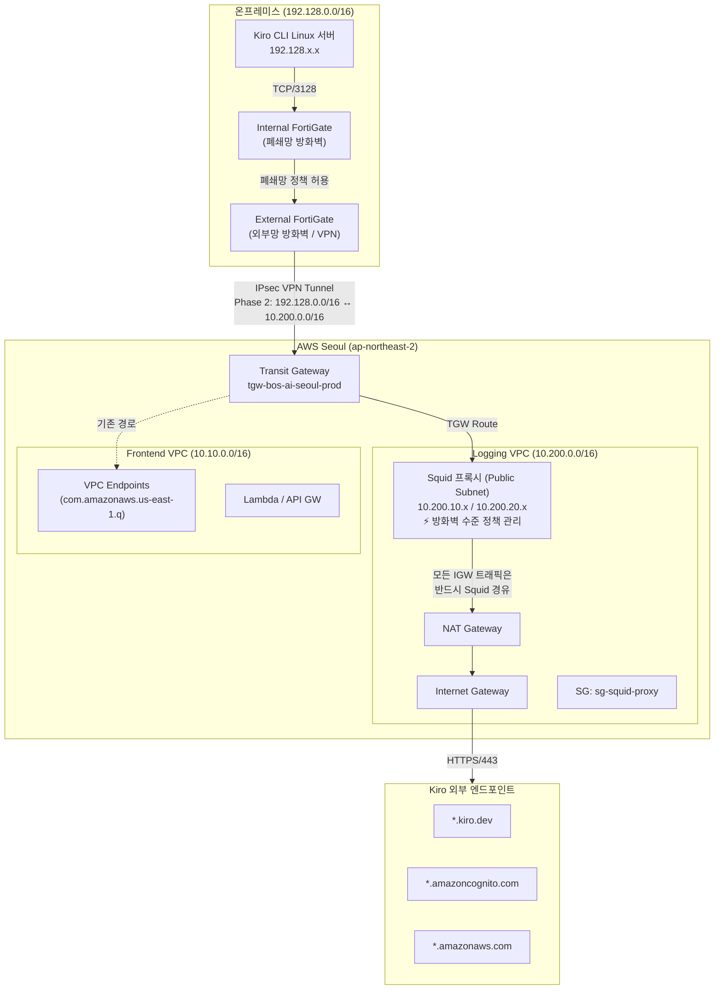
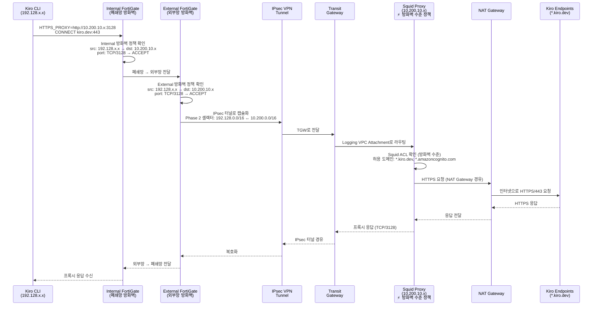
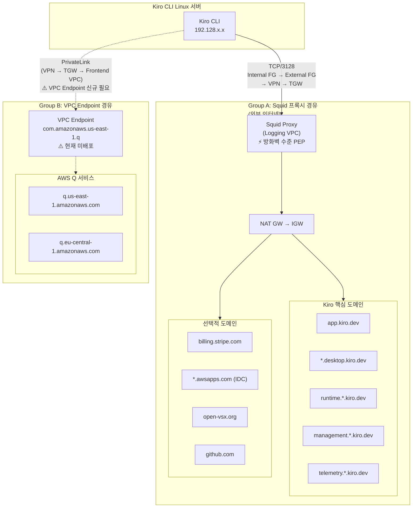

# 설계 문서: Kiro CLI 프록시 라우팅

## 개요

온프레미스 Linux 서버에서 Kiro CLI를 사용하기 위해, 이중 방화벽(Internal FortiGate → External FortiGate)을 통해 Logging VPC(10.200.0.0/16)의 Squid 프록시로 트래픽을 라우팅하고, 프록시가 NAT Gateway를 통해 Kiro 외부 엔드포인트(*.kiro.dev, *.amazoncognito.com, *.amazonaws.com)에 접근하는 네트워크 경로를 구성한다.

**이중 방화벽 토폴로지**: Kiro CLI Linux 서버 상위에는 폐쇄망(Internal) 방화벽이 위치하며, 이 Internal 방화벽 상단에 외부망(External) 방화벽이 존재한다. AWS와의 IPsec VPN 연동은 External 방화벽에서 수행된다. 따라서 네트워크 경로는 다음과 같다:

> Kiro CLI Linux 서버 → **Internal FortiGate (폐쇄망)** → **External FortiGate (외부망/VPN)** → IPsec VPN → TGW → Logging VPC

현재 인프라에서 온프레미스(192.128.0.0/16)는 External FortiGate의 IPsec VPN → Transit Gateway를 통해 Frontend VPC(10.10.0.0/16)와 연결되어 있으나, Logging VPC(10.200.0.0/16)로의 직접 라우팅은 IPsec Phase 2 셀렉터에 포함되지 않았을 가능성이 높다. 이 설계는 Internal/External FortiGate 방화벽 정책, IPsec Phase 2 셀렉터, 정적 라우팅, TGW 라우팅, Security Group, Squid ACL(방화벽 수준 정책 관리), 그리고 Linux 클라이언트 프록시 설정을 포괄한다.

**Squid 정책 관리 수준**: Logging VPC의 Squid 프록시는 단순 프록시가 아닌, 방화벽과 동일한 수준의 정책 관리 대상이다. 모든 IGW 방향 트래픽은 반드시 Squid를 경유해야 하며, Squid ACL 정책은 방화벽 정책과 동일한 엄격함으로 관리된다.

핵심 변경 범위:
1. **Internal FortiGate (폐쇄망)**: Kiro CLI 서버 → External FortiGate 방향 트래픽 허용 정책 추가
2. **External FortiGate (외부망/VPN)**: 방화벽 정책 추가, 정적 라우트 추가, IPsec Phase 2 셀렉터에 10.200.0.0/16 추가
3. **AWS TGW**: 온프레미스 → Logging VPC 라우팅 확인 (기존 TGW 전파로 이미 동작할 가능성 있음)
4. **Logging VPC**: Squid 프록시 EC2 배포 (방화벽 수준 정책 관리), Security Group 생성, Squid ACL 설정
5. **Linux 클라이언트**: 환경변수 또는 PAC 파일로 프록시 설정

## 아키텍처

### 전체 네트워크 토폴로지



### 트래픽 흐름 시퀀스



## 컴포넌트 및 인터페이스

### 컴포넌트 1: Internal FortiGate 방화벽 정책 (폐쇄망)

**목적**: 폐쇄망 내부의 Kiro CLI 서버에서 External FortiGate(외부망) 방향으로의 TCP/3128 트래픽 통과 허용

**인터페이스**:
- 소스: `kiro-linux-server` (192.128.x.x)
- 목적지: `logging-vpc-proxy` (10.200.10.x 또는 10.200.20.x)
- 서비스: TCP/3128
- 인바운드 인터페이스: `internal` (폐쇄망 내부)
- 아웃바운드 인터페이스: `to-external-fw` (External FortiGate 방향)

**책임**:
- 폐쇄망에서 외부망 방화벽으로의 Kiro CLI 트래픽만 선택적으로 허용
- 로그 기록 (logtraffic all)
- 폐쇄망 보안 정책 준수 (최소 권한 원칙)

### 컴포넌트 1-2: External FortiGate 방화벽 정책 (외부망/VPN)

**목적**: Internal FortiGate를 통과한 트래픽을 IPsec VPN 터널로 전달하여 Logging VPC Squid 프록시에 도달

**인터페이스**:
- 소스: `kiro-linux-server` (192.128.x.x)
- 목적지: `logging-vpc-proxy` (10.200.10.x 또는 10.200.20.x)
- 서비스: TCP/3128
- 인바운드 인터페이스: `from-internal-fw` (Internal FortiGate에서 수신)
- 아웃바운드 인터페이스: `vpn-aws-tgw` (IPsec VPN 터널)

**책임**:
- Internal FortiGate에서 전달된 Kiro CLI 트래픽을 VPN 터널로 라우팅
- 로그 기록 (logtraffic all)
- IPsec Phase 2 셀렉터에 10.200.0.0/16 포함 보장
- 정적 라우트로 10.200.0.0/16 → vpn-aws-tgw 설정

### 컴포넌트 2: Squid 프록시 (EC2) — 방화벽 수준 정책 관리

**목적**: Kiro 관련 도메인만 허용하는 포워드 프록시. **방화벽과 동일한 수준의 정책 관리** 대상으로, Logging VPC에서 IGW로 나가는 모든 트래픽은 반드시 Squid를 경유해야 한다.

**정책 관리 수준**:
- Squid ACL 정책 변경은 방화벽 정책 변경과 동일한 변경 관리 프로세스(Change Management) 적용
- 도메인 화이트리스트 추가/삭제 시 보안팀 승인 필요
- 정책 변경 이력 관리 및 감사 로그 보존
- 정기적인 정책 리뷰 (방화벽 정책 리뷰와 동일 주기)

**인터페이스**:
- 인바운드: TCP/3128 (온프레미스 CIDR 192.128.0.0/16에서)
- 아웃바운드: HTTPS/443 (Kiro 도메인으로, NAT Gateway → IGW 경유)

**책임**:
- 도메인 기반 ACL로 허용 도메인만 프록시 (방화벽 수준 엄격함)
- Logging VPC의 모든 IGW 방향 트래픽에 대한 정책 집행점(Policy Enforcement Point) 역할
- 접근 로그 기록 (감사 추적 가능)
- 비허용 도메인 차단 및 알림

### 컴포넌트 3: Security Group (sg-squid-proxy)

**목적**: Squid 프록시 EC2 인스턴스의 네트워크 접근 제어

**인터페이스**:

```hcl
resource "aws_security_group" "squid_proxy" {
  name        = "sg-squid-proxy-bos-ai-seoul-prod"
  description = "Squid proxy for Kiro CLI connectivity"
  vpc_id      = module.vpc_logging.vpc_id

  ingress {
    description = "Proxy from on-premises"
    from_port   = 3128
    to_port     = 3128
    protocol    = "tcp"
    cidr_blocks = ["192.128.0.0/16"]
  }

  ingress {
    description = "SSH from on-premises for management"
    from_port   = 22
    to_port     = 22
    protocol    = "tcp"
    cidr_blocks = ["192.128.0.0/16"]
  }

  egress {
    description = "HTTPS to internet via NAT"
    from_port   = 443
    to_port     = 443
    protocol    = "tcp"
    cidr_blocks = ["0.0.0.0/0"]
  }

  egress {
    description = "DNS resolution"
    from_port   = 53
    to_port     = 53
    protocol    = "udp"
    cidr_blocks = ["0.0.0.0/0"]
  }
}
```

**책임**:
- 온프레미스에서 TCP/3128 인바운드만 허용
- 아웃바운드는 HTTPS/443과 DNS/53만 허용
- 불필요한 포트 차단

### 컴포넌트 4: TGW 라우팅

**목적**: 온프레미스 ↔ Logging VPC 간 양방향 라우팅

**현재 상태**: `main.tf`에서 이미 `logging_to_onprem_via_tgw` 라우트가 존재하므로, Logging VPC → 온프레미스 방향은 설정 완료. TGW 기본 라우트 테이블 전파(propagation)가 활성화되어 있어 VPN에서 Logging VPC로의 라우팅도 자동 전파될 가능성이 높음.

**확인 필요 사항**:
- TGW 라우트 테이블에 온프레미스(192.128.0.0/16) → Logging VPC attachment 경로 존재 여부
- VPN 연결이 TGW에 연결된 경우 자동 전파 확인

## 데이터 모델

### Terraform 변수 정의

```hcl
variable "onprem_cidr" {
  description = "온프레미스 네트워크 CIDR"
  type        = string
  default     = "192.128.0.0/16"

  validation {
    condition     = can(cidrhost(var.onprem_cidr, 0))
    error_message = "유효한 IPv4 CIDR 블록이어야 합니다"
  }
}

variable "squid_proxy_port" {
  description = "Squid 프록시 포트"
  type        = number
  default     = 3128

  validation {
    condition     = var.squid_proxy_port > 0 && var.squid_proxy_port < 65536
    error_message = "포트 번호는 1-65535 범위여야 합니다"
  }
}

variable "squid_instance_type" {
  description = "Squid 프록시 EC2 인스턴스 타입"
  type        = string
  default     = "t3.micro"
}

variable "kiro_allowed_domains" {
  description = "Squid ACL에서 허용할 Kiro 관련 도메인 목록 (Group A: Squid 경유)"
  type        = list(string)
  default = [
    # Kiro 핵심 서비스 (필수)
    "app.kiro.dev",
    "prod.us-east-1.auth.desktop.kiro.dev",
    "prod.us-east-1.telemetry.desktop.kiro.dev",
    "prod.download.desktop.kiro.dev",
    "runtime.us-east-1.kiro.dev",
    "runtime.eu-central-1.kiro.dev",
    "management.us-east-1.kiro.dev",
    "management.eu-central-1.kiro.dev",
    "telemetry.us-east-1.kiro.dev",
    "telemetry.eu-central-1.kiro.dev",
    # 결제 (Google/GitHub/Builder ID 인증 시)
    "billing.stripe.com",
    "checkout.stripe.com",
    # AWS Q (VPC Endpoint 미배포 시 Squid 경유)
    "q.us-east-1.amazonaws.com",
    "q.eu-central-1.amazonaws.com"
  ]
}

variable "kiro_cli_server_ip" {
  description = "Kiro CLI가 설치된 Linux 서버 IP"
  type        = string

  validation {
    condition     = can(regex("^192\\.128\\.", var.kiro_cli_server_ip))
    error_message = "온프레미스 CIDR(192.128.0.0/16) 범위의 IP여야 합니다"
  }
}
```


## 알고리즘 의사코드 (Formal Specifications)

### 알고리즘 1: 네트워크 경로 검증

```pascal
ALGORITHM verifyNetworkPath(source_ip, proxy_ip, proxy_port)
INPUT: source_ip ∈ OnPremCIDR, proxy_ip ∈ LoggingVPCCIDR, proxy_port = 3128
OUTPUT: path_valid ∈ Boolean

BEGIN
  // 사전조건: 모든 네트워크 컴포넌트가 구성 완료
  ASSERT source_ip IN "192.128.0.0/16"
  ASSERT proxy_ip IN "10.200.0.0/16"
  ASSERT proxy_port = 3128

  // Step 1: Internal FortiGate (폐쇄망) 방화벽 정책 확인
  int_fw_policy ← InternalFortiGate.findPolicy(
    srcintf: "internal",
    dstintf: "to-external-fw",
    srcaddr: source_ip,
    dstaddr: proxy_ip,
    service: "TCP-" + proxy_port
  )
  IF int_fw_policy IS NULL OR int_fw_policy.action ≠ "accept" THEN
    RETURN false  // Internal 방화벽 정책 누락
  END IF

  // Step 1-2: External FortiGate (외부망/VPN) 방화벽 정책 확인
  ext_fw_policy ← ExternalFortiGate.findPolicy(
    srcintf: "from-internal-fw",
    dstintf: "vpn-aws-tgw",
    srcaddr: source_ip,
    dstaddr: proxy_ip,
    service: "TCP-" + proxy_port
  )
  IF ext_fw_policy IS NULL OR ext_fw_policy.action ≠ "accept" THEN
    RETURN false  // External 방화벽 정책 누락
  END IF

  // Step 2: IPsec Phase 2 셀렉터 확인 (External FortiGate — 가장 놓치기 쉬운 부분!)
  phase2 ← ExternalFortiGate.getPhase2Selectors("vpn-aws-tgw")
  logging_vpc_included ← false
  FOR each selector IN phase2 DO
    IF selector.dst_subnet CONTAINS "10.200.0.0/16" THEN
      logging_vpc_included ← true
      BREAK
    END IF
  END FOR
  IF NOT logging_vpc_included THEN
    RETURN false  // Phase 2 셀렉터에 Logging VPC 미포함
  END IF

  // Step 3: External FortiGate 정적 라우트 확인
  static_route ← ExternalFortiGate.findRoute(dst: "10.200.0.0/16")
  IF static_route IS NULL OR static_route.device ≠ "vpn-aws-tgw" THEN
    RETURN false  // 정적 라우트 누락
  END IF

  // Step 4: TGW 라우팅 확인
  tgw_route ← TGW.findRoute(dst: "10.200.0.0/16")
  IF tgw_route IS NULL OR tgw_route.attachment ≠ "logging-vpc-attachment" THEN
    RETURN false  // TGW 라우트 누락
  END IF

  // Step 5: Security Group 확인
  sg ← SecurityGroup.find("sg-squid-proxy-bos-ai-seoul-prod")
  inbound_allowed ← sg.hasIngressRule(
    port: proxy_port,
    protocol: "tcp",
    source: "192.128.0.0/16"
  )
  IF NOT inbound_allowed THEN
    RETURN false  // SG 인바운드 규칙 누락
  END IF

  // Step 6: Squid ACL 확인
  squid_acl ← Squid.getACL()
  IF NOT squid_acl.allowsSource("192.128.0.0/16") THEN
    RETURN false  // Squid 소스 ACL 누락
  END IF

  RETURN true
END
```

**사전조건 (Preconditions)**:
- `source_ip`는 온프레미스 CIDR(192.128.0.0/16) 범위 내
- `proxy_ip`는 Logging VPC CIDR(10.200.0.0/16) 범위 내
- Internal FortiGate, External FortiGate, TGW, Squid가 모두 운영 중

**사후조건 (Postconditions)**:
- `true` 반환 시: 전체 네트워크 경로가 유효하며 트래픽 통과 가능
- `false` 반환 시: 특정 구간에서 차단되며, 어느 단계에서 실패했는지 식별 가능

**루프 불변식 (Loop Invariants)**:
- Phase 2 셀렉터 순회 시: 이전에 확인한 셀렉터는 모두 10.200.0.0/16을 포함하지 않음

### 알고리즘 2: Squid 도메인 필터링

```pascal
ALGORITHM squidDomainFilter(request)
INPUT: request = {client_ip, method, target_domain, target_port}
OUTPUT: action ∈ {ALLOW, DENY}

BEGIN
  ASSERT request.client_ip IS NOT NULL
  ASSERT request.target_domain IS NOT NULL

  // Step 1: 소스 IP ACL 확인
  allowed_sources ← ["192.128.0.0/16"]
  source_allowed ← false
  FOR each cidr IN allowed_sources DO
    IF request.client_ip IN cidr THEN
      source_allowed ← true
      BREAK
    END IF
  END FOR
  IF NOT source_allowed THEN
    LOG "DENIED: unauthorized source " + request.client_ip
    RETURN DENY
  END IF

  // Step 2: 도메인 화이트리스트 확인 (Group A 기준)
  // 참조: https://kiro.dev/docs/cli/privacy-and-security/firewalls/
  allowed_domains ← [
    // Kiro 핵심 서비스 (필수)
    "app.kiro.dev",
    ".desktop.kiro.dev",
    "runtime.us-east-1.kiro.dev",
    "runtime.eu-central-1.kiro.dev",
    "management.us-east-1.kiro.dev",
    "management.eu-central-1.kiro.dev",
    "telemetry.us-east-1.kiro.dev",
    "telemetry.eu-central-1.kiro.dev",
    // 결제 (Google/GitHub/Builder ID 인증 시)
    "billing.stripe.com",
    "checkout.stripe.com",
    // AWS Q (VPC Endpoint 미배포 시)
    "q.us-east-1.amazonaws.com",
    "q.eu-central-1.amazonaws.com"
  ]
  domain_allowed ← false
  FOR each domain IN allowed_domains DO
    IF request.target_domain ENDS_WITH domain THEN
      domain_allowed ← true
      BREAK
    END IF
  END FOR

  // Step 3: CONNECT 메서드 + 포트 확인
  IF request.method = "CONNECT" THEN
    IF request.target_port ≠ 443 THEN
      LOG "DENIED: CONNECT to non-443 port " + request.target_port
      RETURN DENY
    END IF
  END IF

  IF domain_allowed THEN
    LOG "ALLOWED: " + request.client_ip + " → " + request.target_domain
    RETURN ALLOW
  ELSE
    LOG "DENIED: domain not whitelisted " + request.target_domain
    RETURN DENY
  END IF
END
```

**사전조건 (Preconditions)**:
- `request`는 유효한 HTTP/CONNECT 요청
- Squid 프로세스가 정상 동작 중

**사후조건 (Postconditions)**:
- `ALLOW`: 소스 IP가 허용 범위이고, 도메인이 화이트리스트에 포함
- `DENY`: 소스 IP 미허용 또는 도메인 미허용
- 모든 요청은 로그에 기록됨

**루프 불변식 (Loop Invariants)**:
- 소스 ACL 순회: 이전에 확인한 CIDR은 모두 client_ip를 포함하지 않음
- 도메인 순회: 이전에 확인한 도메인은 모두 target_domain과 매치하지 않음

## 핵심 함수 및 Formal Specifications

### 함수 1: Internal FortiGate (폐쇄망) 방화벽 정책 설정

```
# === Internal FortiGate (폐쇄망 방화벽) ===
config firewall policy
    edit <next-id>
        set name "kiro-cli-to-external-fw"
        set srcintf "internal"
        set dstintf "to-external-fw"
        set srcaddr "kiro-linux-server"
        set dstaddr "logging-vpc-proxy"
        set service "TCP-3128"
        set action accept
        set schedule "always"
        set logtraffic all
        set comments "Kiro CLI: 폐쇄망 → 외부망 방화벽 통과 허용"
    next
end
```

**사전조건**:
- `kiro-linux-server` 주소 객체가 Internal FortiGate에 등록됨 (192.128.x.x/32)
- `logging-vpc-proxy` 주소 객체가 Internal FortiGate에 등록됨 (10.200.10.x/32 또는 서브넷)
- `TCP-3128` 서비스 객체가 존재함
- `to-external-fw` 인터페이스가 External FortiGate와 연결되어 활성 상태

**사후조건**:
- 폐쇄망 내부에서 외부망 방화벽 방향으로 해당 트래픽 허용
- 모든 트래픽이 로그에 기록됨

### 함수 1-2: External FortiGate (외부망/VPN) 방화벽 정책 설정

```
# === External FortiGate (외부망 방화벽 / VPN) ===
config firewall policy
    edit <next-id>
        set name "kiro-cli-to-logging-proxy"
        set srcintf "from-internal-fw"
        set dstintf "vpn-aws-tgw"
        set srcaddr "kiro-linux-server"
        set dstaddr "logging-vpc-proxy"
        set service "TCP-3128"
        set action accept
        set schedule "always"
        set logtraffic all
        set comments "Kiro CLI: 외부망 → VPN 터널 → Logging VPC Squid"
    next
end
```

**사전조건**:
- `kiro-linux-server` 주소 객체가 External FortiGate에 등록됨 (192.128.x.x/32)
- `logging-vpc-proxy` 주소 객체가 External FortiGate에 등록됨 (10.200.10.x/32 또는 서브넷)
- `TCP-3128` 서비스 객체가 존재함
- `vpn-aws-tgw` 인터페이스가 활성 상태
- `from-internal-fw` 인터페이스가 Internal FortiGate와 연결되어 활성 상태

**사후조건**:
- Internal FortiGate를 통과한 트래픽이 VPN 터널로 전달됨
- 정책이 활성화되어 해당 트래픽 허용
- 모든 트래픽이 로그에 기록됨

### 함수 2: IPsec Phase 2 셀렉터 추가 (External FortiGate)

```
# === External FortiGate에서 설정 (VPN 터널은 External에 존재) ===
config vpn ipsec phase2-interface
    edit "vpn-aws-tgw-logging"
        set phase1name "vpn-aws-tgw"
        set proposal aes256-sha256
        set src-subnet 192.128.0.0 255.255.0.0
        set dst-subnet 10.200.0.0 255.255.0.0
    next
end
```

**사전조건**:
- Phase 1 터널 `vpn-aws-tgw`가 존재하고 활성 상태
- 기존 Phase 2 셀렉터에 10.200.0.0/16이 포함되지 않음

**사후조건**:
- 192.128.0.0/16 ↔ 10.200.0.0/16 간 IPsec 터널 트래픽 허용
- 기존 Phase 2 셀렉터(10.10.0.0/16, 10.20.0.0/16)에 영향 없음

### 함수 3: External FortiGate 정적 라우트 추가

```
# === External FortiGate에서 설정 ===
config router static
    edit <next-id>
        set dst 10.200.0.0 255.255.0.0
        set device "vpn-aws-tgw"
        set comment "Route to Logging VPC via VPN tunnel"
    next
end
```

**사전조건**:
- 10.200.0.0/16에 대한 기존 라우트가 없음
- `vpn-aws-tgw` 인터페이스가 존재

**사후조건**:
- 10.200.0.0/16 목적지 트래픽이 VPN 터널로 라우팅됨

### 함수 4: Squid 프록시 설정 (squid.conf) — 방화벽 수준 정책

```
# ============================================================
# Squid configuration for Kiro CLI proxy
# ⚡ 이 설정은 방화벽과 동일한 수준의 정책 관리 대상입니다.
# ⚡ 변경 시 보안팀 승인 및 변경 관리 프로세스를 따르세요.
# ⚡ Squid = Policy Enforcement Point (PEP)
# ⚡ Logging VPC의 모든 IGW 방향 트래픽은 반드시 Squid를 경유
# ============================================================
http_port 3128

# === 소스 IP ACL (방화벽 수준 관리) ===
acl localnet src 192.128.0.0/16

# ============================================================
# Kiro CLI OAuth 인증 관련 도메인 — Group A (Squid 경유)
# 참조: https://kiro.dev/docs/cli/privacy-and-security/firewalls/
# ============================================================

# --- Kiro 핵심 서비스 도메인 (필수) ---
acl kiro_core dstdomain app.kiro.dev
acl kiro_core dstdomain prod.us-east-1.auth.desktop.kiro.dev
acl kiro_core dstdomain prod.us-east-1.telemetry.desktop.kiro.dev
acl kiro_core dstdomain prod.download.desktop.kiro.dev
acl kiro_core dstdomain runtime.us-east-1.kiro.dev
acl kiro_core dstdomain runtime.eu-central-1.kiro.dev
acl kiro_core dstdomain management.us-east-1.kiro.dev
acl kiro_core dstdomain management.eu-central-1.kiro.dev
acl kiro_core dstdomain telemetry.us-east-1.kiro.dev
acl kiro_core dstdomain telemetry.eu-central-1.kiro.dev

# --- 결제 관련 도메인 (Google/GitHub/Builder ID 인증 시) ---
acl kiro_billing dstdomain billing.stripe.com
acl kiro_billing dstdomain checkout.stripe.com

# --- IAM Identity Center 사용 시 (필요한 경우 주석 해제) ---
# acl kiro_idc dstdomain <idc-directory-id-or-alias>.awsapps.com
# acl kiro_idc dstdomain oidc.<sso-region>.amazonaws.com

# --- 선택적 도메인 (해당 기능 사용 시 주석 해제) ---
# acl kiro_optional dstdomain open-vsx.org
# acl kiro_optional dstdomain openvsx.eclipsecontent.org
# acl kiro_optional dstdomain github.com
# acl kiro_optional dstdomain raw.githubusercontent.com

# --- Group B 도메인 (VPC Endpoint 미배포 시 Squid 경유 필요) ---
# ⚠️ com.amazonaws.us-east-1.q VPC Endpoint가 Frontend VPC에 배포되면 아래 제거
acl kiro_aws_q dstdomain q.us-east-1.amazonaws.com
acl kiro_aws_q dstdomain q.eu-central-1.amazonaws.com

# === 포트 제한 (방화벽 수준 관리) ===
acl SSL_ports port 443
acl CONNECT method CONNECT

# === 접근 규칙 (방화벽 정책과 동일한 엄격함) ===
# Kiro 핵심 도메인 허용
http_access allow CONNECT SSL_ports kiro_core localnet
http_access allow kiro_core localnet

# 결제 도메인 허용
http_access allow CONNECT SSL_ports kiro_billing localnet
http_access allow kiro_billing localnet

# AWS Q 도메인 허용 (VPC Endpoint 미배포 시)
http_access allow CONNECT SSL_ports kiro_aws_q localnet
http_access allow kiro_aws_q localnet

# IAM Identity Center (필요한 경우 주석 해제)
# http_access allow CONNECT SSL_ports kiro_idc localnet
# http_access allow kiro_idc localnet

# 선택적 도메인 (필요한 경우 주석 해제)
# http_access allow CONNECT SSL_ports kiro_optional localnet
# http_access allow kiro_optional localnet

# 나머지 모두 차단
http_access deny all

# === 감사 로깅 (방화벽 수준 — 변경 이력 추적) ===
access_log /var/log/squid/access.log squid
cache_log /var/log/squid/cache.log

# 캐시 비활성화 (CONNECT 터널이므로)
cache deny all

# === 보안 설정 ===
forwarded_for delete
via off
request_header_access X-Forwarded-For deny all
```

**사전조건**:
- Squid가 EC2 인스턴스에 설치됨
- EC2가 Logging VPC public subnet에 배치됨
- NAT Gateway → IGW 경로가 활성 상태
- **모든 IGW 방향 트래픽이 Squid를 경유하도록 라우팅 구성 완료**

**사후조건**:
- 192.128.0.0/16에서 오는 요청만 허용
- Kiro 관련 도메인만 프록시 (방화벽 수준 정책 집행)
- 모든 접근이 감사 로그에 기록됨
- 비허용 도메인은 차단됨
- Logging VPC의 모든 IGW 트래픽이 Squid 정책을 통과

### 함수 5: Terraform Security Group 리소스

```hcl
resource "aws_security_group" "squid_proxy" {
  provider = aws.seoul

  name        = "sg-squid-proxy-bos-ai-seoul-prod"
  description = "Squid proxy SG for Kiro CLI on-prem connectivity"
  vpc_id      = module.vpc_logging.vpc_id

  ingress {
    description = "Squid proxy from on-premises"
    from_port   = var.squid_proxy_port
    to_port     = var.squid_proxy_port
    protocol    = "tcp"
    cidr_blocks = [var.onprem_cidr]
  }

  ingress {
    description = "SSH management from on-premises"
    from_port   = 22
    to_port     = 22
    protocol    = "tcp"
    cidr_blocks = [var.onprem_cidr]
  }

  egress {
    description = "HTTPS outbound to Kiro endpoints via NAT"
    from_port   = 443
    to_port     = 443
    protocol    = "tcp"
    cidr_blocks = ["0.0.0.0/0"]
  }

  egress {
    description = "DNS resolution UDP"
    from_port   = 53
    to_port     = 53
    protocol    = "udp"
    cidr_blocks = ["0.0.0.0/0"]
  }

  egress {
    description = "DNS resolution TCP"
    from_port   = 53
    to_port     = 53
    protocol    = "tcp"
    cidr_blocks = ["0.0.0.0/0"]
  }

  tags = merge(
    local.seoul_tags,
    {
      Name    = "sg-squid-proxy-bos-ai-seoul-prod"
      Type    = "SquidProxy"
      Purpose = "Kiro CLI Proxy Routing"
    }
  )
}
```

**사전조건**:
- `module.vpc_logging.vpc_id`가 유효한 VPC ID
- `var.onprem_cidr`가 유효한 CIDR (192.128.0.0/16)
- `var.squid_proxy_port`가 유효한 포트 (3128)

**사후조건**:
- Security Group이 생성되어 Squid EC2에 연결 가능
- 인바운드: 온프레미스에서 3128/tcp, 22/tcp만 허용
- 아웃바운드: 443/tcp, 53/udp, 53/tcp만 허용

### 함수 6: Terraform EC2 인스턴스 (Squid 프록시)

```hcl
resource "aws_instance" "squid_proxy" {
  provider = aws.seoul

  ami                    = data.aws_ami.amazon_linux_2023.id
  instance_type          = var.squid_instance_type
  subnet_id              = module.vpc_logging.public_subnet_ids[0]
  vpc_security_group_ids = [aws_security_group.squid_proxy.id]
  key_name               = var.ssh_key_name

  user_data = templatefile("${path.module}/templates/squid-userdata.sh.tpl", {
    proxy_port      = var.squid_proxy_port
    allowed_domains = var.kiro_allowed_domains
    allowed_sources = [var.onprem_cidr]
  })

  tags = merge(
    local.seoul_tags,
    {
      Name    = "ec2-squid-proxy-bos-ai-seoul-prod"
      Type    = "SquidProxy"
      Purpose = "Kiro CLI Proxy Routing"
    }
  )
}

data "aws_ami" "amazon_linux_2023" {
  provider    = aws.seoul
  most_recent = true
  owners      = ["amazon"]

  filter {
    name   = "name"
    values = ["al2023-ami-*-x86_64"]
  }

  filter {
    name   = "virtualization-type"
    values = ["hvm"]
  }
}
```

**사전조건**:
- Logging VPC public subnet이 존재하고 NAT Gateway 경유 인터넷 접근 가능
- SSH 키 페어가 존재
- Amazon Linux 2023 AMI가 사용 가능

**사후조건**:
- EC2 인스턴스가 Logging VPC public subnet에 배포됨
- Squid가 자동 설치 및 구성됨
- Security Group이 연결됨


## 사용 예시

### 예시 1: Linux 클라이언트 환경변수 설정 (Option A)

```bash
# /etc/profile.d/kiro-proxy.sh
export HTTPS_PROXY="http://10.200.10.x:3128"
export HTTP_PROXY="http://10.200.10.x:3128"
export NO_PROXY="localhost,127.0.0.1,192.128.0.0/16,10.10.0.0/16,10.20.0.0/16,.corp.bos-semi.com"

# 적용 확인
source /etc/profile.d/kiro-proxy.sh
curl -v https://kiro.dev  # 프록시 경유 확인
```

### 예시 2: PAC 파일 설정 (Option B)

```javascript
// /etc/kiro-proxy.pac
function FindProxyForURL(url, host) {
    // Group A: Kiro 핵심 도메인 — Squid 프록시 경유
    if (shExpMatch(host, "*.kiro.dev") ||
        shExpMatch(host, "billing.stripe.com") ||
        shExpMatch(host, "checkout.stripe.com")) {
        return "PROXY 10.200.10.x:3128";
    }
    // Group B: AWS Q — VPC Endpoint 미배포 시 Squid 경유
    // ⚠️ com.amazonaws.us-east-1.q VPC Endpoint 배포 후 아래 제거
    if (shExpMatch(host, "q.*.amazonaws.com")) {
        return "PROXY 10.200.10.x:3128";
    }
    // 나머지는 직접 연결
    return "DIRECT";
}
```

### 예시 3: 연결 테스트 스크립트

```bash
#!/bin/bash
# test-kiro-connectivity.sh

PROXY_IP="10.200.10.x"
PROXY_PORT="3128"

echo "=== Kiro CLI 프록시 연결 테스트 ==="

# Step 1: 프록시 서버 TCP 연결 확인
echo "[1/6] 프록시 서버 TCP 연결 테스트..."
nc -zv $PROXY_IP $PROXY_PORT 2>&1
if [ $? -ne 0 ]; then
    echo "FAIL: 프록시 서버 연결 불가 - FortiGate 정책/Phase2/라우팅 확인 필요"
    exit 1
fi

# Step 2: Group A — Kiro 핵심 도메인 접근 확인
echo "[2/6] Group A: Kiro 핵심 도메인 접근 테스트..."
KIRO_DOMAINS=(
    "app.kiro.dev"
    "runtime.us-east-1.kiro.dev"
    "management.us-east-1.kiro.dev"
)
for DOMAIN in "${KIRO_DOMAINS[@]}"; do
    HTTP_CODE=$(curl -x http://$PROXY_IP:$PROXY_PORT -s -o /dev/null -w "%{http_code}" https://$DOMAIN --connect-timeout 10)
    if [ "$HTTP_CODE" = "000" ]; then
        echo "  FAIL: $DOMAIN 접근 불가 - Squid ACL/NAT Gateway 확인 필요"
    else
        echo "  OK: $DOMAIN (HTTP $HTTP_CODE)"
    fi
done

# Step 3: Group A — 인증 도메인 접근 확인
echo "[3/6] Group A: 인증 도메인 접근 테스트..."
HTTP_CODE=$(curl -x http://$PROXY_IP:$PROXY_PORT -s -o /dev/null -w "%{http_code}" https://prod.us-east-1.auth.desktop.kiro.dev --connect-timeout 10)
if [ "$HTTP_CODE" = "000" ]; then
    echo "  FAIL: auth.desktop.kiro.dev 접근 불가"
else
    echo "  OK: auth.desktop.kiro.dev (HTTP $HTTP_CODE)"
fi

# Step 4: Group A — Stripe 결제 도메인 (선택적)
echo "[4/6] Group A: Stripe 결제 도메인 테스트..."
HTTP_CODE=$(curl -x http://$PROXY_IP:$PROXY_PORT -s -o /dev/null -w "%{http_code}" https://billing.stripe.com --connect-timeout 10)
if [ "$HTTP_CODE" = "000" ]; then
    echo "  WARN: billing.stripe.com 접근 불가 (결제 미사용 시 무시 가능)"
else
    echo "  OK: billing.stripe.com (HTTP $HTTP_CODE)"
fi

# Step 5: Group B — AWS Q 도메인 (VPC Endpoint 미배포 시 Squid 경유)
echo "[5/6] Group B: AWS Q 도메인 테스트 (Squid 경유)..."
HTTP_CODE=$(curl -x http://$PROXY_IP:$PROXY_PORT -s -o /dev/null -w "%{http_code}" https://q.us-east-1.amazonaws.com --connect-timeout 10)
if [ "$HTTP_CODE" = "000" ]; then
    echo "  WARN: q.us-east-1.amazonaws.com 접근 불가"
else
    echo "  OK: q.us-east-1.amazonaws.com (HTTP $HTTP_CODE)"
fi

# Step 6: 비허용 도메인 차단 확인
echo "[6/6] 비허용 도메인 차단 테스트..."
HTTP_CODE=$(curl -x http://$PROXY_IP:$PROXY_PORT -s -o /dev/null -w "%{http_code}" https://google.com --connect-timeout 10)
if [ "$HTTP_CODE" != "403" ] && [ "$HTTP_CODE" != "000" ]; then
    echo "  WARN: 비허용 도메인이 차단되지 않음 (HTTP $HTTP_CODE) - Squid ACL 확인 필요"
else
    echo "  OK: google.com 차단됨 (HTTP $HTTP_CODE)"
fi

echo "=== 테스트 완료 ==="
```

### 예시 4: FortiGate 검증 명령어 (이중 방화벽)

```
# === Internal FortiGate (폐쇄망) 검증 ===
# 방화벽 정책 확인
show firewall policy | grep -A 10 "kiro-cli-to-external-fw"

# 트래픽 디버그
diagnose sniffer packet to-external-fw 'host 10.200.10.x and port 3128' 4

# === External FortiGate (외부망/VPN) 검증 ===
# Phase 2 셀렉터 확인
diagnose vpn ipsec status
get vpn ipsec phase2-interface

# 방화벽 정책 확인
show firewall policy | grep -A 10 "kiro-cli-to-logging-proxy"

# 라우팅 테이블 확인
get router info routing-table all | grep 10.200

# 트래픽 디버그
diagnose sniffer packet vpn-aws-tgw 'host 10.200.10.x and port 3128' 4
```

## 정확성 속성 (Correctness Properties)

### 속성 1: 네트워크 경로 완전성
∀ source_ip ∈ OnPremCIDR, ∀ proxy_ip ∈ LoggingVPC_PublicSubnet:
  firewallPolicy(source_ip, proxy_ip, 3128) = ACCEPT
  ∧ phase2Selector(OnPremCIDR, LoggingVPCCIDR) = EXISTS
  ∧ staticRoute(LoggingVPCCIDR, "vpn-aws-tgw") = EXISTS
  ∧ tgwRoute(LoggingVPCCIDR, "logging-vpc-attachment") = EXISTS
  ⟹ tcpConnect(source_ip, proxy_ip, 3128) = SUCCESS

### 속성 2: Squid 도메인 필터링 정확성
∀ request ∈ ProxyRequests:
  request.domain ∈ KiroAllowedDomains ∧ request.source ∈ OnPremCIDR
  ⟹ squidAction(request) = ALLOW
  
∀ request ∈ ProxyRequests:
  request.domain ∉ KiroAllowedDomains
  ⟹ squidAction(request) = DENY

### 속성 3: Security Group 최소 권한
∀ sg ∈ {sg-squid-proxy}:
  sg.ingress_rules = {(3128/tcp, OnPremCIDR), (22/tcp, OnPremCIDR)}
  ∧ sg.egress_rules = {(443/tcp, 0.0.0.0/0), (53/udp, 0.0.0.0/0), (53/tcp, 0.0.0.0/0)}
  ∧ |sg.ingress_rules| = 2
  ∧ |sg.egress_rules| = 3

### 속성 4: IPsec Phase 2 셀렉터 완전성
∀ vpn ∈ {vpn-aws-tgw}:
  phase2Selectors(vpn) ⊇ {
    (192.128.0.0/16 ↔ 10.10.0.0/16),   // Frontend VPC (기존)
    (192.128.0.0/16 ↔ 10.200.0.0/16)    // Logging VPC (신규)
  }

### 속성 5: 양방향 라우팅 대칭성
∀ (src, dst) ∈ {(OnPrem, LoggingVPC), (LoggingVPC, OnPrem)}:
  route(src, dst) = EXISTS ⟹ route(dst, src) = EXISTS

## 에러 처리

### 에러 시나리오 1: IPsec Phase 2 셀렉터 누락 (가장 빈번)

**조건**: Internal/External FortiGate 방화벽 정책과 라우팅은 정상이나, External FortiGate의 Phase 2 셀렉터에 10.200.0.0/16이 없는 경우
**증상**: `nc -zv 10.200.10.x 3128` 타임아웃, External FortiGate에서 `encrypt` 카운터 증가 없음
**대응**: 
```
# External FortiGate에서 실행
config vpn ipsec phase2-interface
    edit "vpn-aws-tgw-logging"
        set phase1name "vpn-aws-tgw"
        set src-subnet 192.128.0.0 255.255.0.0
        set dst-subnet 10.200.0.0 255.255.0.0
    next
end
```
**복구**: Phase 2 셀렉터 추가 후 External FortiGate에서 VPN 터널 재협상 (`diagnose vpn ipsec restart`)

### 에러 시나리오 2: TGW 라우팅 누락

**조건**: TGW 라우트 테이블에 온프레미스 → Logging VPC 경로가 없는 경우
**증상**: External FortiGate에서 패킷이 나가지만 응답 없음
**대응**: TGW 라우트 테이블에서 VPN 연결의 route propagation 확인
**복구**: `aws ec2 enable-transit-gateway-route-table-propagation` 또는 정적 라우트 추가

### 에러 시나리오 3: Squid ACL 거부

**조건**: Squid가 도메인 또는 소스 IP를 차단하는 경우
**증상**: `curl -x http://proxy:3128 https://kiro.dev` → HTTP 403
**대응**: `/var/log/squid/access.log`에서 DENIED 로그 확인
**복구**: `squid.conf`의 ACL 규칙 수정 후 `systemctl reload squid`

### 에러 시나리오 4: NAT Gateway 장애

**조건**: Logging VPC NAT Gateway가 비정상인 경우
**증상**: Squid에서 외부 연결 타임아웃, `access.log`에 TCP_MISS/503
**대응**: NAT Gateway 상태 확인 (`aws ec2 describe-nat-gateways`)
**복구**: NAT Gateway 재생성 또는 다른 AZ의 NAT Gateway로 전환

### 에러 시나리오 5: Security Group 규칙 누락

**조건**: sg-squid-proxy에 온프레미스 CIDR 인바운드 규칙이 없는 경우
**증상**: TCP 연결 시도 시 즉시 거부 (connection refused가 아닌 timeout)
**대응**: Security Group 인바운드 규칙 확인
**복구**: Terraform apply로 SG 규칙 추가

## 테스트 전략

### 단위 테스트 접근법

Terraform 구성의 정적 검증:
- `terraform validate` — HCL 구문 검증
- `tflint` — 리소스 네이밍, 태그, 변수 타입 검증
- OPA/Rego 정책 — Security Group 최소 권한 검증

### Property-Based 테스트 접근법

**Property Test Library**: gopter (Go)

테스트할 속성:
1. **CIDR 유효성**: 생성된 모든 Security Group 규칙의 CIDR이 유효한 IPv4 CIDR인지
2. **포트 범위**: 모든 인바운드/아웃바운드 규칙의 포트가 1-65535 범위인지
3. **태그 완전성**: 모든 리소스에 필수 태그(Name, Project, Environment, ManagedBy)가 존재하는지
4. **라우팅 대칭성**: 양방향 라우트가 모두 존재하는지
5. **ACL 도메인 매칭**: 임의의 도메인에 대해 화이트리스트 매칭이 정확한지

### 통합 테스트 접근법

배포 후 실제 네트워크 경로 검증:
1. 온프레미스 → Squid 프록시 TCP 연결 테스트
2. Squid 프록시 → Kiro 엔드포인트 HTTPS 연결 테스트
3. 비허용 도메인 차단 확인
4. FortiGate 트래픽 로그 확인
5. Squid access.log 확인

## 성능 고려사항

- **Squid 인스턴스 타입**: t3.micro로 시작 (Kiro CLI 트래픽은 경량). 필요 시 t3.small로 스케일업
- **NAT Gateway**: Logging VPC에 이미 single NAT Gateway 존재 (`main.tf` 확인). 추가 비용 없음
- **VPN 대역폭**: Kiro CLI 트래픽은 주로 API 호출이므로 기존 VPN 대역폭으로 충분
- **Squid 캐시**: CONNECT 터널(HTTPS)이므로 캐시 비활성화. 성능 영향 없음

## 보안 고려사항

- **최소 권한 원칙**: Security Group은 필요한 포트만 허용 (3128 인바운드, 443/53 아웃바운드)
- **도메인 화이트리스트**: Squid ACL로 Kiro 관련 도메인만 허용, 나머지 모두 차단
- **프록시 헤더 제거**: `forwarded_for delete`, `via off`로 내부 IP 노출 방지
- **로깅**: FortiGate(`logtraffic all`)와 Squid(`access_log`) 양쪽에서 트래픽 기록
- **IPsec 암호화**: aes256-sha256으로 VPN 터널 트래픽 암호화
- **SSH 접근 제한**: 온프레미스 CIDR에서만 SSH 허용

## 의존성

### 기존 인프라 (이미 배포됨)
- Logging VPC (10.200.0.0/16) — `module.vpc_logging`
- Transit Gateway — `aws_ec2_transit_gateway.main`
- TGW Logging VPC Attachment — `aws_ec2_transit_gateway_vpc_attachment.logging_vpc`
- NAT Gateway (Logging VPC) — `module.vpc_logging` (`single_nat_gateway = true`)
- Logging VPC → 온프레미스 라우트 — `aws_route.logging_to_onprem_via_tgw`

### 신규 구성 필요
- FortiGate 방화벽 정책 (수동 CLI 설정)
- FortiGate IPsec Phase 2 셀렉터 (수동 CLI 설정)
- FortiGate 정적 라우트 (수동 CLI 설정)
- Squid 프록시 EC2 인스턴스 (Terraform)
- Security Group sg-squid-proxy (Terraform)
- Squid 설정 파일 (user_data 템플릿)
- Linux 클라이언트 프록시 환경변수 (수동 설정)

### 외부 서비스
- Kiro 핵심 엔드포인트 (Group A — Squid 경유): `app.kiro.dev`, `*.desktop.kiro.dev`, `runtime.*.kiro.dev`, `management.*.kiro.dev`, `telemetry.*.kiro.dev`
- 결제 엔드포인트 (Group A — 선택적): `billing.stripe.com`, `checkout.stripe.com`
- AWS Q 엔드포인트 (Group B — VPC Endpoint 또는 Squid): `q.us-east-1.amazonaws.com`, `q.eu-central-1.amazonaws.com`
- Amazon Linux 2023 AMI
- Squid 패키지 (`dnf install squid`)

## Kiro CLI OAuth 목적지 분류

> 참조: [Kiro CLI Firewall Allowlist (공식 문서)](https://kiro.dev/docs/cli/privacy-and-security/firewalls/)

Kiro CLI OAuth 인증 및 서비스 운영에 필요한 모든 목적지를 **트래픽 경로별로 두 그룹**으로 분류한다. 이 분류는 Squid ACL 정책, FortiGate 방화벽 정책, 그리고 VPC Endpoint 구성의 기준이 된다.

### Group A: Squid 프록시 경유 (외부 인터넷 — NAT Gateway → IGW)

공용 인터넷 엔드포인트로, Logging VPC의 Squid 프록시를 반드시 경유해야 한다.

**Kiro 핵심 서비스 도메인 (필수)**:

| 도메인 | 용도 | 트래픽 유형 |
|--------|------|-------------|
| `app.kiro.dev` | 로그인 포털 (Sign-in) | 브라우저 (OAuth 리다이렉트) |
| `prod.us-east-1.auth.desktop.kiro.dev` | 토큰 교환, 갱신, 로그아웃 | IDE/CLI |
| `prod.us-east-1.telemetry.desktop.kiro.dev` | 텔레메트리 | IDE/CLI |
| `prod.download.desktop.kiro.dev` | 자동 업데이트, Powers 레지스트리 | IDE/CLI |
| `runtime.us-east-1.kiro.dev` | Kiro 서비스 (US East) | IDE/CLI |
| `runtime.eu-central-1.kiro.dev` | Kiro 서비스 (Europe) | IDE/CLI |
| `management.us-east-1.kiro.dev` | 설정, 접근 관리 (US East) | IDE/CLI |
| `management.eu-central-1.kiro.dev` | 설정, 접근 관리 (Europe) | IDE/CLI |
| `telemetry.us-east-1.kiro.dev` | 텔레메트리 (US East) | IDE/CLI |
| `telemetry.eu-central-1.kiro.dev` | 텔레메트리 (Europe) | IDE/CLI |

**결제 관련 도메인 (Google/GitHub/Builder ID 인증 사용 시)**:

| 도메인 | 용도 | 트래픽 유형 |
|--------|------|-------------|
| `billing.stripe.com` | 결제 포털 | 브라우저 |
| `checkout.stripe.com` | 플랜 업그레이드 | 브라우저 |

**IAM Identity Center 사용 시 추가 도메인**:

| 도메인 | 용도 |
|--------|------|
| `<idc-directory-id-or-alias>.awsapps.com` | IAM Identity Center 포털 |
| `oidc.<sso-region>.amazonaws.com` | OIDC 토큰 교환 |

**선택적 도메인 (해당 기능 사용 시에만)**:

| 도메인 | 용도 |
|--------|------|
| `open-vsx.org` | 확장 프로그램 검색/메타데이터 |
| `openvsx.eclipsecontent.org` | 확장 프로그램 다운로드 |
| `github.com` | Powers/MCP 리포지토리 클론 |
| `raw.githubusercontent.com` | 설정 파일, README 이미지 |

### Group B: Frontend VPC 경유 (VPC Endpoint / AWS PrivateLink — 인터넷 불필요)

AWS 서비스 엔드포인트로, Frontend VPC의 VPC Endpoint(`com.amazonaws.us-east-1.q`)를 통해 인터넷 없이 접근 가능하다.

| 도메인 | 용도 | 트래픽 유형 |
|--------|------|-------------|
| `q.us-east-1.amazonaws.com` | Kiro 서비스 (US East) | IDE/CLI |
| `q.eu-central-1.amazonaws.com` | Kiro 서비스 (Europe) | IDE/CLI |

> ⚠️ **중요**: VPC Endpoint `com.amazonaws.us-east-1.q`는 현재 Frontend VPC에 **배포되어 있지 않다**.
> 현재 Frontend VPC에 배포된 VPC Endpoint: `bedrock-runtime`, `bedrock-agent-runtime`, `s3`, `aoss` (OpenSearch), `secretsmanager`, `logs`
>
> Group B 경로를 사용하려면 Frontend VPC에 `com.amazonaws.us-east-1.q` VPC Endpoint를 **신규 생성**해야 한다.
> VPC Endpoint를 생성하지 않는 경우, `q.us-east-1.amazonaws.com` 및 `q.eu-central-1.amazonaws.com` 트래픽도 Group A(Squid 프록시 경유)로 라우팅해야 한다.

### 목적지 분류 다이어그램



## 핵심 검증 체크리스트 (배포 순서)

| 순서 | 항목 | 검증 방법 | 위험도 |
|------|------|-----------|--------|
| 1 | IPsec Phase 2 셀렉터 | `get vpn ipsec phase2-interface` | 🔴 최고 (가장 놓치기 쉬움) |
| 2 | FortiGate 정적 라우트 | `get router info routing-table all \| grep 10.200` | 🟡 높음 |
| 3 | FortiGate 방화벽 정책 | `show firewall policy` | 🟡 높음 |
| 4 | TGW 라우트 테이블 | AWS Console → TGW Route Tables | 🟡 높음 |
| 5 | Security Group | `aws ec2 describe-security-groups` | 🟢 중간 |
| 6 | Squid ACL (전체 도메인) | `/var/log/squid/access.log` + 도메인별 curl 테스트 | 🟢 중간 |
| 7 | Linux 프록시 설정 | `curl -x http://proxy:3128 https://kiro.dev` | 🟢 낮음 |
| 8 | VPC Endpoint (Group B) | `aws ec2 describe-vpc-endpoints` (선택적) | 🟢 낮음 |
