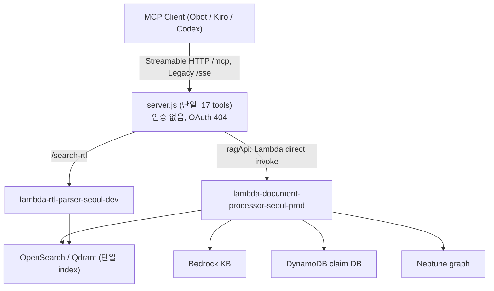
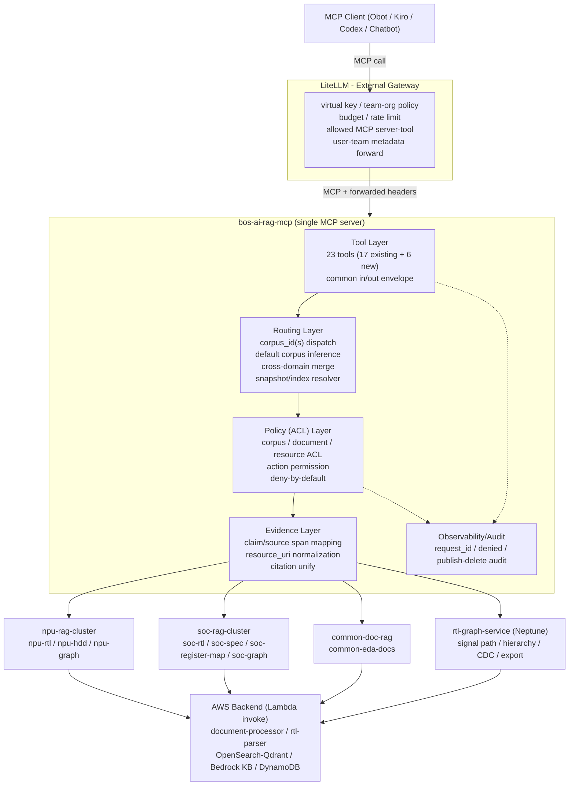
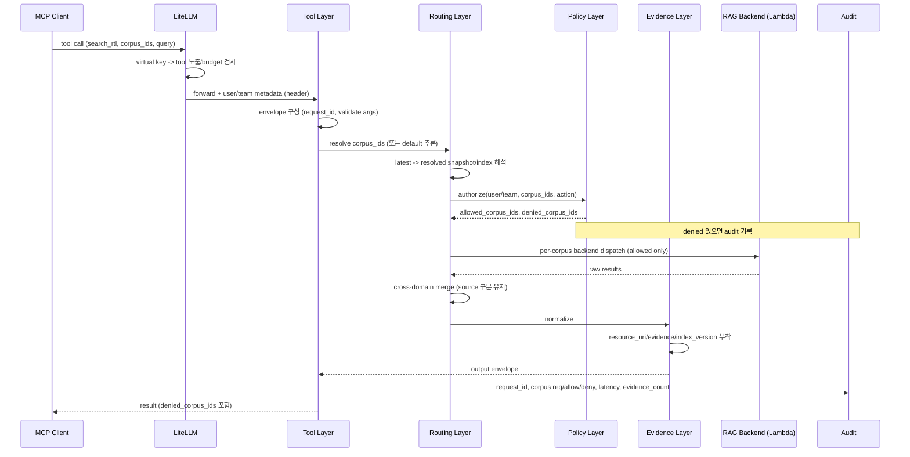
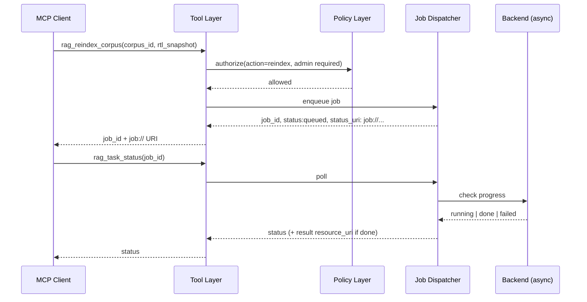
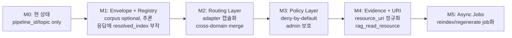
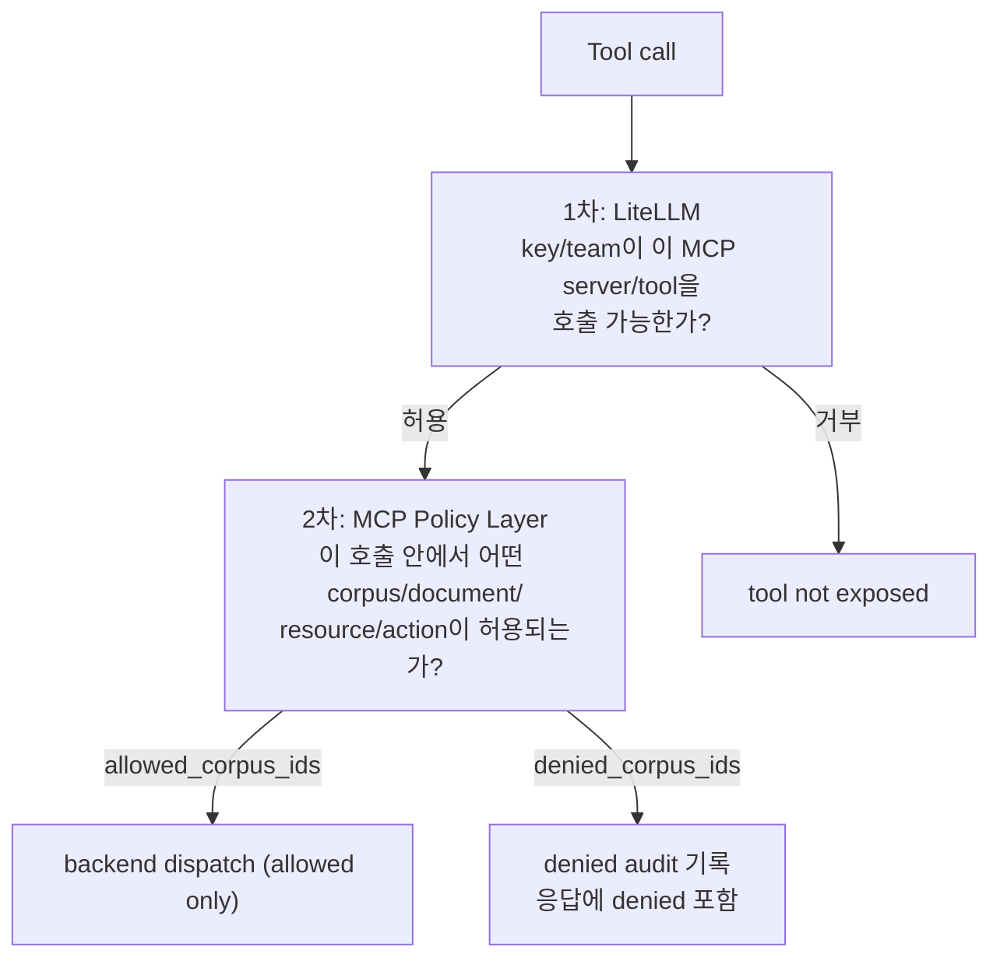
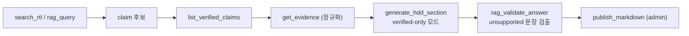

# Design Document: MCP Corpus Routing & ACL

> **Created:** 2026-07-29
> **Updated:** 2026-06-16
> **Purpose:** 단일 BOS-AI RAG MCP 브리지를 다중 RTL 도메인(NPU + SoC)으로 확장하기 위한 corpus 라우팅·2단계 인가·resource URI·재현성·evidence-first·비동기 작업·관측 아키텍처를 설계한다.
> **Spec / Project:** `.kiro/specs/mcp-corpus-routing-acl/`
> **Status:** Deferred — Multi-RAG 단계 보류. LiteLLM access group이 MCP 서버 단위이므로, 2번째 RAG(예: CPU/SoC) 도입 시 MCP 서버 분리와 함께 구현한다. corpus/ACL/cross-domain은 그 단계 산출물.
> **Owner:** Infra/DevOps + RAG MCP

## Overview

현재 BOS-AI RAG MCP 브리지(`mcp-bridge/server.js`)는 단일 Node.js Express 서버로, 17개 도구를 등록해 Seoul/Virginia AWS 백엔드(Lambda → OpenSearch/Qdrant 벡터, Neptune 그래프, Bedrock KB, DynamoDB claim DB)를 호출한다. 도구 인자는 `pipeline_id`/`topic`/`team`/`category` 필터만 가지며 "corpus(도메인)" 개념이 없고, MCP 계층 자체에는 인증이 전혀 없다(OAuth discovery는 의도적으로 404 처리). 이 구조는 NPU RTL 단일 도메인에는 동작하지만, SoC RTL/spec/register-map이 추가되면 도메인 구분·권한 격리·재현성·근거 추적이 불가능하다.

본 설계는 첨부 보고서(`docs/common/NPU_SOC_RTL_RAG_MCP_Improvement_Report.md`)의 결론을 따른다. **MCP 서버는 하나로 유지하고, 백엔드 RAG를 corpus/도메인 단위로 분리**한다. LiteLLM은 외부 Gateway(virtual key, team/budget, tool 노출)로 앞단에 두고, MCP 서버는 RAG Tool Gateway + Domain Router 역할을 맡으며 그 내부에 4개 논리 계층(Tool Layer / Routing Layer / Policy(ACL) Layer / Evidence Layer)을 도입한다.

설계 원칙은 **점진적·하위 호환**이다. 기존 도구 계약(인자/응답)을 깨지 않고 `corpus_id`/`corpus_ids`를 도입하며, 누락 시 `pipeline_id`/`topic`/`source`로부터 기본 corpus를 추론(default corpus inference)한다. 신규 보안 통제(corpus/document/resource ACL, deny-by-default, admin tool 보호)와 신규 운영 도구(`rag_index_status`, `rag_read_resource`, `rag_validate_answer`, `rag_task_status`, `rag_reindex_document`, `rag_reindex_corpus`), 비동기 job 프레임워크, 공통 입출력 envelope를 추가한다. 본 시스템은 폐쇄망 AWS 아키텍처(Seoul frontend + Virginia backend, Terraform 관리, 인터넷 게이트웨이 없음)에 맞춘다.

## Scope

**In scope (MCP 서버 아키텍처 개선):**
1. Corpus 모델 & 라우팅 — `corpus_id`/`corpus_ids` 표준화, 도메인 dispatch, cross-domain merge
2. 2단계 인가 — LiteLLM tool-level + MCP 내부 corpus/document/resource ACL (deny-by-default)
3. Resource URI 체계 — `rag://`, `rtl://`, `graph://`, `claim://`, `job://`, `index://` parser/validator
4. 재현성 — 모든 응답에 resolved `rtl_snapshot` + `index_version`, `latest` 해석·반환
5. Evidence-first — `get_evidence` 정규화, `generate_hdd_section` verified-only 모드, `rag_validate_answer`
6. 신규 운영 도구 6종
7. 비동기 job/task 프레임워크
8. Statelessness — 세션 corpus 저장 금지, 공통 입출력 envelope
9. 관측/감사 — `request_id`, user/team/key, corpus requested/allowed/denied, index_version, latency, denied-resource/publish/delete 감사

**Out of scope:** 별도 EDA RAG 콘텐츠/평가 이니셔티브, RAG 검색 품질(reranker) 알고리즘 자체, LiteLLM 내부 설정 상세(외부 의존으로만 다룸), 백엔드 클러스터의 물리적 인프라 신설(Terraform 작업은 후속 spec).

## Architecture

### Current State (As-Is)



문제점: corpus 개념 없음(pipeline_id/topic만), MCP 계층 무인증, 파괴적 admin 도구(`rag_delete_document`, `publish_markdown`, `regenerate_stale_hdd`) 무보호, 응답에 resource URI/index version 없음, `latest` 미해석.

### Target State (To-Be) — Component View



핵심: 서버는 단일, 내부는 4계층. corpus는 **백엔드 adapter 선택 키**이며 동시에 **ACL 단위**다. 기존 Lambda invoke 경로(`ragApi`)는 adapter 뒤로 캡슐화되어 유지된다.

### Layer Responsibilities

| Layer | 책임 | 현재 server.js 대비 변화 |
|---|---|---|
| Tool Layer | MCP 도구 등록, 공통 input/output envelope 적용, 인자 검증(zod) | 각 도구에 corpus 인자 추가, envelope 래핑. 도구별 핸들러 로직은 routing/evidence로 위임 |
| Routing Layer | `corpus_ids` → 백엔드 adapter dispatch, default corpus 추론, cross-domain 병합, `latest` snapshot/index 해석 | 신규. 현재 `ragApi` 직접 호출을 adapter 경유로 대체 |
| Policy (ACL) Layer | tool 호출 컨텍스트(user/team)에 대해 corpus/document/resource/action 인가, deny-by-default, admin 보호 | 신규. 현재 무인증 |
| Evidence Layer | 응답 정규화(resource_uri, evidence span, confidence, support_level), index_version/resolved snapshot 부착 | 신규. 현재 텍스트 직렬화만 |
| Observability/Audit | 구조화 로그, denied/publish/delete 감사 | 현재 `console.log`만 |

## Request Flow

### Standard Retrieval Flow (e.g. search_rtl)



핵심 보안 불변식: **denied corpus는 backend dispatch 이전에 제거**된다(검색 후 사후 필터 금지 — reranker/LLM 입력 단계 누출 방지).

### Async Job Flow (e.g. rag_reindex_corpus)



## Components and Interfaces

### Common Input Envelope

모든 도구가 공통 필드를 받는다. 하위 호환을 위해 corpus 필드는 optional이며 누락 시 추론된다.

```typescript
interface CommonInput {
  // corpus 지정 (둘 중 하나; 누락 시 default corpus inference)
  corpus_id?: CorpusId;
  corpus_ids?: CorpusId[];

  // 컨텍스트 (LiteLLM이 header/metadata로 전달 — 전달 방식은 Open Question OQ-2)
  request_id?: string;          // 없으면 서버가 생성
  user_context?: { user_id?: string; team_id?: string; key_id?: string };

  // 재현성/스코프
  project?: string;             // n1b0, n1-soc, trinity ...
  rtl_snapshot?: string;        // "latest" 허용, 응답에 resolved 값 반환

  options?: {
    top_k?: number;
    include_evidence?: boolean;
    include_resource_links?: boolean;
    include_graph_paths?: boolean;
  };
}
```

### Common Output Envelope

```typescript
interface CommonOutput<TResult> {
  request_id: string;
  resolved_scope: {
    corpus_ids: CorpusId[];
    rtl_snapshot: string;       // "latest"가 아닌 실제 해석된 값
  };
  resolved_index: {
    corpus_id: CorpusId;
    index_version: string;      // 예: idx_soc_20260615_001
    graph_version?: string;
  }[];
  results: TResult[];
  denied_corpus_ids: DeniedCorpus[];   // 권한 거부된 corpus (이유 포함)
  evidence?: Evidence[];
  warnings: string[];           // "확실하지 않음", stale, graph 단절 등
  execution_time_ms: number;
}

interface DeniedCorpus {
  corpus_id: CorpusId;
  reason: string;               // 예: "team npu-readonly has no soc-rtl access"
}
```

> 하위 호환: 기존 클라이언트는 `content[].text`(사람이 읽는 텍스트)를 계속 받는다. 신규 구조화 필드는 텍스트 본문에 요약으로 포함하고, 향후 structured content로 확장한다. 텍스트 직렬화 헬퍼는 envelope를 받아 현재와 동일한 형식의 문자열을 생성한다.

### Corpus Registry

```typescript
type CorpusId =
  | "npu-rtl" | "npu-hdd" | "npu-graph"
  | "soc-rtl" | "soc-spec" | "soc-register-map" | "soc-graph"
  | "common-eda-docs" | "released-hdd-only";

interface CorpusMetadata {
  corpus_id: CorpusId;
  domain: "npu" | "soc" | "common";
  data_type: "rtl" | "hdd" | "spec" | "register-map" | "graph" | "docs";
  security_level: "internal" | "restricted" | "released";
  index_version: string;
  graph_version?: string;
  embedding_model: string;
  last_indexed_at: string;       // ISO8601
  // 마이그레이션: 기존 백엔드 필터로의 매핑
  backend: {
    target: "document-processor" | "rtl-parser" | "neptune";
    pipeline_id?: string;        // 기존 pipeline_id (예: tt_20260221)
    topic_filter?: string;
    source_filter?: string;
    team?: string;
    category?: string;
  };
}

interface CorpusRegistry {
  list(): CorpusMetadata[];
  get(id: CorpusId): CorpusMetadata | undefined;
  resolveSnapshot(id: CorpusId, snapshot: string): string;   // "latest" -> 실제 버전
}
```

> Registry는 초기에는 서버 내 구성(JSON/코드 상수)으로 구현하고, 추후 `rag_categories` 확장 또는 별도 registry API로 이전한다.

### Routing Layer

```typescript
interface RoutingLayer {
  // corpus 누락 시 기존 필터로부터 기본 corpus 추론 (하위 호환 핵심)
  inferDefaultCorpus(args: LegacyArgs): CorpusId[];

  // corpus -> backend adapter dispatch + cross-domain merge
  dispatch(corpusIds: CorpusId[], op: BackendOp, input: unknown): Promise<MergedResult>;
}

interface LegacyArgs {
  pipeline_id?: string;   // tt_20260221 -> npu-rtl 등
  topic?: string;
  source?: string;
  team?: string;
  category?: string;
}

interface BackendAdapter {
  corpusId: CorpusId;
  search(input: SearchInput): Promise<RawResult[]>;
  readResource(uri: ResourceUri): Promise<ResourceContent>;
  // 기존 ragApi(Lambda invoke)를 감싼다
}
```

### Policy (ACL) Layer

```typescript
type Action = "read" | "search" | "trace" | "export" | "publish" | "delete" | "reindex" | "regenerate";

interface AuthRequest {
  user_context: { user_id?: string; team_id?: string; key_id?: string };
  tool: string;
  corpus_ids: CorpusId[];
  action: Action;
  resource_uri?: ResourceUri;   // resource 직접 접근 시
}

interface AuthDecision {
  allowed_corpus_ids: CorpusId[];
  denied_corpus_ids: DeniedCorpus[];
  action_allowed: boolean;       // admin action 등
}

interface PolicyLayer {
  authorize(req: AuthRequest): AuthDecision;   // deny-by-default
}

// 정책 저장: team/key -> corpus + action 매핑
interface PolicyRule {
  team_id: string;
  allowed_corpus_ids: CorpusId[];
  allowed_actions: Action[];
}
```

deny-by-default 원칙: 정책에 명시되지 않은 (team, corpus) 또는 (team, action) 조합은 거부. admin action(`publish`/`delete`/`reindex`/`regenerate`)은 admin 권한 team에만 허용.

### Evidence Layer

```typescript
interface Evidence {
  source_uri: ResourceUri;          // rtl:// rag:// claim:// 중 하나
  source_type: "rtl_span" | "doc_chunk" | "claim" | "hdd_section";
  support_level: "direct" | "indirect" | "weak";
  confidence: number;               // 0..1
  span?: { line_start: number; line_end: number };
  quote?: string;                   // 짧은 발췌 (verbatim 제한 준수)
}

interface EvidenceLayer {
  normalizeEvidence(raw: unknown, corpus: CorpusId): Evidence[];
  attachResourceUri(result: RawResult, corpus: CorpusId): RawResult & { resource_uri: ResourceUri };
}
```

### Resource URI Scheme

```typescript
type Scheme = "rag" | "rtl" | "graph" | "claim" | "job" | "index";

interface ResourceUri {
  scheme: Scheme;
  corpus_id: string;       // 또는 job/index의 네임스페이스
  path: string;
  fragment?: string;       // 예: section=8.2, L120-L180
  raw: string;
}

interface UriParser {
  parse(raw: string): ResourceUri;        // 형식 위반 시 throw
  validate(raw: string): boolean;
  build(parts: Omit<ResourceUri, "raw">): string;
}
```

예시:
```text
rag://npu-hdd/docs/N1B0_NPU_HDD_v0.1.md#section=8.2
rtl://npu-rtl/used_in_n1/rtl/trinity_noc2axi_router.sv#L120-L180
graph://npu-graph/path/signal/npu_irq/path_001
claim://npu-hdd/claim/claim_noc2axi_router_001
job://rag/reindex/job_soc_20260601_001
index://soc-rtl/idx_20260615_001
```

### New Operational Tools

| Tool | Action | 인자(핵심) | 응답(핵심) |
|---|---|---|---|
| `rag_index_status` | read | `corpus_ids?` | corpus별 index_version, last_indexed_at, embedding_model, freshness |
| `rag_read_resource` | read | `resource_uri` | URI 원문/스팬 (권한 재검증 후) |
| `rag_validate_answer` | read | `answer`, `corpus_ids`, `claim_ids?` | 문장별 evidence coverage, unsupported 문장 목록 |
| `rag_task_status` | read | `job_id` | queued/running/done/failed, 결과 resource_uri |
| `rag_reindex_document` | reindex(admin) | `corpus_id`, `document_id` | job_id + job:// |
| `rag_reindex_corpus` | reindex(admin) | `corpus_id`, `rtl_snapshot?` | job_id + job:// |

### Async Job Framework

```typescript
interface Job {
  job_id: string;
  status: "queued" | "running" | "done" | "failed";
  status_uri: string;          // job://...
  result_uri?: ResourceUri;
  error?: string;
  created_at: string;
}

interface JobDispatcher {
  enqueue(action: Action, payload: unknown): Job;
  status(job_id: string): Job;
}
```

> 폐쇄망 제약: 별도 큐 인프라 신설 전에는 백엔드 Lambda의 비동기 invoke + DynamoDB(또는 기존 claim DB의 별도 테이블) 상태 저장으로 시작한다. 인프라 선택은 후속 Terraform spec에서 확정(OQ 참조).

## Data Models

### Tool-to-Corpus / Action Mapping (마이그레이션 매핑)

| Tool | 기본 corpus 추론 소스 | 기본 action |
|---|---|---|
| `rag_query` | team/category -> common-eda-docs 등 | read |
| `search_rtl` | pipeline_id -> npu-rtl/soc-rtl | search |
| `search_archive` | source/topic -> corpus | search |
| `trace_signal_path`, `find_instantiation_tree`, `find_clock_crossings` | module_name 도메인 추정 -> *-graph | trace |
| `graph_export` | root_module 도메인 추정 -> *-graph | export |
| `get_evidence`, `list_verified_claims` | topic -> corpus | read |
| `generate_hdd_section` | topic/corpus_ids | read(+생성) |
| `publish_markdown` | topic/corpus | publish(admin) |
| `rag_delete_document` | s3_key team/category -> corpus | delete(admin) |
| `regenerate_stale_hdd` | 전체 또는 corpus | regenerate(admin) |

### Default Corpus Inference Rules

```pascal
ALGORITHM inferDefaultCorpus(args)
INPUT: args (legacy filters: pipeline_id, topic, source, team, category)
OUTPUT: corpus_ids (list)

BEGIN
  IF args.corpus_ids is present THEN RETURN args.corpus_ids
  IF args.corpus_id is present THEN RETURN [args.corpus_id]

  candidates <- []

  // pipeline_id -> domain (registry backend 매핑 역참조)
  IF args.pipeline_id is present THEN
    FOR each corpus IN registry.list() DO
      IF corpus.backend.pipeline_id = args.pipeline_id THEN
        candidates.add(corpus.corpus_id)
      END IF
    END FOR
  END IF

  // topic/source/team/category -> corpus
  IF candidates is empty THEN
    candidates <- matchByTopicSourceTeam(args)
  END IF

  // 여전히 비어있으면 도구별 기본 corpus (보수적: 가장 좁은 read 범위)
  IF candidates is empty THEN
    candidates <- toolDefaultCorpus(currentTool)
    warnings.add("corpus 미지정 - 기본 corpus 추론됨: " + candidates)
  END IF

  RETURN candidates
END
```

**전제 가정:** registry의 `backend.pipeline_id` 매핑이 기존 운영 pipeline_id(예: `tt_20260221`)와 1:1 또는 1:N으로 정의되어 있다고 가정한다(초기값은 현 NPU 데이터 -> `npu-rtl`).

## Snapshot & Index Resolution

```pascal
ALGORITHM resolveScope(corpus_ids, rtl_snapshot)
INPUT: corpus_ids, rtl_snapshot (may be "latest" or null)
OUTPUT: resolved_scope, resolved_index[]

BEGIN
  resolved_index <- []
  FOR each cid IN corpus_ids DO
    meta <- registry.get(cid)
    ASSERT meta != null   // 없으면 corpus_not_found error
    IF rtl_snapshot = "latest" OR rtl_snapshot is null THEN
      snap <- registry.resolveSnapshot(cid, "latest")
    ELSE
      snap <- rtl_snapshot
    END IF
    resolved_index.add({corpus_id: cid, index_version: meta.index_version, graph_version: meta.graph_version})
  END FOR
  resolved_scope <- {corpus_ids, rtl_snapshot: snap}
  RETURN (resolved_scope, resolved_index)
END
```

**불변식:** 응답의 `resolved_scope.rtl_snapshot`은 절대 `"latest"`가 아니다(재현성). corpus 간 snapshot이 다르면 `resolved_index[]`에 각각 기록하고, HDD↔RTL snapshot 불일치는 `warnings`에 stale로 표시한다.

## Migration & Compatibility

점진적 전환을 위한 단계. 각 단계는 기존 도구 계약을 깨지 않는다.



호환 규칙:
- **하위 호환 인자:** corpus 필드는 모두 optional. 기존 호출(`{query, pipeline_id}`)은 그대로 동작하며 corpus는 추론된다.
- **응답 호환:** 기존 텍스트 형식 유지. 신규 필드는 텍스트에 요약 추가 + 향후 structured content.
- **점진적 ACL:** M3 도입 전에는 ACL이 "log-only(audit)" 모드로 동작(거부하지 않고 기록만)한 뒤, 정책 안정화 후 enforce로 전환. 단, admin 도구(`delete`/`publish`/`regenerate`)는 M3에서 즉시 enforce.
- **code drift 정리(부수 정비):** `server.mjs`는 QuickSight 도구(`quick_dashboard_list`/`quick_dashboard_data`)를 포함한 stale 변형이다. `package.json`이 가리키는 활성 파일은 `server.js`이므로, single source of truth로 `server.mjs`를 제거하거나 `server.js`로 일원화한다(마이너 정비 항목; QuickSight 도구 필요 여부는 requirements에서 확인).

## Two-Tier Authorization Model



보안 통제 요약:
- **deny-by-default:** 미정의 권한은 거부.
- **admin 도구 보호:** `rag_delete_document`, `publish_markdown`, `regenerate_stale_hdd`, `rag_reindex_*`는 admin action 권한 필요. 현재 무보호 상태를 닫는 것이 P0.
- **resource ACL:** `rag_read_resource`로 URI 직접 접근 시에도 corpus/document 권한 재검증.
- **누출 방지:** denied corpus는 검색 입력 단계에서 제외(사후 필터 금지).
- **OAuth 404 유지:** MCP 계층 인증은 LiteLLM이 전담하므로 현 OAuth discovery 404 동작은 유지하되, user/team metadata 전달 경로(헤더)를 확보한다(OQ-2).

## Evidence-First HDD Workflow



정책:
- `generate_hdd_section`은 `allow_unverified_inference=false`일 때 evidence 없는 문장 생성 금지, 근거 부족 부분은 "확실하지 않음/추가 확인 필요"로 표시.
- `publish_markdown` **이전에** `rag_validate_answer`로 coverage 검증을 강제(워크플로 권장; enforce 여부는 requirements에서 결정).
- source URI 없는 문장 publish 금지, `latest` 미해석 응답 publish 금지.

## Observability & Audit

구조화 로그(요청당 1건):
```typescript
interface AuditRecord {
  request_id: string;
  ts: string;
  user_id?: string; team_id?: string; key_id?: string;
  tool: string;
  action: Action;
  corpus_requested: CorpusId[];
  corpus_allowed: CorpusId[];
  corpus_denied: CorpusId[];
  index_version: string[];
  query?: string;             // 품질 분석용 (민감정보 정책 준수)
  retrieval_latency_ms?: number;
  evidence_count?: number;
  denied_resources?: string[];
  mutation?: { kind: "publish" | "delete" | "reindex" | "regenerate"; target: string };
}
```

폐쇄망 환경에서는 CloudWatch Logs로 송출(기존 `console.log`를 구조화 JSON 로그로 대체). 메트릭: tool call count, latency p50/p95/p99, evidence coverage ratio, cross-domain query ratio, denied corpus access count, index freshness.

## Correctness Properties

설계가 만족해야 할 보편 속성(요구사항/PBT 도출용):

### Property 1: Statelessness
임의의 도구 호출 순서에서, 동일 입력(corpus_ids 포함)은 서버 세션 상태와 무관하게 동일 corpus 범위로 라우팅된다. 세션에 selected corpus가 저장되지 않는다.

**Validates: Requirements 8.1** (Statelessness — design-first, requirements 도출 시 확정)

### Property 2: Deny-by-default
정책에 명시되지 않은 (team, corpus) 또는 (team, action)은 항상 거부되며 결과에 노출되지 않는다.

**Validates: Requirements 2.1** (Two-tier authorization — design-first, requirements 도출 시 확정)

### Property 3: No-leak
denied corpus의 결과/evidence/resource_uri는 응답 어디에도 포함되지 않는다(검색 입력 단계 제외 보장).

**Validates: Requirements 2.2** (Two-tier authorization — design-first, requirements 도출 시 확정)

### Property 4: Snapshot resolution
모든 응답의 `resolved_scope.rtl_snapshot`은 `"latest"`가 아니며 구체 버전이다. `resolved_index[]`는 요청된 모든 allowed corpus를 포함한다.

**Validates: Requirements 4.1** (Reproducibility — design-first, requirements 도출 시 확정)

### Property 5: Backward compatibility
corpus 필드 없는 legacy 호출은 항상 유효한 corpus_ids로 추론되며 오류 없이 처리된다(추론 실패 시 보수적 기본값 + warning).

**Validates: Requirements 1.1** (Corpus model & routing / migration — design-first, requirements 도출 시 확정)

### Property 6: URI round-trip
임의의 유효한 resource_uri는 `parse`->`build` 후 의미적으로 동일하다. 잘못된 URI는 `validate=false`.

**Validates: Requirements 3.1** (Resource URI scheme — design-first, requirements 도출 시 확정)

### Property 7: Admin protection
admin action 도구는 admin 권한 없는 컨텍스트에서 항상 거부된다.

**Validates: Requirements 2.3** (Two-tier authorization / admin tool 보호 — design-first, requirements 도출 시 확정)

### Property 8: Evidence integrity
verified-only 모드에서 생성된 HDD의 모든 문장은 하나 이상의 evidence(source_uri)로 뒷받침되거나 "확실하지 않음"으로 표시된다.

**Validates: Requirements 5.1** (Evidence-first — design-first, requirements 도출 시 확정)

### Property 9: Audit completeness
모든 도구 호출은 corpus requested/allowed/denied와 request_id를 가진 audit record를 생성한다. 모든 mutation(publish/delete/reindex/regenerate)은 mutation 필드를 기록한다.

**Validates: Requirements 9.1** (Observability/audit — design-first, requirements 도출 시 확정)

## Error Handling

| 시나리오 | 조건 | 응답 | 복구 |
|---|---|---|---|
| corpus not found | 미등록 corpus_id | `error: corpus_not_found` + 유효 corpus 목록 | 클라이언트가 corpus 수정 |
| corpus denied | 정책상 미허용 | `denied_corpus_ids`에 사유 포함, allowed만 처리 | 권한 요청/축소 |
| action denied (admin) | 비admin admin 도구 호출 | `error: action_not_permitted` + audit | admin key 사용 |
| invalid resource_uri | 형식 위반 | `error: invalid_uri` | URI 수정 |
| index stale | HDD↔RTL snapshot 불일치 | 결과 + `warnings: stale` | reindex 제안 |
| backend invoke 실패 | Lambda 오류/timeout | `error` + 부분 결과(가능 시) | 재시도/job화 |
| long op timeout | 동기 호출이 긴 작업 | job_id 반환으로 전환 | `rag_task_status` polling |

## Open Design Questions (requirements에서 해소)

보고서가 "확실하지 않음"으로 표기했거나 본 설계가 가정에 의존하는 항목. requirements 단계에서 실환경 확인이 필요하다.

- **OQ-1 (LiteLLM MCP Gateway 기능 범위):** 현 사내 LiteLLM 배포가 MCP server/tool 노출 제어와 transport를 어디까지 지원하는지. tool-level 권한을 LiteLLM이 전담 가능한지.
- **OQ-2 (user/team metadata 전달):** LiteLLM이 MCP 서버로 user/team/key를 어떤 헤더/메타데이터로 전달하는지. 전달 불가 시 MCP 내부 ACL의 식별 주체 대안.
- **OQ-3 (corpus-level ACL 지원):** 현 OpenSearch/Qdrant index가 corpus 단위 필터/ACL을 지원하는지, 아니면 index 분리가 선행되어야 하는지.
- **OQ-4 (Neptune cross-domain edge):** Neptune 그래프가 NPU↔SoC cross-domain edge를 표현 가능한지. 불가 시 cross-domain signal trace의 대안(애플리케이션 레벨 병합).
- **OQ-5 (SoC vs NPU 보안 등급):** SoC RTL과 NPU RTL의 보안 등급 차이 -> corpus security_level 및 ACL 정책 정의.
- **OQ-6 (MCP SDK RC 지원):** 현 `@modelcontextprotocol/sdk` 버전이 2026-07-28 RC(stateless core, Tasks)를 어디까지 지원하는지 -> async job 구현 방식 선택.
- **OQ-7 (async job 인프라):** 폐쇄망에서 job 상태 저장소(DynamoDB vs 기존 claim DB 테이블 vs 신규 큐) 선택.
- **OQ-8 (server.mjs/QuickSight):** QuickSight 도구가 향후 필요한지 -> drift 정리 시 제거 vs 이관 결정.
- **OQ-9 (ACL enforce 전환 시점):** log-only -> enforce 전환 기준과 admin 도구 즉시 enforce 범위 확정.

## Testing Strategy

### Unit Testing Approach
- **UriParser:** `parse`/`validate`/`build`의 정상·이상 케이스(6개 scheme, fragment 유무, 잘못된 형식). Property 6(round-trip) 검증.
- **CorpusRegistry:** `resolveSnapshot("latest")`가 항상 구체 버전 반환, 미등록 corpus 조회 시 undefined.
- **inferDefaultCorpus:** corpus 명시/미명시, pipeline_id 매핑, topic/source fallback, 보수적 기본값 + warning 경로.
- **PolicyLayer.authorize:** deny-by-default, admin action 거부, allowed/denied 분리. Property 2·7 검증.

### Property-Based Testing Approach
대상 속성: Property 1(stateless), 2(deny-by-default), 3(no-leak), 4(snapshot resolution), 5(backward compat), 6(uri round-trip), 7(admin protection), 9(audit completeness). 임의의 (team, corpus_ids, action, 호출 순서) 입력을 생성해 불변식 위반 여부를 검사한다. 특히 No-leak은 임의 정책/요청 조합에서 denied corpus가 출력 envelope·evidence·resource_uri 어디에도 등장하지 않음을 검증한다.

**Property Test Library:** fast-check (Node.js/JS 환경에 적합). 기존 인프라 PBT는 Go/gopter이나 MCP 브리지 코드는 Node.js이므로 도구 계층 속성은 fast-check로 검증한다.

### Integration Testing Approach
- corpus_id 라우팅 → 실제 백엔드 Lambda invoke가 올바른 함수/필터로 전달되는지(adapter 매핑).
- cross-domain 호출(`["npu-rtl","soc-rtl"]`) 결과 merge 시 source 구분 유지.
- admin 도구(`rag_delete_document` 등)가 비admin 컨텍스트에서 차단되는지 end-to-end.
- `latest` → resolved snapshot이 응답에 반영되는지.
- 하위 호환: corpus 필드 없는 기존 호출이 오류 없이 동작하는지.

## Dependencies

- 기존: Node.js, Express, `@modelcontextprotocol/sdk`, `zod`, `@aws-sdk/client-lambda`
- 백엔드(불변): `lambda-document-processor-seoul-prod`, `lambda-rtl-parser-seoul-dev`, OpenSearch Serverless/Qdrant, Neptune, Bedrock KB, DynamoDB claim DB
- 외부(통제): LiteLLM (virtual key/tool 노출/metadata 전달)
- 신규(잠재): job 상태 저장소(OQ-7), corpus registry 저장소(초기 코드 상수)
- 인프라: Terraform 관리, Seoul frontend + Virginia backend, 폐쇄망(인터넷 게이트웨이 없음)
