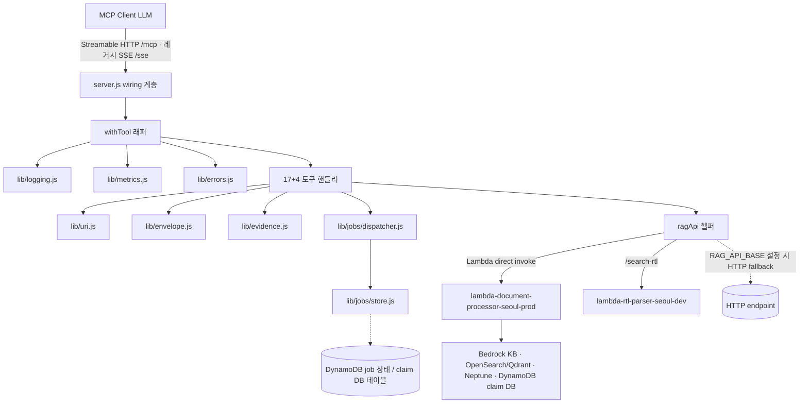
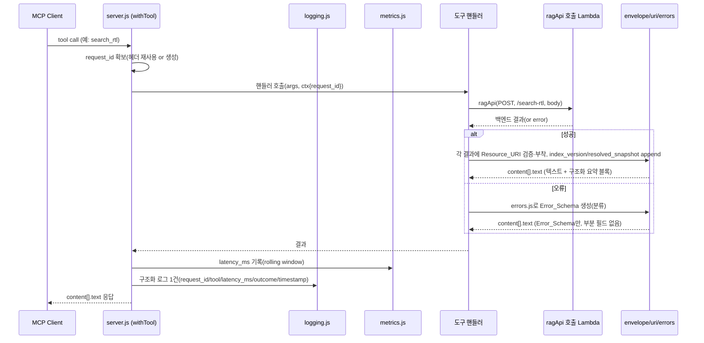
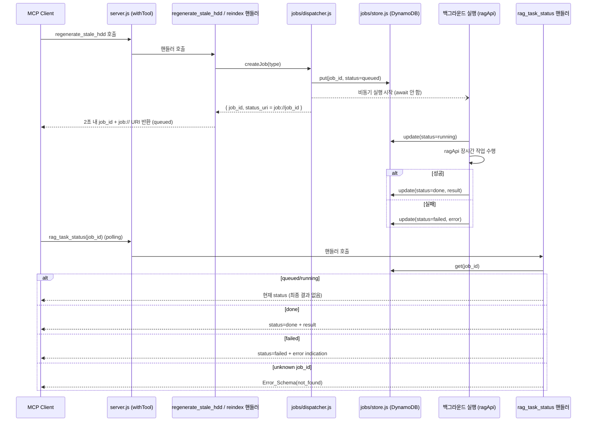

# Design Document

> **Title:** MCP Tool-Layer Optimization — Design
> **Created:** 2026-06-16
> **Updated:** 2026-06-16
> **Purpose:** 단일 BOS-AI RAG MCP 브리지(`mcp-bridge/server.js`)의 도구 계층을 가산적(additive)으로 진화시키는 설계 — 도구 선택 명확성, 출력 품질(Resource_URI·index_version·resolved_snapshot·일관 에러), evidence-first, 신규 운영 도구, 비동기 job, 관측성, server.js/server.mjs drift 정리. corpus/도메인 분리와 무관하다.
> **Spec / Project:** `.kiro/specs/mcp-tool-optimization/`
> **Status:** Draft
> **Owner:** Infra/DevOps + RAG MCP

## Overview

본 설계는 운영 중인 단일 Node.js MCP 브리지(`mcp-bridge/server.js`)의 **도구 계층 품질**을 개선한다. 핵심 제약은 **기존 17개 도구 계약을 깨지 않는 가산적 진화**다. 모든 응답은 지금처럼 `content[].text` 안에 사람이 읽는 텍스트로 반환되며, 신규 정보(Resource_URI, `index_version`, `resolved_snapshot`, 일관 에러 스키마)는 그 텍스트 끝에 **구조화 요약 블록**으로 덧붙는다. 기존 클라이언트는 앞부분 텍스트를 그대로 읽고, 새 클라이언트는 끝의 구조화 블록을 파싱한다.

### 설계 원칙

1. **가산성(Additive only)** — 기존 도구 이름·입력 시그니처·텍스트 출력 형식을 보존한다. 신규 파라미터는 모두 optional, 신규 필드는 모두 텍스트 말미에 덧붙는다(Req 1.7, 2.10, 2.11, 7.6, 8.8).
2. **단일 진실 원천(Single source of truth)** — `server.js`만이 활성 entrypoint다. 로직은 작은 내부 라이브러리 모듈(`mcp-bridge/lib/`)로 추출하고 `server.js`는 얇은 wiring 계층으로 남긴다. 1500줄 가까운 단일 파일에 17개 핸들러가 인라인된 현 구조에서, 도구 핸들러는 유지하되 횡단 관심사(URI·envelope·error·logging·metrics·job)를 모듈화하여 테스트 가능하게 만든다.
3. **식별자일 뿐 접근제어 아님(Identifier-only)** — Resource_URI 스킴은 출력/재조회 식별자 규약이다. 스킴이나 식별자에서 corpus·접근권한을 유도하지 않는다(Req 8.7).
4. **식별자-free 관측성** — 구조화 로깅·메트릭은 사용자/팀 식별자 전파 없이 가능한 데이터로만 구성하고, corpus allowed/denied 감사 필드를 포함하지 않는다(Req 6.8, 6.9).

### 스코프 가드레일 (명시적 제외)

본 설계는 corpus 분리와 **독립적**이며, 다음을 도입하지 **않는다**(보류된 `mcp-corpus-routing-acl` spec 소관): `corpus_id`/corpus 라우팅, corpus 레지스트리, 2단계/corpus/document ACL, deny-by-default 인가, cross-domain merge, MCP 서버 분리. Resource_URI는 출력 식별자 규약일 뿐 접근제어를 함의하지 않는다. 관측성은 식별자 전파를 요구하지 않으며 corpus 감사 필드를 제외한다.

### 기존 17개 도구 (보존 대상)

`rag_query`, `rag_list_documents`, `rag_categories`, `rag_upload_status`, `rag_extract_status`, `rag_delete_document`, `search_rtl`, `search_archive`, `get_evidence`, `list_verified_claims`, `generate_hdd_section`, `publish_markdown`, `trace_signal_path`, `find_instantiation_tree`, `find_clock_crossings`, `graph_export`, `regenerate_stale_hdd`.

### 신규 도구 (가산)

`rag_validate_answer`, `rag_index_status`, `rag_read_resource`, `rag_task_status` (4개).

### 기존 코드 매핑 (검토 결과)

- `server.js`: CommonJS, Express + `@modelcontextprotocol/sdk`(`McpServer`, `StreamableHTTPServerTransport` + 레거시 `SSEServerTransport`) + `zod`. `ragApi()`가 `lambda-document-processor-seoul-prod`(및 `/search-rtl` → `lambda-rtl-parser-seoul-dev`)를 직접 invoke하고, `RAG_API_BASE` 설정 시 HTTP fallback. 도구마다 `console.log` + 텍스트 말미 `execution_time_ms`. OAuth discovery 라우트는 의도적 404. **이 파일이 `package.json`의 `start`가 가리키는 활성 파일이다.**
- `server.mjs`: stale drift 변형. `@modelcontextprotocol/sdk/dist/cjs/...` 경로를 쓰고 QuickSight 도구(`quick_dashboard_list`, `quick_dashboard_data`)를 포함하나 `server.js`에는 없다. `package.json`의 `dependencies`에 `@aws-sdk/client-quicksight`가 남아 있다(QuickSight 흔적).

## Architecture

### 진화 전략: 인라인 핸들러 → wiring + lib 모듈

현재 `createMcpServer()`가 17개 핸들러를 인라인으로 등록한다. 설계는 이 구조를 유지하되, 각 핸들러가 공유하는 횡단 관심사를 `mcp-bridge/lib/` 아래 순수 모듈로 추출한다. 각 핸들러는 "입력 검증 → `ragApi` 호출 → 결과를 envelope로 감싸 텍스트 반환"의 동일 골격을 갖게 되며, 골격 자체를 `withTool()` 래퍼가 제공한다(로깅·메트릭·에러 정규화·request_id 일원화).

```
mcp-bridge/
├── server.js                  # 얇은 wiring: Express, 전송계층, createMcpServer(), 도구 등록
├── lib/
│   ├── uri.js                 # Resource_URI parse/build/validate (6 schemes, round-trip)
│   ├── envelope.js            # 텍스트 말미 구조화 요약 블록 append (index_version/resolved_snapshot/resource_uri)
│   ├── errors.js              # Error_Schema 생성·분류 (invalid_uri/not_found/upstream_error)
│   ├── evidence.js            # get_evidence 정규화, 문장 분할, coverage 판정
│   ├── logging.js             # 구조화 JSON 로깅 → CloudWatch (request_id/tool/latency_ms/outcome/timestamp)
│   ├── metrics.js             # rolling 5분 윈도우 latency 수집, p50/p95/p99
│   ├── tool-descriptions.js   # 도구 설명·disambiguation 문구 상수 (Req 1)
│   └── jobs/
│       ├── dispatcher.js      # Job_Dispatcher: job 생성·실행·상태 전이
│       └── store.js           # Job 상태 저장소 어댑터 (DynamoDB / claim DB 테이블)
├── tests/                     # node:test + fast-check 단위/속성 테스트
└── package.json               # start → server.js (단일 entrypoint)
```

`server.mjs`는 제거(또는 고유 정의 이관 후 제거)하여 단일 entrypoint를 확정한다(Req 7).

### 컴포넌트 다이어그램



### 동기 요청 흐름 (Sequence)



### 비동기 Job 흐름 (Sequence)



## Components and Interfaces

### lib/uri.js — Resource_URI parser/validator/builder (Req 8, 2.1, 2.2)

6개 스킴의 닫힌 집합(`rag://`, `rtl://`, `graph://`, `claim://`, `job://`, `index://`)만 인정한다. **식별자 규약일 뿐 접근제어를 함의하지 않는다**(Req 8.7).

```
SCHEMES = ["rag", "rtl", "graph", "claim", "job", "index"]   // 닫힌 집합 (Req 8.1)

parseUri(uri) -> { scheme, id } | throw InvalidUriError
  - "<scheme>://<id>" 형태만 허용
  - scheme이 SCHEMES에 없으면 invalid_uri (Req 8.5)
  - id가 비었거나 공백 포함이면 invalid_uri (Req 8.2, 8.6)

buildUri(scheme, id) -> string
  - scheme 검증 + id 검증 후 "<scheme>://<id>" 생성
  - 잘못된 입력이면 invalid_uri

isWellFormed(uri) -> boolean
  - 닫힌 6개 스킴 + 비어있지 않고 공백 없는 id (Req 8.2)

// 라운드트립 보장(Req 8.4): buildUri(parseUri(u)) === u  (well-formed u에 대해)
```

응답에 Resource_URI를 넣기 직전 항상 `isWellFormed`로 검증한다(Req 8.3). addressable 자원이 아니면 필드를 **생략**한다(빈/null/placeholder 금지, Req 2.2).

### lib/envelope.js — 출력 envelope (Req 2.3~2.6, 2.10, 2.11)

기존 사람이 읽는 텍스트를 그대로 둔 채, **텍스트 말미**에 기계 파싱 가능한 구조화 요약 블록을 덧붙인다. 기존 `execution_time_ms:` 라인과 동일한 "텍스트 끝 부가정보" 패턴의 확장이다.

```
appendEnvelope(text, meta) -> text + "\n\n--- structured ---\n" + JSON.stringify({
  index_version,           // 비어있지 않은 인덱스 상태 식별자 (Req 2.3)
  resolved_snapshot,       // 항상 구체 버전, 절대 "latest" 아님 (Req 2.4~2.6)
  resource_uris: [...],    // addressable 결과별 well-formed URI (생략 가능, Req 2.1/2.2)
  request_id
})
```

`resolved_snapshot` 규칙:
- 요청이 `latest`이거나 미지정 → 백엔드가 해석한 구체 스냅샷을 응답에 포함(Req 2.4).
- 요청이 구체 스냅샷 → 그 값을 그대로 echo(Req 2.5).
- 어느 경우든 `resolved_snapshot`은 리터럴 `"latest"`가 될 수 없다(Req 2.6) — envelope 빌더가 불변식으로 강제하고, 위반 시 `upstream_error`로 처리.

**백엔드 의존 / fallback (Open Question 연계):** `index_version`/`resolved_snapshot`의 실제 값은 Lambda 응답에서 와야 한다. 현 `ragApi` 응답 형태 검토 결과:
- 오늘 존재하는 필드: 도구별 결과 필드(`results`, `citations`, `evidence`, `claims` 등). `search_archive` 결과 항목에는 `uri`가 이미 존재한다(Resource_URI 부착에 부분 활용 가능).
- 오늘 **존재하지 않는** 필드: 명시적 `index_version`, `resolved_snapshot`. 백엔드 Lambda 지원이 필요하다(Open Questions 참조).
- **Graceful fallback:** 백엔드가 해당 필드를 아직 제공하지 않으면, envelope는 `index_version: "unknown"`으로 채우고 `resolved_snapshot`은 브리지가 관측 가능한 최선의 구체 식별자(예: 백엔드가 echo한 명시 스냅샷)로 채우되 **절대 `"latest"`를 쓰지 않는다.** 명시 스냅샷이 없고 백엔드도 해석값을 주지 않는 경우의 정확한 채움 규칙은 백엔드 지원 여부에 달려 있으므로 **단정하지 않고 Open Question으로 표시**한다.

### lib/errors.js — Error_Schema (Req 2.7~2.9, 4.4, 4.5, 4.7, 4.8, 8.5, 8.6)

```
ERROR_CODES = { INVALID_URI: "invalid_uri", NOT_FOUND: "not_found", UPSTREAM_ERROR: "upstream_error" }

makeError(code, message) -> { error_code, message }   // 정확히 1개 코드 + 비어있지 않은 메시지 (Req 2.7)
classify(err) -> code
  - URI 파싱/스킴/식별자 위반 → invalid_uri (Req 8.5, 8.6, 4.4)
  - 자원/job/claim 부재 → not_found (Req 4.5, 4.7)
  - 그 외 일체 → upstream_error (Req 2.8, 4.8)

renderError(errObj) -> content[].text   // Error_Schema만, 부분 Resource_URI/index_version/resolved_snapshot 미부착 (Req 2.9)
```

에러 시 핸들러는 envelope 부가필드를 붙이지 않고 Error_Schema만 텍스트로 반환한다(Req 2.9). 기존 `isError: true` 플래그와 텍스트 형식을 유지한다(Req 2.10).

### withTool() 래퍼 — 횡단 관심사 일원화 (Req 6)

각 도구 핸들러를 감싸 request_id 확보, 시작/종료 시각 측정, 메트릭 적재, 구조화 로그 1건 방출, 미처리 예외의 Error_Schema 변환을 담당한다. 이로써 핸들러 내부의 `console.log`와 산재된 `Date.now()` 측정을 제거한다(Req 6.7).

```
withTool(toolName, handler) -> async (args, extra) => {
  const request_id = incomingRequestId(extra) || logging.newRequestId();  // Req 6.3, 6.4
  const start = process.hrtime.bigint();
  try {
    const result = await handler(args, { request_id });
    const latency_ms = elapsedMs(start);
    metrics.record(toolName, latency_ms);                 // Req 6.6
    logging.emit({ request_id, tool: toolName, latency_ms, outcome: "success", timestamp: isoUtc() });  // Req 6.1, 6.2
    return result;
  } catch (err) {
    const latency_ms = elapsedMs(start);
    metrics.record(toolName, latency_ms);
    logging.emit({ request_id, tool: toolName, latency_ms, outcome: "failure", error_category: errors.classify(err), timestamp: isoUtc() });  // Req 6.1, 6.2, 6.5
    return errors.renderError(errors.makeError(errors.classify(err), err.message));
  }
}
```

### lib/logging.js — 구조화 로깅 (Req 6.1~6.5, 6.7~6.9)

CloudWatch Logs로 도구 호출당 정확히 1건의 JSON 레코드를 방출한다. 필드: `request_id`, `tool`, `latency_ms`, `outcome ∈ {success, failure}`, `timestamp`(UTC ISO 8601), 실패 시 `error_category`. request_id는 들어온 것을 재사용하고 없으면 프로세스 수명 내 유일한 값을 생성한다(`crypto.randomUUID()`). **사용자/팀 식별자 및 corpus allowed/denied 필드를 포함하지 않는다**(Req 6.8, 6.9).

### lib/metrics.js — latency 백분위 (Req 6.6)

rolling 5분 윈도우에 도구 호출 latency(ms)를 적재하고, 요청 시 p50/p95/p99(ms)를 계산한다. 윈도우 밖 샘플은 만료한다. (메모리 내 타임스탬프 큐; 식별자 불필요.)

### lib/tool-descriptions.js — 도구 설명·disambiguation (Req 1)

도구별 설명 상수를 한 곳에 모아 일관성과 상호 배타성을 보장한다. 각 설명은 (a) 목적, (b) 각 입력 의미, (c) 최소 1개 구체 예시, (d) 겹치는 입력에 대한 "이 도구를 쓸 때 / 다른 도구를 쓸 때" 명시(정확한 등록명 인용)를 포함한다(Req 1.1~1.5, 1.8). zod 스키마는 모든 파라미터에 타입·설명·required/optional을 명시한다(Req 1.3, 1.4).

#### Tool-selection guidance 표 (Req 1.6)

질문 유형마다 정확히 하나의 권장 도구를 매핑한다.

| 질문 유형 / 입력 | 권장 도구 | 쓰지 말아야 할 도구와 이유 |
|---|---|---|
| RTL/SoC 설계 데이터: 모듈명·포트·신호·인스턴스·레지스터맵·계층구조 | `search_rtl` | `rag_query`(RTL 미색인 → "근거 없음"), `search_archive`(아카이브 전용) |
| 업로드된 스펙 PDF·설계 문서·주간 보고서 자연어 질의 | `rag_query` | `search_rtl`(RTL 전용), `search_archive`(KB 아카이브 메타필터 전용) |
| Archive 문서 topic/source 메타데이터 필터 검색 | `search_archive` | `rag_query`(아카이브 필터 미지원), `search_rtl`(RTL 전용) |
| 특정 claim의 근거 조회 | `get_evidence` | `search_*`(검색이지 근거 조회 아님) |
| topic의 검증된 claim 목록 | `list_verified_claims` | `search_archive`(검증 상태 필터 아님) |
| 답변 텍스트의 문장별 근거 검증 | `rag_validate_answer` (신규) | `get_evidence`(claim 단위이지 답변 문장 단위 아님) |
| Resource_URI로 원문/스팬 재조회 | `rag_read_resource` (신규) | `search_*`(검색이지 URI 직접 조회 아님) |
| 인덱스 version/freshness/embedding model | `rag_index_status` (신규) | `rag_upload_status`(문서 KB sync 상태이지 인덱스 상태 아님) |
| 비동기 job 진행 상태 polling | `rag_task_status` (신규) | — |
| 신호 전파 경로 | `trace_signal_path` | `graph_export`(부분그래프 추출이지 경로 추적 아님) |
| 인스턴스화 트리 | `find_instantiation_tree` | `graph_export` |
| 클럭 도메인 크로싱 | `find_clock_crossings` | `search_rtl` |
| 그래프 부분집합 JSON 추출 | `graph_export` | `trace_signal_path`/`find_instantiation_tree`(특정 질의 전용) |
| 검증 claim 기반 HDD 섹션 생성 | `generate_hdd_section` | `rag_query`(생성이지 질의 아님) |
| 검증 콘텐츠 출판 | `publish_markdown` | — |
| 문서 목록/카테고리/업로드 상태/추출 상태/삭제 | `rag_list_documents` / `rag_categories` / `rag_upload_status` / `rag_extract_status` / `rag_delete_document` | 상호 배타 — 표의 행 그대로 |
| stale HDD 일괄 재생성(장시간) | `regenerate_stale_hdd` → job 반환 후 `rag_task_status` | 동기 결과를 기대하지 말 것 |

### Evidence-first 컴포넌트 (Req 3)

#### get_evidence 정규화 매핑 (Req 3.1, 3.2)

`lib/evidence.js`가 백엔드 evidence 항목을 정규 스키마로 매핑한다. 현 백엔드 필드(`source_document_id`, `source_type`, `source_chunk`, `page_number`, `source_path`, `line_start`, `line_end`)를 다음으로 매핑:

| 정규 필드 | 출처/규칙 |
|---|---|
| `source_uri` | `source_path`/`source_document_id`로 well-formed Resource_URI(`rag://` 또는 `rtl://`) 구성, 검증 후 부착 |
| `source_type` | `source_type` (비어있지 않게 보정) |
| `support_level` | 백엔드 신호 매핑(예: 직접 인용=strong). 없으면 보수적 기본값 |
| `confidence` | 0..1 범위로 정규화(클램프) |
| `span` | `{ line_start, line_end }` |

evidence가 없으면 빈 리스트를 반환하고 Error_Schema를 반환하지 않는다(Req 3.2).

#### rag_validate_answer (신규, Req 3.3~3.6)

```
입력: { answer: string }  (zod, required)
처리:
  1) answer가 빈 문자열/공백뿐이면 Error_Schema 반환 (Req 3.6)
  2) 문장 분할(sentence segmentation)
  3) 각 문장에 대해 evidence 연결 수 계산 → 0이면 unsupported (Req 3.4)
  4) per-sentence supported/unsupported 라벨 + unsupported 문장의 text/position 목록 반환 (Req 3.3, 3.5)
출력: content[].text (구조화 요약 블록에 sentences[], unsupported[] 포함)
```

#### generate_hdd_section verified-only 모드 (Req 3.7)

신규 optional 파라미터 `allow_unverified_inference: boolean`(기본 동작은 기존 보존). `false`일 때, 지원 evidence가 0인 생성 세그먼트를 `content[].text` 내에 마커 **"확실하지 않음"** 으로 표기한다. 기존 파라미터·출력은 유지(가산).

#### publish_markdown 가드 (Req 3.8, 3.9)

발행 전 콘텐츠를 검사한다:
- 미지원 문장이 1개 이상이면 발행 거부 + Error_Schema, 어떤 부분도 저장하지 않음(Req 3.8).
- 미해석 `latest` 참조가 있으면 발행 거부 + Error_Schema, 어떤 부분도 저장하지 않음(Req 3.9).
검사는 `ragApi`로 백엔드 저장을 호출하기 **전에** 수행하여 부분 저장을 원천 차단한다.

### 신규 운영 도구 (Req 4)

- **rag_index_status** — 입력 없음. 인덱스별 `{ index_version, last_updated_at(ISO 8601 UTC), embedding_model }` 리스트 반환(Req 4.1). 인덱스 없으면 빈 리스트(Error 아님)(Req 4.2).
- **rag_read_resource** — 입력 `{ resource_uri: string }`(required). well-formed + 존재 → 원문/스팬 반환(Req 4.3). malformed → `invalid_uri`, 부분 콘텐츠 없음(Req 4.4). well-formed지만 부재 → `not_found`(Req 4.5).
- **rag_task_status** — 입력 `{ job_id: string }`(required). 알려진 job → `queued|running|done|failed` 중 정확히 하나(Req 4.6, done이면 결과 포함). 미지 job → `not_found`(Req 4.7).
- 위 3개 모두 `invalid_uri`/`not_found` 외 실패는 `upstream_error`(Req 4.8), 응답은 `content[].text` 가산 형식(Req 4.9).

### 비동기 Job 프레임워크 (Req 5)

#### Job_Dispatcher (`lib/jobs/dispatcher.js`)

```
createJob(type, payload) -> { job_id, status_uri }
  1) job_id = crypto.randomUUID()
  2) store.put({ job_id, type, status: "queued", created_at })   // 초기 queued (Req 5.3)
  3) 백그라운드 실행 시작 (await 하지 않음) — runJob()
  4) status_uri = buildUri("job", job_id)  → "job://<job_id>" (Req 5.5)
  5) 반환 (2초 이내, content[].text 내) (Req 5.1, 5.2)

runJob(job):
  store.update(job_id, status="running")
  try { result = await ragApi(...); store.update(job_id, status="done", result) }   // Req 5.7
  catch(err) { store.update(job_id, status="failed", error) }                        // Req 5.8
```

`regenerate_stale_hdd`와 reindex 작업을 동기 블로킹에서 job 반환으로 전환한다(Req 5.1, 5.2). 기존 `regenerate_stale_hdd`는 입력이 없으므로 시그니처 보존이 자명하다. 상태는 항상 `queued|running|done|failed` 중 하나(Req 5.4). `rag_task_status`가 queued/running이면 최종 결과 없이 현재 상태만, done이면 결과를, failed면 에러 표시를 반환한다(Req 5.6~5.8).

#### Job 상태 저장소 (`lib/jobs/store.js`)

폐쇄망 AWS 제약상 외부 큐를 도입하지 않는다. 후보: (a) 신규 DynamoDB 테이블 `bos-ai-mcp-jobs`, (b) 기존 claim DB 테이블(`bos-ai-claim-db-prod`)에 job 레코드 타입 추가. 저장소 선택과 SDK Tasks 대 커스텀 dispatcher 결정은 **Open Question**으로 표시한다(아래). 인터페이스는 저장소 무관하게 `put/get/update`로 추상화하여 결정이 바뀌어도 핸들러는 불변이다.

```
store.put(job)          // 신규 job 기록
store.get(job_id)       // 없으면 null → 호출부에서 not_found
store.update(job_id, patch)
```

## Data Models

### Resource_URI

```
ResourceUri := "<scheme>://<id>"
scheme ∈ { rag, rtl, graph, claim, job, index }   // 닫힌 6개
id     := 비어있지 않고 공백 없는 문자열
```

### Output envelope (텍스트 말미 구조화 블록)

```jsonc
{
  "index_version": "idx_20260615_001",   // 또는 "unknown" (백엔드 미지원 시 fallback)
  "resolved_snapshot": "snap_20260615_0930",  // 절대 "latest" 아님
  "resource_uris": ["rtl://module/tt_noc_router", "claim://uuid"],  // 없으면 생략
  "request_id": "uuid"
}
```

### Error_Schema

```jsonc
{ "error_code": "invalid_uri | not_found | upstream_error", "message": "비어있지 않은 사유" }
```

### 정규화된 Evidence 항목

```jsonc
{
  "source_uri": "rag://doc/id#L10-L20",
  "source_type": "pdf | rtl | claim | ...",
  "support_level": "strong | weak | ...",
  "confidence": 0.0,                 // 0..1
  "span": { "line_start": 10, "line_end": 20 }
}
```

### Job 레코드

```jsonc
{
  "job_id": "uuid",
  "type": "regenerate_stale_hdd | reindex",
  "status": "queued | running | done | failed",
  "created_at": "ISO8601",
  "updated_at": "ISO8601",
  "result": { },        // status=done 일 때
  "error": "사유"       // status=failed 일 때
}
```

### Latency 메트릭 윈도우

```
samples[tool] = [ { t: epoch_ms, latency_ms } ... ]   // rolling 5분, 만료 제거
percentiles(tool) -> { p50, p95, p99 }   // ms
```

## Correctness Properties

*A property is a characteristic or behavior that should hold true across all valid executions of a system — essentially, a formal statement about what the system should do. Properties serve as the bridge between human-readable specifications and machine-verifiable correctness guarantees.*

본 절은 prework 분석을 근거로 작성되었으며, 도구 계층의 순수 로직(URI 파싱/검증, envelope 가산성, 에러 분류, 스냅샷 해석, evidence coverage, job 상태머신, 메트릭 백분위, 로깅 필드 화이트리스트)을 대상으로 한다. PBT가 부적합한 항목(설계 문서 산출물 문서화, entrypoint 파일 상태, QuickSight 결정 분기, console.log 정적 부재, URI 비-접근제어 보장)은 SMOKE/EXAMPLE로 분류되어 Testing Strategy에서 다룬다.

**Property Reflection(중복 제거 요약):** 보존 불변식(1.7/7.6)은 단일 시그니처 보존 속성으로, 스냅샷 해석(2.4/2.5/2.6)은 단일 해석 속성으로, 에러 분류(2.7/2.8/4.8)는 단일 분류 속성으로, 형식·가산성(2.10/2.11/4.9/8.8)은 단일 형식 불변식으로, URI well-formed 판정(8.1/8.2)·invalid 신호(8.5/8.6/4.4)·round-trip(8.4/5.5)은 각각 통합, job 상태 일관성(4.6/5.3/5.4/5.6/5.7/5.8)은 단일 lifecycle 속성으로, 로깅(6.1/6.2/6.5)·식별자-free(6.8/6.9)는 각각 통합했다.

### Property 1: 도구 설명 완전성

*For any* 등록된 Tool(기존 17개 + 신규 4개), 그 description은 비어있지 않으며 목적, 각 입력의 의미, 그리고 최소 1개의 구체 예시를 포함한다.

**Validates: Requirements 1.1, 1.8**

### Property 2: zod 스키마 계약 완전성

*For any* 등록된 Tool의 *for any* 입력 파라미터, 그 파라미터는 zod 스키마에 타입과 사람이 읽는 설명을 가지며 required 또는 optional로 명시적으로 표시된다.

**Validates: Requirements 1.3, 1.4, 1.8**

### Property 3: 기존 시그니처 보존 + 신규 파라미터 optional

*For any* 17개 기준 도구, 통합 후 등록된 도구 집합은 동일한 이름과 입력 파라미터 시그니처를 보존하고, 추가된 모든 신규 파라미터는 optional이다.

**Validates: Requirements 1.7, 7.6**

### Property 4: Resource_URI 라운드트립

*For any* well-formed Resource_URI `u`, 그것을 parse한 뒤 다시 build하면 스킴 prefix와 식별자 구성요소가 동일한 Resource_URI가 산출된다(`buildUri(parseUri(u)) == u`). 특히 `job://<job_id>` URI를 parse하면 동일한 job_id가 복원되어 `rag_task_status`로 해석 가능하다.

**Validates: Requirements 8.4, 5.5**

### Property 5: well-formed 판정 규칙

*For any* 문자열, `isWellFormed`는 그 문자열이 6개의 정의된 스킴 prefix 중 하나를 가지며 식별자 구성요소가 비어있지 않고 공백을 포함하지 않을 때에 한해서만 참을 반환한다.

**Validates: Requirements 8.1, 8.2**

### Property 6: 잘못된 URI는 invalid_uri로 신호되고 반환되지 않음

*For any* 미지원 스킴을 가지거나 식별자가 비었/공백뿐인 Resource_URI 입력에 대해, MCP_Bridge는 error_code `invalid_uri`를 신호하고 그 Resource_URI를 반환하지 않는다.

**Validates: Requirements 8.5, 8.6, 4.4**

### Property 7: 반환되는 URI는 항상 well-formed이고 자원에 대해 안정·유일

*For any* addressable 결과에 대해, 응답에 부착된 Resource_URI는 `isWellFormed`를 통과하며, 동일한 자원에 대해 결정적으로 동일하고 자원을 유일하게 식별한다.

**Validates: Requirements 8.3, 2.1**

### Property 8: non-addressable 결과는 URI 필드를 생략

*For any* non-addressable 결과에 대해, envelope는 `resource_uri` 필드를 빈 문자열/null/placeholder로 채우지 않고 아예 생략한다.

**Validates: Requirements 2.2**

### Property 9: 모든 retrieval 결과에 비어있지 않은 index_version

*For any* retrieval 결과 응답에 대해, envelope의 `index_version`은 비어있지 않은 인덱스 상태 식별자를 포함한다.

**Validates: Requirements 2.3**

### Property 10: resolved_snapshot 해석 — 절대 "latest" 아님

*For any* 요청에 대해, 요청이 `latest`이거나 스냅샷을 생략하면 응답은 해석된 구체 스냅샷을 포함하고, 요청이 구체 스냅샷을 명시하면 그 값이 그대로 echo되며, 어느 경우에도 `resolved_snapshot`은 리터럴 문자열 `latest`가 아니다.

**Validates: Requirements 2.4, 2.5, 2.6**

### Property 11: 에러 분류 단일성

*For any* 도구 에러에 대해, 반환되는 Error_Schema는 집합 {`invalid_uri`, `not_found`, `upstream_error`}에서 정확히 하나의 error_code와 비어있지 않은 메시지를 가지며, `invalid_uri`나 `not_found`에 해당하지 않는 모든 에러는 `upstream_error`로 분류된다.

**Validates: Requirements 2.7, 2.8, 4.8**

### Property 12: 에러 응답은 Error_Schema만 포함

*For any* 실패한 도구 호출에 대해, 응답은 Error_Schema만 포함하며 부분적인 Resource_URI, index_version, resolved_snapshot 필드를 부착하지 않는다.

**Validates: Requirements 2.9**

### Property 13: 응답 형식 불변성 + 가산성

*For any* 도구 결과(성공 또는 에러, 기존·신규 도구 무관)에 대해, 응답은 기존 `content[].text` 구조를 유지하고, 기존의 사람이 읽는 텍스트가 prefix로 보존되며 신규 구조화 블록은 텍스트 말미에만 추가되어 기존 필드/계약이 변경되지 않는다.

**Validates: Requirements 2.10, 2.11, 4.9, 8.8**

### Property 14: Evidence 정규화

*For any* 백엔드 evidence 항목 집합에 대해, `get_evidence` 정규화 출력의 각 항목은 `source_uri`(well-formed), `source_type`(비어있지 않음), `support_level`(비어있지 않음), `confidence`(0..1 포함 범위), `span`(line_start/line_end)을 모두 가지며, evidence가 0건이면 빈 리스트를 반환하고 Error_Schema를 반환하지 않는다.

**Validates: Requirements 3.1, 3.2**

### Property 15: 답변 검증 coverage

*For any* 비어있지 않은 답변 텍스트와 evidence 집합에 대해, `rag_validate_answer`는 답변을 문장으로 분할하여 각 문장에 supported/unsupported 라벨을 부여하고, 연결된 evidence가 0인 문장을 unsupported로 라벨하며, 모든 unsupported 문장을 그 text와 position과 함께 목록으로 반환한다.

**Validates: Requirements 3.3, 3.4, 3.5**

### Property 16: 빈/공백 답변 거부

*For any* 전부 공백이거나 빈 답변 텍스트에 대해, `rag_validate_answer`는 Error_Schema를 반환한다.

**Validates: Requirements 3.6**

### Property 17: verified-only HDD 표기

*For any* 생성된 HDD 세그먼트 집합에 대해, `allow_unverified_inference=false`일 때 지원 evidence가 0인 모든 세그먼트는 `content[].text` 출력에서 마커 "확실하지 않음"으로 표기된다.

**Validates: Requirements 3.7**

### Property 18: publish 가드

*For any* 발행 콘텐츠에 대해, 그것이 하나 이상의 미지원 문장을 포함하거나 미해석 `latest` 참조를 포함하면, `publish_markdown`은 발행을 거부하고 Error_Schema를 반환하며 콘텐츠의 어떤 부분도 저장하지 않는다(백엔드 저장 미호출).

**Validates: Requirements 3.8, 3.9**

### Property 19: index_status 필드 완전성

*For any* 인덱스 상태 집합에 대해, `rag_index_status`는 각 인덱스에 대해 index_version, ISO 8601 UTC 마지막-성공-갱신 타임스탬프, embedding model 식별자를 반환하고, 인덱스가 없으면 빈 리스트를 반환하며 Error_Schema를 반환하지 않는다.

**Validates: Requirements 4.1, 4.2**

### Property 20: read_resource 존재/부재 처리

*For any* well-formed Resource_URI에 대해, 그것이 존재하는 자원을 가리키면 `rag_read_resource`는 해당 원문 또는 스팬을 반환하고, 존재하지 않는 자원을 가리키면 error_code `not_found`를 반환한다.

**Validates: Requirements 4.3, 4.5**

### Property 21: 미지 job은 not_found

*For any* 저장소에 존재하지 않는 job_id에 대해, `rag_task_status`는 error_code `not_found`를 반환한다.

**Validates: Requirements 4.7**

### Property 22: Job 디스패치 비블로킹

*For any* `regenerate_stale_hdd` 또는 reindex 호출에 대해, 백그라운드 작업의 소요 시간과 무관하게 Job_Dispatcher는 완료를 기다리지 않고 즉시 job_id와 `job://` 상태 URI를 `content[].text` 안에 반환한다.

**Validates: Requirements 5.1, 5.2**

### Property 23: Job lifecycle 일관성

*For any* Job에 대해, 생성 직후 상태는 `queued`이고, 모든 시점에서 상태는 정확히 {`queued`, `running`, `done`, `failed`} 중 하나이며, `queued`/`running` 상태를 polling하면 최종 결과 없이 현재 상태가 반환되고, 성공 완료 시 `done`과 함께 결과가 조회 가능하며, 실패 시 `failed`와 함께 에러 표시가 반환된다.

**Validates: Requirements 4.6, 5.3, 5.4, 5.6, 5.7, 5.8**

### Property 24: 호출당 정확히 1건의 구조화 로그

*For any* 도구 호출(성공 또는 실패)에 대해, 정확히 하나의 구조화 로그 레코드가 방출되며, 그 레코드는 request_id, tool 이름, latency_ms, outcome ∈ {success, failure}, UTC timestamp를 포함하고, 실패 시 outcome=failure와 에러 범주 표시를 포함하되 request_id/tool/latency 필드를 누락하지 않는다.

**Validates: Requirements 6.1, 6.2, 6.5**

### Property 25: request_id 재사용/생성 유일성

*For any* 도구 호출에 대해, 들어온 request_id가 있으면 로그 레코드는 그 값을 그대로 재사용하고, 없으면 프로세스 수명 내에서 유일한 request_id를 생성하여 사용한다(생성된 다수의 request_id는 서로 중복되지 않는다).

**Validates: Requirements 6.3, 6.4**

### Property 26: latency 백분위 단조성 + 윈도우

*For any* latency 샘플 집합에 대해, 산출된 백분위는 p50 ≤ p95 ≤ p99(ms)를 만족하고, rolling 5분 윈도우 밖의 샘플은 계산에서 제외된다.

**Validates: Requirements 6.6**

### Property 27: 관측성 출력 필드 화이트리스트 (식별자-free)

*For any* 방출된 구조화 로그 레코드 및 latency 메트릭 출력에 대해, 필드는 사용자/팀 식별자 전파 없이 가능한 데이터로 제한되며, 사용자/팀 식별자 필드와 corpus allowed/corpus denied 감사 필드를 포함하지 않는다.

**Validates: Requirements 6.8, 6.9**

## Error Handling

- **단일 에러 표면:** 모든 도구 에러는 `lib/errors.js`의 `classify` → `makeError` → `renderError` 경로를 거쳐 일관된 Error_Schema(`{ error_code, message }`)로 변환된다. 기존 `isError: true` 플래그와 `content[].text` 형식을 유지한다(Req 2.10).
- **분류 규칙:** URI 파싱/스킴/식별자 위반 → `invalid_uri`; 자원·job·claim 부재 → `not_found`; 그 외(Lambda invoke 실패, 타임아웃, 백엔드 5xx, envelope 불변식 위반 등) → `upstream_error`(Req 2.8, 4.8).
- **부분 결과 금지:** 에러 시 envelope 부가필드(Resource_URI/index_version/resolved_snapshot)를 부착하지 않는다(Req 2.9, 4.4).
- **publish 원자성:** `publish_markdown` 가드는 백엔드 저장 호출 **이전**에 평가되어, 거부 시 어떤 부분도 저장되지 않음을 보장한다(Req 3.8, 3.9).
- **백엔드 fallback:** `ragApi`가 `{ error }`를 반환하면 `upstream_error`로 매핑한다. 기존 Lambda invoke 실패 경로(`catch` 후 `{ error: ... }`)와 호환된다.
- **빈 결과 ≠ 에러:** `get_evidence`(Req 3.2), `rag_index_status`(Req 4.2)의 빈 결과는 Error가 아니라 빈 리스트로 표현한다.

## Testing Strategy

### 듀얼 접근

- **속성 테스트(property tests):** 위 27개 Correctness Property를 각각 단일 property-based 테스트로 구현한다. 순수 로직(URI, envelope, errors, evidence, jobs 상태머신, metrics, logging 필드)이 대상이다.
- **단위/예시 테스트(example & smoke tests):** PBT 부적합 항목 — 구체 도구쌍 disambiguation 문구(1.2, 1.5), 설계 문서 표 존재(1.6), entrypoint 파일 상태(7.1~7.4), QuickSight 결정 분기(7.5/7.7/7.8), 호출 경로 `console.log` 부재(6.7), URI 비-접근제어 보장(8.7).

### 도구·라이브러리

- **언어/런타임:** Node.js(CommonJS, `server.js`와 동일). 테스트는 `mcp-bridge/tests/` 아래.
- **러너:** 내장 `node:test`.
- **속성 라이브러리:** `fast-check` (직접 구현 금지). 각 속성 테스트는 **최소 100회 반복**(`{ numRuns: 100 }` 이상)으로 실행한다.
- **mock:** `ragApi`/`lib/jobs/store.js`를 주입 가능하게 하여 Lambda·DynamoDB 호출 없이 로직만 검증한다(폐쇄망·비용 회피). job 비블로킹(Property 22)은 지연 mock으로 검증한다.
- **단일 실행:** watch 모드 대신 `node --test`(1회 실행)로 수행한다.

### 태그 형식

각 속성 테스트는 대응 설계 속성을 주석으로 참조한다:

```
// Feature: mcp-tool-optimization, Property 4: Resource_URI 라운드트립
```

### 영향받지 않는 테스트

- 인프라 테스트(Go/gopter, `tests/`)는 본 spec 범위 밖이며 변경하지 않는다.
- Lambda 테스트(Python pytest, `rtl_parser_src/`)도 변경하지 않는다 — 단, `index_version`/`resolved_snapshot` 백엔드 지원이 채택되면 그때 해당 Lambda 테스트가 별도로 갱신된다(Open Questions).

## End-User Guide (다운스트림 산출물 — 본 설계에서 작성하지 않음)

구현 완료 후 **엔드유저 가이드**가 필수 산출물로 요구된다. 본 설계 문서는 가이드를 작성하지 않으며, tasks 단계에서 별도 문서 작업으로 포함되어야 한다. 가이드가 다뤄야 할 범위:

- **도구 선택 가이드:** 위 Tool-selection 표를 사용자 친화적으로 풀어, "이런 질문엔 이 도구"를 안내(특히 `rag_query` vs `search_rtl` vs `search_archive` 오선택 방지).
- **신규 도구 사용법:** `rag_validate_answer`, `rag_index_status`, `rag_read_resource`, `rag_task_status`의 목적·입력·출력 예시.
- **Resource_URI 사용법:** 6개 스킴의 의미와 `rag_read_resource`로 재조회하는 방법(식별자 규약일 뿐 접근제어가 아님을 명시).
- **비동기 job polling:** 장시간 작업(`regenerate_stale_hdd`, reindex)이 `job://` 핸들을 반환하며 `rag_task_status`로 상태를 확인하는 흐름.
- **에러 해석:** `invalid_uri`/`not_found`/`upstream_error`의 의미와 사용자 대응.

## Open Questions

1. **백엔드 index_version / resolved_snapshot 지원:** 현 Lambda 응답에는 명시 `index_version`/`resolved_snapshot` 필드가 없다. 이를 `lambda-document-processor-seoul-prod`(및 RTL 파서) 응답에 추가할지, 추가 전까지 브리지 fallback(`index_version: "unknown"`, snapshot은 명시 echo 외에는 구체값 채움 규칙 미확정)을 어떤 정확한 규칙으로 운영할지 결정 필요. 본 설계는 `resolved_snapshot != "latest"` 불변식만 단정하고 채움 규칙은 백엔드 지원에 의존한다.
2. **Job 상태 저장소 선택:** 신규 DynamoDB 테이블(`bos-ai-mcp-jobs`) 대 기존 claim DB 테이블 재사용. 폐쇄망·Terraform 관리 제약 하에서 운영·비용·격리 트레이드오프 검토 필요.
3. **@modelcontextprotocol/sdk Tasks 지원 여부:** SDK가 비동기 task 기능을 제공한다면 커스텀 `Job_Dispatcher` 대신 활용할지, 아니면 커스텀 dispatcher로 갈지 결정 필요(SDK 버전·기능 확인 선행).
4. **QuickSight 도구 처분:** `server.mjs`의 `quick_dashboard_list`/`quick_dashboard_data`를 `server.js`로 이관할지 제거할지. **권고: 적극 사용 중이 아니면 MCP 브리지에서 제거** — QuickSight 통합은 별도 spec(`9_quicksight-private-integration`) 소관이고, 본 도구 계층 최적화 범위를 흐리며, `package.json`의 `@aws-sdk/client-quicksight` 잔여 의존도 함께 정리할 수 있기 때문. 다만 운영 중 실사용 여부 확인이 필요하므로 **최종 결정은 사용자에게 남긴다**(Req 7.5의 결정 문서에 근거와 함께 기록).
