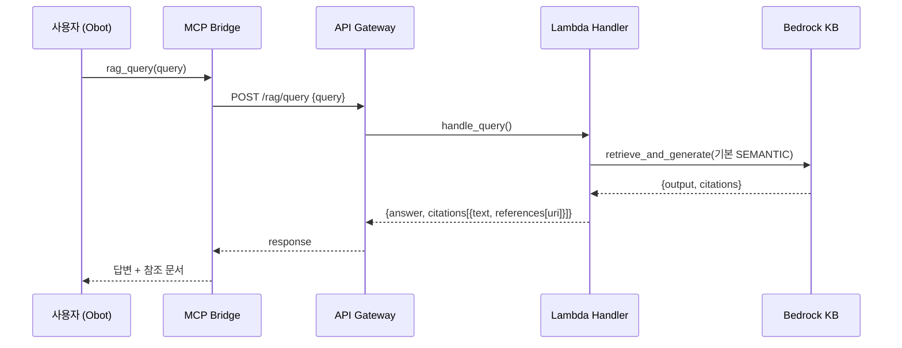
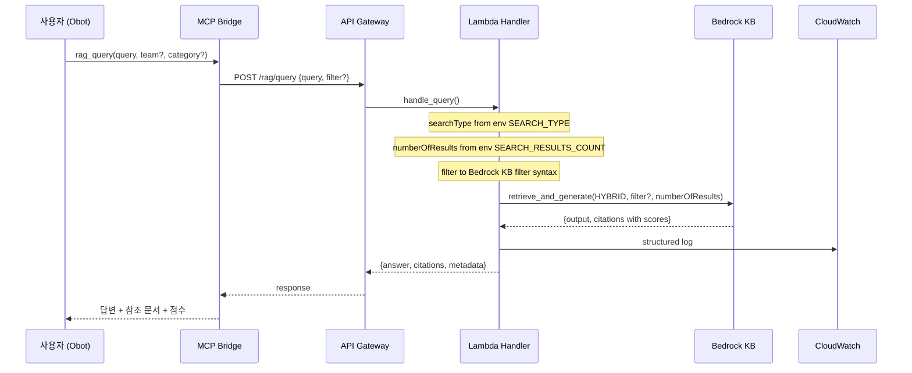
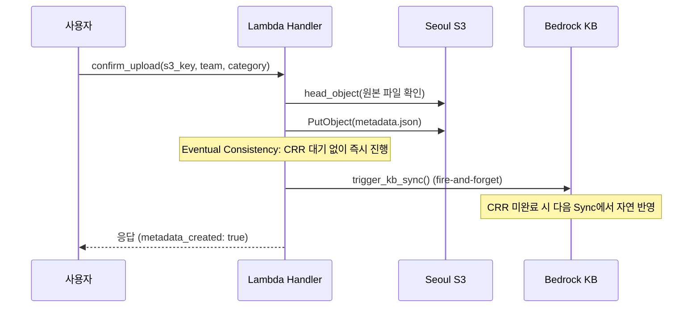
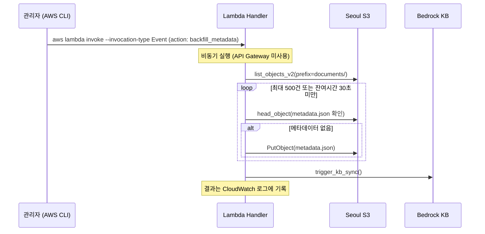

# 설계 문서: RAG 검색 성능 최적화

## 개요

BOS-AI Private RAG 시스템의 검색 품질을 Phase 1으로 개선하는 설계이다. 현재 시스템은 Bedrock Knowledge Base의 기본 시맨틱(벡터) 검색만 사용하고 있어, RTL 변수명(`HADDR`, `BLK_UCIE` 등) 같은 정확한 기술 키워드 매칭이 부정확하다. 본 설계는 다음 핵심 변경을 포함한다:

1. Hybrid Search 활성화: 시맨틱 검색 + BM25 키워드 검색 결합으로 기술 용어 매칭 정확도 향상
2. 메타데이터 자동 생성: 문서 업로드 시 `.metadata.json` 파일 자동 생성 (Eventual Consistency 모델)
3. 메타데이터 기반 필터링: team/category 기반 검색 범위 제한
4. 검색 응답 구조 개선: score, metadata 필드 추가로 결과 신뢰성 판단 지원
5. MCP Bridge 필터 전달: Obot 채팅에서 팀/카테고리 필터 지정 가능
6. 검색 품질 모니터링: CloudWatch 구조화 로그 + 커스텀 메트릭
7. 기존 문서 메타데이터 일괄 생성: Lambda 비동기 직접 호출 + 500건 페이지네이션

### 설계 결정 사항

| 결정 | 근거 |
|------|------|
| OpenSearch 인덱스 리매핑 불필요 | `AMAZON_BEDROCK_TEXT_CHUNK`가 이미 `"type": "text"`로 설정되어 있어 BM25 검색이 가능. Hybrid Search는 Bedrock KB API 파라미터(`searchType: HYBRID`)만으로 활성화됨 |
| CRR 대기 전략: Eventual Consistency 수용 | API Gateway 하드 타임아웃이 29초이므로 `time.sleep(30)` + `head_object` 확인 로직은 504 Gateway Timeout을 유발함. 메타데이터 생성 후 즉시 응답하고, KB Sync는 fire-and-forget으로 실행. 메타데이터가 CRR 복제 전에 Sync가 돌면 다음 Sync 시 자연 반영됨 |
| Backfill: API Gateway 미사용, Lambda 비동기 직접 호출 | API Gateway 29초 타임아웃으로 500건 S3 list/head/put 처리 불가. 관리자 전용이므로 `aws lambda invoke --invocation-type Event`로 비동기 호출. 기존 `process_extraction`과 동일한 패턴 |
| trigger_kb_sync에 ConflictException 처리 추가 | Bedrock KB `StartIngestionJob`은 동시에 1개만 실행 가능. 동시 업로드 시 ConflictException 발생하면 에러 무시하고 정상 종료 |

### 변경 범위

| 컴포넌트 | 파일 | 변경 유형 |
|----------|------|----------|
| Lambda Handler | `environments/app-layer/bedrock-rag/lambda_src/index.py` | 수정 (handle_query, confirm_upload, process_extraction, trigger_kb_sync, 신규 함수 4개: build_bedrock_filter, create_metadata_file, backfill_metadata, parse_team_category_from_key) |
| Terraform Variables | `environments/app-layer/bedrock-rag/variables.tf` | 수정 (search_type, search_results_count 변수 추가) |
| Terraform Lambda | `environments/app-layer/bedrock-rag/lambda.tf` | 수정 (환경 변수 2개 추가, CloudWatch 메트릭 필터 추가) |
| MCP Bridge | `mcp-bridge/server.js` | 수정 (rag_query 도구에 filter 파라미터 추가) |
| Property Tests | `tests/properties/rag_search_optimization_test.go` | 신규 |


## 아키텍처

### 현재 질의 흐름 (AS-IS)



### 변경 후 질의 흐름 (TO-BE)



### 문서 업로드 + 메타데이터 흐름 (TO-BE)



### 메타데이터 일괄 생성 흐름




## 컴포넌트 및 인터페이스

### 1. Lambda Handler 변경 (`index.py`)

#### 1.1 `handle_query()` 수정

현재 `handle_query()`는 `retrieve_and_generate` API를 기본 설정으로 호출한다. 다음과 같이 변경한다:

- 환경 변수 `SEARCH_TYPE`(기본값 `HYBRID`)과 `SEARCH_RESULTS_COUNT`(기본값 `5`)에서 검색 설정을 읽음
- `vectorSearchConfiguration`에 `searchType`과 `numberOfResults` 설정
- `filter` 객체가 요청에 포함되면 `build_bedrock_filter()`로 변환하여 전달
- 응답에서 `retrievedReferences`의 `score` 필드를 추출하여 `references[].score`에 포함
- 응답에 `metadata` 객체 추가 (`search_type`, `results_count`, `query_length`)
- `ValidationException` → HTTP 400, `ThrottlingException` → HTTP 429 분기 처리
- 응답 시간 측정 및 CloudWatch 구조화 로그 기록
- 인용 0건 시 `no_citation_query` 경고 로그, 응답 시간 30초 초과 시 `slow_query` 경고 로그

```python
def handle_query(event):
    """RAG 질의 처리 - Hybrid Search + 필터 + 모니터링"""
    body = parse_body(event)
    query = body.get('query', '')
    filter_obj = body.get('filter', None)

    if not query:
        return response(400, {'error': 'query field is required'})

    if not BEDROCK_KB_ID:
        return response(200, {
            'message': 'RAG query endpoint ready - Bedrock KB ID not configured',
            'query': query
        })

    search_type = os.environ.get('SEARCH_TYPE', 'HYBRID')
    search_results_count = int(os.environ.get('SEARCH_RESULTS_COUNT', '5'))

    vector_search_config = {
        'numberOfResults': search_results_count,
        'searchType': search_type
    }

    if filter_obj:
        bedrock_filter = build_bedrock_filter(filter_obj)
        if bedrock_filter:
            vector_search_config['filter'] = bedrock_filter

    try:
        bedrock_runtime = boto3.client('bedrock-agent-runtime', region_name=BACKEND_REGION)
        start_time = time.time()

        resp = bedrock_runtime.retrieve_and_generate(
            input={'text': query},
            retrieveAndGenerateConfiguration={
                'type': 'KNOWLEDGE_BASE',
                'knowledgeBaseConfiguration': {
                    'knowledgeBaseId': BEDROCK_KB_ID,
                    'modelArn': os.environ.get('FOUNDATION_MODEL_ARN',
                        'arn:aws:bedrock:us-east-1::foundation-model/anthropic.claude-v2'),
                    'retrievalConfiguration': {
                        'vectorSearchConfiguration': vector_search_config
                    }
                }
            }
        )

        response_time_ms = int((time.time() - start_time) * 1000)

        # 응답 구성 (score 포함)
        citations = []
        for c in resp.get('citations', []):
            refs = []
            for r in c.get('retrievedReferences', []):
                uri = r.get('location', {}).get('s3Location', {}).get('uri', '')
                score = r.get('metadata', {}).get('score') if 'metadata' in r else None
                refs.append({'uri': uri, 'score': score})
            citations.append({
                'text': c.get('generatedResponsePart', {}).get('textResponsePart', {}).get('text', ''),
                'references': refs
            })

        # CloudWatch 구조화 로그
        log_data = {
            'event': 'rag_query',
            'query_length': len(query),
            'search_type': search_type,
            'citation_count': len(citations),
            'response_time_ms': response_time_ms,
            'has_filter': filter_obj is not None
        }
        if filter_obj:
            log_data['filter_team'] = filter_obj.get('team', '')
            log_data['filter_category'] = filter_obj.get('category', '')
        logger.info(json.dumps(log_data))

        # 경고 메트릭 로그
        if len(citations) == 0:
            logger.warning(json.dumps({
                'metric_name': 'no_citation_query',
                'query_length': len(query),
                'search_type': search_type
            }))

        if response_time_ms > 30000:
            logger.warning(json.dumps({
                'metric_name': 'slow_query',
                'response_time_ms': response_time_ms,
                'query_length': len(query)
            }))

        return response(200, {
            'answer': resp['output']['text'],
            'citations': citations,
            'metadata': {
                'search_type': search_type,
                'results_count': search_results_count,
                'query_length': len(query)
            }
        })

    except Exception as e:
        error_str = str(e)
        if 'ValidationException' in type(e).__name__:
            logger.error(f"RAG query ValidationException: {error_str}")
            return response(400, {'error': error_str})
        elif 'ThrottlingException' in type(e).__name__:
            logger.warning(f"RAG query ThrottlingException: {error_str}")
            return response(429, {'error': error_str})
        else:
            logger.error(f"RAG query error: {error_str}")
            return response(500, {'error': error_str})
```

#### 1.2 `build_bedrock_filter()` 신규 함수

```python
def build_bedrock_filter(filter_obj):
    """filter 객체를 Bedrock KB 필터 구문으로 변환"""
    conditions = []
    if filter_obj.get('team'):
        conditions.append({'equals': {'key': 'team', 'value': filter_obj['team']}})
    if filter_obj.get('category'):
        conditions.append({'equals': {'key': 'category', 'value': filter_obj['category']}})

    if len(conditions) == 0:
        return None
    elif len(conditions) == 1:
        return conditions[0]
    else:
        return {'andAll': conditions}
```

#### 1.3 `create_metadata_file()` 신규 함수

```python
DOCUMENT_TYPE_MAP = {'pdf': 'pdf', 'txt': 'text', 'md': 'markdown'}

def create_metadata_file(s3_key, team='', category='', bucket=None):
    """S3 객체에 대한 .metadata.json 파일 생성"""
    if bucket is None:
        bucket = S3_BUCKET_SEOUL

    ext = s3_key.rsplit('.', 1)[-1].lower() if '.' in s3_key else ''
    document_type = DOCUMENT_TYPE_MAP.get(ext, 'other')

    metadata = {
        'metadataAttributes': {
            'team': team or '',
            'category': category or '',
            'document_type': document_type,
            'upload_date': datetime.utcnow().isoformat() + 'Z'
        }
    }

    metadata_key = s3_key + '.metadata.json'
    s3_client.put_object(
        Bucket=bucket,
        Key=metadata_key,
        Body=json.dumps(metadata, ensure_ascii=False).encode('utf-8'),
        ContentType='application/json'
    )
    return metadata_key
```

#### 1.4 `trigger_kb_sync()` 수정

기존 `trigger_kb_sync()`에 ConflictException 처리를 추가한다. Bedrock KB `StartIngestionJob`은 동시에 1개만 실행 가능하므로, 동시 업로드 시 ConflictException이 발생하면 WARNING 로그를 기록하고 정상 종료한다:

```python
def trigger_kb_sync():
    """Bedrock KB 동기화 트리거 (fire-and-forget, ConflictException 허용)"""
    try:
        bedrock_agent = boto3.client('bedrock-agent', region_name=BACKEND_REGION)
        data_source_id = os.environ.get('BEDROCK_DS_ID', '')

        resp = bedrock_agent.start_ingestion_job(
            knowledgeBaseId=BEDROCK_KB_ID,
            dataSourceId=data_source_id
        )
        job_id = resp.get('ingestionJob', {}).get('ingestionJobId', 'unknown')
        logger.info(f"KB sync started - job_id: {job_id}")
        return f"sync started - job_id: {job_id}"
    except Exception as e:
        if 'ConflictException' in type(e).__name__:
            logger.warning(f"KB sync ConflictException: sync already in progress")
            return "sync already in progress"
        logger.error(f"KB sync error: {e}")
        return f"sync error: {e}"
```

#### 1.5 `confirm_upload()` 수정

기존 `confirm_upload()`에 메타데이터 생성 + fire-and-forget KB Sync 로직 추가. Eventual Consistency 모델을 수용하여 CRR 복제 대기 없이 즉시 KB Sync를 트리거한다:

```python
def confirm_upload(event):
    """업로드 완료 확인 - 메타데이터 생성 + S3 파일 존재 확인 + fire-and-forget KB Sync"""
    body = parse_body(event)
    s3_key = body.get('s3_key', '')
    team = body.get('team', '')
    category = body.get('category', '')
    skip_sync = body.get('skip_sync', False)
    is_archive = body.get('is_archive', False)

    if not s3_key:
        return response(400, {'error': 's3_key is required'})

    try:
        s3_client.head_object(Bucket=S3_BUCKET_SEOUL, Key=s3_key)
    except s3_client.exceptions.ClientError as e:
        if e.response['Error']['Code'] == '404':
            return response(404, {'error': 'File not found in S3', 's3_key': s3_key})
        raise

    # 메타데이터 파일 생성
    metadata_key = create_metadata_file(s3_key, team, category)

    # fire-and-forget KB Sync (CRR 복제 대기 없이 즉시 트리거)
    sync_result = 'skipped'
    if not skip_sync and not is_archive:
        sync_result = trigger_kb_sync()

    logger.info(f"Upload confirmed: {s3_key}, metadata: {metadata_key}, kb_sync: {sync_result}")
    return response(200, {
        'message': 'Upload confirmed',
        'key': s3_key,
        'kb_sync': sync_result,
        'metadata_created': True
    })
```

#### 1.6 `process_extraction()` 수정

압축 해제 시 각 파일에 대해 메타데이터 생성. 기존 S3 업로드 루프 내에서 `success_files.append(flat_name)` 직후에 추가:

```python
# 메타데이터 생성 (실패해도 파일 업로드는 성공으로 처리)
try:
    create_metadata_file(dest_key, team, category)
except Exception as meta_err:
    logger.warning(f"Metadata creation failed for {dest_key}: {meta_err}")
```

#### 1.7 `backfill_metadata()` 신규 함수

Lambda Event 비동기 호출(`aws lambda invoke --invocation-type Event`)로 실행되며, API Gateway를 경유하지 않는다. handler에서 `action == 'backfill_metadata'` 분기로 호출된다:

```python
def backfill_metadata(event, context):
    """기존 문서에 대한 메타데이터 일괄 생성 (Lambda Event 비동기 호출)"""
    body = event if isinstance(event, dict) else parse_body(event)
    continuation_token = body.get('continuation_token', None)
    max_items = 500

    processed_count = 0
    skipped_count = 0
    error_count = 0
    last_key = None
    has_more = False

    list_params = {'Bucket': S3_BUCKET_SEOUL, 'Prefix': S3_PREFIX, 'MaxKeys': 1000}
    if continuation_token:
        list_params['StartAfter'] = continuation_token

    while True:
        remaining_ms = context.get_remaining_time_in_millis()
        if remaining_ms < 30000:
            has_more = True
            break

        resp = s3_client.list_objects_v2(**list_params)
        for obj in resp.get('Contents', []):
            key = obj['Key']

            if key.endswith('.metadata.json') or key.endswith('/'):
                continue

            if processed_count + skipped_count + error_count >= max_items:
                has_more = True
                break

            if context.get_remaining_time_in_millis() < 30000:
                has_more = True
                break

            metadata_key = key + '.metadata.json'
            try:
                s3_client.head_object(Bucket=S3_BUCKET_SEOUL, Key=metadata_key)
                skipped_count += 1
            except Exception:
                team, category = parse_team_category_from_key(key)
                try:
                    create_metadata_file(key, team, category)
                    processed_count += 1
                except Exception as e:
                    logger.error(f"Backfill metadata error for {key}: {e}")
                    error_count += 1

            last_key = key

        if has_more or not resp.get('IsTruncated', False):
            break
        list_params['ContinuationToken'] = resp['NextContinuationToken']

    sync_result = trigger_kb_sync()

    result = {
        'processed_count': processed_count,
        'skipped_count': skipped_count,
        'error_count': error_count,
        'kb_sync': sync_result,
        'has_more': has_more
    }
    if has_more and last_key:
        result['continuation_token'] = last_key

    return response(200, result)
```

#### 1.8 `parse_team_category_from_key()` 신규 함수

```python
def parse_team_category_from_key(s3_key):
    """S3 키 경로에서 team/category 파싱 (documents/{team}/{category}/{filename})"""
    parts = s3_key.replace(S3_PREFIX, '', 1).split('/')
    if len(parts) >= 3:
        return parts[0], parts[1]
    return '', ''
```

#### 1.9 `handler()` 라우팅 수정

기존 `handler()` 함수에 `action` 기반 분기를 추가하여 Lambda Event 비동기 호출을 처리한다. API Gateway 라우트(`/rag/backfill-metadata`)는 사용하지 않는다:

```python
# handler() 함수 내 기존 API Gateway 라우팅 이후에 추가
# Lambda Event 비동기 호출 처리 (API Gateway 미경유)
action = event.get('action', '')
if action == 'backfill_metadata':
    return backfill_metadata(event, context)
```

### 2. Terraform 변경

#### 2.1 `variables.tf` 추가 변수

```hcl
variable "search_type" {
  description = "Bedrock KB 검색 유형. 허용 값: HYBRID, SEMANTIC"
  type        = string
  default     = "HYBRID"

  validation {
    condition     = contains(["HYBRID", "SEMANTIC"], var.search_type)
    error_message = "search_type은 HYBRID 또는 SEMANTIC이어야 합니다."
  }
}

variable "search_results_count" {
  description = "Bedrock KB 검색 결과 수"
  type        = number
  default     = 5
}
```

#### 2.2 `lambda.tf` 환경 변수 추가

Lambda 함수의 `environment.variables` 블록에 추가:

```hcl
SEARCH_TYPE          = var.search_type
SEARCH_RESULTS_COUNT = tostring(var.search_results_count)
```

#### 2.3 CloudWatch 메트릭 필터

```hcl
resource "aws_cloudwatch_log_metric_filter" "no_citation_query" {
  name           = "rag-no-citation-query"
  log_group_name = aws_cloudwatch_log_group.lambda.name
  pattern        = "{ $.metric_name = \"no_citation_query\" }"

  metric_transformation {
    name      = "RAGNoCitationCount"
    namespace = "BOS-AI/RAG"
    value     = "1"
  }
}
```

### 3. MCP Bridge 변경 (`server.js`)

`rag_query` 도구의 입력 스키마에 `team`, `category` 파라미터 추가:

```javascript
mcp.tool(
  "rag_query",
  "BOS-AI RAG 지식 베이스에 질의합니다. ...",
  {
    query: z.string().describe("질의 내용 (한국어/영어 모두 가능)"),
    team: z.string().optional().describe("팀 필터 (예: soc). 특정 팀 문서만 검색"),
    category: z.string().optional().describe("카테고리 필터 (예: code, spec). 특정 카테고리만 검색")
  },
  async (args) => {
    const body = { query: args.query };
    if (args.team || args.category) {
      body.filter = {};
      if (args.team) body.filter.team = args.team;
      if (args.category) body.filter.category = args.category;
    }
    const resp = await ragApi("POST", "/query", body);
    // ... 기존 응답 처리 로직 유지, references에 score 표시 추가 ...
  }
);
```

필터가 모두 미제공 시 `filter` 객체를 요청 본문에 포함하지 않아 기존 동작과 동일하게 전체 문서 대상 검색을 수행한다.


## 데이터 모델

### 메타데이터 파일 구조 (`.metadata.json`)

Bedrock KB가 인식하는 표준 메타데이터 형식을 따른다. 파일명은 원본 파일명 뒤에 `.metadata.json`을 붙인다 (예: `spec.pdf` → `spec.pdf.metadata.json`).

```json
{
  "metadataAttributes": {
    "team": "soc",
    "category": "code",
    "document_type": "pdf",
    "upload_date": "2025-01-15T09:30:00Z"
  }
}
```

| 필드 | 타입 | 설명 | 예시 |
|------|------|------|------|
| `team` | string | 팀 식별자. 없으면 빈 문자열 | `"soc"`, `""` |
| `category` | string | 카테고리 식별자. 없으면 빈 문자열 | `"code"`, `"spec"`, `""` |
| `document_type` | string | 파일 확장자 기반 문서 유형 | `"pdf"`, `"text"`, `"markdown"`, `"other"` |
| `upload_date` | string | ISO 8601 형식 업로드 일시 | `"2025-01-15T09:30:00Z"` |

### 파일 확장자 → document_type 매핑

| 확장자 | document_type |
|--------|--------------|
| `.pdf` | `"pdf"` |
| `.txt` | `"text"` |
| `.md` | `"markdown"` |
| 그 외 (`.docx`, `.csv`, `.html` 등) | `"other"` |

### 검색 응답 구조 (TO-BE)

기존 `answer` + `citations` 구조를 유지하면서 `references` 내 `score` 필드와 최상위 `metadata` 객체를 추가한다.

```json
{
  "answer": "HADDR 신호는 AHB 버스의 주소 버스로...",
  "citations": [
    {
      "text": "HADDR[31:0] is the 32-bit system address bus...",
      "references": [
        {
          "uri": "s3://bos-ai-documents-us/documents/soc/spec/ahb_spec.pdf",
          "score": 0.87
        }
      ]
    }
  ],
  "metadata": {
    "search_type": "HYBRID",
    "results_count": 5,
    "query_length": 24
  }
}
```

### Bedrock KB 필터 구문

단일 조건 (team만 또는 category만):
```json
{"equals": {"key": "team", "value": "soc"}}
```

복합 조건 (team + category 모두):
```json
{
  "andAll": [
    {"equals": {"key": "team", "value": "soc"}},
    {"equals": {"key": "category", "value": "code"}}
  ]
}
```

### CloudWatch 구조화 로그 형식

질의 처리 시 기록되는 구조화 로그:

```json
{
  "event": "rag_query",
  "query_length": 24,
  "search_type": "HYBRID",
  "citation_count": 3,
  "response_time_ms": 2450,
  "has_filter": true,
  "filter_team": "soc",
  "filter_category": "code"
}
```

경고 메트릭 로그 (인용 0건):
```json
{"metric_name": "no_citation_query", "query_length": 24, "search_type": "HYBRID"}
```

경고 메트릭 로그 (느린 질의):
```json
{"metric_name": "slow_query", "response_time_ms": 35000, "query_length": 150}
```

### Backfill 응답 구조

```json
{
  "processed_count": 487,
  "skipped_count": 13,
  "error_count": 0,
  "kb_sync": "sync started - job_id: abc123",
  "has_more": true,
  "continuation_token": "documents/soc/code/last_processed_file.pdf"
}
```


## 정확성 속성 (Correctness Properties)

*속성(Property)은 시스템의 모든 유효한 실행에서 참이어야 하는 특성 또는 동작이다. 속성은 사람이 읽을 수 있는 명세와 기계가 검증할 수 있는 정확성 보장 사이의 다리 역할을 한다.*

### Property 1: 검색 설정 구성 (Search Config Construction)

*For any* 유효한 검색 유형(`HYBRID` 또는 `SEMANTIC`)과 양의 정수 결과 수에 대해, `vectorSearchConfiguration`을 구성하면 해당 `searchType`과 `numberOfResults` 값이 정확히 포함되어야 한다. 환경 변수가 없을 경우 `searchType`은 `HYBRID`, `numberOfResults`는 `5`가 기본값이어야 한다.

**Validates: Requirements 1.1, 1.2**

### Property 2: Terraform 검색 변수 정의

*For any* Terraform 변수 파일에서, `search_type` 변수는 `string` 타입이고 기본값이 `"HYBRID"`이며 `HYBRID`와 `SEMANTIC`만 허용하는 validation 블록을 포함해야 하고, `search_results_count` 변수는 `number` 타입이고 기본값이 `5`여야 하며, Lambda 환경 변수에 `SEARCH_TYPE`과 `SEARCH_RESULTS_COUNT`가 포함되어야 한다.

**Validates: Requirements 2.1, 2.2, 2.3, 2.4**

### Property 3: 메타데이터 파일 구조 및 내용

*For any* S3 키와 임의의 team/category 값에 대해, `create_metadata_file()`이 생성하는 메타데이터는 `metadataAttributes` 객체를 포함하고, 그 안에 `team`(문자열), `category`(문자열), `document_type`(문자열), `upload_date`(ISO 8601 형식 문자열) 필드가 모두 존재해야 한다. team 또는 category가 None이거나 빈 값이면 빈 문자열(`""`)로 설정되어야 하며, `document_type`은 파일 확장자 매핑(`.pdf`→`"pdf"`, `.txt`→`"text"`, `.md`→`"markdown"`, 그 외→`"other"`)을 정확히 따라야 한다. 메타데이터 키는 원본 S3 키 + `.metadata.json`이어야 한다.

**Validates: Requirements 3.1, 3.2, 3.3, 3.4, 3.5**

### Property 4: Bedrock 필터 구문 변환

*For any* filter 객체에 대해, `build_bedrock_filter()`는 다음 규칙을 따라야 한다: team만 있으면 `{"equals": {"key": "team", "value": "<값>"}}`, category만 있으면 `{"equals": {"key": "category", "value": "<값>"}}`, 둘 다 있으면 `{"andAll": [team필터, category필터]}`, 둘 다 없거나 빈 값이면 `None`을 반환해야 한다.

**Validates: Requirements 4.1, 4.2, 4.3, 4.4, 4.5**

### Property 5: 질의 응답 구조 완전성

*For any* 성공적인 Bedrock `retrieve_and_generate` 응답에 대해, Lambda의 질의 응답은 `answer`(문자열), `citations`(배열), `metadata`(객체) 필드를 포함해야 한다. 각 citation은 `text`(문자열)와 `references`(배열)를 포함하고, 각 reference는 `uri`(문자열)와 `score`(숫자 또는 null)를 포함해야 한다. `metadata`는 `search_type`, `results_count`, `query_length` 필드를 포함해야 한다.

**Validates: Requirements 5.1, 5.2, 5.3, 5.4**

### Property 6: MCP Bridge 필터 요청 구성

*For any* team과 category 파라미터 조합에 대해, MCP Bridge가 구성하는 API 요청 본문은 다음을 만족해야 한다: team 또는 category 중 하나라도 제공되면 `filter` 객체에 해당 값이 포함되고, 둘 다 미제공이면 `filter` 객체가 요청 본문에 포함되지 않아야 한다.

**Validates: Requirements 6.2, 6.3**

### Property 7: 구조화 로그 필드 완전성

*For any* 질의 처리에 대해, CloudWatch에 기록되는 구조화 로그는 `query_length`(정수), `search_type`(문자열), `citation_count`(정수), `response_time_ms`(정수), `has_filter`(불리언) 필드를 모두 포함해야 한다.

**Validates: Requirements 7.1**

### Property 8: S3 키 경로 team/category 파싱

*For any* `documents/{team}/{category}/{filename}` 형식의 S3 키에 대해, `parse_team_category_from_key()`는 정확한 `(team, category)` 튜플을 반환해야 한다. 경로 깊이가 3 미만인 키에 대해서는 `('', '')`를 반환해야 한다.

**Validates: Requirements 8.2**

### Property 9: Backfill 페이지네이션 및 카운팅

*For any* backfill 실행에 대해, 응답의 `processed_count + skipped_count + error_count`는 실제 처리된 문서 수와 일치해야 하며, 처리 한도(500건)를 초과하지 않아야 한다. 미처리 문서가 남아있으면 `has_more`가 `true`이고 `continuation_token`이 마지막 처리된 S3 키여야 한다.

**Validates: Requirements 8.3, 8.6, 8.7**


## 에러 처리

### Lambda Handler 에러 처리

| 에러 상황 | HTTP 코드 | 응답 | 로그 레벨 |
|-----------|----------|------|----------|
| `query` 필드 누락 | 400 | `{"error": "query field is required"}` | - |
| `ValidationException` (잘못된 검색 파라미터) | 400 | `{"error": "<에러 메시지>"}` | ERROR |
| `ThrottlingException` (Bedrock API 제한) | 429 | `{"error": "<에러 메시지>"}` | WARNING |
| 기타 Bedrock API 에러 | 500 | `{"error": "<에러 메시지>"}` | ERROR |
| 메타데이터 파일 생성 실패 (업로드 흐름) | - | 업로드 자체는 성공 처리 | WARNING |
| `ConflictException` (KB Sync 동시 실행) | - | sync 무시, 정상 종료 | WARNING |
| Backfill 개별 문서 메타데이터 생성 실패 | - | 해당 문서 건너뛰고 계속 처리, `error_count` 증가 | ERROR |
| Backfill Lambda 잔여 시간 30초 미만 | 200 | `has_more: true` + `continuation_token` 포함 | INFO |
| `s3_key` 누락 (confirm_upload) | 400 | `{"error": "s3_key is required"}` | - |
| S3 파일 미존재 (confirm_upload) | 404 | `{"error": "File not found in S3"}` | - |

### Backfill 안전장치

- 1회 요청당 최대 500건 처리 (Lambda 타임아웃 내 안전 처리)
- `context.get_remaining_time_in_millis()` 매 문서 처리 전 확인
- 잔여 시간 30초 미만 시 즉시 중단, `has_more: true` + `continuation_token` 반환
- 개별 문서 실패 시 건너뛰고 계속 처리 (`error_count` 증가)
- KB Sync는 처리 완료 후 1회만 실행

## 테스트 전략

### 단위 테스트 (Unit Tests)

단위 테스트는 특정 예시, 엣지 케이스, 에러 조건을 검증한다.

| 테스트 | 검증 내용 |
|--------|----------|
| `ValidationException` → HTTP 400 | 요구사항 1.4 에러 처리 |
| `ThrottlingException` → HTTP 429 | 요구사항 1.5 에러 처리 |
| 메타데이터 Content-Type 확인 | 요구사항 3.6 (`application/json`, UTF-8) |
| Eventual Consistency: confirm_upload에서 CRR 대기 없이 즉시 KB Sync | 요구사항 3.7 fire-and-forget |
| `ConflictException` 발생 시 WARNING 로그 후 정상 종료 | trigger_kb_sync ConflictException 처리 |
| 인용 0건 시 `no_citation_query` 로그 | 요구사항 7.2 경고 로그 |
| 응답 시간 30초 초과 시 `slow_query` 로그 | 요구사항 7.4 경고 로그 |
| CloudWatch 메트릭 필터 Terraform 정의 | 요구사항 7.3 |
| MCP Bridge `rag_query` 스키마에 team/category 존재 | 요구사항 6.1 |
| Backfill 개별 문서 실패 시 계속 처리 | 요구사항 8.4 |
| Backfill KB Sync 1회 실행 | 요구사항 8.5 |
| Backfill Lambda 타임아웃 안전장치 | 요구사항 8.8 |
| Backfill `action == 'backfill_metadata'` 분기 라우팅 | 요구사항 8.1 Lambda Event 비동기 호출 |

### 속성 기반 테스트 (Property-Based Tests)

속성 기반 테스트는 gopter 라이브러리(Go 1.21)를 사용하여 무작위 입력에 대한 보편적 속성을 검증한다. 각 테스트는 최소 100회 반복 실행한다.

| 테스트 | 속성 | 태그 |
|--------|------|------|
| 검색 설정 구성 | Property 1 | `Feature: rag-search-optimization, Property 1: Search Config Construction` |
| Terraform 검색 변수 | Property 2 | `Feature: rag-search-optimization, Property 2: Terraform Search Variables` |
| 메타데이터 파일 구조 | Property 3 | `Feature: rag-search-optimization, Property 3: Metadata File Structure` |
| Bedrock 필터 변환 | Property 4 | `Feature: rag-search-optimization, Property 4: Bedrock Filter Construction` |
| 질의 응답 구조 | Property 5 | `Feature: rag-search-optimization, Property 5: Query Response Structure` |
| MCP Bridge 필터 구성 | Property 6 | `Feature: rag-search-optimization, Property 6: MCP Bridge Filter Request` |
| 구조화 로그 완전성 | Property 7 | `Feature: rag-search-optimization, Property 7: Structured Log Completeness` |
| S3 키 파싱 | Property 8 | `Feature: rag-search-optimization, Property 8: S3 Key Parsing` |
| Backfill 페이지네이션 | Property 9 | `Feature: rag-search-optimization, Property 9: Backfill Pagination` |

### 테스트 파일 위치

- 속성 기반 테스트: `tests/properties/rag_search_optimization_test.go`
- 기존 테스트 패턴을 따라 `package properties`로 작성
- gopter 라이브러리 사용 (기존 프로젝트 의존성에 포함)
- 각 속성 테스트는 설계 문서의 Property 번호를 주석으로 참조

### 테스트 실행

```bash
cd tests && go test -v ./properties/ -run TestRagSearchOptimization -count=1
```

