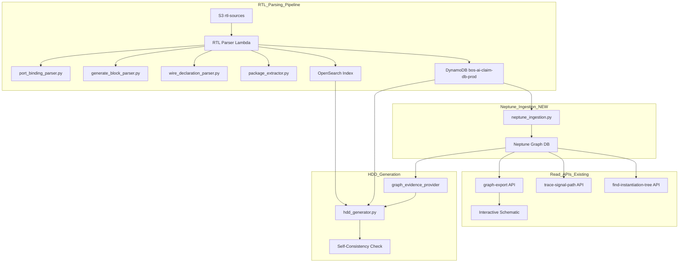
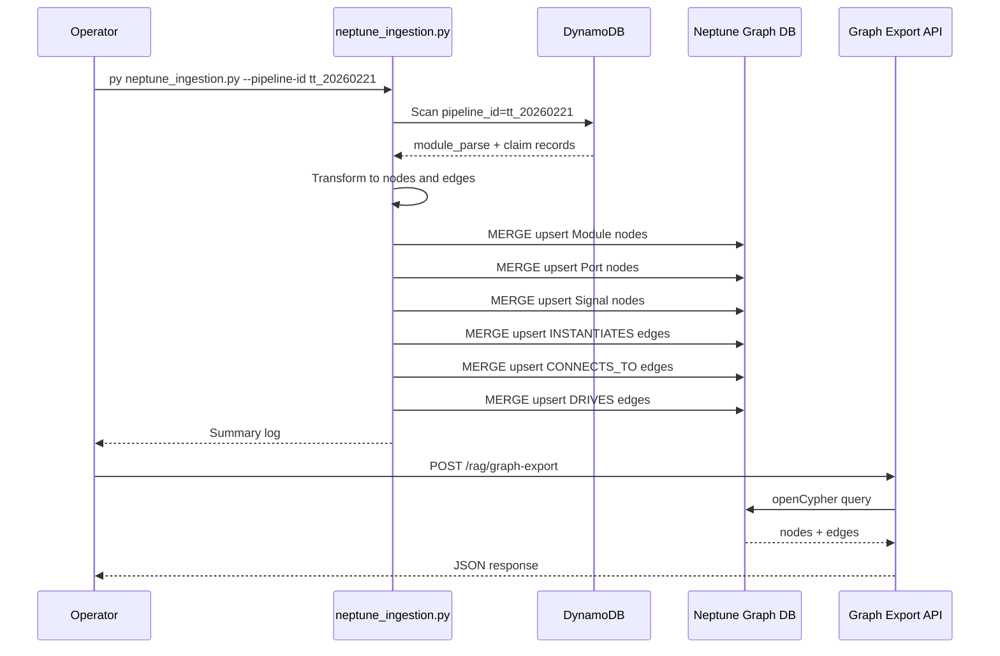

# Design Document — RAG v9.4 Final

## Overview

RAG v9.4는 BOS-AI Private RAG 시스템의 RTL 파이프라인 최종 대규모 개선이다. v9.3 리뷰에서 식별된 치명적 오류 6건과 구조적 한계를 4개 카테고리로 나누어 해결한다:

1. **즉시 수정 (Requirements 1-4)**: 프롬프트/데이터 수정으로 factual error 제거 + DFX 자동 추출 병행
2. **파서 확장 (Requirements 5-9)**: RTL Parser의 expression preservation, generate block label, parameter/dimension 추출, instantiation parameter override 코드 수정
3. **Neptune Ingestion Pipeline (Requirements 10-13)**: DynamoDB 파싱 데이터를 Neptune Graph DB에 적재 + **Neptune → HDD evidence 경로 구축**

> **Scope 변경 (v9.4 리뷰 반영):** SoC RTL 호환성 (Requirements 14-15)은 실제 SoC RTL 샘플 확보 후 v9.5로 이동. PBT는 10개 → 4개로 축소.

### Design Decisions

| 결정 | 선택 | 근거 |
|------|------|------|
| Neptune 적재 방식 | Standalone Python script in lambda_src/ | Lambda 15분 제한 회피, 대량 batch upsert에 적합 |
| Expression evaluator 범위 | +, -, *, / + 정수 리터럴 + 괄호 | v9.3 리뷰에서 +-1 수준이 즉시 필요, 복잡한 expression은 문자열 보존 |
| Generate block label 추출 위치 | 기존 generate_block_parser.py 확장 | 이미 generate block 구조를 파싱하는 코드가 존재 |
| Idempotent upsert 전략 | MERGE openCypher with composite key | 재실행 시 중복 노드/엣지 방지 |
| Graph → HDD 연결 | graph_evidence_provider 컴포넌트 | Neptune 데이터를 HDD 생성의 primary evidence로 활용 |
| Graph schema 수준 | ModuleDef + Instance + PortInstance 3-tier | instance-level connectivity 보존 (generate 반복, 다중 instance 구분) |
| Edge 모델 | BINDS_TO + DRIVES 분리 | .port(signal) 의미를 정확히 표현 |
| DFX 추출 | manual claim + 자동 추출 병행 | emergency fix + 장기 자동화 |
| Expression 컴포넌트 명칭 | ExpressionPreserver (evaluator 아님) | 실제 동작(보존)과 이름 일치 |
| Instantiation param override | 추출 대상에 포함 | #(.NUM_REPEATERS(4)) 같은 override 값 캡처 |

---

## Architecture



### Data Flow

1. RTL 파일이 S3 rtl-sources/에 업로드되면 RTL Parser Lambda가 트리거
2. 각 파서 모듈이 claims를 생성하여 OpenSearch + DynamoDB에 저장
3. NEW: neptune_ingestion.py가 DynamoDB의 파싱 결과를 읽어 Neptune에 노드/엣지로 적재
4. Graph Export API가 Neptune에서 데이터를 읽어 Interactive Schematic에 제공
5. **NEW: graph_evidence_provider가 Neptune에서 trace_signal_path, instantiation-tree 결과를 조회하여 HDD 섹션별 evidence table로 주입**
6. HDD Generator가 claims + graph evidence를 조합하여 문서 생성 시 self-consistency check 수행

---

## Components and Interfaces

### Category 1: 즉시 수정 (Requirements 1-4)

#### 1.1 Manual Claim Injection

위치: DynamoDB bos-ai-claim-db-prod 테이블에 직접 삽입

Claim 구조 (기존 패턴 준수):
- claim_id: manual_edc_ring_001
- claim_type: structural
- claim_text: Each column (X=0..3) has its own independent EDC ring
- topic: EDC
- confidence_score: 1.0
- source: manual_claim
- pipeline_id: tt_20260221
- status: verified

대상 Claims:
- EDC per-column ring (Req 1)
- DFX 4-wrapper chain x 4개 모듈 (Req 4)
- EDC port [3:0] 배열 차원 (Req 3 — 파서 수정과 병행)

#### 1.2 HDD Generator Self-Consistency Check (Req 2)

위치: rtl_parser_src/hdd_generator.py — _build_hdd_prompt() 수정

새 함수: _validate_dispatch_coordinates(inference_text, ep_table) -> str
- EP Table 좌표와 FROM LLM 추론의 일관성 검증
- 모순 발견 시 좌표 부분 제거 또는 재생성

프롬프트 추가 문구:
- EP Table의 좌표를 참조하여 FROM LLM 추론을 검증하라
- East dispatch는 X=3, West dispatch는 X=0이다
- 좌표 관련 추론이 EP Table과 모순되면 해당 부분을 제거하라

Discard 로직:
1. 좌표 관련 부분만 제거 시도
2. 제거 후 문장이 불완전하면 전체 단락 재생성
3. Warning log 발행: event=dispatch_coord_conflict, conflicting_values={...}

#### 1.3 좌표계 일반화 Self-Consistency (Overlay Y축 포함)

위치: rtl_parser_src/hdd_generator.py — _validate_coordinates() (dispatch 전용 → 범용)

기존 _validate_dispatch_coordinates()를 일반화하여 EP Table 전체 좌표를 single source of truth로 사용:
- Dispatch E/W: East=X=3, West=X=0
- Overlay: Y=4 (NOC2AXI row), Y=0..3 (Tensix rows)
- Composite tile: row_span 검증 (Y=4+Y=3 걸침)

검증 대상 확장:
- [FROM LLM] 추론에서 X/Y 좌표가 EP Table과 모순되면 동일 discard/regenerate 로직 적용
- Overlay Y=0 오류 (v9.3 P0 #4) 방지

#### 1.4 DFX 자동 추출 경로 (manual claim 병행)

위치: rtl_parser_src/handler.py — DFX 모듈 자동 감지

Manual claim은 emergency overlay로 유지하되, 자동 추출도 병행:
- module_filter='*_dfx' 패턴으로 DFX wrapper 모듈 자동 감지
- 추출 대상: module name, file path, clock in/out port count, IJTAG ifdef presence
- Claim 생성: topic="DFX", claim_type="structural", source="auto_extracted"
- Manual claim과 auto claim이 충돌 시 manual이 우선 (confidence_score 비교)

---

### Category 2: 파서 확장 (Requirements 5-9)

#### 2.1 Port Binding ExpressionPreserver (Req 5)

위치: rtl_parser_src/port_binding_parser.py

> **명칭 변경:** "Expression Evaluator" → "ExpressionPreserver". 실제 동작은 산술값 계산이 아닌 표현식 보존/분류이므로 이름을 실제 동작에 맞춤.

현재 signal_expr는 괄호 내부 텍스트를 그대로 반환한다. 이미 i_local_nodeid_y - 1 같은 표현식이 추출되고 있으나, claim_text에 반영되지 않는 경우가 있다.

변경 사항:
- signal_expr 필드에 산술 연산 포함 표현식을 그대로 보존 (현재 동작 유지 확인)
- Claim text 생성 시 expression 전체를 포함하도록 보장
- 새로운 expression_type 필드 추가: simple, arithmetic, concatenation

Expression 분류 로직:
- 빈 문자열 -> simple
- { 로 시작 -> concatenation
- +, -, *, / 포함 -> arithmetic
- 그 외 -> simple

Round-trip 보장: 파싱된 expression을 다시 텍스트로 포맷팅했을 때 원본과 동등한 문자열 생성

#### 2.2 Generate Block Label Extraction (Req 6)

위치: rtl_parser_src/generate_block_parser.py

현재 _extract_for_loops()는 이미 label 필드를 추출하고 있다. 그러나:
- generate if 블록의 label은 _extract_generate_if_claims()에서만 부분적으로 추출
- 인스턴스와 enclosing generate block의 연관이 claim에 명시적으로 기록되지 않음
- 중첩 generate block의 계층 경로가 없음

새 함수: _extract_generate_block_labels(clean_content) -> list
- 모든 labeled generate block을 추출하고 계층 경로를 구성
- 반환: label, parent_label, hierarchy_path, block_type (for/if), instances 리스트

Claim 생성 패턴:
- Module 'trinity_top' generate block 'gen_noc2axi_ne_opt' (for) contains instances: trinity_noc2axi_n_opt, trinity_router

중첩 경로 예시: gen_outer/gen_inner

#### 2.3 Top Module Parameter Extraction (Req 7)

위치: rtl_parser_src/package_extractor.py — 새 함수 추가

현재 _extract_parameters()는 package 블록 내부의 parameter만 추출한다. Top-level module의 parameter 선언은 별도 처리가 필요하다.

새 함수: extract_module_parameters(rtl_content, module_name, file_path, pipeline_id) -> list
- 패턴 1: module module_name #( parameter TYPE NAME = VALUE, ... ) (ports);
- 패턴 2: module 내부 parameter TYPE NAME = VALUE;
- topic: TopLevelParameter
- 최소 추출 대상: AXI_SLV_OUTSTANDING_READS, AXI_SLV_OUTSTANDING_WRITES, AXI_SLV_RD_RDATA_FIFO_DEPTH

호출 위치: handler.py의 _process_rtl_file() — package file이 아닌 일반 모듈 파일에서도 호출

#### 2.3b Instantiation Parameter Override Extraction (NEW)

위치: rtl_parser_src/port_binding_parser.py — 새 함수 추가

v9.3 리뷰에서 지적된 `#(.NUM_REPEATERS(4))` 같은 instantiation parameter override를 추출:

새 함수: _extract_instance_param_overrides(instance_text) -> list[dict]
- 패턴: `module_name #( .PARAM_NAME(value), ... ) instance_name (...)`
- 반환: [{param_name, override_value, instance_name, module_name}]
- topic: "InstanceParameter"
- claim_text: "Instance 'u_repeater' overrides NUM_REPEATERS=4"

Neptune 연동:
- Instance node에 param_overrides property 추가 (JSON dict)
- HDD evidence로 활용: NoC repeater count, FIFO depth 등 instance-specific 값

#### 2.4 Wire Dimension 3차원 보존 (Req 8)

위치: rtl_parser_src/wire_declaration_parser.py

현재 _parse_dimensions() 함수는 이미 모든 [...] 차원을 추출한다. 문제는 Pattern C의 정규식에서 optional packed dimension과 array dimension이 겹칠 때 마지막 차원이 누락될 수 있음.

수정: Pattern C 정규식에서 packed dimension 그룹과 array dimension 그룹을 명확히 분리
- Group 1: type name (ending with _t)
- Group 2: 0개 이상의 packed dimensions
- Group 3: signal name
- Group 4: 1개 이상의 array dimensions (필수)

검증: de_to_t6_coloumn[SizeX][SizeY-1][2] -> dims = [SizeX, SizeY-1, 2] (3개 모두 보존)

#### 2.5 Struct Field Packed Dimension (Req 9)

위치: rtl_parser_src/package_extractor.py — _parse_struct_fields() 수정

현재 구현은 logic [N:M] field_name 패턴에서 packed dimension을 추출하지만, unpacked dimension (logic field_name [3:0])은 처리하지 않는다.

변경 사항:
- Packed dimension ([7:0] field_name) vs Unpacked dimension (field_name [3:0]) 구분
- 필드 수 검증: 추출된 필드 수가 소스와 불일치 시 에러 보고
- 반환 dict에 packed_dim, unpacked_dim 키 추가

---

### Category 3: Neptune Ingestion Pipeline (Requirements 10-13)

#### 3.1 Sequence



#### 3.2 Node Types (3-Tier Instance Model)

ModuleDef node (모듈 정의):
- Properties: name, file_path, pipeline_id, module_type
- Source: module_parse records from DynamoDB
- 역할: RTL 소스에서 정의된 모듈 (definition-level)

Instance node (인스턴스화):
- Properties: instance_name, hier_path, generate_scope, x, y (좌표, if available), parent_instance
- Source: module_parse.instance_list + generate block context
- 역할: 특정 위치에 인스턴스화된 모듈 (instance-level). 동일 ModuleDef의 다중 인스턴스 구분 가능

PortDef node (포트 정의):
- Properties: name, direction (input/output/inout), bit_width, parent_module_def
- Source: module_parse.port_list

PortInstance node (포트 인스턴스):
- Properties: name, direction, bit_width, parent_instance, hier_path
- Source: Instance의 port binding에서 생성
- 역할: 특정 Instance에 속한 포트. generate 반복, _ne/_nw symmetry 구분 가능

Signal node (Net):
- Properties: name, dimensions, struct_type, purpose, scope (module/instance)
- Source: Claims with topic WireTopology

ClockDomain node:
- Properties: name, frequency (if available), source_module
- Source: Claims with topic ClockDomain

#### 3.3 Edge Types (Revised — BINDS_TO/DRIVES 분리)

DEFINES (ModuleDef -> PortDef):
- Structural: 모듈 정의가 포트 정의를 포함

INSTANCE_OF (Instance -> ModuleDef):
- Properties: instance_name, generate_scope
- Source: module_parse.instance_list

INSTANTIATES (Instance -> Instance):
- Properties: hier_path
- Source: 계층적 인스턴스 관계

HAS_PORT (Instance -> PortInstance):
- Structural: 인스턴스가 포트 인스턴스를 소유

BINDS_TO (PortInstance -> Signal):
- Properties: signal_expr, expression_type (simple/arithmetic/concatenation)
- Source: Claims with topic PortBinding
- 의미: `.port(signal)` 바인딩 — 포트 인스턴스가 특정 signal/net에 연결됨

DRIVES (PortInstance -> Signal):
- Properties: driver_type (output/inout)
- Source: output 방향 PortInstance에서 Signal로의 구동 관계

READS (Signal -> PortInstance):
- Properties: reader_type (input/inout)
- Source: input 방향 PortInstance가 Signal을 읽는 관계

BELONGS_TO (Signal -> ClockDomain):
- Source: Claims with topic ClockDomain

> **설계 근거:** 기존 CONNECTS_TO (Port→Port)는 `.port(signal)` 의미를 정확히 표현하지 못함. BINDS_TO/DRIVES/READS 분리로 `flit_out_req[1][4] → repeater → flit_in_req[2][4]` 같은 multi-hop path를 정확히 추적 가능.

#### 3.4 Idempotent Upsert Strategy

Module node upsert (composite key: pipeline_id + name):
```
MERGE (m:Module {name: $name, pipeline_id: $pipeline_id})
SET m.file_path = $file_path, m.module_type = $module_type
```

INSTANTIATES edge upsert:
```
MATCH (parent:Module {name: $parent_name, pipeline_id: $pid})
MATCH (child:Module {name: $child_name, pipeline_id: $pid})
MERGE (parent)-[r:INSTANTIATES {instance_name: $inst_name}]->(child)
```

#### 3.5 Script Interface

```
Usage: py neptune_ingestion.py --pipeline-id <id> [options]

Options:
  --pipeline-id       Required. DynamoDB 레코드 필터링 키
  --neptune-endpoint  Neptune endpoint (env: NEPTUNE_ENDPOINT)
  --batch-size        Batch upsert 크기 (default: 50)
  --dry-run           Neptune 쓰기 없이 변환 결과만 출력
  --verbose           상세 로그 출력
```

#### 3.6 Authentication

기존 Neptune read API와 동일한 IAM SigV4 인증 사용 (botocore.auth.SigV4Auth + AWSRequest).
neptune-db 서비스에 대한 WriteDataViaQuery 권한은 이미 knowledge-graph/iam_write.tf에 정의됨.

#### 3.7 Error Handling and Validation (Req 13)

Parsing-to-ingestion mismatch detection:
- 파싱에서 N>0 모듈을 발견했으나 ingestion 결과 0 노드인 경우 에러 보고

Skip ratio warning:
- 변환 실패 레코드가 전체의 30% 초과 시 경고 레벨 상향

Completion summary log:
- total_nodes_created, total_edges_created, execution_time_seconds, skipped_records

#### 3.8 Graph Evidence Provider (Neptune → HDD) — NEW

위치: rtl_parser_src/graph_evidence_provider.py (신규 모듈)

역할: Neptune Graph DB에서 HDD 섹션별 evidence를 조회하여 hdd_generator에 주입

인터페이스:
```python
class GraphEvidenceProvider:
    def get_section_evidence(self, topic: str, module_name: str) -> dict:
        """HDD 섹션 생성 시 Neptune에서 관련 graph evidence를 조회"""
        
    def get_connectivity_path(self, from_port: str, to_port: str) -> list:
        """trace_signal_path API를 호출하여 signal propagation path 반환"""
        
    def get_hierarchy_tree(self, module_name: str, depth: int = 3) -> dict:
        """find-instantiation-tree API를 호출하여 hierarchy 반환"""
        
    def get_instance_params(self, instance_hier_path: str) -> dict:
        """특정 instance의 parameter override 값 조회"""
```

HDD Generator 연동:
- hdd_generator.py의 _build_hdd_prompt()에서 topic별로 graph evidence 조회
- Evidence table 형식으로 프롬프트에 주입:
  ```
  [GRAPH EVIDENCE — NoC Section]
  - Signal path: flit_out_req[1][4] → u_repeater_stage_0 → flit_in_req[2][4]
  - Instance params: u_repeater_stage_0.NUM_REPEATERS=4
  - Hierarchy: trinity_top/gen_noc/trinity_router[1][4]/u_repeater_stage_0
  ```

Fallback: Neptune 미접속 시 graph evidence 없이 기존 claim-only 모드로 동작 (graceful degradation)

---

### Category 4: SoC RTL 호환성 — v9.5로 이동

> **Scope 변경:** Requirements 14-15 (SoC RTL graceful degradation, module filtering)는 실제 SoC RTL 샘플 확보 후 v9.5에서 구현. 현재 v9.4에서는 NPU RTL 정확도 향상에 집중.

---

## Data Models

### DynamoDB Records (기존 스키마 확장)

module_parse record (기존):
- claim_id, analysis_type=module_parse, module_name, port_list, parameter_list, instance_list, file_path, pipeline_id

claim record (기존 + 확장):
- claim_id, analysis_type=claim, claim_type, claim_text, topic, module_name, pipeline_id, confidence_score, parser_source
- NEW: expression_type (simple/arithmetic/concatenation) for PortBinding claims

### Neptune Graph Schema (3-Tier Instance Model)

Node constraints (idempotent creation):
- ModuleDef: composite key = (name, pipeline_id)
- Instance: composite key = (hier_path, pipeline_id)
- PortDef: composite key = (name, parent_module_def, pipeline_id)
- PortInstance: composite key = (name, parent_instance_hier_path, pipeline_id)
- Signal: composite key = (name, scope_hier_path, pipeline_id)
- ClockDomain: composite key = (name, pipeline_id)

### Configuration Model

Per-pipeline-id 설정:
- tt: rtl_type=npu, chunking max=8000, overlap=200, focus=npu_topology
- module_filter: glob patterns (empty = all)
- graph_evidence_enabled: true/false (Neptune 접속 가능 여부에 따라)

---

## Correctness Properties

*A property is a characteristic or behavior that should hold true across all valid executions of a system - essentially, a formal statement about what the system should do. Properties serve as the bridge between human-readable specifications and machine-verifiable correctness guarantees.*

### Property 1: Wire dimension count preservation

*For any* wire declaration with N dimensions (N >= 1), the Wire_Declaration_Parser SHALL extract exactly N dimension expressions in their original order. No trailing dimensions shall be dropped regardless of total dimension count.

**Validates: Requirements 8.1, 8.3, 8.4**

### Property 2: Struct field count invariant

*For any* struct definition with N declared fields (including fields with packed dimensions, unpacked dimensions, and custom type references), the Package_Extractor SHALL extract exactly N fields, correctly distinguishing between packed dimensions (bit-width) and unpacked dimensions (array).

**Validates: Requirements 9.1, 9.2, 9.3, 9.4**

### Property 3: Neptune ingestion idempotence

*For any* set of DynamoDB records for a given pipeline_id, running the Neptune ingestion pipeline twice SHALL produce the same node count and edge count as running it once. No duplicate nodes or edges shall be created.

**Validates: Requirements 10.5, 11.5**

### Property 4: Port binding expression round-trip

*For any* valid port binding expression containing arithmetic operators (+, -, *, /) and integer literals (including nested parenthesized expressions like `(SizeX - 1) * 2`), parsing the expression from RTL text and formatting it back to text SHALL produce a string equivalent to the original expression (whitespace-normalized).

**Validates: Requirements 5.1, 5.2, 5.4, 5.5**

> **Scope 축소 (리뷰 반영):** PBT를 10개에서 4개로 축소. P0 오류 관련 핵심 property만 유지. Generate block, module filter, graceful degradation, coordinate consistency는 example-based unit test로 충분히 커버.

---

## Error Handling

### Parser Error Handling (Category 2)

| Error Condition | Handling | Recovery |
|----------------|----------|----------|
| Dimension preservation failure (Req 3, 8) | Continue extracting ports without dimensions | Log warning, return partial result |
| Unsupported construct in SoC RTL (Req 14) | Skip construct, log type + location | Continue processing remaining file |
| Skip ratio > 30% (Req 14.3) | Escalate warning level | Include skip ratio in pipeline summary |
| Expression parse failure (Req 5) | Store raw expression string as-is | No data loss, just no classification |
| Struct field count mismatch (Req 9.2) | Fail extraction, report mismatch | Return error with expected vs actual count |

### Neptune Ingestion Error Handling (Category 3)

| Error Condition | Handling | Recovery |
|----------------|----------|----------|
| Neptune endpoint not configured | Check config first, log error, exit code 1 | No network attempt |
| Neptune endpoint unreachable | Log error, exit code 1 | Graceful shutdown |
| Parsing-to-ingestion mismatch (N>0 modules, 0 nodes) | Report as error | Include in summary |
| Individual record transform failure | Skip record, increment skip_count | Continue with next record |
| Skip ratio > 30% | Escalate warning | Include in pipeline summary |
| DynamoDB scan timeout | Retry with exponential backoff (max 3) | Fail after retries |

### HDD Generation Error Handling (Category 1)

| Error Condition | Handling | Recovery |
|----------------|----------|----------|
| Coordinate contradiction detected (Req 2) | Remove coordinate parts from inference | If incomplete sentence, regenerate paragraph |
| Context incomplete after discard (Req 2.2) | Regenerate entire paragraph | Log original + regenerated |
| Manual claim missing (Req 1, 4) | HDD section generated without claim data | Log warning about missing claim |

---

## Testing Strategy

### Unit Tests (Example-based)

- Manual claims: Verify specific claims exist in DynamoDB with correct attributes (Req 1, 3, 4)
- HDD prompt content: Verify self-consistency instruction is present (Req 2.3)
- Coordinate validation: Verify Overlay Y=0 and Dispatch E/W contradictions are caught (Req 2 generalized)
- Specific parameter extraction: Verify AXI_SLV_* parameters are extracted (Req 7.4)
- Instantiation param override: Verify #(.NUM_REPEATERS(4)) extraction (Req 7 extended)
- Specific wire declaration: Verify de_to_t6_coloumn[SizeX][SizeY-1][2] produces 3 dimensions (Req 8.2)
- Neptune script CLI: Verify --pipeline-id argument parsing and error on missing endpoint (Req 12.1, 12.4)
- Completion summary: Verify log format contains required fields (Req 12.5)
- Generate block labels: Verify gen_noc2axi_ne_opt extraction and instance association (Req 6)
- DFX auto-extraction: Verify *_dfx module detection and clock count extraction (Req 4 extended)
- Graph evidence provider: Verify fallback to claim-only mode when Neptune unavailable

### Property-Based Tests (4 properties, minimum 100 iterations each)

Testing library for Python parser tests: **hypothesis** (Python PBT library)
Testing library for Go infrastructure tests: **gopter** (already in project at tests/properties/)

1. Feature: rag-v9.4-final, Property 1: Wire dimension count preservation
   - Generator: random wire declarations with 1-5 dimensions, each dimension being identifier or expression
   - Assertion: len(extracted_dims) == N and order matches

2. Feature: rag-v9.4-final, Property 2: Struct field count invariant
   - Generator: random struct definitions with 1-15 fields, mix of packed/unpacked/custom types
   - Assertion: len(extracted_fields) == N and packed/unpacked correctly classified

3. Feature: rag-v9.4-final, Property 3: Neptune ingestion idempotence
   - Generator: random sets of module_parse + claim records (mocked Neptune client)
   - Assertion: run_twice_count == run_once_count for both nodes and edges

4. Feature: rag-v9.4-final, Property 4: Port binding expression round-trip
   - Generator: random arithmetic expressions with +, -, *, /, parentheses, identifiers, integers
   - Assertion: parse(format(expr)) == expr (whitespace-normalized)

### Integration Tests

- Neptune ingestion end-to-end: DynamoDB -> neptune_ingestion.py -> Graph Export API verification
- Graph Export API scope tests: chip, module, signal scopes after ingestion
- Graph evidence provider → HDD: Verify evidence injection into HDD prompt
- Interactive Schematic rendering: load graph data without JS errors

### Test Configuration

- Property tests: minimum 100 iterations per property
- Python tests: run via `py -m pytest` in rtl_parser_src/
- Go tests: run via `go test ./tests/properties/...`
- Integration tests: require Neptune endpoint access (skip in CI if unavailable)
