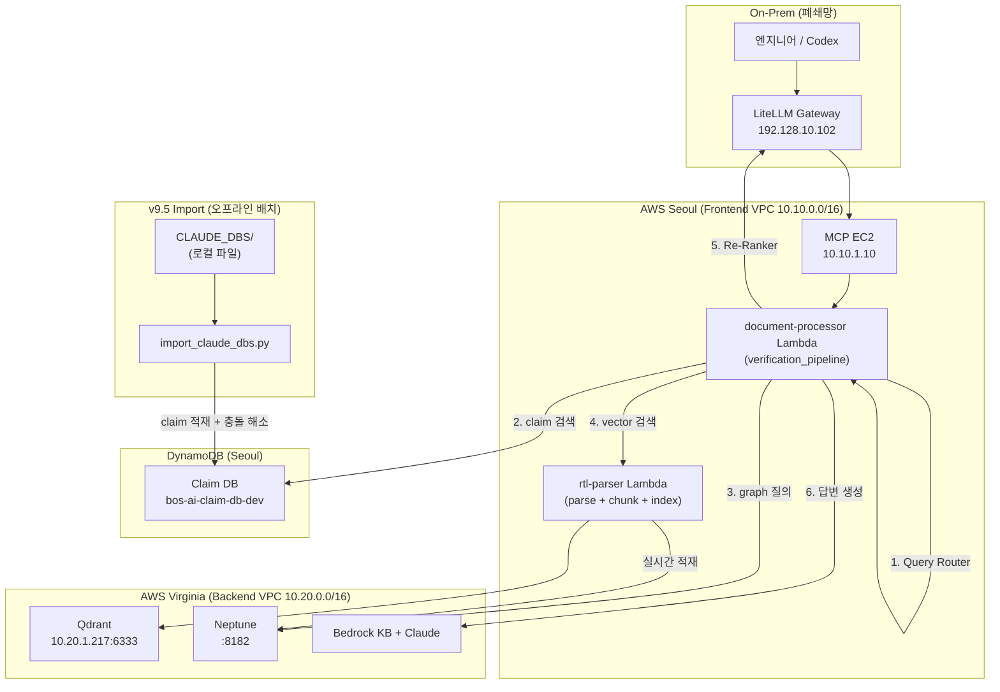
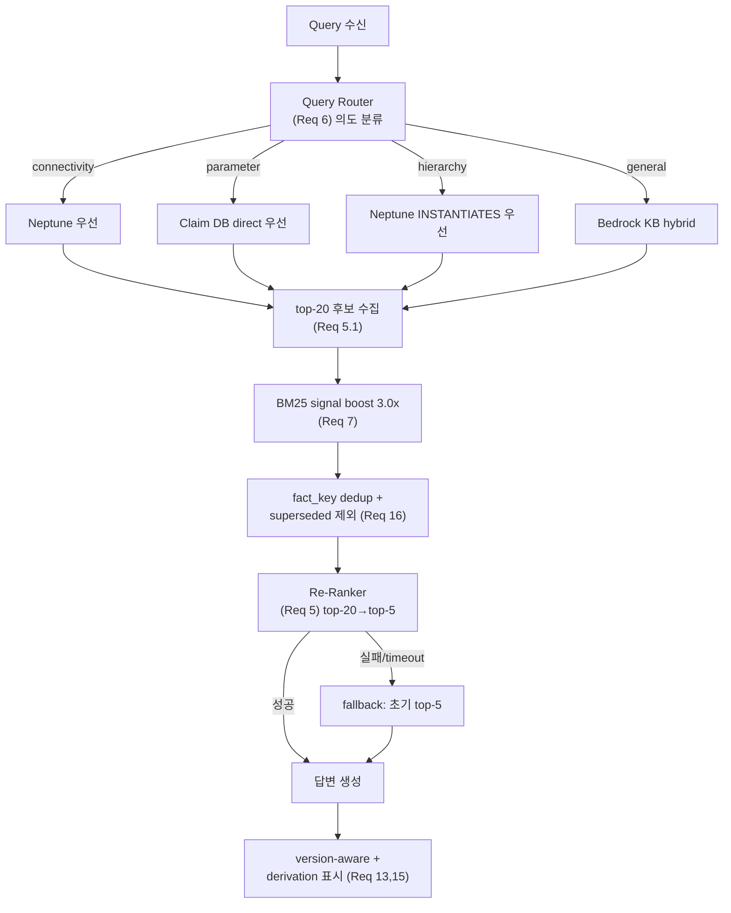
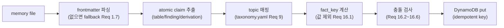
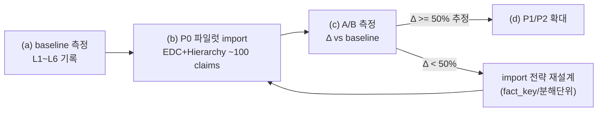
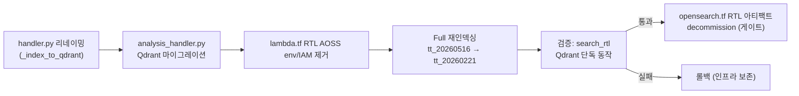

# Design Document

**Feature:** RAG v9.5 Knowledge Import & Retrieval Enhancement

## Overview

v9.5는 두 축으로 구성된다.

1. **Knowledge Import (오프라인)**: NPU 분석팀의 RTL-verified 지식(`test_rtl/Sample/CLAUDE_DBS/`, 51 memory + 10 N1B0 + 5 FB)을 Claim DB(DynamoDB)에 적재하여 RAG가 검색 가능하게 만든다. 일회성/증분 배치 스크립트로 실행한다.
2. **Retrieval Enhancement (온라인)**: document-processor Lambda의 verification_pipeline에 Re-Ranker, Query-Type Routing, BM25 boost를 삽입하고, rtl-parser Lambda의 chunking을 semantic boundary 기반으로 교체한다.

이 둘을 잇는 것이 **Evaluation Framework**다. import "전" baseline을 측정하고, P0 파일럿 후 효과를 정량화하여(Req 17) 추정(NPU 리포트 §6.3)을 실측으로 대체한 뒤에만 P1/P2로 확대한다.

### 설계 원칙

- **기존 파이프라인 비파괴**: verification_pipeline의 8단계 구조를 유지하고, Re-Ranker/Routing은 기존 단계 사이에 삽입한다. 모든 신규 컴포넌트는 환경변수 플래그로 on/off 가능하며 실패 시 기존 경로로 graceful fallback한다.
- **충돌은 import 시점, dedup은 노출 시점**: NPU claim과 파서 claim의 충돌 관계(supersede)는 적재 시 1회 계산하고, 동일 fact 중복 제거는 검색 결과 노출 시점에 수행한다 (Req 16).
- **증분·측정 우선**: 전체 import 전에 baseline 측정 → P0 파일럿 → A/B 측정 게이트를 강제한다 (Req 17).

## Architecture

### 시스템 컨텍스트 (v9.5 추가/변경 컴포넌트)



### Retrieval 흐름 (v9.5 강화 파이프라인)



## Components and Interfaces

### Component 1: CLAUDE_DBS Import Pipeline (신규, 오프라인)

**위치:** `scripts/import_claude_dbs.py` (신규) + `scripts/import_lib/` 모듈

**책임:** memory 파일 파싱 → atomic claim 추출 → 충돌 해소 → Claim DB 적재

**주요 인터페이스:**

```python
def import_claude_dbs(
    source_dir: str,           # "test_rtl/Sample/CLAUDE_DBS/"
    pipeline_id: str,          # "tt_20260221"
    priority_filter: str = None,  # "P0" | "P1" | "P2" | None(전체) — Req 17
    dry_run: bool = False,
) -> ImportSummary:
    """CLAUDE_DBS를 Claim DB에 적재. idempotent (Req 1.6)."""

@dataclass
class ImportSummary:
    total_files_processed: int
    total_claims_created: int
    total_claims_skipped: int      # 중복
    total_evidence_records: int
    files_without_frontmatter: int  # Req 1.7
    conflicts_resolved: int         # Req 16
    execution_time_seconds: float
```

**내부 파이프라인 (파일당):**



**claim 추출 규칙 (Req 2):**

| 소스 패턴 | claim_type | 비고 |
|----------|-----------|------|
| markdown table row | specification | 컬럼 헤더를 context로 보존 (Req 2.1) |
| "Key findings"/"Critical" bullet | finding, priority=high | (Req 2.2) |
| "Before/After" 교정 레코드 | specification + supersedes | corrected 값만 (Req 2.3) |
| "8×2×2×8×2 = 8192" 도출식 | derivation | 전체 체인 보존 (Req 1.3) |

**topic taxonomy** (`scripts/import_lib/topic_taxonomy.yaml`, Req 9.3): MEMORY.md keywords → 정규화 topic 매핑. 미매핑 키워드는 "Uncategorized" + 경고 (Req 9.4).

### Component 2: Conflict Resolver (신규, import 시점)

**위치:** `scripts/import_lib/conflict_resolver.py`

**fact_key 설계 (Req 16.1) — 가장 중요한 결정:**

```python
def compute_fact_key(claim: dict) -> str:
    """값을 제외한 fact 식별 키.
    'SRCA = 256 rows'와 'SRCA = 48 rows'가 같은 키를 갖도록
    asserted value를 제외하고 (대상 엔티티 + 속성명)만 해시한다.
    """
    module = claim.get("module_name", "").lower()
    topic = claim.get("topic", "").lower()
    # claim_text에서 값(숫자/단위)을 마스킹한 후 정규화
    subject = _normalize_subject(claim.get("claim_text", ""))  # 값 토큰 제거
    return hashlib.sha256(f"{module}|{topic}|{subject}".encode()).hexdigest()[:16]
```

**충돌 해소 결정 테이블:**

| NPU claim | 기존 parser claim | 값 비교 | 결정 (Req) |
|-----------|------------------|---------|-----------|
| import됨 | 동일 fact_key 존재 | 값 동일 | parser claim → superseded, NPU 유지 (16.2) |
| import됨 | 동일 fact_key 존재 | 값 상이 | NPU.supersedes_claim_id=parser, parser → superseded (16.3) |
| import됨 (1.0) | 다른 NPU claim (1.0) | 값 상이 | 둘 다 conflicted, operator-review 로그 (16.6) |
| import됨 | 없음 | — | 신규 적재 |

### Component 3: Query Router (신규, 온라인)

**위치:** `lambda_src/query_router.py` (신규 모듈), verification_pipeline의 step (1.5)로 삽입

**인터페이스:**

```python
def classify_query(query: str) -> str:
    """connectivity_query | parameter_query | hierarchy_query | general_query
    규칙 기반 정규식 우선, 모호 시 단일 LLM 호출. < 100ms (Req 6.6)."""

def route_retrieval(query_type: str, query: str, topics: list) -> RetrievalPlan:
    """query_type별 backend 우선순위 반환 (Req 6.2~6.5)."""

@dataclass
class RetrievalPlan:
    primary: str    # "neptune" | "claim_db" | "bedrock_kb"
    secondary: str
    tertiary: str = None
```

기존 `handler.py`의 `classify_query_type`(rtl-parser)과 동일 분류 체계를 공유하되, v9.5는 4-type으로 정규화하고 backend 라우팅을 추가한다.

### Component 4: Re-Ranker (신규, 온라인)

**위치:** `lambda_src/reranker.py` (신규 모듈), verification_pipeline의 답변 생성 직전 삽입

**인터페이스:**

```python
def rerank(query: str, candidates: list, top_k: int = 5) -> list:
    """top-20 후보를 cross-encoder로 재채점, top-5 반환 (Req 5).
    LiteLLM Gateway 경유 Cohere Rerank-v3 호출.
    실패/timeout(500ms) 시 candidates[:top_k] 그대로 반환 (Req 5.5)."""
```

**호출 경로:** document-processor → LiteLLM Gateway(`llm.corp.bos-semi.com`) → Cohere Rerank-v3. 환경변수 `RERANKER_ENABLED`(기본 true), `RERANKER_ENDPOINT`, `RERANKER_TIMEOUT_MS=500`.

> **네트워크 주의:** document-processor Lambda(Seoul VPC)가 On-Prem LiteLLM(192.128.10.102)에 도달하려면 VPN/TGW 경로 + SG egress가 필요하다. design 단계에서 이 경로 확인을 task로 포함한다.

### Component 5: Semantic Boundary Chunker (rtl-parser 교체)

**위치:** `rtl_parser_src/semantic_chunker.py` (신규), `handler.py`의 `_chunk_text` 호출부 교체

**인터페이스:**

```python
def chunk_rtl_semantic(content: str, max_tokens: int = 8000, overlap_tokens: int = 200) -> list[Chunk]:
    """RTL 구문 경계(module/struct/enum/generate/function/task)를 인식하여 분할 (Req 8)."""

@dataclass
class Chunk:
    text: str
    parent_construct_type: str   # module | struct | enum | generate | ...
    parent_construct_name: str
    boundary_type: str           # natural_end | sub_boundary | oversized
```

**경계 처리 우선순위 (Req 8):**
1. 최상위 구문(module/struct/enum/generate/function/task)은 절대 중간 분할 안 함
2. 단일 구문이 max_tokens 초과 → 내부 sub-boundary(always 블록 등)에서 분할 (8.2)
3. struct는 nesting과 무관하게 항상 한 chunk, oversized여도 분리 금지 (8.5, 8.6)
4. 같은 parent의 인접 chunk는 200-token overlap (8.4)

기존 `test_handler_chunking.py`가 회귀 가드로 활용된다.

### Component 6: Evaluation Framework (신규, 오프라인)

**위치:** `test_rtl/evaluation/` (신규)
- `generate_dataset.py` — CLAUDE_DBS → Q&A 쌍 (Req 10)
- `run_eval.py` — RAG API 평가 러너 (Req 11)
- `ground_truth_v9.5.json` — 100+ Q&A 데이터셋 (immutable, Req 10.4, NFR-3)

**평가 인터페이스:**

```python
def run_eval(dataset_path: str, baseline_path: str = None) -> EvalReport:
    """각 질문을 RAG API에 제출, 3차원 채점 (Req 11).
    Retrieval_Recall@5, Answer_Correctness(LLM-judge), Faithfulness."""

@dataclass
class EvalReport:
    mean_recall_at5: float
    mean_correctness: float
    mean_faithfulness: float
    per_topic: dict
    per_difficulty: dict
    root_cause_breakdown: dict   # retrieval_miss/reranker_miss/generation_miss/knowledge_gap (Req 12)
    regression_vs_baseline: dict = None
```

## Data Models

### Claim DB 스키마 확장 (DynamoDB, 기존 테이블에 필드 추가)

기존 claim 레코드에 v9.5 필드를 추가한다. 모두 optional이라 기존 레코드와 호환(NFR-4).

| 필드 | 타입 | 용도 | Req |
|------|------|------|-----|
| `source` | S | `rtl_verified_manual` \| `parser_generated` | 1.4 |
| `confidence_score` | N | 1.0(NPU) / 0.5~0.7(parser) | 1.4, 16.5 |
| `fact_key` | S | 충돌·dedup 키 (GSI 후보) | 16.1 |
| `status` | S | verified \| superseded \| conflicted \| deprecated \| draft | 2.4, 16 |
| `supersedes_claim_id` | S | 교정 대상 claim | 2.3, 16.3 |
| `superseded_by` | S | 역참조 | 16.2 |
| `variant` | S | baseline \| N1B0 | 4.3 |
| `evidence` | M | {file_path, line_number, evidence_type} | 1.2 |
| `claim_type` | S | specification \| finding \| derivation | 1.3, 2 |
| `derived_from` | L | 참조 claim_id 목록 (deferred linking) | 2.6, 2.7 |
| `correction_history` | M | {original_value, corrected_value, correction_date, rtl_evidence} | 15.4 |

**idempotent key (Req 1.6):** `claim_id = sha256(source_file + claim_hash)[:16]`. 동일 입력 재실행 시 동일 claim_id → put_item 덮어쓰기로 중복 방지.

**신규 GSI:** `fact_key-index` (PK: fact_key) — dedup/충돌 조회용. 기존 `topic-index`, `topic-variant-index`는 유지.

### topic_taxonomy.yaml (Req 9.1)

```yaml
EDC:        [edc, node_id, ring, harvest, cdc]
RegisterFile: [register_file, dest, srca, srcb, srcs, latch]
FPU:        [fpu, sfpu, mac, multiplier, num_pair, half_fp_bw]
NIU:        [noc2axi, router, niu, bridge, att, gasket]
Overlay:    [overlay, hierarchy, clock_domain, sram]
SDC:        [sdc, timing, constraint]
TurboQuant: [turboquant, quantization, compression, fwht]
DFX:        [dft, scan, bist, ijtag, dfx]
Firmware:   [firmware, test, dv]
```

### Evaluation Dataset 스키마 (Req 10.3)

```json
{
  "question": "What is the correct SRCA row count for N1B0?",
  "expected_answer": "48 (not 256) — SRCS_NUM_ROWS_16B",
  "source_memory_id": "M40",
  "topic": "RegisterFile",
  "difficulty": "medium",
  "expected_claims": ["<claim_id>"],
  "adversarial": true
}
```

## Correctness Properties

property-based testing(PBT)으로 검증할 불변식. `tests/properties/` 또는 모듈별 `test_*_pbt.py`에 구현.

### Property 1: Import Idempotency

임의의 memory 파일 집합에 대해 `import()`를 2회 실행하면 Claim DB의 claim 집합이 1회 실행과 동일하다 (claim_id 기준 멱등). **Validates: Requirements 1.6**

### Property 2: Claim Atomicity

추출된 모든 claim은 정확히 하나의 검증 가능한 fact를 갖는다 — claim_text에 독립 검증 가능한 assertion이 2개 이상 포함되지 않는다 (compound 금지). **Validates: Requirements 2.5**

### Property 3: Confidence Invariant

CLAUDE_DBS에서 import된 모든 claim은 `confidence_score == 1.0 AND source == "rtl_verified_manual"`. **Validates: Requirements 1.4**

### Property 4: Variant Strictness

M* 파일에서 생성된 claim은 항상 `variant == "baseline"` (절대 N1B0 아님). **Validates: Requirements 4.3**

### Property 5: fact_key Value Independence

동일 (module, topic, subject)이고 asserted value만 다른 두 claim은 동일 fact_key를 갖는다. **Validates: Requirements 16.1**

### Property 6: Supersede Acyclicity

충돌 해소 후, superseded claim은 정확히 하나의 active claim에 의해 superseded되며 순환(A supersedes B supersedes A)이 없다. **Validates: Requirements 16.3**

### Property 7: Exposure Dedup Uniqueness

임의의 검색 결과 집합에서, 노출된 claim들은 fact_key가 모두 유일하다 (동일 fact_key 중복 노출 없음). **Validates: Requirements 16.7**

### Property 8: Superseded Non-Exposure

기본 검색 결과에 `status == "superseded"` claim이 포함되지 않는다. **Validates: Requirements 16.4**

### Property 9: Chunk Syntactic Integrity

임의의 RTL 입력에 대해, 생성된 chunk들에서 어떤 struct/enum 정의도 둘 이상의 chunk에 걸쳐 분할되지 않는다. **Validates: Requirements 8.1, 8.5**

### Property 10: Chunk Reconstructability

chunk들을 overlap 제거 후 순서대로 이으면 원본 content가 복원된다 (정보 손실 없음). **Validates: Requirements 8.1**

### Property 11: Oversized Struct Preservation

max_tokens를 초과하는 단일 struct는 분할되지 않고 1개 oversized chunk로 유지된다. **Validates: Requirements 8.6**

### Property 12: Re-Ranker Graceful Fallback

Re-Ranker가 실패/timeout이면 반환 결과는 초기 retrieval의 top-k와 정확히 동일하다 (graceful degradation, 결과 손실 없음). **Validates: Requirements 5.5**

### Property 13: Confidence Tie-Break Ordering

Re-Ranker 점수가 동률인 후보들은 confidence_score 내림차순으로 정렬된다. **Validates: Requirements 16.5**

### Property 14: Query Router Totality

임의의 비어있지 않은 query는 정확히 하나의 query_type으로 분류된다 (4개 중 하나, 누락/중복 없음). **Validates: Requirements 6.1**

## Error Handling

| 실패 지점 | 처리 | Req |
|----------|------|-----|
| frontmatter 누락 | 파일명/MEMORY.md fallback, skip 안 함 | 1.7 |
| topic 미매핑 | "Uncategorized" + 경고; 로깅 실패해도 import 계속 | 9.4 |
| derived_from 대상 미처리 | deferred linking (나중에 연결) | 2.7 |
| Re-Ranker 불가용 | 초기 top-5 fallback + 경고 | 5.5 |
| Neptune 질의 실패 | 빈 결과 + neptune_fallback=true, 파이프라인 계속 | 6 |
| 1.0 vs 1.0 값 모순 | 둘 다 conflicted, auto-supersede 안 함, operator 로그 | 16.6 |
| 버전 토픽 부재 | 해당 토픽 빈 결과 (구버전 혼합 금지) | 15.2 |

## Observability (NFR-5)

CloudWatch namespace `BOS-AI/RAG-v9.5`. 주요 이벤트/메트릭:
- `import_conflict_resolved` (fact_key, resolution=dedup\|supersede\|conflict) — Req 16.8
- `retrieval_dedup` (fact_key, exposed_claim_id, deduped_count) — Req 16.8
- `fb_rule_applied` (rule_id, claim_id, outcome) — Req 3.5
- 메트릭: ImportClaimCount, RerankerLatency, QueryRouterAccuracy, EvalScoreAvg

## Rollout Plan (Req 17 — 증분 게이트)



- baseline 측정 없이 import 진행 금지 (17.2)
- 확정 목표 점수는 파일럿 실측 후에만 publish (17.7)

## Testing Strategy

- **단위 테스트**: 각 신규 모듈(import_lib, query_router, reranker, semantic_chunker)에 대해 happy path + 에러 경로
- **PBT**: 위 P1~P14를 `hypothesis`(Python) 또는 기존 `test_*_pbt.py` 패턴으로 구현
- **회귀**: 기존 `test_handler_chunking.py`, `test_search_dedup.py`로 chunking/dedup 회귀 가드
- **통합/평가**: Evaluation Framework(Req 11) 자체가 end-to-end 통합 테스트 역할 — import 전/후 A/B로 효과 측정
- **idempotency 테스트**: import 2회 실행 후 claim 수 동일 검증 (P1)

## Dependencies & Open Questions

- **Re-Ranker 모델 가용성**: Cohere Rerank-v3가 On-Prem LiteLLM에 등록되어 있는지, Bedrock 호환 rerank 대안이 있는지 — task에서 확인
- **document-processor → On-Prem LiteLLM 네트워크 경로**: Seoul VPC → VPN/TGW → 192.128.10.102 도달성 + SG egress 확인 필요
- **fact_key subject 정규화 정확도**: `_normalize_subject`가 값은 제거하되 엔티티/속성은 보존해야 함 — P5로 검증하되 실제 CLAUDE_DBS 샘플로 튜닝 필요
- **baseline 측정 선행**: Req 17.2에 따라 import 전 L1~L6 baseline이 없으면 전체 롤아웃 차단

---

# Addendum A: Filelist 임베딩 스코프 & OpenSearch→Qdrant 단일화 설계

> **Added:** 2026-06-12
> **대응 요구사항:** Requirement 18 (used_in_n1 boost), Requirement 19 (OpenSearch 제거 + Qdrant 단일화 + Full 재인덱싱)
> **조사 근거(확정):** S3 트리 `rtl-sources/tt_20260516/` 아래 `tt_rtl/`(전체) ↔ `used_in_n1/tt_rtl/`(N1 부분집합) 물리 분리, filelist 경로 S3 키 1:1 보존. OpenSearch 잔존: `analysis_handler.py`(분석 스테이지 전체) + `lambda.tf`(document-processor env/IAM). `handler.py`는 Qdrant 적재 완료(함수명 `_index_to_opensearch()` 오칭).

## A.1 used_in_n1 태깅 (Req 18)

**삽입점:** `rtl_parser_src/handler.py`에서 `metadata["file_path"] = key`가 설정되는 모든 지점(모듈 파싱, `_process_text_file`, filelist hierarchy 등). 해당 지점 직후 1줄로 판정:

```python
def _is_used_in_n1(s3_key: str) -> bool:
    """S3 키에 '/used_in_n1/' 세그먼트 포함 여부로 판정 (basename 매칭 불필요)."""
    return "/used_in_n1/" in s3_key

# metadata["file_path"] = key 직후
metadata["used_in_n1"] = _is_used_in_n1(key)
```

- Qdrant payload와 DynamoDB claim 양쪽에 `used_in_n1` 필드가 실린다 (기존 metadata dict에 추가되므로 두 경로 모두 자동 반영).
- **검색 boost (Req 18.3):** Qdrant 검색 결과 점수 후처리 단계(`handler.py`의 `qdrant_search` 결과 가공 또는 `qdrant_client.search`)에서 `used_in_n1: true`면 score × `USED_IN_N1_BOOST`(기본 2.0). 기존 query-type별 동적 boost(v9)와 곱연산으로 합성한다.

**filelist `+define+` 파싱 (Req 18.6):** import 도구(`scripts/import_lib/` 또는 별도 `filelist_parser.py`)가 `.f`를 읽어 `+define+NAME[=VAL]`를 추출 → `claim_type: pipeline_config`, `topic: BuildConfig`, `pipeline_id` 연관 claim으로 적재. `+incdir+`는 경로 메타데이터로만 기록(claim 미생성, Req 18.7).

## A.2 OpenSearch → Qdrant 마이그레이션 (Req 19)

### A.2.1 handler.py 리네이밍 (Req 19.1)

`_index_to_opensearch()` → `_index_to_qdrant()`. 순수 리네이밍 + 호출부 정합. 동작 불변. `_flush_index_buffer()`가 실제 Qdrant batch upsert를 호출하므로 내부 로직 변경 없음.

### A.2.2 analysis_handler.py 마이그레이션 (Req 19.2~19.3)

현재 OpenSearch 헬퍼를 Qdrant 등가물로 교체한다:

| 현재 (OpenSearch) | 교체 (Qdrant) | 비고 |
|------|------|------|
| `_opensearch_scroll_query(pipeline_id, analysis_type)` | `_qdrant_scroll_query(...)` | Qdrant `scroll` API + filter(`pipeline_id`, `analysis_type`) |
| `_index_document(doc)` | `_qdrant_upsert_doc(doc)` | 단일 upsert |
| `_bulk_index_documents(docs)` | `_qdrant_upsert_batch(docs)` | batch upsert (size 15) |
| `_update_document(doc_id, fields)` | `_qdrant_set_payload(doc_id, fields)` | Qdrant `set_payload` |
| `handle_backfill_pipeline_id` | Qdrant scroll + set_payload backfill | `_update_by_query` 부재는 동일하게 scroll 기반으로 |
| `_get_opensearch_auth()` (SigV4 aoss) | 제거 | Qdrant는 api-key 헤더 (handler.py `_init_qdrant_api_key` 재사용) |

- **페이지네이션 등가성 (Req 19.3):** OpenSearch `search_after`(_id 정렬) → Qdrant `scroll`(offset/next_page_offset). 결과 누락 0 보장.
- **공유 모듈화:** `handler.py`와 `analysis_handler.py`가 Qdrant 접근 코드를 중복하지 않도록 `qdrant_client` 모듈(이미 존재, `batch_index_documents`/`search` 제공)에 scroll/set_payload 헬퍼를 추가하고 양쪽이 공유한다.

### A.2.3 Terraform 정리 (Req 19.4, 19.8)

- **즉시 제거(RTL 무관 확인 후):** `lambda.tf`의 RTL 관련 `OPENSEARCH_*` env, `aoss:APIAccessAll` IAM 중 RTL 전용분.
- **검증 후 게이트 제거(criterion 8):** `opensearch.tf`의 `aws_opensearchserverless_access_policy.rtl_index`, RTL 인덱스, RTL 전용 SG/VPCE.
- **유지:** Bedrock KB(`bos-ai-vectors`) collection, access policy, VPCE — Bedrock KB가 의존하면 절대 삭제 금지. 제거 전 `bedrock-kb.tf`/module 의존성 grep으로 공유 여부 확정.

### A.2.4 Full 재인덱싱 (Req 19.5~19.7)

`scripts/reindex_all_rtl.py` 사용. 비용 제어: reserved concurrency 10~20, 512MB, 300s, `QDRANT_BATCH_SIZE=15`. idempotent upsert(claim_id = sha256 기반)로 throttle/resume 안전. 대상: `tt_20260516` 우선 → `tt_20260221`. 완료 후 MCP `search_rtl`로 module/port/signal/used_in_n1 대표 질의 검증.

## A.3 Correctness Properties 추가

### Property 15: used_in_n1 Path Determinism
임의의 S3 키에 대해 `_is_used_in_n1(key)`는 `/used_in_n1/` 세그먼트 포함 여부와 정확히 일치한다 (basename·대소문자 무관, 세그먼트 단위). **Validates: Requirements 18.1, 18.2**

### Property 16: used_in_n1 Boost Monotonicity
동일 base relevance를 갖는 두 후보 중 `used_in_n1: true`인 후보의 최종 점수는 `false`인 후보보다 항상 크거나 같다 (boost ≥ 1.0). **Validates: Requirements 18.3, 18.4**

### Property 17: Migration Query Equivalence
임의의 (pipeline_id, analysis_type)에 대해 Qdrant scroll 조회 결과 집합은 동일 입력의 OpenSearch 조회 결과 집합과 논리적으로 동일하다 (문서 누락/중복 없음). **Validates: Requirements 19.3**

### Property 18: Reindex Idempotency
Full 재인덱싱을 2회 실행해도 Qdrant point 집합(id 기준)이 1회 실행과 동일하다. **Validates: Requirements 19.6**

## A.4 Data Model 추가 (Qdrant payload / claim 필드)

| 필드 | 타입 | 용도 | Req |
|------|------|------|-----|
| `used_in_n1` | bool | N1 부분집합 여부 (검색 boost 키) | 18.1 |
| `claim_type: pipeline_config` | enum 확장 | filelist `+define+` 매크로 claim | 18.6 |
| `topic: BuildConfig` | topic 확장 | 빌드 설정 토픽 | 18.6 |

## A.5 마이그레이션 흐름 (게이트)



검증(V) 통과 전에는 OpenSearch 인프라를 삭제하지 않는다 (롤백 가능성 보존, Req 19.8).
