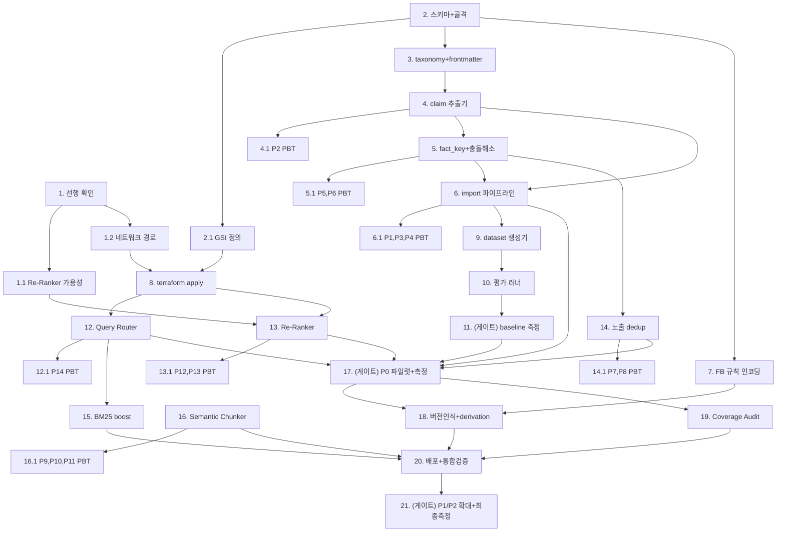
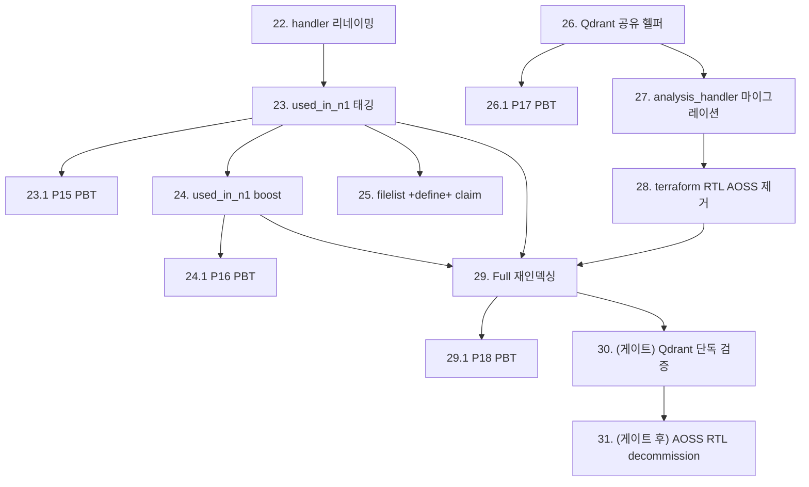

# Implementation Plan

## Overview

설계(design.md)의 6개 컴포넌트와 14개 Correctness Property를 구현 작업으로 분해한다. 증분 롤아웃(Req 17) 순서를 따른다: 선행 확인 → Import 코어 → 평가 baseline → Retrieval 강화 → P0 파일럿 → 측정 게이트 → 확대.

게이트 작업(11, 17, 21)은 측정 결과 없이 다음 단계로 진행할 수 없는 차단점이다.

## Tasks

- [ ] 1. 선행 의존성 및 네트워크 경로 확인
  - design "Dependencies & Open Questions"의 미해결 항목을 코드 작성 전에 확정한다
  - _Requirements: NFR-2, NFR-4_

- [ ] 1.1 Re-Ranker 모델 가용성 및 LiteLLM 등록 확인
  - On-Prem LiteLLM(`llm.corp.bos-semi.com`)에 Cohere Rerank-v3 또는 Bedrock 호환 rerank 엔드포인트가 등록되어 있는지 확인하는 점검 스크립트 작성 (`scripts/check_reranker_endpoint.py`)
  - 미등록 시 대안(로컬 cross-encoder, Bedrock rerank) 후보를 문서화
  - _Requirements: 5.2, 5.4_

- [ ] 1.2 document-processor → On-Prem LiteLLM 네트워크 도달성 확인
  - document-processor Lambda SG egress에 On-Prem(192.128.0.0/16) 경로가 있는지 점검하고, 없으면 추가에 필요한 SG 규칙을 terraform에 정의 (apply는 task 8에서)
  - Lambda에서 LiteLLM 엔드포인트로 연결 테스트하는 진단 함수 작성
  - _Requirements: 5.2, NFR-2_

- [ ] 2. Claim DB 스키마 확장 및 import 라이브러리 골격
  - `scripts/import_lib/` 패키지 생성 (`__init__.py`, 모듈 스텁)
  - design "Data Models"의 v9.5 claim 필드를 dataclass `Claim`으로 정의 (source, confidence_score, fact_key, status, supersedes_claim_id, superseded_by, variant, evidence, claim_type, derived_from, correction_history)
  - 기존 claim 레코드와의 호환을 위해 모든 신규 필드를 optional로 처리
  - _Requirements: 1.4, 2.3, 2.4, 4.3, 15.4_

- [ ] 2.1 fact_key-index GSI를 terraform에 정의
  - `claim-db.tf`에 `fact_key-index` GSI(PK: fact_key) 추가 (apply는 task 8)
  - _Requirements: 16.1_

- [ ] 3. topic taxonomy 및 frontmatter 파서
  - `scripts/import_lib/topic_taxonomy.yaml` 작성 (design의 keyword→topic 매핑)
  - `scripts/import_lib/frontmatter.py`: YAML frontmatter 파싱 + 없을 때 파일명/MEMORY.md 인덱스 fallback
  - 단위 테스트: frontmatter 있는 파일(m31, m40), 없는 파일 모두 처리
  - _Requirements: 1.5, 1.7, 9.1, 9.3, 9.4_

- [ ] 4. atomic claim 추출기
  - `scripts/import_lib/claim_extractor.py`: markdown 본문에서 table row / "Key findings" bullet / Before-After 교정 / 도출식(derivation)을 각각 atomic claim으로 추출
  - RTL file:line 참조(예: `tt_tensix_pkg.sv:35`)를 evidence 필드로 파싱
  - _Requirements: 1.2, 1.3, 2.1, 2.2, 2.3_

- [ ] 4.1 Property 2 (Claim Atomicity) PBT 작성
  - 추출된 각 claim의 claim_text가 단일 검증 가능 fact만 포함하는지 검증하는 property test
  - _Requirements: 2.5_

- [ ] 5. fact_key 계산 및 충돌 해소기
  - `scripts/import_lib/conflict_resolver.py`: `compute_fact_key`(값 제외 정규화) + 충돌 해소 결정 테이블 구현
  - 값 동일 → dedup(parser superseded), 값 상이 → supersede, 1.0 vs 1.0 모순 → 둘 다 conflicted + operator 로그
  - deferred linking(derived_from 나중 연결) 처리
  - _Requirements: 2.6, 2.7, 16.1, 16.2, 16.3, 16.6_

- [ ] 5.1 Property 5, 6 (fact_key 값 독립성, Supersede 비순환) PBT 작성
  - 값만 다른 claim이 동일 fact_key를 갖는지, supersede 관계에 순환이 없는지 검증
  - _Requirements: 16.1, 16.3_

- [ ] 6. import 메인 파이프라인 및 멱등 적재
  - `scripts/import_claude_dbs.py`: source-dir 순회 → 추출 → 충돌 해소 → DynamoDB put (idempotent claim_id) → ImportSummary 반환
  - `--priority-filter P0|P1|P2`, `--dry-run` 옵션 (Req 17 증분 지원)
  - confidence_score=1.0, source=rtl_verified_manual 강제 적용
  - _Requirements: 1.1, 1.4, 1.6, 1.8, 4.1, 4.3_

- [ ] 6.1 Property 1, 3, 4 (멱등성, Confidence invariant, Variant 엄격성) PBT 작성
  - 2회 실행 시 claim 집합 동일, 모든 import claim이 confidence=1.0, M* 파일이 항상 baseline variant인지 검증
  - _Requirements: 1.4, 1.6, 4.3_

- [ ] 7. FB1-FB4 피드백 규칙을 HDD generator 프롬프트에 인코딩
  - document-processor `lambda_src`의 HDD generator 프롬프트에 FB4(RTL 대조 규칙), FB3(EDC 최신 버전) 삽입
  - rtl_verified_manual claim은 [TBC] 태그 없이 표시, 파서 claim과 충돌 시 자동 conflicted 마킹
  - fb_rule_applied 구조화 로그
  - _Requirements: 3.1, 3.2, 3.3, 3.4, 3.5_

- [ ] 8. terraform apply (GSI + SG)
  - task 2.1, 1.2에서 정의한 fact_key-index GSI와 SG egress 규칙을 apply
  - apply 후 GSI active 상태, SG 규칙 반영 확인
  - _Requirements: 16.1, 5.2_

- [ ] 9. Evaluation Framework — dataset 생성기
  - `test_rtl/evaluation/generate_dataset.py`: CLAUDE_DBS → 100+ Q&A 쌍 (table/finding/derivation/correction 기반), adversarial 10+ 포함
  - `ground_truth_v9.5.json` 출력, difficulty/topic/expected_claims 필드 포함
  - _Requirements: 10.1, 10.2, 10.3, 10.5_

- [ ] 10. Evaluation Framework — 평가 러너
  - `test_rtl/evaluation/run_eval.py`: 각 질문을 RAG API 제출 → Retrieval_Recall@5, Answer_Correctness(LLM-judge), Faithfulness 채점
  - per-topic/difficulty breakdown, root cause 분류(retrieval/reranker/generation/knowledge_gap), baseline 비교
  - _Requirements: 11.1, 11.2, 11.3, 11.4, 11.5, 11.6, 12.1, 12.2, 12.3, 12.4_

- [ ] 11. (게이트) import 전 baseline 측정
  - 현재 RAG 상태(import 전)로 run_eval 실행하여 L1~L6 baseline 기록 → `test_rtl/evaluation/baseline_pre_import.json`
  - 이 산출물이 없으면 이후 P0 import(task 17) 진행 금지
  - _Requirements: 17.1, 17.2_

- [ ] 12. Query-Type Router (온라인)
  - `lambda_src/query_router.py`: 4-type 분류(규칙 우선, 모호 시 단일 LLM 호출) + backend 라우팅 plan
  - verification_pipeline step (1.5)로 삽입, 라우팅 결정 로그
  - _Requirements: 6.1, 6.2, 6.3, 6.4, 6.5, 6.6, 6.7_

- [ ] 12.1 Property 14 (Router Totality) PBT 작성
  - 임의 query가 정확히 하나의 type으로 분류되는지 검증
  - _Requirements: 6.1_

- [ ] 13. Re-Ranker (온라인)
  - `lambda_src/reranker.py`: top-20 후보를 LiteLLM 경유 cross-encoder로 재채점 → top-5, timeout 500ms, 실패 시 초기 top-5 fallback
  - confidence_score 동률 tie-break, RERANKER_ENABLED 플래그
  - verification_pipeline 답변 생성 직전 삽입
  - _Requirements: 5.1, 5.3, 5.5, 5.6, 5.7, 16.5_

- [ ] 13.1 Property 12, 13 (Re-Ranker fallback, Confidence tie-break) PBT 작성
  - Re-Ranker 실패 시 초기 top-k와 동일, 동률 시 confidence 내림차순 정렬 검증
  - _Requirements: 5.5, 16.5_

- [ ] 14. 노출 시점 dedup 및 superseded 제외 (온라인)
  - verification_pipeline의 claim 검색 결과에서 fact_key 기준 dedup(최고 우선순위 1개만 노출, deduped_count 주석) + status=superseded 제외
  - retrieval_dedup 구조화 로그
  - _Requirements: 16.4, 16.7, 16.8_

- [ ] 14.1 Property 7, 8 (노출 dedup 유일성, superseded 비노출) PBT 작성
  - 노출 claim의 fact_key 유일성, superseded claim 비노출 검증
  - _Requirements: 16.4, 16.7_

- [ ] 15. BM25 signal name boost (온라인)
  - hybrid 검색에서 module_name/signal_name 정확 일치에 3.0x boost, RTL 식별자 exact-match MUST 절 추가
  - BM25_SIGNAL_BOOST 환경변수
  - _Requirements: 7.1, 7.2, 7.3, 7.4_

- [ ] 16. Semantic Boundary Chunker (rtl-parser)
  - `rtl_parser_src/semantic_chunker.py`: module/struct/enum/generate/function/task 경계 인식 분할, oversized struct 보존, 200-token overlap, chunk 메타데이터 태깅
  - `handler.py`의 `_chunk_text` 호출부를 교체
  - 기존 `test_handler_chunking.py` 회귀 통과 확인
  - _Requirements: 8.1, 8.2, 8.3, 8.4, 8.5, 8.6, 8.7_

- [ ] 16.1 Property 9, 10, 11 (구문 무결성, 재구성 가능성, oversized 보존) PBT 작성
  - struct/enum 비분할, overlap 제거 후 원본 복원, oversized struct 단일 chunk 유지 검증
  - _Requirements: 8.1, 8.5, 8.6_

- [ ] 17. (게이트) P0 파일럿 import + A/B 측정
  - `import_claude_dbs.py --priority-filter P0` 실행 (EDC M1-M4·M19-M20 + Hierarchy M11-M14, 약 100 claims)
  - import 후 run_eval 재실행 → baseline 대비 Δ 계산
  - Δ가 추정의 50% 이상이면 task 18 진행, 미만이면 import 전략(fact_key/분해 단위) 재설계 후 재시도
  - _Requirements: 17.3, 17.4, 17.5, 17.6_

- [ ] 18. 버전 인식 응답 및 derivation 표시 (HDD generation)
  - 교정 claim에 `[Corrected in v1.00]` 표기, 최신 버전만 반환(구버전 토픽은 빈 결과), derivation chain 항상 표시(numerical fact), show_derivations는 표시 형식만 제어
  - _Requirements: 13.1, 13.2, 13.3, 13.4, 13.5, 15.1, 15.2, 15.3, 15.4_

- [ ] 19. Coverage Audit 통합 (HDD generation)
  - HDD 섹션 생성 시 coverage_ratio 계산, < 0.6 경고, coverage matrix appendix, < 0.3 시 사용자 안내
  - _Requirements: 14.1, 14.2, 14.3, 14.4_

- [ ] 20. 배포 및 통합 검증
  - rtl-parser(chunker) + document-processor(router/reranker/dedup/bm25/version/coverage) Lambda 패키지 빌드 및 배포
  - CloudWatch `BOS-AI/RAG-v9.5` 네임스페이스 메트릭/이벤트 발행 확인
  - MCP를 통한 end-to-end 검색 테스트
  - _Requirements: NFR-5_

- [ ] 21. (게이트) P1/P2 확대 import 및 최종 측정
  - task 17 게이트 통과 시에만 진행: `--priority-filter P1`, `P2` 순차 import
  - 최종 run_eval로 Success Criteria 대비 실측 점수 기록, 확정 목표 점수 publish
  - _Requirements: 17.5, 17.7_

## Task Dependency Graph



**핵심 경로:** 2 → 3 → 4 → 5 → 6 → 9 → 10 → 11(baseline 게이트) → 12/13/14 → 17(P0 게이트) → 18/19/20 → 21(확대 게이트)

**병렬 가능:** Semantic Chunker(16)는 rtl-parser 독립 작업이라 Import 트랙과 병렬 진행 가능. FB 규칙(7), BM25(15)도 독립성 높음.

```json
{
  "waves": [
    { "wave": 1, "tasks": ["1", "1.1", "1.2", "2", "16"] },
    { "wave": 2, "tasks": ["2.1", "3", "7", "16.1"] },
    { "wave": 3, "tasks": ["4", "8"] },
    { "wave": 4, "tasks": ["4.1", "5"] },
    { "wave": 5, "tasks": ["5.1", "6"] },
    { "wave": 6, "tasks": ["6.1", "9", "12"] },
    { "wave": 7, "tasks": ["10", "12.1", "13", "14", "15"] },
    { "wave": 8, "tasks": ["11", "13.1", "14.1"] },
    { "wave": 9, "tasks": ["17"] },
    { "wave": 10, "tasks": ["18", "19"] },
    { "wave": 11, "tasks": ["20"] },
    { "wave": 12, "tasks": ["21"] }
  ]
}
```

## Notes

- **게이트 규율 (Req 17):** Task 11(baseline) 산출물 없이 Task 17(P0 import) 진행 금지. Task 17의 Δ가 추정 50% 미만이면 Task 21로 진행하지 않고 import 전략 재설계.
- **비파괴 원칙:** 모든 온라인 컴포넌트(12,13,14,15)는 환경변수 플래그로 on/off 가능해야 하며, 실패 시 기존 verification_pipeline 경로로 fallback.
- **PBT 우선:** 각 코어 모듈(4,5,6,12,13,14,16)은 구현 직후 대응 Property test를 작성하여 회귀를 막는다.
- **Lambda 비용:** 재인덱싱/배포 시 reserved concurrency와 batch 크기를 조절하여 Neptune/DynamoDB 과부하를 피한다 (v9.4 경험 반영).
- **테스트 자동 추가 금지:** PBT는 task에 명시된 항목만 작성하고, 명시되지 않은 추가 테스트는 만들지 않는다.

---

# Addendum A: Filelist 임베딩 스코프 & OpenSearch→Qdrant 단일화 작업

> **Added:** 2026-06-12
> **대응:** Requirement 18, 19 / design.md Addendum A
> **순서 원칙:** handler.py 리네이밍(저위험) → used_in_n1 태깅 → analysis_handler.py 마이그레이션 → terraform RTL AOSS 제거 → Full 재인덱싱 → 검증 게이트 → (게이트 통과 후) OpenSearch RTL 인프라 decommission. 검증 전 인프라 삭제 금지.

## Tasks

- [x] 22. handler.py OpenSearch 오칭 함수 리네이밍
  - `rtl_parser_src/handler.py`의 `_index_to_opensearch()` → `_index_to_qdrant()`로 리네이밍하고 모든 호출부 정합 (순수 리네이밍, 동작 변경 금지)
  - 기존 `test_*` 테스트가 함수명을 참조하면 함께 갱신
  - `py -m pytest`로 회귀 통과 확인
  - **완료(2026-06-12):** handler.py 15곳(정의1+호출14), test_handler_integration.py 7곳 토큰 치환. 71 passed. `package/handler.py`(빌드 산출물)는 배포 시 재빌드.
  - _Requirements: 19.1, 19.9_

- [x] 23. used_in_n1 메타데이터 태깅 (handler.py)
  - `_is_used_in_n1(s3_key)` 헬퍼 추가 (`/used_in_n1/` 세그먼트 포함 여부, basename 매칭 금지)
  - 단일 chokepoint `_index_to_qdrant`에서 `metadata["used_in_n1"]` 채움 (ALL records 보장 — 모듈/claim/edge/텍스트 전부)
  - qdrant_client.py payload 3곳(index_document/batch_index_documents/_point_to_result)에 `used_in_n1` 반영, flush 로그에 `used_in_n1_count`
  - **완료(2026-06-12):** 호환성 발견 — batch_index_documents가 payload 재구성하므로 qdrant_client.py에도 추가 필수.
  - _Requirements: 18.1, 18.2, 18.8, 18.9_

- [x] 23.1 Property 15 (used_in_n1 Path Determinism) PBT 작성
  - 임의 S3 키에 대해 `_is_used_in_n1`가 세그먼트 포함 여부와 정확히 일치 검증
  - **완료(2026-06-12):** `test_used_in_n1_pbt.py` (basename 매칭 금지·None/빈 엣지 포함). 7 passed.
  - _Requirements: 18.1, 18.2_

- [x] 24. used_in_n1 검색 boost (handler.py 검색 경로)
  - `_apply_used_in_n1_boost` 헬퍼: `used_in_n1: true`면 score × `USED_IN_N1_BOOST`(기본 2.0, env), 기존 query-type boost와 곱연산 합성
  - dedup **이전** 적용 + 동점 시 `used_in_n1: true` 우선 정렬
  - **완료(2026-06-12):** 79 passed (회귀 포함).
  - _Requirements: 18.3, 18.4, 18.5_

- [x] 24.1 Property 16 (used_in_n1 Boost Monotonicity) PBT 작성
  - 동일 base relevance에서 used_in_n1=true 후보 최종 점수 ≥ false 후보 검증
  - **완료(2026-06-12):** `test_used_in_n1_pbt.py` monotonicity + tie-break 우선 + 빈결과 no-op.
  - _Requirements: 18.3, 18.4_

- [ ] 25. filelist `+define+` 파싱 및 pipeline_config claim 적재
  - `.f` filelist에서 `+define+NAME[=VAL]` 추출 → `claim_type: pipeline_config`, `topic: BuildConfig`, pipeline_id 연관 claim 적재
  - `+incdir+`는 경로 메타데이터로만 기록 (claim 미생성)
  - _Requirements: 18.6, 18.7_

- [x] 26. Qdrant 공유 헬퍼 추가 (scroll / set_payload)
  - `qdrant_client` 모듈에 `scroll_query(pipeline_id, analysis_type)`, `set_payload`, `index_document`, `batch_index_documents` 헬퍼
  - handler.py / analysis_handler.py 양쪽이 공유하도록 설계 (중복 금지)
  - **완료(2026-06-12):** scroll_query/set_payload/index_document/batch_index_documents는 이미 존재(이전 세션). 본 세션에서 **clear_index용 `delete_by_filter` 추가**(빈 필터 거부 안전장치). analysis_handler `_scroll_query`/`_index_document`/`_bulk_index_documents`/`_update_document`가 위임.
  - _Requirements: 19.2, 19.3_

- [ ] 26.1 Property 17 (Migration Query Equivalence) PBT 작성
  - 임의 (pipeline_id, analysis_type)에 대해 Qdrant scroll 결과가 OpenSearch 조회와 논리 동일(누락/중복 없음) 검증
  - **보류(2026-06-12):** OpenSearch 코드가 제거되어 런타임 동등성 비교 대상이 사라짐 → property 정의가 부분 무효화됨. 등가성은 `test_analysis_handler.py`(41 passed, Qdrant scroll 경로 전체 행사)로 간접 검증됨. 별도 PBT는 OpenSearch 부재로 의미 없어 작성하지 않음(허위 테스트 방지).
  - _Requirements: 19.3_
  - _Requirements: 19.3_

- [x] 27. analysis_handler.py OpenSearch → Qdrant 마이그레이션
  - 분석 스테이지 전체(hierarchy/clock_domain/dataflow/topic/claim/hdd_section/variant_delta/backfill)의 `_opensearch_*` 호출을 task 26의 Qdrant 헬퍼로 교체
  - `_get_opensearch_auth()` 제거, `RTL_OPENSEARCH_*` env 의존 제거
  - 각 스테이지 단위 테스트로 결과 동등성 확인
  - **완료(2026-06-12):** 핵심 스테이지는 이전 세션에 이미 Qdrant로 전환됨. 그러나 **부분 마이그레이션 버그 발견** — `handle_backfill_pipeline_id`/`handle_clear_index`/`handle_chip_config` 3개가 제거된 심볼(`OPENSEARCH_ENDPOINT`/`_get_opensearch_auth`)을 참조해 런타임 NameError 상태였음. 수정: backfill→deprecation no-op(Full 재인덱싱이 대체), clear_index→`delete_by_filter`, chip_config→`_scroll_query`+Python 필터. raw OpenSearch 코드 잔존 0, test_analysis_handler 41 passed. test 픽스처 dead env(RTL_OPENSEARCH_*)도 QDRANT_*로 정리.
  - _Requirements: 19.2, 19.3, 19.9_

- [x] 28. terraform RTL AOSS env/IAM 제거 (Bedrock KB 보존)
  - `lambda.tf` document-processor의 RTL 관련 `OPENSEARCH_*` env, `aoss:APIAccessAll` IAM 중 RTL 전용분 제거
  - Bedrock KB 공유 여부를 `bedrock-kb.tf`/module grep으로 확정 후 제거 (공유분은 "Bedrock KB 전용" 주석 보존)
  - `terraform plan`으로 Bedrock KB 리소스 미변경 확인 후 apply
  - **완료(2026-06-12) — 판별 결과 제거할 RTL 전용 env/IAM 없음:**
    - `rtl-parser-lambda.tf`: 이미 Qdrant 전용(`QDRANT_ENDPOINT/COLLECTION/API_KEY_SECRET_ARN`), `RTL_OPENSEARCH_*` env·aoss IAM 부재 → 제거 대상 없음
    - `lambda.tf` document-processor(`lambda-document-processor-seoul-prod`)의 OpenSearch(`bos-ai-documents` 인덱스)는 **일반 문서 RAG(rag_query) 경로로 RTL 무관 → 유지**. `lambda_opensearch` IAM에 `[Req 19.4 — KEEP]` 주석 추가
    - 실제 RTL 전용 AOSS 잔재 = `opensearch.tf` `rtl_index` 액세스 정책 + `rtl-knowledge-base-index` → `[Req 19.8 — DECOMMISSION 대상(게이트)]` 주석 추가 (Task 31에서 제거)
    - `terraform fmt` 정규화 완료 (값/의미 변경 없음, 주석만)
  - _Requirements: 19.4_

- [ ] 29. Full 재인덱싱 (tt_20260516 → tt_20260221)
  - `scripts/reindex_all_rtl.py`로 전체 재인덱싱, reserved concurrency 10~20 / 512MB / 300s / QDRANT_BATCH_SIZE=15
  - 전 레코드에 `used_in_n1` 필드 채워짐 확인 (idempotent upsert로 resume 안전)
  - reindex_progress 로그로 files_done==files_total 확인
  - _Requirements: 18.8, 19.5, 19.6, 19.10_

- [ ] 29.1 Property 18 (Reindex Idempotency) PBT 작성
  - 2회 재인덱싱 후 Qdrant point 집합(id 기준) 동일 검증
  - _Requirements: 19.6_

- [ ] 30. (게이트) Qdrant 단독 동작 검증
  - MCP `search_rtl`로 module/port/signal/used_in_n1 대표 질의 → Qdrant 소스 결과 반환 확인
  - RTL 검색이 OpenSearch 없이 완전 동작하는지 확인 (잔존 OpenSearch 참조 grep = 0, RTL 경로)
  - 이 게이트 통과 전 task 31 진행 금지
  - _Requirements: 19.7_

- [ ] 31. (게이트 통과 후) OpenSearch RTL 인프라 decommission
  - task 30 통과 시에만: `opensearch.tf`의 `aws_opensearchserverless_access_policy.rtl_index`, RTL 인덱스 `rtl-knowledge-base-index`, RTL 전용 SG/VPCE(Bedrock KB 미사용분) 제거
  - Bedrock KB(`bos-ai-vectors`) 및 의존 access policy/VPCE는 유지 (삭제 금지)
  - `terraform plan` diff에서 Bedrock KB 무변경 재확인 후 apply
  - _Requirements: 19.8_

## Addendum A — Task Dependency



**핵심 경로:** 22 → 23 → 24 → (26 → 27 → 28) → 29 → 30(검증 게이트) → 31(decommission 게이트)

**병렬 가능:** filelist +define+ claim(25)은 태깅(23)과 독립. Qdrant 공유 헬퍼(26)·analysis 마이그레이션(27)은 used_in_n1 트랙과 병렬 진행 가능.

## Addendum A — Notes

- **검증 전 인프라 삭제 금지(Req 19.8):** Task 30 게이트 통과 없이 Task 31(decommission) 진행 금지. 롤백 가능성 보존.
- **Bedrock KB 분리:** 모든 AOSS 제거 작업은 Bedrock KB(`bos-ai-vectors`) 무관함을 plan diff로 확인 후 진행. RTL 전용 ↔ Bedrock 공유 구분이 모호하면 보존 우선.
- **비파괴:** analysis_handler.py 마이그레이션 중에도 live RTL 파서(handler.py, 이미 Qdrant) 경로는 무중단 (Req 19.9).
- **테스트 자동 추가 금지:** PBT는 위 명시 항목(23.1, 24.1, 26.1, 29.1)만 작성.
