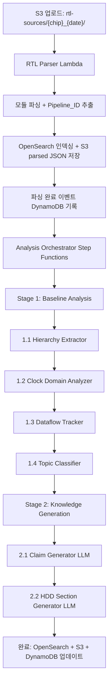
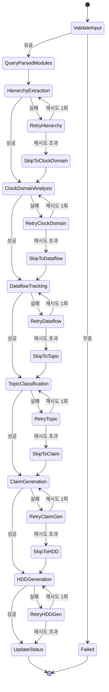

# 설계 문서: RTL 자동 분석 파이프라인

## 개요

RTL 자동 분석 파이프라인은 기존 RTL Parser Lambda의 단일 모듈 파싱 기능을 확장하여, 다단계 분석(계층 추출, 클럭 도메인 분석, 데이터 흐름 추적, 토픽 분류, Claim 생성, HDD 섹션 생성)을 자동으로 수행하는 시스템이다.

핵심 설계 원칙:
- 인프라 불변: S3 버킷, OpenSearch 인덱스, Lambda, DynamoDB 등 기존 리소스를 재사용. 새 칩 추가 시 인프라 변경 없음
- Pipeline_ID 기반 격리: S3 디렉토리 `rtl-sources/{chip_type}_{date}/`에서 Pipeline_ID를 추출하여 모든 분석 결과를 논리적으로 격리
- 기존 네트워크 제약 준수: RTL Parser Lambda(VPC 밖) AOSS/Bedrock 직접 접근, Main Lambda(VPC 안) Lambda invoke로 우회

첫 번째 대상: Trinity/N1B0 RTL (`rtl-sources/tt_20260221/`, 9,465개 파일, 539MB)

## 아키텍처

### 시스템 아키텍처 다이어그램

```
Seoul (ap-northeast-2)
======================

  RTL S3 Bucket                    RTL Parser Lambda (VPC 밖)
  bos-ai-rtl-src-{acct}           lambda-rtl-parser-seoul-dev
  +------------------+            +---------------------------+
  | rtl-sources/     |--S3 Event->| 모듈 파싱 (정규식)        |
  |   tt_20260221/   |            | Pipeline_ID 추출          |
  | rtl-parsed/      |            | OpenSearch 인덱싱         |
  |   hierarchy/     |            | Titan Embeddings 생성     |
  |   hdd/           |            | 파싱 완료 이벤트 발행     |
  +------------------+            +-------------+-------------+
         ^                                      |
         |                                      | DynamoDB 이벤트
         |                                      v
         |                        +---------------------------+
         |                        | Analysis Orchestrator     |
         |                        | (Step Functions)          |
         |                        | - Stage 1: Baseline       |
         |                        | - Stage 2: HDD Generation |
         |                        | - 재시도/에러 처리        |
         |                        +-------------+-------------+
         |                                      |
         |                    +-----------------+-----------------+
         |                    |                                   |
         |          Stage 1: Baseline              Stage 2: Knowledge Gen
         |          +-----------------+            +-------------------+
         |          | Hierarchy Ext.  |            | Claim Generator   |
         +<---------| Clock Domain    |            | (Bedrock Claude)  |
         |          | Dataflow Track  |            | HDD Section Gen   |
         |          | Topic Classify  |            | (Bedrock Claude)  |
         |          +-----------------+            +-------------------+
         |                    |                           |
         v                    v                           v
  +------------------+  +----------+              +----------+
  | DynamoDB         |  | OpenSearch|              | OpenSearch|
  | - 분석 상태 추적 |  | AOSS     |              | AOSS     |
  | - Claim DB       |  | us-east-1|              | us-east-1|
  +------------------+  +----------+              +----------+

Virginia (us-east-1)
====================
  OpenSearch Serverless              Bedrock Runtime
  iw3pzcloa0en8d90hh7               Claude 3 Haiku
  +------------------+              +------------------+
  | rtl-parsed index |              | Claim 생성       |
  | 벡터 검색 (1024d)|              | HDD 섹션 생성    |
  | analysis_type별  |              | Titan Embed v2   |
  | pipeline_id 격리 |              +------------------+
  +------------------+
```

### 분석 파이프라인 단계별 흐름



### Step Functions 상태 머신 설계



설계 결정 사항:
- 각 분석 단계는 최대 2회 재시도 (원본 1회 + 재시도 1회). 재시도 실패 시 해당 단계를 건너뛰고 후속 단계 진행
- Step Functions Express Workflow 사용 (5분 이내 완료 예상, 비용 효율적)
- 단, 전체 파이프라인이 9,465개 파일을 처리하므로 Standard Workflow 사용 (최대 1년 실행 가능)
- Pipeline_ID를 Step Functions 실행 이름에 포함하여 추적성 확보

## 컴포넌트 및 인터페이스

### 1. RTL Parser Lambda (기존 확장)

현재 `lambda-rtl-parser-seoul-dev`를 확장한다. 기존 기능(모듈 파싱, OpenSearch 인덱싱)에 Pipeline_ID 추출과 파싱 완료 이벤트 발행을 추가한다.

확장 사항:
- S3 키에서 Pipeline_ID 추출: `rtl-sources/{chip_type}_{date}/...` 에서 `{chip_type}_{date}` 파싱
- 파싱 결과에 `pipeline_id`, `chip_type`, `snapshot_date` 메타데이터 추가
- 파싱 완료 시 DynamoDB `rag-extraction-tasks` 테이블에 완료 이벤트 기록
- OpenSearch 문서에 `pipeline_id`, `analysis_type=module_parse` 필드 추가

인터페이스:
```python
# 입력: S3 Event Notification
{
    "Records": [{
        "s3": {
            "bucket": {"name": "bos-ai-rtl-src-{acct}"},
            "object": {"key": "rtl-sources/tt_20260221/path/to/module.sv"}
        }
    }]
}

# 출력: DynamoDB 파싱 완료 이벤트
{
    "task_id": "parse_{pipeline_id}_{file_hash}",
    "pipeline_id": "tt_20260221",
    "chip_type": "tt",
    "snapshot_date": "20260221",
    "status": "parsed",
    "module_name": "tt_dispatch_top",
    "file_path": "rtl-sources/tt_20260221/dispatch/tt_dispatch_top.sv",
    "timestamp": "2026-02-21T10:00:00Z"
}
```

### 2. Analysis Orchestrator (Step Functions)

Pipeline_ID 단위로 전체 분석 파이프라인을 조율하는 Step Functions 상태 머신이다.

트리거 메커니즘:
- 수동 트리거 (1차 구현): 엔지니어가 Pipeline_ID를 지정하여 Step Functions 실행을 시작
- 자동 트리거 (향후): EventBridge 규칙으로 DynamoDB Streams 파싱 완료 이벤트 감지

입력 인터페이스:
```json
{
    "pipeline_id": "tt_20260221",
    "chip_type": "tt",
    "snapshot_date": "20260221",
    "s3_prefix": "rtl-sources/tt_20260221/",
    "trigger_type": "manual",
    "options": {
        "skip_stages": [],
        "variant_baseline_id": null
    }
}
```

상태 관리 (DynamoDB `rag-extraction-tasks` 테이블):
```json
{
    "task_id": "analysis_{pipeline_id}_{stage}",
    "pipeline_id": "tt_20260221",
    "stage": "hierarchy_extraction",
    "status": "in_progress",
    "started_at": "2026-02-21T10:05:00Z",
    "updated_at": "2026-02-21T10:10:00Z",
    "retry_count": 0,
    "error_message": null,
    "modules_processed": 1500,
    "modules_total": 9465
}
```

### 3. Hierarchy Extractor

RTL Parser Lambda가 추출한 개별 모듈의 인스턴스 목록을 조합하여 전체 계층 트리를 구축한다.

알고리즘:
1. OpenSearch에서 해당 Pipeline_ID의 모든 파싱 결과를 조회 (module_name, instance_list)
2. 각 모듈의 instance_list에서 `instance_name: module_type` 쌍을 추출
3. module_type을 키로 하여 parent-child 관계 그래프를 구축
4. 루트 모듈(다른 모듈에 의해 인스턴스화되지 않는 모듈)을 식별
5. DFS로 계층 경로를 생성 (예: `trinity.gen_dispatch_e.tt_dispatch_top_inst_east`)
6. 각 노드에 클럭 신호, 리셋 신호, 메모리 인스턴스 정보를 매핑

출력 형식:
```json
{
    "pipeline_id": "tt_20260221",
    "root_module": "trinity",
    "total_modules": 1247,
    "hierarchy": [
        {
            "module_name": "trinity",
            "instance_name": "top",
            "hierarchy_path": "trinity",
            "clock_signals": ["i_ai_clk", "i_noc_clk"],
            "reset_signals": ["i_rst_n"],
            "memory_instances": [],
            "children": [
                {
                    "module_name": "tt_dispatch_top",
                    "instance_name": "gen_dispatch_e",
                    "hierarchy_path": "trinity.gen_dispatch_e",
                    "clock_signals": ["i_ai_clk"],
                    "reset_signals": ["i_rst_n"],
                    "memory_instances": ["u_sram_256x64"],
                    "children": []
                }
            ]
        }
    ]
}
```

S3 저장 경로:
- JSON: `rtl-parsed/hierarchy/{pipeline_id}/hierarchy_tree.json`
- CSV: `rtl-parsed/hierarchy/{pipeline_id}/hierarchy_tree.csv` (Hierarchy, Module, Clock, Reset, Memory_Instances 컬럼)

### 4. Clock Domain Analyzer

RTL 소스 코드에서 클럭 도메인을 추출하고 CDC 경계를 식별한다.

분석 로직:
1. S3에서 RTL 소스 파일을 읽어 `always_ff @(posedge <clock>)` 및 `always @(posedge <clock>)` 패턴 매칭
2. 추출된 클럭 신호를 도메인 그룹으로 분류:
   - `i_ai_clk` 계열: `ai_clock_domain`
   - `i_noc_clk` 계열: `noc_clock_domain`
   - `i_dm_clk` 계열: `dm_clock_domain`
   - `i_ref_clk` 계열: `ref_clock_domain`
   - 기타: `unclassified_clock`
3. 모듈 내 2개 이상 클럭 도메인 감지 시 CDC 경계 모듈로 표시
4. 결과를 OpenSearch에 `analysis_type=clock_domain` 문서로 인덱싱

출력 형식:
```json
{
    "pipeline_id": "tt_20260221",
    "module_name": "tt_noc_router",
    "analysis_type": "clock_domain",
    "clock_domains": [
        {"domain": "noc_clock_domain", "signals": ["i_noc_clk"]},
        {"domain": "ai_clock_domain", "signals": ["i_ai_clk"]}
    ],
    "is_cdc_boundary": true,
    "cdc_pairs": [["noc_clock_domain", "ai_clock_domain"]]
}
```

### 5. Dataflow Tracker

모듈 간 신호 연결 관계를 추적하여 데이터 흐름 그래프를 생성한다.

분석 로직:
1. 계층 트리의 각 parent 모듈에서 child 인스턴스의 포트 매핑을 추출
2. 정규식으로 `.port_name(signal_name)` 패턴을 파싱
3. 상위 모듈 신호와 하위 모듈 포트 간 매핑을 기록
4. 비트 폭 정보 추출 (`[MSB:LSB]` 패턴)
5. 비트 폭 불일치 감지 시 `width_mismatch` 경고 태깅

출력 형식:
```json
{
    "pipeline_id": "tt_20260221",
    "module_name": "tt_dispatch_top",
    "analysis_type": "dataflow",
    "connections": [
        {
            "parent_signal": "dispatch_data_out",
            "child_module": "tt_dispatch_engine",
            "child_port": "i_data",
            "direction": "input",
            "bit_width": 64,
            "width_mismatch": false
        }
    ]
}
```

### 6. Topic Classifier

파일 경로와 모듈명 패턴을 기반으로 RTL 모듈을 주제별로 분류한다.

분류 규칙 (우선순위 순):
```python
TOPIC_RULES = {
    "NoC":         {"path": ["*/noc/*"], "prefix": ["tt_noc_", "noc_"]},
    "FPU":         {"path": ["*/fpu/*"], "prefix": ["tt_fpu_", "fpu_"]},
    "SFPU":        {"path": ["*/sfpu/*"], "prefix": ["tt_sfpu_", "sfpu_"]},
    "TDMA":        {"path": ["*/tdma/*"], "prefix": ["tt_tdma_", "tdma_"]},
    "Overlay":     {"path": ["*/overlay/*"], "prefix": ["tt_overlay_", "overlay_"]},
    "EDC":         {"path": ["*/edc/*"], "prefix": ["tt_edc_", "edc_"]},
    "Dispatch":    {"path": ["*/dispatch/*"], "prefix": ["tt_dispatch_", "dispatch_"]},
    "L1_Cache":    {"path": ["*/l1/*", "*/cache/*"], "prefix": ["tt_l1_", "l1_"]},
    "Clock_Reset": {"path": ["*/clk/*", "*/reset/*"], "prefix": ["tt_clk_", "clk_", "rst_"]},
    "DFX":         {"path": ["*/dfx/*"], "prefix": ["tt_dfx_", "dfx_"]},
    "NIU":         {"path": ["*/niu/*"], "prefix": ["tt_niu_", "niu_"]},
    "SMN":         {"path": ["*/smn/*"], "prefix": ["tt_smn_", "smn_"]},
}
```

분류 로직:
1. 파일 경로 패턴 매칭 (우선)
2. 모듈명 접두사 패턴 매칭
3. 복수 토픽 매칭 시 모두 태깅
4. 미분류 시 `unclassified` + 계층 트리에서 가장 가까운 분류된 상위 모듈의 토픽을 상속 후보로 제안

### 7. Claim Generator

Bedrock Claude를 호출하여 분석 결과로부터 구조화된 claim을 생성한다.

LLM 호출 전략:
- 모델: `anthropic.claude-3-haiku-20240307-v1:0` (us-east-1)
- 토픽별 모듈 그룹 단위로 호출 (예: NoC 관련 모듈 50개를 하나의 프롬프트로)
- 단일 호출당 입력 토큰 100,000 이하 제한
- 초과 시 모듈 그룹을 분할하여 복수 호출
- 타임아웃: 60초, 재시도: 최대 1회

Claim 출력 형식:
```json
{
    "claim_id": "clm_{pipeline_id}_{topic}_{seq}",
    "pipeline_id": "tt_20260221",
    "module_name": "tt_noc_router",
    "topic": "NoC",
    "claim_type": "connectivity",
    "claim_text": "tt_noc_router는 4개의 방향(N/S/E/W) 포트를 통해 메시 토폴로지를 구성하며, 각 방향별 64비트 데이터 경로를 제공한다",
    "confidence_score": 0.95,
    "source_files": ["rtl-sources/tt_20260221/noc/tt_noc_router.sv"],
    "version": 1,
    "status": "auto_generated",
    "created_at": "2026-02-21T10:30:00Z"
}
```

### 8. HDD Section Generator

분석 결과를 조합하여 HDD 문서 섹션을 자동 생성한다. 엔지니어가 작성한 HDD 문서(N1B0_NPU_HDD_v0.1.md, EDC_HDD.md, overlay_HDD_v0.1.md)의 구조와 깊이를 참고한다.

HDD 섹션 유형별 생성 전략:

칩 전체 HDD (N1B0_NPU_HDD 스타일):
- 섹션: Overview, Package Constants, Top-Level Ports, Module Hierarchy, Compute Tile, Dispatch Engine, NoC Fabric, NIU, Clock Architecture, Reset Architecture, EDC, Power Management, SRAM Inventory, DFX, P and R Guide, SW Programming Guide, RTL File Reference
- 입력: 전체 계층 트리 + 토픽별 요약 + 클럭 도메인 전체 맵

서브시스템 HDD (EDC_HDD 스타일):
- 섹션: Overview, Architecture, Serial Bus Interface, Packet Format, Node ID Structure, Module Hierarchy, Module Reference, Ring Topology, Harvest Bypass, BIU, Node Configuration, Event Types, CDC, Firmware Interface, Inter-Cluster Connectivity, Instance Paths
- 입력: 해당 토픽의 모듈 그룹 + 계층 + 클럭 + 데이터 흐름 + claim

블록 HDD (overlay_HDD 스타일):
- 섹션: Overview, Position in Grid, Feature Summary, Block Diagram, Sub-module Hierarchy, Feature Details, Control Path, Key Parameters, Clock/Reset Summary, APB Register Interfaces, Worked Example, Verification Checklist, Key RTL File Index
- 입력: 단일 블록 모듈 + 하위 계층 + 포트 매핑

S3 저장 경로:
- `rtl-parsed/hdd/{pipeline_id}/{topic}_HDD.md`
- `rtl-parsed/hdd/{pipeline_id}/{chip_type}_NPU_HDD.md` (칩 전체)

### 9. Package Parameter Extractor (RTL Parser Lambda 확장)

RTL Parser Lambda에 `*_pkg.sv` 파일 전용 파싱 로직을 추가하여 패키지 파라미터 및 칩 구성 정보를 추출한다.

분석 로직:
1. 파일명이 `*_pkg.sv` 패턴과 일치하는 경우 전용 파싱 경로 진입
2. `localparam` 선언 추출: `localparam\s+(\w+)\s*=\s*(.+?);` 패턴
3. `parameter` 선언 추출: `parameter\s+(\w+)\s*=\s*(.+?);` 패턴
4. `typedef enum` 선언 추출: `typedef\s+enum\s*(?:logic\s*\[.*?\])?\s*\{([^}]+)\}\s*(\w+);` 패턴
5. 칩 구성 파라미터 식별: SizeX, SizeY, NumTensix, NumNoc2Axi, NumDispatch 등 키워드 매칭
6. 타일 타입 enum에서 타일 타입 → RTL 모듈 매핑 추출

출력 형식:
```json
{
    "pipeline_id": "tt_20260221",
    "analysis_type": "chip_config",
    "package_file": "tt_noc_pkg.sv",
    "parameters": {
        "SizeX": {"value": "4", "type": "localparam"},
        "SizeY": {"value": "5", "type": "localparam"},
        "NumTensix": {"value": "12", "type": "localparam"}
    },
    "enums": {
        "tile_type_t": {
            "values": ["TENSIX", "NOC2AXI_NE_OPT", "DISPATCH"],
            "module_mapping": {"TENSIX": "tt_tensix_tile", "NOC2AXI_NE_OPT": "tt_noc2axi"}
        }
    }
}
```

### 10. EDC Topology Analyzer

EDC 서브시스템의 링 토폴로지, 시리얼 버스 프로토콜, 하베스트 바이패스 메커니즘을 분석한다. `analysis_handler.py`에 `handle_edc_topology(event)` 핸들러로 구현한다.

분석 로직:
1. `tt_edc1_*` 모듈의 인스턴스화 패턴에서 노드 간 연결 관계 추출
2. 연결 관계로부터 링 토폴로지 재구성 (U-shape: Segment A 하향 → U-turn → Segment B 상향)
3. `tt_edc1_serial_bus_mux` / `tt_edc1_serial_bus_demux` 인스턴스화 패턴에서 하베스트 바이패스 경로 식별
4. `tt_edc1_pkg.sv`에서 시리얼 버스 인터페이스 정의 추출 (`req_tgl`, `ack_tgl`, `data`, `data_p`, `async_init`)
5. `node_id_part`, `node_id_subp`, `node_id_inst` 필드에서 노드 ID 디코딩 테이블 생성

출력 형식:
```json
{
    "pipeline_id": "tt_20260221",
    "analysis_type": "edc_topology",
    "ring_topology": {
        "segment_a": ["edc_node_0", "edc_node_1", "edc_node_2"],
        "u_turn": "edc_node_2",
        "segment_b": ["edc_node_3", "edc_node_4", "edc_node_5"]
    },
    "harvest_bypass_paths": [
        {"from": "edc_node_1", "to": "edc_node_3", "type": "mux_bypass"}
    ],
    "serial_bus_interface": {
        "signals": ["req_tgl", "ack_tgl", "data", "data_p", "async_init"]
    },
    "node_id_table": [
        {"node": "edc_node_0", "part": 0, "subp": 0, "inst": 0}
    ]
}
```

### 11. NoC Protocol Analyzer

NoC의 라우팅 알고리즘, 패킷 구조(flit format), 보안 펜스 메커니즘을 분석한다. `analysis_handler.py`에 `handle_noc_protocol(event)` 핸들러로 구현한다.

분석 로직:
1. `tt_noc_pkg.sv`에서 라우팅 알고리즘 enum 추출 (`DIM_ORDER`, `TENDRIL`, `DYNAMIC`)
2. `noc_header_address_t` 구조체에서 flit 헤더 필드 추출 (x_dest, y_dest, endpoint_id, flit_type, dynamic_carried_list)
3. AXI 주소 가스켓(56-bit) 구조 추출 (`target_index`, `endpoint_id`, `tlb_index`, `address`)
4. `tt_noc_sec_fence_edc_wrapper` 모듈에서 보안 펜스 메커니즘 식별 (SMN 그룹 기반 접근 제어)

출력 형식:
```json
{
    "pipeline_id": "tt_20260221",
    "analysis_type": "noc_protocol",
    "routing_algorithms": [
        {"name": "DIM_ORDER", "enum_value": 0, "parameters": {}},
        {"name": "TENDRIL", "enum_value": 1, "parameters": {}},
        {"name": "DYNAMIC", "enum_value": 2, "parameters": {"EnableDynamicRouting": "1"}}
    ],
    "flit_structure": {
        "header_fields": ["x_dest", "y_dest", "endpoint_id", "flit_type", "dynamic_carried_list"],
        "total_bits": 64
    },
    "axi_address_gasket": {
        "total_bits": 56,
        "fields": ["target_index", "endpoint_id", "tlb_index", "address"]
    },
    "security_fence": {
        "module": "tt_noc_sec_fence_edc_wrapper",
        "mechanism": "smn_group_access_control"
    }
}
```

### 12. Overlay Deep Analyzer

Overlay(RISC-V 서브시스템)의 내부 구조를 심화 분석한다. `analysis_handler.py`에 `handle_overlay_deep_analysis(event)` 핸들러로 구현한다.

분석 로직:
1. `tt_overlay_pkg.sv`에서 CPU 클러스터 파라미터 추출 (NUM_CLUSTER_CPUS, NUM_INTERRUPTS, RESET_VECTOR_WIDTH)
2. Overlay 서브모듈 역할 식별: CPU 클러스터(`tt_overlay_cpu_wrapper`), iDMA(`tt_idma_wrapper`), ROCC(`tt_rocc_accel`), LLK 카운터(`tt_overlay_tile_counters`), SMN(`tt_overlay_smn_wrapper`), FDS(`tt_fds_wrapper`)
3. `tt_overlay_memory_wrapper` 모듈에서 L1 캐시 파라미터 추출 (뱅크 수, 뱅크 폭, ECC 타입, SRAM 타입)
4. `tt_overlay_reg_xbar_slave_decode` 구조에서 APB 슬레이브 목록과 주소 맵 추출

출력 형식:
```json
{
    "pipeline_id": "tt_20260221",
    "analysis_type": "overlay_deep",
    "cpu_cluster": {
        "NUM_CLUSTER_CPUS": 4,
        "NUM_INTERRUPTS": 32,
        "RESET_VECTOR_WIDTH": 32
    },
    "submodule_roles": {
        "tt_overlay_cpu_wrapper": "cpu_cluster",
        "tt_idma_wrapper": "idma",
        "tt_rocc_accel": "rocc_accelerator",
        "tt_overlay_tile_counters": "llk_counter",
        "tt_overlay_smn_wrapper": "smn",
        "tt_fds_wrapper": "fds"
    },
    "l1_cache": {
        "num_banks": 8,
        "bank_width": 64,
        "ecc_type": "SECDED",
        "sram_type": "SP_SRAM"
    },
    "apb_slaves": [
        {"name": "slave_0", "base_address": "0x0000", "size": "0x1000"},
        {"name": "slave_1", "base_address": "0x1000", "size": "0x1000"}
    ]
}
```

## 데이터 모델

### OpenSearch 인덱스 스키마 확장

기존 `rtl-knowledge-base-index` 인덱스에 다음 필드를 추가한다. 기존 8,168건의 문서와 호환성을 유지하면서 새 필드를 추가하는 방식이다.

```json
{
    "mappings": {
        "properties": {
            "embedding":          {"type": "knn_vector", "dimension": 1024},
            "module_name":        {"type": "keyword"},
            "parent_module":      {"type": "keyword"},
            "port_list":          {"type": "text"},
            "parameter_list":     {"type": "text"},
            "instance_list":      {"type": "text"},
            "file_path":          {"type": "keyword"},
            "parsed_summary":     {"type": "text"},

            "pipeline_id":        {"type": "keyword"},
            "chip_type":          {"type": "keyword"},
            "snapshot_date":      {"type": "keyword"},
            "analysis_type":      {"type": "keyword"},

            "hierarchy_path":     {"type": "keyword"},
            "hierarchy_depth":    {"type": "integer"},
            "children_modules":   {"type": "keyword"},
            "clock_signals":      {"type": "keyword"},
            "reset_signals":      {"type": "keyword"},
            "memory_instances":   {"type": "keyword"},

            "clock_domains":      {"type": "nested", "properties": {
                "domain":         {"type": "keyword"},
                "signals":        {"type": "keyword"}
            }},
            "is_cdc_boundary":    {"type": "boolean"},
            "cdc_pairs":          {"type": "keyword"},

            "dataflow_connections": {"type": "nested", "properties": {
                "parent_signal":  {"type": "keyword"},
                "child_module":   {"type": "keyword"},
                "child_port":     {"type": "keyword"},
                "direction":      {"type": "keyword"},
                "bit_width":      {"type": "integer"},
                "width_mismatch": {"type": "boolean"}
            }},

            "topic":              {"type": "keyword"},
            "topics":             {"type": "keyword"},

            "claim_id":           {"type": "keyword"},
            "claim_type":         {"type": "keyword"},
            "claim_text":         {"type": "text"},
            "confidence_score":   {"type": "float"},
            "source_files":       {"type": "keyword"},

            "hdd_section_title":  {"type": "keyword"},
            "hdd_section_type":   {"type": "keyword"},
            "hdd_content":        {"type": "text"},
            "hdd_metadata":       {"type": "object", "properties": {
                "generation_date":    {"type": "date"},
                "pipeline_version":   {"type": "keyword"},
                "source_rtl_files":   {"type": "keyword"}
            }},

            "created_at":         {"type": "date"},
            "updated_at":         {"type": "date"},
            "previous_version_at": {"type": "date"}
        }
    }
}
```

`analysis_type` 필드 값:
- `module_parse`: 기존 RTL Parser Lambda 파싱 결과
- `hierarchy`: 계층 트리 노드
- `clock_domain`: 클럭 도메인 분석 결과
- `dataflow`: 데이터 흐름 연결 정보
- `topic`: 토픽 분류 결과
- `claim`: LLM 생성 claim
- `hdd_section`: HDD 문서 섹션
- `variant_delta`: variant 차이 분석 결과
- `chip_config`: 패키지 파라미터 및 칩 구성 정보
- `edc_topology`: EDC 링 토폴로지 및 프로토콜 분석 결과
- `noc_protocol`: NoC 라우팅 알고리즘 및 패킷 구조 분석 결과
- `overlay_deep`: Overlay 내부 구조 심화 분석 결과

### DynamoDB 테이블 스키마

기존 `rag-extraction-tasks` 테이블을 분석 상태 추적에 재사용한다. 기존 `task_id` (S) 파티션 키 구조를 유지하면서 분석 파이프라인 상태를 추적한다.

분석 상태 추적 아이템:
```json
{
    "task_id": "analysis_tt_20260221_hierarchy_extraction",
    "pipeline_id": "tt_20260221",
    "stage": "hierarchy_extraction",
    "status": "completed",
    "started_at": "2026-02-21T10:05:00Z",
    "completed_at": "2026-02-21T10:15:00Z",
    "retry_count": 0,
    "modules_processed": 9465,
    "modules_total": 9465,
    "error_message": null,
    "ttl": 1740000000
}
```

기존 `bos-ai-claim-db` 테이블에 Pipeline_ID 기반 격리를 추가한다. 기존 스키마(claim_id PK, version SK)를 유지하면서 `pipeline_id` 속성을 추가한다.

Claim DB 아이템 (확장):
```json
{
    "claim_id": "clm_tt_20260221_noc_001",
    "version": 1,
    "pipeline_id": "tt_20260221",
    "topic": "NoC",
    "topic_variant": "NoC_tt_20260221",
    "status": "auto_generated",
    "claim_type": "connectivity",
    "claim_text": "tt_noc_router는 4개의 방향 포트를 통해 메시 토폴로지를 구성한다",
    "confidence_score": 0.95,
    "source_document_id": "rtl-sources/tt_20260221/noc/tt_noc_router.sv",
    "source_files": ["rtl-sources/tt_20260221/noc/tt_noc_router.sv"],
    "extraction_date": "2026-02-21",
    "last_verified_at": "2026-02-21T10:30:00Z",
    "claim_family_id": "fam_noc_router_connectivity"
}
```

설계 결정: `topic_variant` GSI를 활용하여 `topic_variant = "NoC_tt_20260221"` 형태로 Pipeline_ID별 Claim을 격리 조회한다. 기존 GSI 구조를 변경하지 않고 `topic_variant` 값에 Pipeline_ID를 인코딩하는 방식이다.

### Pipeline_ID 기반 데이터 격리 설계

모든 데이터 저장소에서 Pipeline_ID를 기준으로 논리적 격리를 수행한다:

| 저장소 | 격리 방식 | 예시 |
|--------|-----------|------|
| S3 | 디렉토리 프리픽스 | `rtl-parsed/hierarchy/tt_20260221/` |
| OpenSearch | `pipeline_id` 필드 필터 | `{"term": {"pipeline_id": "tt_20260221"}}` |
| DynamoDB (분석 상태) | `task_id` 프리픽스 | `analysis_tt_20260221_*` |
| DynamoDB (Claim DB) | `topic_variant` GSI | `NoC_tt_20260221` |
| Step Functions | 실행 이름 | `analysis-tt_20260221-20260221T100000` |

## Correctness Properties

*A property is a characteristic or behavior that should hold true across all valid executions of a system — essentially, a formal statement about what the system should do. Properties serve as the bridge between human-readable specifications and machine-verifiable correctness guarantees.*

### Property 1: Pipeline_ID 파싱 정확성

*For any* 유효한 S3 키 `rtl-sources/{chip_type}_{date}/...` 형식에 대해, Pipeline_ID 추출 함수는 정확한 `chip_type`과 `date`를 반환하고, `{chip_type}_{date}` 형식의 Pipeline_ID를 생성해야 한다.

**Validates: Requirements 1.6, 10.1**

### Property 2: 계층 트리 라운드트립

*For any* 유효한 RTL 모듈 세트와 그 인스턴스 목록에 대해, 계층 트리를 구축한 후 해당 트리에서 각 parent-child 관계를 역으로 추출하면 원본 인스턴스화 관계와 동일한 결과를 산출해야 한다.

**Validates: Requirements 2.1, 2.6**

### Property 3: 계층 노드 완전성

*For any* 생성된 계층 트리의 모든 노드에 대해, 해당 노드는 module_name, instance_name, hierarchy_path, clock_signals, reset_signals 필드를 포함해야 한다.

**Validates: Requirements 2.2, 2.3**

### Property 4: 계층 직렬화 라운드트립

*For any* 유효한 계층 트리에 대해, JSON으로 직렬화한 후 역직렬화하면 원본 트리와 동일한 구조를 산출해야 하며, CSV로 직렬화한 결과는 JSON과 동일한 모듈 집합을 포함해야 한다.

**Validates: Requirements 2.5**

### Property 5: 클럭 추출 및 도메인 분류

*For any* RTL 소스 코드에서 `always_ff @(posedge clock)` 또는 `always @(posedge clock)` 패턴이 포함된 경우, Clock_Domain_Analyzer는 해당 클럭 신호를 추출하고, 표준 패턴과 일치하면 올바른 도메인 그룹으로 분류하며, 일치하지 않으면 `unclassified_clock`으로 분류해야 한다.

**Validates: Requirements 3.1, 3.2, 3.5**

### Property 6: CDC 경계 감지

*For any* 모듈에 대해, 해당 모듈 내에서 2개 이상의 서로 다른 클럭 도메인이 감지되면 `is_cdc_boundary`가 true로 설정되어야 하고, 1개 이하이면 false로 설정되어야 한다.

**Validates: Requirements 3.3**

### Property 7: 데이터 흐름 연결 추출 완전성

*For any* RTL 모듈의 인스턴스 포트 매핑 `.port_name(signal_name)` 패턴에 대해, Dataflow_Tracker는 해당 연결을 추출하고, 각 연결에 parent_signal, child_module, child_port, direction, bit_width 필드를 포함해야 한다.

**Validates: Requirements 4.1, 4.2, 4.3**

### Property 8: 비트 폭 불일치 감지

*For any* 포트 연결에서 상위 모듈 신호의 비트 폭과 하위 모듈 포트의 비트 폭이 다른 경우, `width_mismatch` 플래그가 true로 설정되어야 하고, 동일한 경우 false로 설정되어야 한다.

**Validates: Requirements 4.5**

### Property 9: 토픽 분류 정확성

*For any* RTL 모듈에 대해, 파일 경로 또는 모듈명이 사전 정의된 토픽 패턴과 일치하면 해당 토픽이 할당되어야 하고, 복수 패턴과 일치하면 모든 매칭 토픽이 할당되어야 하며, 어떤 패턴과도 일치하지 않으면 `unclassified`로 분류되어야 한다.

**Validates: Requirements 5.1, 5.3, 5.4**

### Property 10: Claim 스키마 유효성

*For any* 생성된 claim에 대해, claim_id, module_name, topic, claim_type, claim_text, confidence_score, source_files 필드가 모두 존재해야 하며, confidence_score는 0.0 이상 1.0 이하여야 하고, claim_type은 structural, behavioral, connectivity, timing 중 하나여야 한다.

**Validates: Requirements 6.2**

### Property 11: LLM 입력 토큰 분할

*For any* 모듈 그룹에 대해, Claim_Generator의 토큰 분할 함수는 각 분할 청크의 토큰 수가 100,000 이하가 되도록 분할해야 하며, 모든 모듈이 정확히 하나의 청크에 포함되어야 한다.

**Validates: Requirements 6.4**

### Property 12: HDD 섹션 완전성

*For any* 생성된 HDD 섹션에 대해, 해당 섹션은 필수 구조(개요, 모듈 계층, 기능 상세, 클럭/리셋 구조, 주요 파라미터, 검증 체크리스트)를 포함해야 하며, 메타데이터(source_rtl_files, generation_date, pipeline_version, pipeline_id)가 존재해야 한다.

**Validates: Requirements 7.2, 7.5, 10.6**

### Property 13: HDD 참조 무결성

*For any* 생성된 HDD 섹션에 대해, 해당 섹션에서 참조하는 모듈명은 계층 트리에 존재하는 모듈명의 부분집합이어야 한다.

**Validates: Requirements 7.6**

### Property 14: 검색 쿼리 구성 정확성

*For any* 검색 파라미터 조합(topic, clock_domain, hierarchy_path, pipeline_id)에 대해, 쿼리 빌더는 해당 필터 조건을 모두 포함하는 유효한 OpenSearch 쿼리를 생성해야 하며, 빈 파라미터는 쿼리에서 제외되어야 한다.

**Validates: Requirements 8.3**

### Property 15: Variant Delta 추출 정확성

*For any* 베이스라인과 variant 모듈 세트 쌍에 대해, delta 추출 함수는 모듈 추가/삭제, 파라미터 값 변경, 인스턴스 추가/삭제를 정확히 식별해야 하며, 변경되지 않은 항목은 delta에 포함되지 않아야 한다.

**Validates: Requirements 9.2**

### Property 16: Pipeline_ID 격리

*For any* 두 개의 서로 다른 Pipeline_ID에 대해, 하나의 Pipeline_ID로 필터링한 쿼리 결과에는 다른 Pipeline_ID의 문서가 포함되지 않아야 한다.

**Validates: Requirements 1.7, 10.2, 10.5**

### Property 17: Terraform 리소스 태깅

*For any* Terraform으로 생성되는 AWS 리소스에 대해, Project, Environment, ManagedBy 태그가 포함되어야 한다.

**Validates: Requirements 11.6**

### Property 18: 패키지 파라미터 추출 라운드트립

*For any* 유효한 SystemVerilog 패키지 파일(`*_pkg.sv`)에서 `localparam`, `parameter`, `typedef enum` 선언이 포함된 경우, 추출 함수는 모든 선언을 정확히 추출해야 하며, 추출된 파라미터 이름과 값을 원본 소스 코드에서 역으로 검색하면 일치하는 선언을 찾을 수 있어야 한다.

**Validates: Requirements 12.1, 12.3, 13.3, 14.1, 15.1, 15.3**

### Property 19: 구조체 필드 추출 완전성

*For any* 유효한 SystemVerilog 구조체(`typedef struct`) 정의에 대해, 필드 추출 함수는 모든 필드명과 비트 폭을 추출해야 하며, 추출된 필드 수는 원본 구조체의 필드 수와 동일해야 한다.

**Validates: Requirements 14.2, 14.3**

### Property 20: EDC 토폴로지 분석 정확성

*For any* 유효한 EDC 노드 인스턴스화 관계 세트에 대해, 링 토폴로지 재구성 함수는 모든 노드를 포함하는 연결 경로를 생성해야 하며, 재구성된 토폴로지에서 각 노드 간 연결을 역으로 추적하면 원본 인스턴스화 관계와 동일한 결과를 산출해야 한다. 또한 노드 ID 디코딩 테이블의 각 엔트리는 고유한 (part, subp, inst) 조합을 가져야 한다.

**Validates: Requirements 13.1, 13.2, 13.4**

### Property 21: Overlay 구조 분석 완전성

*For any* 유효한 Overlay 모듈 세트에 대해, 서브모듈 역할 식별 함수는 알려진 서브모듈 패턴(`tt_overlay_cpu_wrapper`, `tt_idma_wrapper`, `tt_rocc_accel`, `tt_overlay_tile_counters`, `tt_overlay_smn_wrapper`, `tt_fds_wrapper`)과 일치하는 모든 모듈에 올바른 역할을 할당해야 하며, APB 슬레이브 목록 추출 함수는 크로스바 디코드 모듈에서 모든 슬레이브 엔트리를 추출해야 한다.

**Validates: Requirements 15.2, 15.4**

## 에러 처리

### 에러 처리 전략

| 컴포넌트 | 에러 유형 | 처리 방식 | 재시도 |
|----------|-----------|-----------|--------|
| RTL Parser Lambda | S3 GetObject 실패 | DynamoDB 에러 테이블에 기록, CloudWatch 경고 | Lambda 자체 재시도 (최대 2회) |
| RTL Parser Lambda | OpenSearch 인덱싱 실패 | 에러 로그 기록, 파싱 결과는 S3에 저장 | 1회 재시도 |
| RTL Parser Lambda | Titan Embeddings 호출 실패 | 임베딩 없이 인덱싱 진행 (텍스트 검색만 가능) | 1회 재시도 |
| RTL Parser Lambda | Pipeline_ID 파싱 실패 | `unknown_unknown` 기본값 사용, 경고 로그 | 재시도 없음 |
| Analysis Orchestrator | 분석 단계 실패 | Step Functions 재시도 (최대 2회), 실패 시 건너뛰기 | 2회 |
| Analysis Orchestrator | Step Functions 실행 타임아웃 | DynamoDB에 timeout 상태 기록, CloudWatch 알람 | 재시도 없음 |
| Hierarchy Extractor | OpenSearch 쿼리 실패 | 재시도 후 실패 시 빈 계층 트리 반환 | 2회 |
| Hierarchy Extractor | 순환 참조 감지 | 순환 경로를 로그에 기록하고 해당 브랜치 절단 | 재시도 없음 |
| Clock Domain Analyzer | S3 파일 읽기 실패 | 해당 모듈 건너뛰기, 에러 카운트 증가 | 1회 재시도 |
| Dataflow Tracker | 포트 매핑 파싱 실패 | 해당 연결 건너뛰기, 경고 로그 | 재시도 없음 |
| Claim Generator | Bedrock Claude 호출 실패 | 해당 모듈 그룹 건너뛰기, 에러 기록 | 1회 재시도 |
| Claim Generator | LLM 응답 파싱 실패 | 원본 응답을 S3에 저장, 에러 기록 | 재시도 없음 |
| Claim Generator | 토큰 제한 초과 | 모듈 그룹을 더 작은 단위로 분할하여 재호출 | 자동 분할 |
| HDD Section Generator | Bedrock Claude 호출 실패 | 해당 토픽 HDD 건너뛰기, 에러 기록 | 1회 재시도 |
| HDD Section Generator | S3 저장 실패 | 재시도 후 실패 시 에러 기록 | 2회 재시도 |
| Package Parameter Extractor | 정규식 파싱 실패 | 해당 선언 건너뛰기, 경고 로그 | 재시도 없음 |
| EDC Topology Analyzer | 토폴로지 재구성 실패 | 부분 토폴로지 반환, 에러 기록 | 1회 재시도 |
| EDC Topology Analyzer | 노드 ID 디코딩 실패 | 해당 노드 건너뛰기, 경고 로그 | 재시도 없음 |
| NoC Protocol Analyzer | 구조체 파싱 실패 | 해당 구조체 건너뛰기, 경고 로그 | 재시도 없음 |
| NoC Protocol Analyzer | 보안 펜스 식별 실패 | 빈 결과 반환, 경고 로그 | 재시도 없음 |
| Overlay Deep Analyzer | 서브모듈 역할 식별 실패 | 미식별 모듈을 "unknown" 역할로 태깅 | 재시도 없음 |
| Overlay Deep Analyzer | APB 슬레이브 추출 실패 | 빈 슬레이브 목록 반환, 경고 로그 | 재시도 없음 |

### 에러 전파 정책

- 개별 파일 파싱 실패는 전체 파이프라인을 중단하지 않음
- 개별 분석 단계 실패는 후속 단계 실행을 차단하지 않음 (건너뛰기)
- LLM 호출 실패는 해당 모듈 그룹만 건너뛰고 나머지 그룹은 계속 처리
- 모든 에러는 DynamoDB `rag-extraction-tasks` 테이블과 CloudWatch Logs에 기록
- 에러율이 전체 모듈의 10% 초과 시 CloudWatch 알람 발생

### Lambda 실행 시간 관리

RTL Parser Lambda의 300초 타임아웃 제약을 준수하기 위한 작업 분할 전략:
- 개별 파일 파싱: 파일당 평균 0.03초, 충분한 여유
- Hierarchy Extractor: OpenSearch 스크롤 쿼리로 배치 처리 (1,000건씩)
- Clock Domain Analyzer: S3 파일을 배치로 읽기 (100개씩)
- Claim Generator: 토픽별 모듈 그룹 단위로 LLM 호출 (그룹당 60초 타임아웃)
- 각 분석 단계는 별도 Lambda 호출로 분리하여 300초 제한을 개별 적용

## 테스팅 전략

### 이중 테스팅 접근법

이 프로젝트는 단위 테스트와 속성 기반 테스트(Property-Based Testing)를 병행한다.

- 단위 테스트: 구체적인 예시, 엣지 케이스, 에러 조건 검증
- 속성 기반 테스트: 모든 유효한 입력에 대해 보편적 속성 검증
- 통합 테스트: AWS 인프라 연동 검증

### 속성 기반 테스트 (Property-Based Testing)

라이브러리: Go `gopter` (기존 `tests/properties/` 디렉토리의 패턴을 따름)

각 속성 테스트는 최소 100회 반복 실행하며, 설계 문서의 Property를 참조하는 태그를 포함한다.

태그 형식: `Feature: rtl-auto-analysis-pipeline, Property {number}: {property_text}`

테스트 대상 속성 (순수 로직 함수):

| Property | 테스트 대상 함수 | 생성기 | 검증 조건 |
|----------|-----------------|--------|-----------|
| 1 | `extract_pipeline_id(s3_key)` | 랜덤 chip_type + date 조합의 S3 키 | 추출된 chip_type, date가 원본과 일치 |
| 2 | `build_hierarchy(modules)` | 랜덤 모듈 세트 + 인스턴스 관계 | 트리에서 역추출한 관계 = 원본 관계 |
| 3 | `build_hierarchy(modules)` | 랜덤 모듈 세트 | 모든 노드에 필수 필드 존재 |
| 4 | `serialize_hierarchy(tree)` | 랜덤 계층 트리 | JSON 라운드트립 동일성, CSV/JSON 모듈 집합 동일 |
| 5 | `extract_clock_domains(rtl)` | 랜덤 always 블록 포함 RTL | 클럭 추출 정확성 + 도메인 분류 정확성 |
| 6 | `detect_cdc_boundary(domains)` | 랜덤 클럭 도메인 목록 | domains >= 2이면 true, 아니면 false |
| 7 | `extract_port_mappings(rtl)` | 랜덤 포트 매핑 포함 RTL | 모든 연결 추출 + 필수 필드 존재 |
| 8 | `detect_width_mismatch(conn)` | 랜덤 비트 폭 쌍 | 불일치 시 true, 일치 시 false |
| 9 | `classify_topic(path, name)` | 랜덤 파일 경로 + 모듈명 | 패턴 매칭 시 올바른 토픽, 미매칭 시 unclassified |
| 10 | `validate_claim(claim)` | 랜덤 claim 객체 | 필수 필드 존재 + 값 범위 검증 |
| 11 | `split_module_groups(groups)` | 랜덤 크기의 모듈 그룹 | 모든 청크 100K 토큰 이하 + 모든 모듈 포함 |
| 14 | `build_search_query(params)` | 랜덤 검색 파라미터 | 유효한 OpenSearch 쿼리 + 빈 파라미터 제외 |
| 15 | `extract_variant_delta(base, var)` | 랜덤 베이스라인/variant 쌍 | 변경 항목 정확 식별 + 미변경 항목 미포함 |
| 17 | Terraform 리소스 파일 | 모든 .tf 파일의 리소스 블록 | Project, Environment, ManagedBy 태그 존재 |
| 18 | `extract_package_params(rtl)` | 랜덤 localparam/parameter/typedef enum 포함 SV 코드 | 모든 선언 추출 + 원본 역검색 일치 |
| 19 | `extract_struct_fields(rtl)` | 랜덤 typedef struct 정의 포함 SV 코드 | 모든 필드명/비트폭 추출 + 필드 수 동일 |
| 20 | `build_edc_topology(nodes)` | 랜덤 EDC 노드 인스턴스화 관계 | 토폴로지 라운드트립 + 노드 ID 고유성 |
| 21 | `identify_overlay_roles(modules)` | 랜덤 Overlay 모듈 세트 | 알려진 패턴 역할 할당 + APB 슬레이브 추출 |

### 단위 테스트

단위 테스트는 구체적인 예시와 엣지 케이스에 집중한다:

- Pipeline_ID 파싱: 유효/무효 S3 키 예시 (빈 문자열, 언더스코어 없음, 다중 언더스코어)
- 계층 트리: 순환 참조 감지, 루트 모듈 없는 경우, 단일 모듈 트리
- 클럭 도메인: 클럭 없는 모듈, 비표준 클럭명, 주석 내 클럭 패턴 무시
- 토픽 분류: 경계 케이스 (경로와 모듈명이 다른 토픽에 매칭)
- Claim 스키마: 필수 필드 누락, 잘못된 claim_type, confidence_score 범위 초과
- HDD 참조 무결성: 존재하지 않는 모듈 참조, 빈 계층 트리
- 메모리 인스턴스 식별: SRAM, register file, ROM 패턴 매칭
- 패키지 파라미터 추출: localparam/parameter/typedef enum 파싱, 빈 패키지 파일, 주석 내 선언 무시
- EDC 토폴로지: 단일 노드 링, 바이패스 없는 경우, 불완전한 연결 관계
- NoC 프로토콜: 빈 구조체, 중첩 구조체, 보안 펜스 모듈 없는 경우
- Overlay 구조: 알려지지 않은 서브모듈, 빈 크로스바, L1 캐시 파라미터 누락

### 통합 테스트

통합 테스트는 AWS 인프라 연동을 검증한다:

- S3 업로드 -> Lambda 트리거 -> OpenSearch 인덱싱 E2E
- Step Functions 실행 -> DynamoDB 상태 업데이트
- Bedrock Claude 호출 -> Claim 생성 -> DynamoDB/OpenSearch 저장
- OpenSearch 필터링 검색 (pipeline_id, topic, analysis_type)
- Cross-region 접근: Seoul Lambda -> Virginia OpenSearch/Bedrock

### Terraform 인프라 테스트

기존 `tests/properties/` 디렉토리의 패턴을 따라 Terraform 리소스 속성을 검증한다:

- Step Functions 상태 머신 정의 검증 (재시도 설정, 타임아웃)
- Lambda 함수 설정 검증 (런타임, 메모리, 타임아웃, VPC 설정)
- DynamoDB 테이블 스키마 검증 (파티션 키, GSI)
- IAM 정책 최소 권한 검증
- 보안 그룹 규칙 검증
- KMS 암호화 설정 검증
- 리소스 태깅 검증 (Property 17)

### Terraform 리소스 목록 (신규 추가)

| 리소스 | 타입 | 설명 |
|--------|------|------|
| `aws_sfn_state_machine.analysis_orchestrator` | Step Functions | 분석 파이프라인 오케스트레이터 |
| `aws_iam_role.sfn_analysis` | IAM Role | Step Functions 실행 역할 |
| `aws_iam_role_policy.sfn_lambda_invoke` | IAM Policy | Step Functions Lambda invoke 권한 |
| `aws_iam_role_policy.sfn_dynamodb` | IAM Policy | Step Functions DynamoDB 상태 기록 권한 |
| `aws_iam_role_policy.rtl_parser_bedrock_claude` | IAM Policy | RTL Parser Lambda Bedrock Claude 호출 권한 |
| `aws_iam_role_policy.rtl_parser_sfn` | IAM Policy | RTL Parser Lambda Step Functions 시작 권한 |
| `aws_cloudwatch_log_group.sfn_analysis` | CloudWatch | Step Functions 실행 로그 |
| `aws_cloudwatch_metric_alarm.analysis_error_rate` | CloudWatch Alarm | 분석 에러율 10% 초과 알람 |

기존 리소스 수정:
- `aws_lambda_function.rtl_parser`: 환경 변수 추가 (STEP_FUNCTIONS_ARN, ANALYSIS_TYPE 등)
- `aws_iam_role_policy.rtl_parser_dynamodb`: PutItem + UpdateItem + Query 권한 추가
- `aws_iam_role_policy.rtl_parser_bedrock`: Claude 모델 InvokeModel 권한 추가
- OpenSearch 인덱스 매핑: 새 필드 추가 (pipeline_id, analysis_type, hierarchy_path 등)
