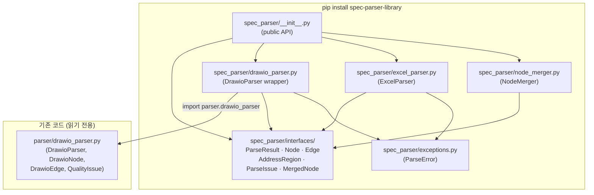
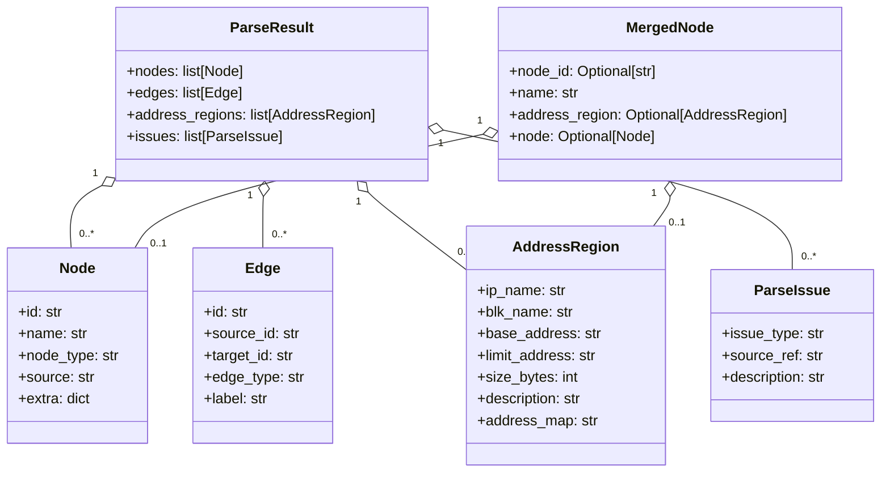

# Design Document — spec-parser-library

> **Created:** 2026-06-22
> **Updated:** 2026-06-22
> **Purpose:** spec-parser-library의 기술 설계 — 패키지 레이아웃, 인터페이스, DrawioParser 래퍼, ExcelParser, NodeMerger, 오류 처리, 테스트 전략을 기술한다.
> **Spec / Project:** `.kiro/specs/spec-parser-library/`
> **Status:** Draft

---

## Overview

`spec-parser-library`는 SoC 아키텍처 문서(drawio, MemoryMap xlsx)를 파싱해 정규화된 Python 객체로 반환하는 독립 pip 패키지다. 저장소(Neo4j, DynamoDB 등)에 의존하지 않으며, 다운스트림 repo에서 `pip install spec-parser-library`로 사용한다.

### 핵심 설계 결정

| 결정 | 이유 |
|------|------|
| 기존 `parser/drawio_parser.py`를 수정하지 않고 래핑 | 기존 `run.py` 워크플로가 깨지지 않도록 |
| `src/` 레이아웃 + hatchling | PEP 517/518 표준, `pip install -e .`가 자동으로 `PYTHONPATH` 설정 불필요 |
| dataclass 기반 인터페이스 | 직렬화·역직렬화 용이, 타입 힌트 완비 |
| ExcelParser가 openpyxl `data_only=True`로 읽기 | 수식 계산 결과(숫자)를 직접 읽어 size_bytes 변환 단순화 |
| NodeMerger — exact case-insensitive only | 오탐(false match) 방지, 명세 충실 |

---

## Architecture



**데이터 흐름:**

```
.drawio file ──► DrawioParser.parse() ──► ParseResult(nodes, edges, [], issues)
                                                              │
xlsx file ────► ExcelParser.parse()  ──► ParseResult([], [], address_regions, issues)
                                                              │
                                         NodeMerger.merge(drawio_result, excel_result)
                                                              │
                                                    list[MergedNode]
```

---

## Components and Interfaces

### 1. 패키지 디렉토리 레이아웃

```
spec-parser/                          ← 저장소 루트
├── pyproject.toml                    ← hatchling 빌드 설정
├── src/
│   └── spec_parser/
│       ├── __init__.py               ← 공개 API 재수출
│       ├── exceptions.py             ← ParseError
│       ├── interfaces/
│       │   ├── __init__.py           ← 인터페이스 재수출
│       │   ├── parse_result.py       ← ParseResult dataclass
│       │   ├── node.py               ← Node, Edge dataclasses
│       │   ├── address_region.py     ← AddressRegion dataclass
│       │   ├── parse_issue.py        ← ParseIssue dataclass
│       │   └── merged_node.py        ← MergedNode dataclass
│       ├── drawio_parser.py          ← DrawioParser wrapper
│       ├── excel_parser.py           ← ExcelParser
│       └── node_merger.py            ← NodeMerger
├── tests/
│   ├── test_interfaces.py
│   ├── test_drawio_parser.py
│   ├── test_excel_parser.py
│   ├── test_node_merger.py
│   └── conftest.py
├── parser/                           ← 기존 코드 (수정 금지)
├── graphdb/                          ← 기존 코드 (수정 금지)
└── mcp_server/                       ← 기존 코드 (수정 금지)
```

### 2. 인터페이스 dataclass 정의

**`exceptions.py`**
```python
class ParseError(Exception):
    """파일이 존재하나 파싱할 수 없을 때"""
    pass
```

**`interfaces/node.py`**
```python
@dataclass
class Node:
    id: str
    name: str
    node_type: str
    source: str
    extra: dict = field(default_factory=dict)

@dataclass
class Edge:
    id: str
    source_id: str
    target_id: str
    edge_type: str
    label: str = ""
```

**`interfaces/address_region.py`**
```python
@dataclass
class AddressRegion:
    ip_name: str
    blk_name: str
    base_address: str
    limit_address: str
    size_bytes: int
    description: str
    address_map: str
```

**`interfaces/parse_issue.py`**
```python
@dataclass
class ParseIssue:
    issue_type: str   # FLOATING_EDGE | PARTIAL_EDGE | EMPTY_LABEL |
                      # MISSING_SHEET | INVALID_SIZE | PARSE_ERROR
    source_ref: str
    description: str
```

**`interfaces/parse_result.py`**
```python
@dataclass
class ParseResult:
    nodes: list[Node] = field(default_factory=list)
    edges: list[Edge] = field(default_factory=list)
    address_regions: list[AddressRegion] = field(default_factory=list)
    issues: list[ParseIssue] = field(default_factory=list)
```

**`interfaces/merged_node.py`**
```python
@dataclass
class MergedNode:
    node_id: Optional[str]           # drawio Node.id, or None if no drawio match
    name: str
    address_region: Optional[AddressRegion]  # None if no Excel match
    node: Optional[Node] = None      # original Node for extra fields access
```

**`interfaces/__init__.py`** — 모든 타입을 재수출:
```python
from .node import Node, Edge
from .address_region import AddressRegion
from .parse_issue import ParseIssue
from .parse_result import ParseResult
from .merged_node import MergedNode

__all__ = ["Node", "Edge", "AddressRegion", "ParseIssue", "ParseResult", "MergedNode"]
```

### 3. DrawioParser (src/spec_parser/drawio_parser.py)

기존 `parser.drawio_parser.DrawioParser`를 내부에서 사용하고, 결과를 `ParseResult`로 변환하는 얇은 래퍼다.

**공개 API:**
```python
class DrawioParser:
    def __init__(self, filepath: str) -> None: ...
    def parse(self) -> ParseResult: ...
```

**내부 매핑 로직:**

```
DrawioNode  →  Node
  .id            → id
  .label         → name
  .node_type     → node_type
  "drawio"       → source
  {label, node_type, fill_color, stroke_color,
   x, y, width, height, props, page_name}  → extra

DrawioEdge  →  Edge
  .id            → id
  .source_id     → source_id
  .target_id     → target_id
  .edge_type     → edge_type
  .label         → label

QualityIssue  →  ParseIssue
  .issue_type    → issue_type
  .cell_id       → source_ref
  .description   → description
```

**오류 처리 순서:**
1. `Path(filepath).exists()` 검사 → `False`이면 `FileNotFoundError(filepath)` 즉시 raise
2. `existing_parser.parse()` 호출 → `ET.ParseError` 또는 기타 예외 발생 시 `ParseError` wrapping하여 re-raise

**내부 임포트 전략:**
```python
# src/spec_parser/drawio_parser.py
import sys, pathlib
# 저장소 루트를 sys.path에 추가 (설치 환경과 개발 환경 모두 대응)
_repo_root = pathlib.Path(__file__).parent.parent.parent
if str(_repo_root) not in sys.path:
    sys.path.insert(0, str(_repo_root))

from parser.drawio_parser import DrawioParser as _InternalDrawioParser
from parser.drawio_parser import DrawioNode, DrawioEdge, QualityIssue
```

> **이유:** `parser/`는 pip 패키지에 포함되지 않는다. 패키지가 개발 환경(`pip install -e .`)에서 사용되는 한, 저장소 루트가 `sys.path`에 들어가 있거나 위 코드로 추가된다. 배포 패키지로 독립 설치할 경우 `parser/`를 별도로 포함시키는 방안(옵션 의존성)은 Requirement 8.3과 충돌하지 않으므로 v1에서는 개발 환경 전용으로 한정하고, README에 명시한다.

### 4. ExcelParser (src/spec_parser/excel_parser.py)

**공개 API:**
```python
class ExcelParser:
    def __init__(self, filepath: str) -> None: ...
    def parse(self) -> ParseResult: ...
```

**파일 검증:**
1. `Path(filepath).exists()` → `False`이면 `FileNotFoundError(filepath)` raise
2. `openpyxl.load_workbook(filepath, data_only=True)` → 실패하면 `ParseError` raise

#### 4.1 ATLAS_CA720_MM 시트 파싱 알고리즘

실제 시트 구조(inspect 결과):
- 행 1: `['', 'BLK', 'Addr', 'IP', '', '', 'BLK', 'Addr', 'IP', '', '', ...]` — 1-indexed col 2, 7, 12… 에 `"BLK"` 헤더
- 행 2: BLK명 + 첫 번째 IP 데이터 (`'BLK_BUSN', '0x2000_0000', 'PRCM_BUSN'`)
- 행 3+: 주소 + IP명 (`'', '0x2001_0000', 'SYSREG_BUSN'`)

```
컬럼 그룹 구조 (1-indexed):
  그룹 k = [blk_col, addr_col, ip_col, _, _]
  blk_col  = 컬럼 j   (row1 == "BLK")
  addr_col = j + 1
  ip_col   = j + 2
  stride   = 5
```

**BLK 그룹 검출:**
```python
def _find_blk_groups(ws) -> list[tuple[int, int, int]]:
    """(blk_col, addr_col, ip_col) 튜플 목록 반환 (1-indexed)"""
    groups = []
    for col in range(1, ws.max_column + 1):
        if str(ws.cell(1, col).value or "").strip() == "BLK":
            groups.append((col, col + 1, col + 2))
    return groups
```

**행 필터링 규칙 (행 2부터):**
- `ip_cell` 값이 `"reserved"` (case-insensitive strip) → skip
- `ip_cell` 값이 비어 있고 `addr_cell`도 비어 있음 → skip
- `ip_cell` 값이 비어 있고 `addr_cell`에 값 있음 → `ip_name=""` 로 `AddressRegion` 생성
- `blk_name`: 해당 그룹의 row-2 BLK 컬럼 값을 파싱 시작 시 한 번 읽어 저장

**`AddressRegion` 생성:**
```python
AddressRegion(
    ip_name=ip_val,          # "" if ip_cell empty
    blk_name=blk_name,       # row-2 BLK column value
    base_address=str(addr_cell_value),  # 셀 값 그대로
    limit_address="",
    size_bytes=0,
    description="",
    address_map="ATLAS_CA720_MM",
)
```

#### 4.2 MM-CPU / MM-SAFE 시트 파싱 알고리즘

실제 시트 구조(inspect 결과):
- 행 5: `['Base Address (HEX)', 'Limit Address (HEX)', 'Size (Hex)', 'Size (B)', 'Size (KB)', 'Size (MB)', 'Size (GB)', 'Description', ...]`
- 즉, col 1 = base, col 2 = limit, col 4 = Size(B), col 8 = Description

**헤더 행 검출:**
```python
def _find_data_start(ws) -> int:
    """col 1 이 "Base Address (HEX)" 인 행 번호 반환 (1-indexed). 없으면 -1."""
    for row in range(1, ws.max_row + 1):
        if str(ws.cell(row, 1).value or "").strip() == "Base Address (HEX)":
            return row + 1   # 다음 행부터 데이터
    return -1
```

**행 필터링 규칙:**
- `base_address` 셀이 비어 있음 → skip
- `description` 값이 `"Reserved"` (case-insensitive strip) → skip

**`size_bytes` 변환:**
```python
raw = ws.cell(row, 4).value
try:
    size_bytes = int(raw)
except (TypeError, ValueError):
    size_bytes = 0
    issues.append(ParseIssue(
        issue_type="INVALID_SIZE",
        source_ref=f"{sheet_name}!D{row}",
        description=f"size 변환 실패: {raw!r}",
    ))
```

> `data_only=True` 로 workbook을 열면 col 4 (`Size (B)`)는 openpyxl이 계산된 정수값을 반환한다. 실제 파일에서 이 컬럼은 `33554432` 같은 정수다.

**`AddressRegion` 생성:**
```python
AddressRegion(
    ip_name="",
    blk_name="",
    base_address=str(ws.cell(row, 1).value),   # 셀 값 그대로
    limit_address=str(ws.cell(row, 2).value or ""),
    size_bytes=size_bytes,
    description=str(ws.cell(row, 8).value or ""),
    address_map="MM-CPU" | "MM-SAFE",
)
```

#### 4.3 MISSING_SHEET 처리

```python
for sheet_name in ["ATLAS_CA720_MM", "MM-CPU", "MM-SAFE"]:
    if sheet_name not in wb.sheetnames:
        result.issues.append(ParseIssue(
            issue_type="MISSING_SHEET",
            source_ref=filepath,
            description=f"시트 '{sheet_name}'이 존재하지 않습니다.",
        ))
        continue
    # 파싱 계속
```

`ATLAS_CA720_MM`이 없으면 `address_regions`는 빈 채로 유지되고 나머지 시트 파싱은 계속된다.

### 5. NodeMerger (src/spec_parser/node_merger.py)

**공개 API:**
```python
class NodeMerger:
    def merge(
        self,
        drawio_result: ParseResult,
        excel_result: ParseResult,
    ) -> list[MergedNode]: ...
```

**매칭 알고리즘:**

```
1. drawio_result.nodes 로 { name.lower() → Node } 딕셔너리 구성
   (동일 name이 여러 개인 경우 list[Node]로 저장)

2. excel_result.address_regions 순회:
   ip_name.lower() 가 딕셔너리에 있으면 → 매칭된 각 Node에 대해 MergedNode 생성
   없으면 → MergedNode(node_id=None, name=ip_name, address_region=region)

3. 매칭에 사용된 Node ID 추적:
   이미 매칭된 Node ID set을 유지

4. drawio_result.nodes 중 매칭 안 된 것:
   → MergedNode(node_id=node.id, name=node.name, address_region=None, node=node)
```

**복수 AddressRegion 처리 (Req 6.6):**

같은 `ip_name`을 가진 `AddressRegion`이 `MM-CPU`, `MM-SAFE` 등 여러 `address_map`에 걸쳐 있으면, 해당 Node 하나에 대해 `AddressRegion` 개수만큼 `MergedNode`를 생성한다.

```python
# 예시: SYSREG_CPU0 이 MM-CPU 와 ATLAS_CA720_MM 두 곳에 존재
# → MergedNode(node_id="n1", name="SYSREG_CPU0", address_region=region_from_mm_cpu)
# → MergedNode(node_id="n1", name="SYSREG_CPU0", address_region=region_from_atlas)
```

**퍼지 매칭 금지:** 오직 `a.lower() == b.lower()` 비교만 허용. 레벤슈타인 거리, 접두사 매칭 등 일절 사용하지 않는다.

### 6. pyproject.toml

```toml
[build-system]
requires = ["hatchling"]
build-backend = "hatchling.build"

[project]
name = "spec-parser-library"
version = "0.1.0"
requires-python = ">=3.10"
dependencies = [
    "openpyxl>=3.1",
    "lxml>=4.9",
]

[tool.hatch.build.targets.wheel]
packages = ["src/spec_parser"]
```

`pip install -e .` 실행 시 hatchling이 `src/spec_parser`를 editable wheel로 설치하므로 `PYTHONPATH` 수동 설정 없이 `import spec_parser`가 동작한다.

### 7. src/spec_parser/__init__.py

```python
from spec_parser.interfaces import (
    ParseResult, Node, Edge, AddressRegion, ParseIssue, MergedNode,
)
from spec_parser.drawio_parser import DrawioParser
from spec_parser.excel_parser import ExcelParser
from spec_parser.node_merger import NodeMerger
from spec_parser.exceptions import ParseError

__all__ = [
    "ParseResult", "Node", "Edge", "AddressRegion",
    "ParseIssue", "MergedNode",
    "DrawioParser", "ExcelParser", "NodeMerger",
    "ParseError",
]
```

---

## Data Models

### 클래스 다이어그램



### AddressRegion 필드 출처 매핑

| 필드 | ATLAS_CA720_MM | MM-CPU / MM-SAFE |
|------|----------------|------------------|
| `ip_name` | IP 컬럼 값 (row2+) | `""` |
| `blk_name` | row2 BLK 컬럼 값 | `""` |
| `base_address` | Addr 컬럼 값 (원문 그대로) | col 1 값 |
| `limit_address` | `""` | col 2 값 |
| `size_bytes` | `0` | col 4 정수 변환 |
| `description` | `""` | col 8 값 |
| `address_map` | `"ATLAS_CA720_MM"` | `"MM-CPU"` / `"MM-SAFE"` |

---

## Correctness Properties

*A property is a characteristic or behavior that should hold true across all valid executions of a system — essentially, a formal statement about what the system should do. Properties serve as the bridge between human-readable specifications and machine-verifiable correctness guarantees.*

### Property 1: DrawioParser 필드 매핑 보존

*For any* `DrawioNode` 인스턴스, `DrawioParser`의 내부 매핑 함수를 거쳐 생성된 `Node`는 `source == "drawio"`이어야 하고, `extra` 딕셔너리에 `label`, `node_type`, `fill_color`, `x`, `y`, `width`, `height`, `page_name` 키가 모두 존재해야 한다.

*For any* `DrawioEdge` 인스턴스, 매핑된 `Edge`는 `edge_type`과 `label`이 원본과 동일해야 한다.

**Validates: Requirements 2.2, 2.3**

### Property 2: QualityIssue → ParseIssue 완전 전달

*For any* N개의 `QualityIssue` 목록을 가진 drawio 파일을 파싱하면, `ParseResult.issues`에는 정확히 N개의 `ParseIssue`가 포함되어야 한다.

**Validates: Requirements 2.4**

### Property 3: 존재하지 않는 파일 — FileNotFoundError

*For any* 파일 시스템에 존재하지 않는 경로 문자열을 `DrawioParser` 또는 `ExcelParser`에 전달하면, 두 파서 모두 `FileNotFoundError`를 raise해야 한다.

**Validates: Requirements 2.5, 5.1**

### Property 4: ATLAS_CA720_MM address_map 태그 불변성

*For any* 유효한 MemoryMap xlsx 파일을 파싱할 때, `ATLAS_CA720_MM` 시트에서 생성된 모든 `AddressRegion`의 `address_map` 필드는 정확히 `"ATLAS_CA720_MM"`이어야 하며, `limit_address == ""` 이고 `size_bytes == 0` 이어야 한다.

**Validates: Requirements 3.4, 3.6**

### Property 5: BLK 그룹 검출 정확성

*For any* 행 1에 `"BLK"` 헤더가 임의 컬럼 위치에 배치된 합성 워크시트에 대해, `_find_blk_groups` 함수는 각 `"BLK"` 헤더의 컬럼 인덱스를 정확히 반환해야 하며, 검출된 각 그룹의 stride(ip_col - blk_col)가 2이어야 한다.

**Validates: Requirements 3.2**

### Property 6: 행 필터링 — Reserved/빈 IP 건너뜀

*For any* `"reserved"` (대소문자 무관)이거나 빈 문자열인 IP 셀 값을 가진 행에 대해, `ExcelParser`는 해당 행에 대한 `AddressRegion`을 생성해서는 안 된다. 또한 MM-CPU/MM-SAFE에서 description이 `"Reserved"` (case-insensitive)인 행도 `AddressRegion`을 생성해서는 안 된다.

**Validates: Requirements 3.7, 4.6**

### Property 7: MM-CPU/MM-SAFE 컬럼 매핑 불변성

*For any* MM-CPU 또는 MM-SAFE 시트의 파싱 결과 `AddressRegion`에 대해, `blk_name == ""`, `ip_name == ""` 이어야 하며, `address_map`은 각각 `"MM-CPU"` 또는 `"MM-SAFE"`이어야 한다. 또한 각 `AddressRegion.base_address` 값은 해당 행의 col 1 raw 셀 값과 동일해야 한다.

**Validates: Requirements 4.3, 4.4, 4.5, 9.1**

### Property 8: INVALID_SIZE 오류 처리

*For any* 정수로 변환할 수 없는 size 셀 값 (빈 셀, 문자열, 부동소수점 문자열 등)에 대해, `ExcelParser`는 `issue_type == "INVALID_SIZE"`인 `ParseIssue`를 기록하고 해당 행의 `size_bytes == 0`을 설정해야 한다.

**Validates: Requirements 4.7**

### Property 9: NodeMerger 매칭 정확성 및 완전성

*For any* N개의 `Node` 목록과 M개의 `AddressRegion` 목록에서, `NodeMerger.merge()` 결과는:
- 각 매칭된 (Node, AddressRegion) 쌍에 대해 정확히 1개의 `MergedNode`가 생성된다
- 매칭되지 않은 모든 `Node`는 `address_region=None`인 `MergedNode`로 포함된다
- 매칭되지 않은 모든 `AddressRegion`은 `node_id=None`인 `MergedNode`로 포함된다
- 총 `MergedNode` 수는 `N + M - (매칭 쌍 수)`와 같다

**Validates: Requirements 6.1, 6.2, 6.3, 6.4**

### Property 10: NodeMerger 복수 address_map 카디널리티

*For any* 하나의 `Node`에 대해 같은 `ip_name`을 갖는 K개의 `AddressRegion`(서로 다른 `address_map`)이 있을 때, `NodeMerger.merge()`는 해당 Node에 대해 정확히 K개의 `MergedNode`를 생성해야 한다.

**Validates: Requirements 6.6**

### Property 11: ExcelParser 직렬화 라운드트립

*For any* 유효한 MemoryMap xlsx 파일로부터 파싱된 `AddressRegion` 객체를 `dataclasses.asdict()`로 딕셔너리로 변환한 후 `AddressRegion(**d)`로 재구성하면, 재구성된 객체는 원본과 동일해야 한다.

**Validates: Requirements 9.3**

### Property 12: ExcelParser 멱등성 (idempotence)

*For any* 유효한 MemoryMap xlsx 파일에 대해 `ExcelParser(path).parse()`를 두 번 연속 호출하면, 두 결과의 `address_regions` 목록과 `issues` 목록은 동일해야 한다.

**Validates: Requirements 9.4**

---

## Error Handling

### 오류 분류 및 처리 전략

| 상황 | 예외/처리 | 발생 시점 |
|------|-----------|-----------|
| 파일 미존재 | `FileNotFoundError(filepath)` | `__init__` 또는 `parse()` 첫 줄 |
| 파일 있으나 파싱 불가 (XML/xlsx 손상) | `ParseError(description)` | 파서 호출 직후 except |
| 시트 미존재 | `ParseIssue(issue_type="MISSING_SHEET")` | 시트 접근 전 검사 |
| size 정수 변환 실패 | `ParseIssue(issue_type="INVALID_SIZE")`, `size_bytes=0` | 해당 행 처리 중 |
| DrawioNode 빈 라벨 | `ParseIssue` (기존 `EMPTY_LABEL` 전달) | 래퍼 매핑 중 |

### ParseError 설계

```python
class ParseError(Exception):
    """파일이 존재하나 파서가 처리할 수 없을 때 발생하는 예외."""
    def __init__(self, message: str, filepath: str = "", cause: Exception = None):
        super().__init__(message)
        self.filepath = filepath
        self.cause = cause
```

### 방어적 파싱 원칙

- 치명적 오류(파일 없음, 파일 손상): 즉시 예외 raise, 부분 결과 없음
- 복구 가능한 오류(시트 없음, 개별 행 파싱 실패): `ParseIssue`로 기록하고 파싱 계속
- 로그를 직접 출력하지 않는다 — 호출자가 `ParseResult.issues`를 검사해 처리

---

## Testing Strategy

### 테스트 프레임워크 및 도구

| 도구 | 용도 |
|------|------|
| `pytest` | 테스트 러너 |
| `hypothesis` | Property-based testing (PBT) |
| `openpyxl` (테스트용) | 합성 xlsx 생성 |

### 단위 테스트 (example-based)

**`tests/test_interfaces.py`**
- `Node`, `Edge`, `AddressRegion`, `ParseIssue`, `ParseResult`, `MergedNode` 인스턴스화 및 필드 접근
- `from spec_parser.interfaces import ...` 임포트 성공 확인
- `from spec_parser import DrawioParser, ExcelParser, NodeMerger, ...` 공개 API 확인

**`tests/test_drawio_parser.py`**
- 샘플 drawio 파일로 `DrawioParser.parse()` → `ParseResult` 반환 확인
- 존재하지 않는 경로 → `FileNotFoundError`
- 손상된 XML 파일 → `ParseError`

**`tests/test_excel_parser.py`**
- 샘플 xlsx로 `ExcelParser.parse()` → 비어 있지 않은 `address_regions`
- `ATLAS_CA720_MM` 시트 없는 xlsx → `MISSING_SHEET` ParseIssue
- `MM-CPU` 시트 없는 xlsx → `MISSING_SHEET` ParseIssue, `MM-SAFE`는 정상 파싱

**`tests/test_node_merger.py`**
- 간단한 매칭 예시 (정확한 이름 매칭)
- 매칭 없는 경우 (전부 unmatched)

### Property-Based 테스트 (hypothesis)

PBT 라이브러리: `hypothesis` (Python 표준 PBT 라이브러리)
최소 반복 횟수: 각 property 테스트당 100회 (`@settings(max_examples=100)`)
태그 형식: `# Feature: spec-parser-library, Property N: <property_text>`

**Property 1: DrawioParser 필드 매핑 보존**
```python
# Feature: spec-parser-library, Property 1: DrawioParser field mapping preserves source and extra keys
@given(st.builds(DrawioNode, ...))
@settings(max_examples=100)
def test_drawionode_mapping_preserves_fields(node: DrawioNode):
    mapped = _map_node(node)
    assert mapped.source == "drawio"
    assert all(k in mapped.extra for k in ["label", "node_type", "fill_color", "x", "y", "width", "height"])
```

**Property 2: QualityIssue 완전 전달** — DrawioNode/Edge 매핑 테스트와 연동

**Property 3: FileNotFoundError** — `hypothesis.strategies.text()`로 임의 경로 생성

**Property 5: BLK 그룹 검출** — 합성 header row 생성 후 `_find_blk_groups` 검증

**Property 6: 행 필터링** — `hypothesis`로 IP 셀 값 생성 ("reserved", "RESERVED", "")

**Property 7: MM-CPU/SAFE 컬럼 매핑** — openpyxl로 합성 시트 생성 후 매핑 검증

**Property 8: INVALID_SIZE** — `hypothesis.strategies.text()` | `st.none()` | `st.floats()` 로 비정수 값 생성

**Property 9: NodeMerger 완전성** — 임의 Node/AddressRegion 리스트 생성 후 수량 검증

**Property 10: 복수 address_map 카디널리티** — `st.integers(min_value=1, max_value=10)`으로 K 생성

**Property 11: 라운드트립** — `st.builds(AddressRegion, ...)` 후 `asdict` → 재구성 비교

**Property 12: 멱등성** — 샘플 파일 두 번 파싱 후 결과 비교 (파일 고정, hypothesis 불필요 — 단일 예제로 충분)

### 커버리지 목표

- `src/spec_parser/` 전체 라인 커버리지 ≥ 90%
- 필수 예외 경로(`FileNotFoundError`, `ParseError`, `MISSING_SHEET`, `INVALID_SIZE`) 100% 커버
