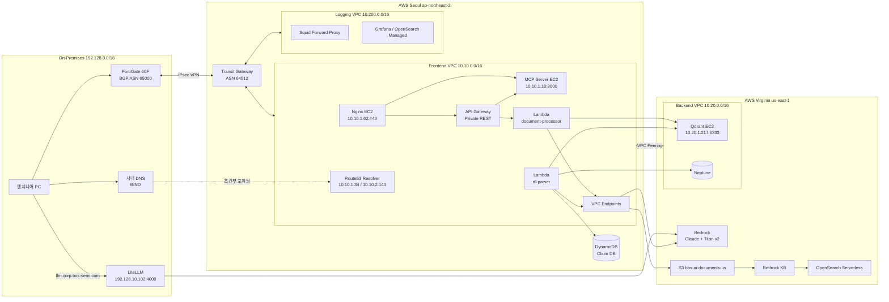

# AWS Air-Gapped Architecture

> **Created:** 2026-06-02
> **Updated:** 2026-06-02
> **Purpose:** 폐쇄망 BOS-AI Private RAG의 AWS 인프라(VPC/TGW/VPN/Peering/Endpoint, EC2/Lambda, SG/IAM/KMS) 현재 스냅샷.
> **Spec / Project:** 운영 BOS-AI Private RAG
> **Status:** Stable
> **Owner:** Infra/DevOps

---

## 0. 문서 범위

- **이 문서**: AWS에서 폐쇄망을 구현한 인프라(네트워크·서버·보안)의 현재 상태
- **응용 문서**: `docs/Phase03_rag-application/03_enhanced-rag/rtl-rag-pipeline-architecture.md` (RTL 파이프라인, 검색, HDD 생성)

---

## 1. 한눈에 보기



핵심: On-Prem과 AWS는 IPsec VPN + TGW로 묶고, 인터넷·NAT 없이 VPC Endpoint와 VPC Peering으로 모든 AWS 서비스에 닿는다.

---

## 2. 네트워크

### 2.1 VPC

| VPC | CIDR | 리전 | 용도 | IGW | NAT | 0.0.0.0/0 |
|-----|------|------|------|-----|-----|-----------|
| Frontend (Private RAG) | 10.10.0.0/16 | Seoul | RAG 진입점, Lambda, MCP/Nginx EC2, Endpoints | ❌ | ❌ | ❌ |
| Logging | 10.200.0.0/16 | Seoul | 보안 로그, Squid, Grafana | (별도) | (별도) | — |
| Backend | 10.20.0.0/16 | Virginia | Qdrant, Neptune, AI 서비스 접근 | — | — | — |

**Frontend VPC 서브넷:**

| 서브넷 | CIDR | AZ | 호스트 |
|--------|------|----|--------|
| Private-1 | 10.10.1.0/24 | ap-northeast-2a | Nginx, MCP, Resolver, Lambda ENI |
| Private-2 | 10.10.2.0/24 | ap-northeast-2c | Resolver, Lambda ENI |

**Frontend VPC 라우팅:**

| 대상 | 타겟 |
|------|------|
| 10.10.0.0/16 | local |
| 192.128.0.0/16 | TGW |
| 10.20.0.0/16 | VPC Peering `pcx-0a44f0b90565313f7` |

### 2.2 Transit Gateway

| 항목 | 값 |
|------|-----|
| TGW ID | tgw-0897383168475b532 |
| AWS ASN | 64512 |
| Attachment | Frontend VPC, Logging VPC, VPN |

라우팅:

```
192.128.0.0/16 → VPN
10.10.0.0/16   → Frontend VPC
10.200.0.0/16  → Logging VPC
```

### 2.3 IPsec VPN

| 항목 | 값 |
|------|-----|
| VPN ID | vpn-0b2b65e9414092369 |
| 온프레미스 장비 | FortiGate 60F v7.4.11 |
| 터널 (AWS) | 3.38.69.188, 43.200.222.199 |
| 라우팅 | BGP (On-Prem ASN 65000 ↔ AWS ASN 64512) |
| 터널 수 | 2 (Active/Standby) |

### 2.4 VPC Peering (Seoul ↔ Virginia)

| 항목 | 값 |
|------|-----|
| Peering ID | pcx-0a44f0b90565313f7 |
| 양단 | Frontend VPC ↔ Backend VPC |
| 트래픽 | Lambda → Qdrant·Neptune·S3·Bedrock |

### 2.5 VPC Endpoints (Frontend VPC)

| 서비스 | Endpoint ID | 타입 | 비고 |
|--------|-------------|------|------|
| execute-api | vpce-0e5f61dd7bd52882e | Interface | API Gateway. Private DNS 비활성 |
| S3 | vpce-08474f7814c698b6c | Gateway | — |
| CloudWatch Logs | vpce-0f017558595dedd41 | Interface | — |
| Secrets Manager | vpce-075ba17f3151048ba | Interface | Qdrant API key 등 |
| OpenSearch (AOSS) | vpce-013aa002a16145cd0 | Interface | Bedrock KB 측 |
| Bedrock Runtime | vpce-0fe70be9fc4fd10ea | Interface | Claude/Titan |

DynamoDB는 Endpoint 대신 prefix list `pl-48a54021`로 SG egress만 허용한다.

### 2.6 DNS

| 항목 | 값 |
|------|-----|
| Private Hosted Zone | corp.bos-semi.com (Z04599582HCRH2UPCSS34) |
| 연결 VPC | Frontend VPC |
| Resolver Inbound | rslvr-in-93384eeb51fc4c4db (10.10.1.34, 10.10.2.144) |

PHZ 레코드:

| 이름 | 타입 | 값 |
|------|------|-----|
| rag.corp.bos-semi.com | A (Alias) | execute-api VPC Endpoint DNS |
| mcp.corp.bos-semi.com | A | 10.10.1.62 (Nginx EC2) |
| llm.corp.bos-semi.com | A | 192.128.10.102 (On-Prem LiteLLM) |

사내 DNS는 `*.corp.bos-semi.com`만 Resolver Inbound로 조건부 포워딩한다. 그 외 도메인은 기존 사내/Public DNS를 그대로 사용한다.

---

## 3. 서버·컴포넌트

### 3.1 EC2

| 컴포넌트 | 위치 | IP | 인스턴스 | 포트 | 역할 |
|----------|------|-----|---------|------|------|
| Nginx Proxy | Frontend VPC | 10.10.1.62 | t3.micro | 443 | TLS 종단, MCP 프록시 |
| MCP Server | Frontend VPC | 10.10.1.10 | t3.small | 3000 | 17개 MCP 도구, Lambda invoke |
| Squid Forward Proxy | Logging VPC | (private) | t3.micro | 3128 | 화이트리스트 외부 호출 |
| LiteLLM | On-Prem | 192.128.10.102 | 물리 서버 | 4000 | OpenAI-compatible API (Bedrock + GPT) |

### 3.2 Lambda

| 함수명 | 메모리 | Timeout | Concurrency | 트리거 | 역할 |
|--------|--------|---------|-------------|-------|------|
| `lambda-document-processor-seoul-prod` | 512 MB | 300s | 10 | API Gateway | RAG 검색·HDD 생성 응답 |
| `lambda-rtl-parser-seoul-dev` | 512 MB | 300s | 20 | S3 ObjectCreated | RTL 파싱 → Qdrant·Neptune·DynamoDB 적재 |

런타임은 Python 3.12. 두 함수 모두 Frontend VPC ENI에 attach.

### 3.3 데이터·AI 서비스

| 서비스 | 위치 | 역할 |
|--------|------|------|
| S3 `bos-ai-documents-seoul-v3` | Seoul | 사용자 업로드 1차 저장. SSE-KMS, 버전 관리 |
| S3 `bos-ai-documents-us` | Virginia | Cross-Region Replication 대상. Bedrock KB 데이터 소스 |
| Bedrock KB `FNNOP3VBZV` | Virginia | Titan Embed v2 + Claude. 일반 문서 RAG |
| OpenSearch Serverless `bos-ai-vectors` | Virginia | Bedrock KB 전용 벡터 인덱스 |
| Qdrant EC2 `10.20.1.217:6333` | Virginia | RTL 전용 벡터 인덱스 (`rtl-knowledge-base`, 1024d, cosine) |
| Neptune Cluster | Virginia | RTL 인스턴스 트리·신호 경로·CDC 그래프 |
| DynamoDB `bos-ai-claim-db-prod` | Seoul | Claim DB |

벡터 저장소는 Bedrock KB(AOSS)와 RTL(Qdrant) 두 개로 분리되어 있다.

---

## 4. 보안

### 4.1 격리 원칙

| 원칙 | 구현 |
|------|------|
| Air-Gapped | Frontend VPC에 IGW/NAT/`0.0.0.0/0` 없음 |
| Zero Trust | API GW Resource Policy + SG + IAM 3중 게이트 |
| 최소 권한 | IAM Role마다 사용 리소스만 명시 (버킷·KB·테이블 단위) |
| 암호화 기본 | 전송 중 TLS 1.2 / IPsec, 저장 중 SSE-KMS |

### 4.2 Security Group

| SG | Inbound | Outbound |
|----|---------|----------|
| VPC Endpoints | TCP 443 from 10.10.0.0/16, 192.128.0.0/16 | — |
| Route53 Resolver | TCP/UDP 53 from 192.128.0.0/16 | — |
| Lambda (document-processor) | — | TCP 443 → VPCE SG, 10.20.0.0/16 |
| Lambda (rtl-parser) | — | TCP 443 → VPCE SG, 10.20.0.0/16, DynamoDB pl-48a54021 |
| Nginx EC2 | TCP 443 from 192.128.0.0/16 | TCP 443 → VPCE SG, TCP 3000 → MCP SG |
| MCP EC2 | TCP 3000 from Nginx SG, API GW VPCE | TCP 443 → VPCE SG, Lambda invoke |
| Qdrant EC2 | TCP 6333 from 10.10.0.0/16 (peering) | (제한) |

### 4.3 IAM

| Role | 핵심 권한 | 리소스 한정 |
|------|----------|------------|
| document-processor Lambda | s3:Get/List, logs:*, bedrock:Invoke*, kms:Decrypt, ec2:*NetworkInterface | 데이터 버킷, KB ID |
| rtl-parser Lambda | s3:Get/List, logs:*, dynamodb:PutItem/GetItem/Query, secretsmanager:GetSecretValue | Claim 테이블, Qdrant secret |
| Bedrock KB Role | s3:GetObject, aoss:APIAccessAll, bedrock:InvokeModel | 버킷, KB collection, Titan ARN |
| S3 Replication Role | s3:GetObject (Seoul), s3:Replicate* (Virginia), kms:Decrypt/Encrypt | 두 버킷 + 두 KMS 키 |

### 4.4 API Gateway Resource Policy

```json
{
  "Effect": "Allow",
  "Principal": "*",
  "Action": "execute-api:Invoke",
  "Resource": "execute-api:/*",
  "Condition": {
    "StringEquals": { "aws:sourceVpce": "vpce-0e5f61dd7bd52882e" }
  }
}
```

### 4.5 S3 Bucket Policy (요약)

```
Deny  s3:* on bos-ai-documents-seoul-v3
      WHEN aws:sourceVpce != vpce-08474f7814c698b6c
```

예외: Terraform 운영자 IAM, S3 Replication Role.

### 4.6 암호화

| 구간 | 방식 |
|------|------|
| On-Prem ↔ AWS | IPsec VPN (AES-256, IKEv2) |
| 클라이언트 ↔ API GW / MCP | TLS 1.2 |
| Lambda ↔ AWS 서비스 | TLS 1.2 (VPC Endpoint) |
| VPC Peering | AWS 백본 내부 암호화 |
| S3 (Seoul/Virginia) | SSE-KMS, 리전별 키 |
| AOSS / Qdrant | TLS + 디스크 암호화 |
| Lambda 환경 변수 | KMS |

S3 Cross-Region Replication 시 Seoul KMS로 복호화 → Virginia KMS로 재암호화.

### 4.7 감사·로깅

| 항목 | 보존 |
|------|------|
| CloudTrail (모든 AWS API) | 90일 |
| VPC Flow Logs (Frontend/Backend) | 30일 |
| API GW Access Log | 30일 |
| Lambda CloudWatch Logs | 14일 |

---

## 5. 트래픽 시나리오

### 5.1 사용자 RAG 질의

```
사용자 PC
  → 사내 DNS (조건부 포워딩) → Resolver Inbound → PHZ → execute-api VPCE 사설 IP
  → VPN → TGW → Frontend VPC → execute-api VPCE → API Gateway
  → Lambda document-processor
  → VPC Peering → Qdrant / Bedrock(VPCE) / Neptune
  → 응답 ← Lambda ← API GW ← VPCE ← TGW ← VPN
```

### 5.2 문서 업로드 → 인덱싱

일반 문서:
```
사용자 → API GW /rag/documents → Lambda → S3 Gateway VPCE → S3(Seoul)
  → Cross-Region Replication → S3(Virginia) → Bedrock KB → AOSS
```

RTL:
```
S3(Seoul, RTL prefix) → 이벤트 → rtl-parser Lambda
  → 10종 파서 → claim/module_parse/signal_path 생성
  → VPC Peering → Qdrant 적재 + Neptune 적재
  → DynamoDB Claim DB 저장 (prefix list egress 경유)
```

### 5.3 Codex / Claude Code → MCP

```
엔지니어 PC → mcp.corp.bos-semi.com (PHZ로 10.10.1.62 해석)
  → VPN → TGW → Nginx EC2(443, TLS 종단)
  → API Gateway /mcp/{proxy+} → MCP Server EC2(10.10.1.10:3000)
  → Lambda invoke → 시나리오 5.1의 Lambda 경로
```

### 5.4 LLM 호출 (LiteLLM 경유)

```
엔지니어 PC → llm.corp.bos-semi.com:4000 (PHZ로 192.128.10.102 해석)
  → On-Prem LiteLLM (Virtual Key 검증)
  → (a) Bedrock 모델: VPN → TGW → VPCE Bedrock Runtime → Virginia
  → (b) GPT 모델: On-Prem 인터넷 → api.openai.com
```

---

## 6. 참고 문서

| 영역 | 문서 |
|------|------|
| 네트워크 토폴로지 | [`Phase02_network/01_private-rag-api/deep-dive-network-architecture.md`](../Phase02_network/01_private-rag-api/deep-dive-network-architecture.md) |
| 보안 정책 | [`Phase02_network/01_private-rag-api/deep-dive-security-policy.md`](../Phase02_network/01_private-rag-api/deep-dive-security-policy.md) |
| 컴포넌트 상세 | [`Phase02_network/01_private-rag-api/deep-dive-component-details.md`](../Phase02_network/01_private-rag-api/deep-dive-component-details.md) |
| 데이터 흐름 | [`Phase02_network/01_private-rag-api/deep-dive-data-flow.md`](../Phase02_network/01_private-rag-api/deep-dive-data-flow.md) |
| RTL RAG 파이프라인 | [`Phase03_rag-application/03_enhanced-rag/rtl-rag-pipeline-architecture.md`](../Phase03_rag-application/03_enhanced-rag/rtl-rag-pipeline-architecture.md) |
| 운영 런북 | `docs/OPERATIONAL_RUNBOOK.md` |

---

## Appendix A. 리소스 ID 빠른 참조

| 리소스 | ID |
|--------|-----|
| Frontend VPC | vpc-0a118e1bf21d0c057 |
| Backend VPC (US) | vpc-0ed37ff82027c088f |
| Logging VPC | vpc-066c464f9c750ee9e |
| Transit Gateway | tgw-0897383168475b532 |
| VPN | vpn-0b2b65e9414092369 |
| VPC Peering | pcx-0a44f0b90565313f7 |
| API Gateway | r0qa9lzhgi |
| Bedrock KB | FNNOP3VBZV |
| AOSS Collection | iw3pzcloa0en8d90hh7 (`bos-ai-vectors`) |
| Private Hosted Zone | Z04599582HCRH2UPCSS34 (`corp.bos-semi.com`) |
| Resolver Inbound | rslvr-in-93384eeb51fc4c4db |
| DynamoDB prefix list | pl-48a54021 |
