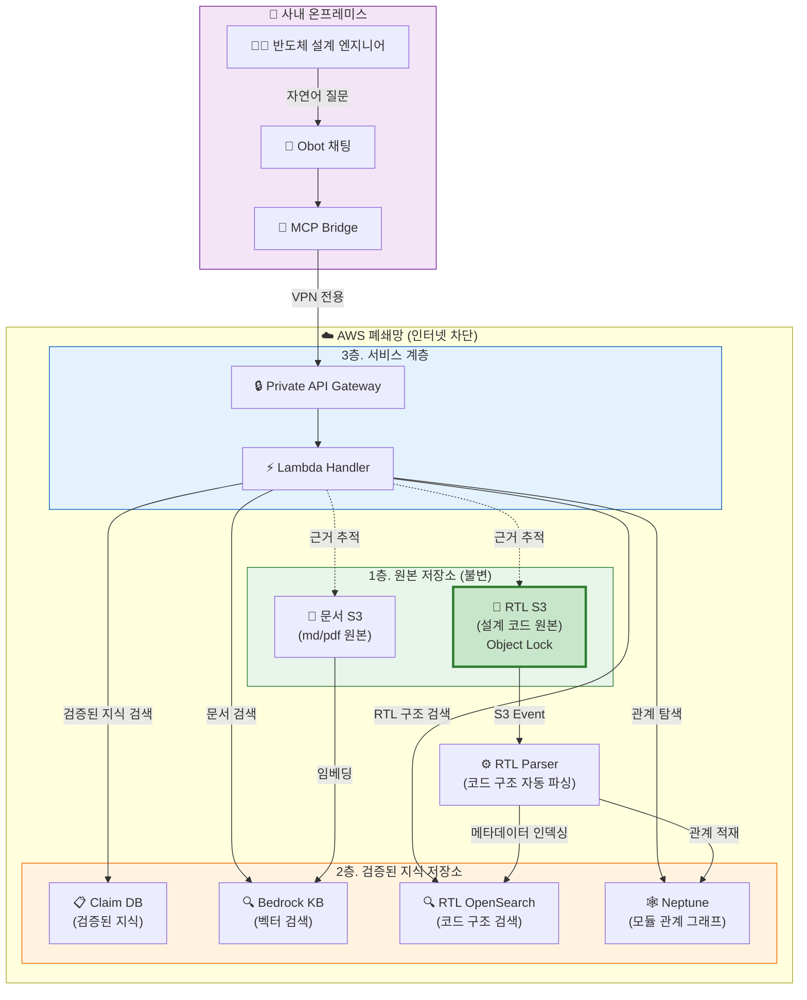
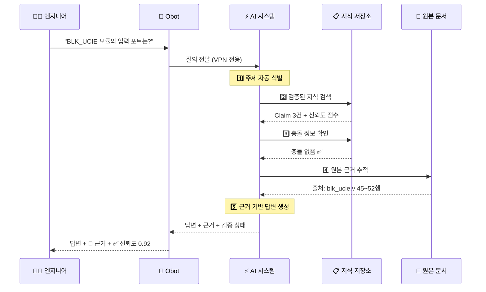
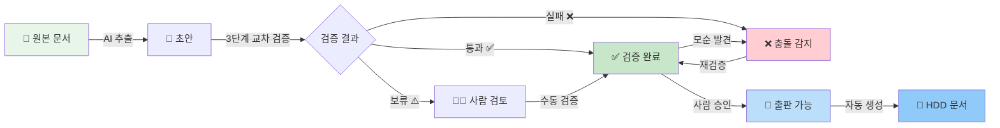

# BOS-AI Private RAG 시스템 경영진 보고서

**보고일**: 2026년 4월 7일
**작성**: IT/DevOps TF
**대상**: 경영진
**분류**: 사내 한정

---

## 1. 시스템 개요

BOS-AI Private RAG는 당사 반도체 설계 엔지니어들이 사내 기술 문서(RTL 코드, 설계 스펙, HDD 등)를 자연어로 질의하고, AI가 근거 기반 답변을 제공하는 사내 전용 AI 지식 시스템입니다.

모든 데이터와 AI 처리는 외부 인터넷이 완전히 차단된 폐쇄망(Air-Gapped) 환경에서 동작하며, 당사의 핵심 IP(RTL 설계 코드)가 외부로 유출될 수 없는 구조로 설계되었습니다.

본 프로젝트는 기반 인프라 구축부터 시작하여, 문서 검색 → Hybrid Search → 검증 가능한 지식 운영 체계(Enhanced RAG)까지 단계적으로 진화하는 로드맵을 따릅니다.

---

## 2. 시스템 동작 방식

### 전체 시스템 구조도



### 엔지니어 질의 응답 흐름



### 지식 오염 방지 흐름



### 기존 방식 vs BOS-AI RAG

| 항목 | 기존 (수동) | BOS-AI RAG |
|------|------------|------------|
| RTL 코드 분석 | 엔지니어가 직접 코드를 읽고 수동으로 Memory Archive 작성 | AI가 자동으로 모듈 구조를 파싱하고 검색 가능한 형태로 저장 |
| HDD 문서 작성 | 수동으로 분석 결과를 마크다운으로 정리 | AI가 검증된 지식 기반으로 HDD 섹션 초안을 자동 생성 |
| 정보 검증 | 다른 AI에 다시 물어보거나 동료에게 확인 | 시스템이 자동으로 3단계 교차 검증 수행 |
| 오류 추적 | 어떤 문서에서 온 정보인지 추적 어려움 | 모든 답변에 원본 문서 출처와 라인 번호까지 첨부 |
| 정보 오염 | 잘못된 정보가 archive에 남아 전파 | Claim 상태 관리(초안→검증→충돌→폐기)로 오염 차단 |
| 설계 관계 대조 | 엑셀에 모듈 관계를 수동 정리 후 하나하나 대조 | Graph DB가 RTL 코드에서 관계를 자동 추출, 신호 경로/인스턴스 트리 즉시 탐색 |

---

## 3. 3계층 보안 아키텍처

```
┌─────────────────────────────────────────────────────┐
│  1층. 원본 저장소 (Source of Truth)                      │
│  ─ RTL 소스 코드, 설계 문서 원본                          │
│  ─ AI가 절대 수정할 수 없음 (인프라 수준 차단)               │
│  ─ Object Lock으로 우발적 삭제/덮어쓰기 방지               │
├─────────────────────────────────────────────────────┤
│  2층. 검증된 지식 저장소 (Knowledge Archive)              │
│  ─ 원본에서 추출/검증된 지식 단위(Claim)                   │
│  ─ 각 지식에 근거 문서, 검증 상태, 신뢰도 점수 부착          │
│  ─ 사람의 승인 없이 중요 문서 출판 불가                     │
├─────────────────────────────────────────────────────┤
│  3층. 서비스 계층 (Serving)                              │
│  ─ 엔지니어가 접근하는 유일한 계층                         │
│  ─ 검증된 지식 + 원본 근거를 조합하여 답변 생성              │
│  ─ 사내 VPN을 통해서만 접근 가능                          │
└─────────────────────────────────────────────────────┘
```

---

## 4. 보안 기능

| 영역 | 보안 항목 | 구현 방식 |
|------|-----------|----------|
| 네트워크 | 인터넷 차단 | VPC에 Internet Gateway 없음. VPN + VPC Endpoint만 |
| 네트워크 | 접근 경로 | 사내 → VPN → Transit Gateway → Private VPC |
| 네트워크 | API 접근 | Private API Gateway (VPC Endpoint 전용) |
| 네트워크 | DNS | 조건부 포워딩 (*.corp.bos-semi.com만 AWS로) |
| IP 보호 | 코드 분리 | RTL 전용 S3 버킷 (일반 문서와 물리 분리) |
| IP 보호 | 원본 보호 | Object Lock Governance 모드 |
| IP 보호 | AI 접근 제한 | 원본 코드 접근 불가, 파싱된 메타데이터만 사용 |
| IP 보호 | IAM 차단 | Explicit Deny — 원본 버킷 쓰기/삭제 인프라 수준 차단 |
| 암호화 | 전 구간 | KMS CMK (S3, DynamoDB, OpenSearch, Lambda 환경변수, 리전 간 복제) |
| 지식 품질 | 근거 필수 | 근거 없는 지식은 저장 거부 |
| 지식 품질 | 상태 관리 | 초안→검증→충돌→폐기 생명주기 |
| 지식 품질 | 교차 검증 | 3단계 자동 검증 (LLM + 다른 프롬프트 + 규칙 기반) |
| 지식 품질 | 사람 승인 | 중요 주제 출판 전 Human Review Gate |

---

## 5. 엔지니어 베네핏

| 베네핏 | 설명 |
|--------|------|
| RTL 분석 시간 단축 | 코드 업로드 시 모듈 구조 자동 파싱, 구조적 질의에 즉시 답변 |
| HDD 문서 자동화 | 검증된 지식 기반 HDD 섹션 초안 자동 생성, 근거 각주 첨부 |
| 정보 신뢰성 | 모든 답변에 출처(파일명, 페이지, 라인) + 3단계 교차 검증 내장 |
| Variant 비교 | baseline vs N1B0 등 variant별 지식 분리 저장 및 자동 비교 |
| 작업형 도구 | archive 검색, 근거 조회, 검증 목록, HDD 생성, 마크다운 출판 |

---

## 6. 프로젝트 로드맵

### 전체 진척률: 54% (7/13 마일스톤 완료)

```
█████████████░░░░░░░░░░░  54%  [7/13]
```

| # | 단계 | 마일스톤 | 주요 내용 | 상태 | 기간 |
|---|------|---------|----------|------|------|
| | **기반 인프라** | | | | |
| 1 | Infra | 네트워크 인프라 | VPC, VPN, Transit Gateway, VPC Peering, Route53 | ✅ 완료 | — |
| 2 | Infra | Private API + DNS | Private API Gateway, Route53 Private Hosted Zone, 조건부 포워딩 | ✅ 완료 | — |
| | **문서 검색 RAG** | | | | |
| 3 | RAG v1 | 문서 파이프라인 | S3 업로드 → Cross-Region Replication → Bedrock KB 임베딩 | ✅ 완료 | — |
| 4 | RAG v1 | Hybrid Search | 의미 검색 + 키워드 검색 결합, 메타데이터 필터링, 검색 모니터링 | ✅ 완료 | — |
| 5 | RAG v1 | 다중 업로드 | 다중 파일/디렉토리/압축 파일, Pre-signed URL, 비동기 처리 | ✅ 완료 | — |
| 6 | RAG v1 | MCP Bridge v1 | Obot 연동, rag_query 도구, 필터 파라미터 전달 | ✅ 완료 | — |
| 7 | RAG v1 | 검색 모니터링 | CloudWatch 구조화 로그, 커스텀 메트릭, 품질 추적 | ✅ 완료 | — |
| | **Enhanced RAG (검증형 지식 체계)** | | | | |
| 8~10 | RAG v2 | 구현 | RTL 파이프라인 + Claim DB + MCP 도구 + Verification Pipeline | 📋 계획 | 2주 |
| 11~12 | RAG v2 | 검증 | HDD 자동 생성 + Human Review + Cross-Check + KPI + 통합 테스트 | 📋 계획 | 2주 |
| | **RTL Knowledge Graph** | | | | |
| 13 | RAG v3 | 구현+검증 | Neptune Graph DB + 관계 추출 + 3저장소 통합 질의 | 📋 계획 | 2주 |

---

## 7. 비용 구조

### 현재 운영 비용 (월간)

| 서비스 | 비용 | 비중 |
|--------|------|------|
| OpenSearch Serverless (4 OCU) | $700~800 | ~78% |
| AWS Bedrock (Claude + Titan) | $50~100 | ~8% |
| S3 Storage | $2~5 | ~0.4% |
| Lambda | $5~10 | ~1% |
| Data Transfer (리전 간) | $10~20 | ~2% |
| VPC, CloudWatch, 기타 | $20~30 | ~3% |
| **합계** | **약 $800~1,000/월** | |

### Enhanced RAG 추가 비용

| 항목 | 추가 비용 |
|------|----------|
| DynamoDB (Claim DB, 온디맨드) | $5~20/월 |
| RTL Parser Lambda (2048MB) | $5~15/월 |
| CloudWatch 커스텀 메트릭 | $3~5/월 |
| Neptune (db.t4g.medium, Phase 6) | ~$200/월 |
| **추가 합계** | **약 $215~280/월 (Phase 6 포함)** |

---

## 8. 향후 과제

### 8.1 OpenSearch Serverless 비용 최적화

현재 전체 비용의 ~78%를 차지하는 OpenSearch Serverless 비용 절감이 최우선 과제입니다.

| 방안 | 예상 절감 | 시기 |
|------|----------|------|
| 인덱스 정리 + 문서 TTL | 10~20% | 단기 |
| Managed OpenSearch 전환 (t3.medium) | 60~70% | 중기 |
| Bedrock KB 네이티브 벡터 스토어 (AWS 로드맵) | 최대 90% | 장기 |

### 8.2 MCP 노드 확장

MCP 도구가 1개→6개로 확장되면서 가용성 및 처리량 확보가 필요합니다.

| 방안 | 시기 |
|------|------|
| MCP Bridge 이중화 (온프레미스 2노드) | 단기 |
| MCP Gateway 패턴 (도구별 라우팅 + Rate Limiting) | 중기 |
| AWS 내부 MCP 서버 전환 (Lambda/ECS) | 장기 |

---

## 9. 핵심 메시지

1. 당사의 RTL 설계 코드는 외부 인터넷이 완전히 차단된 폐쇄망에서만 처리되며, AI가 원본 코드에 직접 접근하거나 수정하는 것은 인프라 수준에서 원천 차단됩니다.

2. 단순 "문서/코드 검색 AI"가 아니라, 근거 기반 답변 + 교차 검증 + 오염 방지 + RTL 설계 관계성 자동 추출이 내장된 "검증 가능한 지식 운영 체계"입니다.

3. 엔지니어들이 현재 수동으로 수행하는 RTL 분석 → Memory Archive 작성 → HDD 문서 생성 → Cross-Check → 엑셀 기반 설계 관계 대조 작업을 시스템이 자동화합니다. RTL 코드 업로드만으로 모듈 구조 파싱, 관계성 추출, 지식 검증이 자동 수행되어, 엔지니어는 분석 작업 대신 설계 판단에 집중할 수 있습니다.

4. 마일스톤 1~7(기반 인프라 + RAG v1) 운영 비용은 월 약 $800~1,000이며, 마일스톤 8~13(Enhanced RAG + Graph DB) 추가 비용은 월 약 $215~280으로 예상됩니다. 전체 13개 마일스톤 중 7개(54%)가 완료되었고, 나머지는 구현 2주 + 검증 2주 + Graph DB 2주 = 약 6주 내 완료 예정입니다.

5. MCP(Model Context Protocol) 표준 프로토콜 기반으로 설계되어 특정 LLM에 종속되지 않습니다. ChatGPT, Codex, Gemini, Claude 등 MCP를 지원하는 어떤 AI 도구에서든 동일한 RAG 지식 체계에 연결하여 사용할 수 있으며, 향후 LLM 시장 변화에 유연하게 대응할 수 있습니다.
