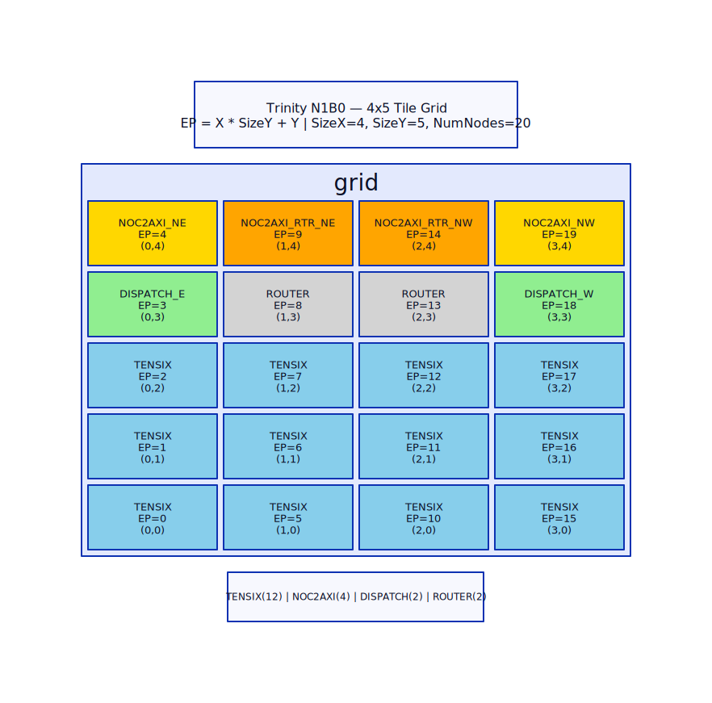

# RTL Architecture Diagrams

Trinity N1B0 칩 구조를 시각화한 다이어그램 소스 파일.

## 파일 목록

| # | 파일 | 내용 |
|---|------|------|
| 1 | `01_trinity_grid_layout.d2` | 4×5 타일 그리드 배치도 (EP 번호, 타일 타입) |
| 2 | `02_module_hierarchy.d2` | 모듈 계층 트리 (trinity → 서브모듈) |
| 3 | `03_noc_routing_topology.d2` | NoC 2D 메시, 라우팅 알고리즘, repeater 위치 |
| 4 | `04_edc_ring_topology.d2` | EDC U-shape 링, harvest bypass, serial bus |
| 5 | `05_rag_pipeline_flow.d2` | RAG 파이프라인 데이터 흐름 (v9.2 기준) |
| 6 | `06_clock_distribution.d2` | 클럭 분배 메시 (trinity_clock_routing_t) |

## 렌더링 방법

### D2 설치

```bash
# Windows
winget install terrastruct.d2

# macOS
brew install d2

# Linux
curl -fsSL https://d2lang.com/install.sh | sh -s --
```

### SVG 생성 (전체)

```bash
cd docs/diagrams
for f in *.d2; do d2 "$f" "${f%.d2}.svg"; done
```

### 개별 렌더링

```bash
d2 01_trinity_grid_layout.d2 01_trinity_grid_layout.svg
d2 --theme 200 02_module_hierarchy.d2 02_module_hierarchy.svg
d2 --layout elk 03_noc_routing_topology.d2 03_noc_routing_topology.svg
```

### 옵션

- `--theme 0` (default), `--theme 200` (dark)
- `--layout dagre` (default), `--layout elk` (더 정교한 배치)
- `--pad 20` (여백 조절)
- `-w` (watch mode — 파일 변경 시 자동 재렌더링)

## 문서에서 참조

마크다운 문서에서 렌더링된 SVG를 참조:

```markdown

```

Confluence에서는 SVG 파일을 첨부 후 이미지 매크로로 삽입.

## 수정 가이드

D2 문법 참조: https://d2lang.com/tour/intro

주요 패턴:
- 박스: `name: "label" { style.fill: "#color" }`
- 연결: `a -> b: "label"`
- 양방향: `a -- b`
- 중첩: `parent: { child: "..." }`
- 점선: `style.stroke-dash: 3`
